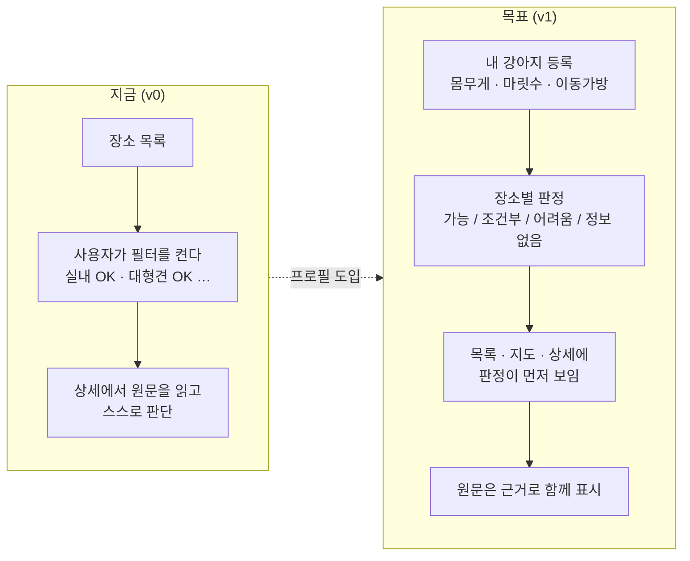

# 강아지랑 제주 — 제품 컨셉

> 최종 수정: 2026-09-15 (v1: 컨셉 문서 신설. "가이드 열람" 에서 "내 강아지 기준 판정" 으로 목적을 명문화)

## 한 줄 정의

**내 강아지의 조건(몸무게·마릿수·이동가방 유무)을 한 번 등록하면, 제주의 반려견 동반 숙소·식당·카페 86곳 중
"우리 강아지가 갈 수 있는 곳" 을 골라 보여주는 PWA.**

## 왜 만드는가

원 자료는 짱구누나(작성자: 사용자의 배우자)가 Notion 에 정리한 "강아지와 제주도 여행" 가이드다.
숙소 26 · 식당 34 · 카페 26 곳과 준비물 15가지가 있고, 장소마다 반려동물 이용 조건이 **사람이 쓴 문장**으로 적혀 있다.

```
"실내외 모두 가능하지만 실내에서는 유모차/이동 가방 필요. 대형견은 야외만."
"1~5kg 1만원. 6~10kg 1.5만원. 2마리까지."
```

이 문장을 86번 읽고 자기 강아지에 대입하는 일이 Notion 에서는 사용자 몫이다.
앱의 존재 이유는 그 대입을 **한 번만 하게 만드는 것**이다. 강아지를 등록하면 그다음부터는 목록·지도·상세가
"갈 수 있음 / 조건부 / 어려움 / 정보 없음" 으로 미리 걸러져 보인다.

## 누구를 위해

- **1차**: 자기 강아지와 제주 여행을 준비하는 반려인. 20대~30대 여성 취향을 기본 톤으로 잡았다(색·타이포·말투).
- **2차**: 작성자 본인. 앱은 자료를 대신 보여주는 창구이고, 원본 Notion 링크를 항상 노출한다.

## 핵심 개념 3개

| 개념 | 설명 | 코드 |
|---|---|---|
| **장소(Place)** | 숙소/식당/카페 중 하나. 읍면·방향·특징·이용 조건 원문·좌표·네이버 링크를 가진다. 사진은 없다(→ [ADR-002](./decisions/ADR-002-no-place-photos.md)) | `src/types.ts`, `src/data/places.json` |
| **이용 조건(PetPolicy)** | 원문 문장에서 규칙으로 뽑아낸 구조화 조건. 실내 가능 여부, 무게 제한, 마릿수, 요금 등. 원문은 항상 함께 보여준다 | `src/lib/petPolicy.ts` |
| **내 강아지(DogProfile)** | 사용자가 등록하는 기준. 이용 조건과 맞춰 장소별 **판정(eligibility)** 을 낸다. **아직 구현 전** — 지금은 일반 필터(대형견 OK 등)로 대신한다 | 계획: [features/dog-profile.md](./features/dog-profile.md) |

## 지금 상태와 목표 상태



- v0 는 완성돼 있다(6개 화면, 저장·준비물 체크, 오프라인).
- v1 의 핵심은 `DogProfile × PetPolicy → Eligibility` 함수 하나다. 화면은 그 결과를 배지와 정렬로 드러내면 된다.
  판정 규칙은 [architecture/pet-policy-and-eligibility.md](./architecture/pet-policy-and-eligibility.md) 에 표로 정리했다.

## 하지 않는 것

- **스토어 배포.** PWA 로 홈 화면에 추가하는 것까지가 범위다(→ [ADR-001](./decisions/ADR-001-pwa-static-export.md)).
- **서버·로그인.** 데이터는 빌드에 박히고 사용자 상태는 기기 안(localStorage)에만 있다. 강아지 프로필도 같은 방식이다.
- **Notion 실시간 동기화.** 자료가 바뀌면 스크립트로 다시 뽑아 빌드한다(→ [architecture/data-pipeline.md](./architecture/data-pipeline.md)).
- **타인의 사진.** 후기 링크 85/86 이 다른 블로거의 글이라 사진을 쓰지 않는다.
- **판정을 단정하지 않는다.** 파서가 놓친 조건이 있을 수 있으므로 "어려움" 이어도 원문과 전화 확인 안내를 함께 보여준다.

## 톤 앤 매너

- **말투**: 짱구누나의 원문 말투(친근한 존댓말)를 화면 문구에도 잇는다.
- **색**: 핑크 브랜드 + 크림 바탕 + 잉크 히어로. 분홍은 강조에만 쓰고, 면은 파스텔 워시, 글씨·주요 버튼만 진하게(→ [ADR-003](./decisions/ADR-003-untitled-ui-and-palette.md)).
- **종류 구분은 색으로**: 사진이 없으므로 숙소=바다 / 식당=감귤 앰버 / 카페=라떼 색이 종류를 가르는 주 신호다.
