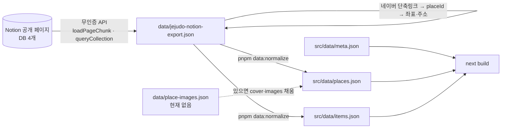

# 데이터 파이프라인 — Notion → src/data

> 최종 수정: 2026-09-15 (v1: 신설)

## 개요

앱이 읽는 데이터는 `src/data/` 의 JSON 세 개가 전부이고, 런타임 fetch 는 없다.
원본은 공개 Notion 페이지(`src/data/meta.json` 의 `sourceUrl`)이며, 아래 세 단계로 만들어진다.
**동기화는 수동**이다 — 자료가 바뀌면 사람이 스크립트를 돌리고 다시 빌드한다.

## 1. 추출 (Notion → export)

- Notion 페이지는 공개라 인증 없이 `POST /api/v3/loadPageChunk` 와 `POST /api/v3/queryCollection` 으로 받는다.
  HTML 만 받으면 "Notion" 한 단어뿐이라 반드시 API 를 써야 한다.
- DB 는 준비물(15) · 숙소(26) · 식당(34) · 카페(26) 네 개. collection/view id 는 Claude 메모리(`zgnn-notion-data-source`)에 있다.
- 결과는 `data/jejudo-notion-export.json` 에 **커밋**한다. 재추출 스크립트는 레포에 없다(한 번 뽑은 뒤 필요가 없었다).
  다시 뽑을 일이 생기면 위 두 API 로 스크립트를 만들고 `scripts/` 에 둔다.

## 2. 좌표·주소 보강

- 장소 86곳 전부 네이버 플레이스 단축링크(`naver.me`)를 가진다. HEAD 요청의 Location 에 placeId 가 나오고,
  53곳은 좌표까지 같이 나온다.
- 나머지는 `https://m.place.naver.com/place/{placeId}/home` 을 모바일 UA 로 받아 HTML 안의
  `"coordinate":{"x","y"}` 와 `roadAddress`, `category` 를 읽었다.
- 결과: 좌표 81곳, 도로명주소 76곳. **미확보 5곳**(요호르기 스테이, 미트타운, 개떼목장, 브릭스제주, 롯지먼트)은
  지도에서 빠지고 화면이 "좌표 없는 5곳 제외" 로 알린다. 억지로 좌표를 지어내지 않는다.

## 3. 정규화 (`scripts/normalize.mjs`)

입력 `data/jejudo-notion-export.json` (+ 있으면 `data/place-images.json`) → 출력 `src/data/places.json`, `src/data/items.json`.

- **읍면·방향**(`TRegion`): 원문 "동쪽 구좌읍" 같은 문자열을 `direction`(east/west/south/north/udo/unknown) + `town` 으로 나눈다. `raw` 를 남겨 파싱 실패를 화면에서 확인할 수 있게 한다.
- **숙소 요금**(`TStayPrice`): 원문 `text` 를 보존하고 `min`/`max` 를 숫자로 뽑는다. 정렬은 숫자, 표시는 원문.
- **이용 조건**은 여기서 파싱하지 않는다. `petPolicyText` 원문 그대로 두고 런타임에 `parsePetPolicy()` 가 읽는다
  (→ [pet-policy-and-eligibility.md](./pet-policy-and-eligibility.md)). 파서 규칙을 고칠 때 데이터를 다시 만들 필요가 없게 하기 위함.
- **이미지**: 매니페스트가 없으면 경고만 내고 `cover` 없음·`images: []` 로 만든다(→ [ADR-002](../decisions/ADR-002-no-place-photos.md)).

`meta.json`(작성자·소개문·준비물 안내·고지)은 손으로 관리한다.

## 스키마 요약

`src/types.ts` 가 계약이다. 화면과 lib 는 이 타입만 본다.

| 타입 | 핵심 필드 | 비고 |
|---|---|---|
| `TPlace` | `id`, `type`, `name`, `region`, `features`, `petPolicyText`, `geo?`, `address?`, `naverUrl?`, `reviewUrl?`, `stay?` | `id` 는 Notion 블록 id. 라우트 `/place/[id]` 와 저장 목록의 키 |
| `TStayInfo` | `price: TStayPrice`, `amenitiesText` | 숙소만. `amenitiesText` 는 준비물 화면의 구비 용품 매핑에 쓰인다(`src/lib/amenities.ts`) |
| `TItem` | `id`, `name`, `emoji`, `seasons`, `reason`, `linkUrl?`, `variants?` | 준비물. `linkUrl` 은 쿠팡 파트너스 링크라 `meta.disclosure` 를 함께 표시. `variants` 는 원본의 여러 줄을 `lib/places.ts` 의 `ITEM_VARIANTS` 가 한 항목으로 합치면서 생긴다(기내용 가방의 5kg 이하/이상) — JSON 에는 없는 파생 필드다 |
| `TMeta` | `author`, `sourceUrl`, `intro`, … | 화면 문구 |

## 관련 파일

- `scripts/normalize.mjs`, `scripts/fetch-blog-images.mjs`(허용목록 비어 있음), `scripts/optimize-images.mjs`
- `data/jejudo-notion-export.json`, `src/data/*.json`, `src/types.ts`
- 빌드 시 라우트 목록도 `places.json` 에서 만든다: `next.config.mjs`(프리캐시), `src/app/place/[id]/page.tsx`(`generateStaticParams`)
