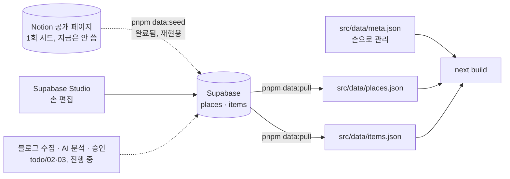
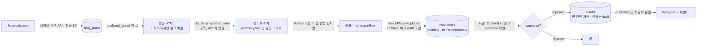

# 데이터 파이프라인 — Supabase → src/data

> 최종 수정: 2026-09-21 (v3: "수집 · 분석 · 승인" 절을 실제 흐름·상태 머신으로. Claude 는 구독 `claude -p`. Vercel 빌드 명령 전환[4a]·`fromPlaceRow`)
> 이전 (v2: 원본을 Supabase 로 전환[ADR-015]. Notion 경로는 1회 시드 이력으로 내리고, 갱신 경로·`sort`·`data:normalize` 의 바뀐 역할을 적음)
> 이전 (v1: 신설 — Notion 이 원본이던 시절)

## 개요

앱이 읽는 데이터는 여전히 `src/data/` 의 JSON 세 개가 전부이고, **런타임 fetch 는 없다.** 바뀐 건 그 JSON 을
누가 만드느냐다 — 원본은 이제 **Supabase**([ADR-015](../decisions/ADR-015-supabase-source-and-rebuild.md))고,
Notion 은 1회 시드 경로로만 남는다.

- 앱은 런타임에 아무것도 fetch 하지 않는다. 장소 86곳(숙소 26·식당 34·카페 26), 준비물 15가지 — 지금까지와 동일.
- 갱신은 여전히 사람이 명령을 돌려야 반영된다(`data:pull` → 재빌드). Vercel 빌드 명령이 아직
  `pnpm data:pull && pnpm build` 로 안 바뀌어서([todo/00](../todo/00-setup-supabase-vercel.md) 4a), 지금 배포되는
  사이트는 여전히 마지막으로 **커밋된 스냅샷**을 쓴다. 4a 가 끝나야 "Studio 수정 → 재배포 반영" 이 이어진다.

## 갱신 경로 — `pnpm data:pull`

- 데이터를 고치는 곳은 이제 Supabase Studio(나중엔 관리 화면)지 Notion 이 아니다.
- `scripts/pull-db.mjs`(`pnpm data:pull`) 가 `status='published'` 인 `places`·`items` 를 읽어 `src/data/places.json`·
  `items.json` 을 다시 쓴다.
- `src/data/*.json` 은 계속 **커밋**한다 — 키 없이도 `pnpm dev`·`pnpm test` 가 돌아야 하고, Supabase 가
  무료 티어 7일 비활성으로 잠들어도 마지막 스냅샷으로 빌드된다.
- 키가 없으면 `data:pull` 은 조용히 옛 스냅샷을 쓰는 대신 **명확히 실패한다**(`exit 1`) — CI 가 조용히 옛 데이터로
  빌드되는 사고를 막기 위해서다. env 는 `node --env-file-if-exists=.env.local` 로 읽는다(Node 22.9+, dotenv 없이).

## 두 입구가 같은 바이트를 내는 이유 — `scripts/lib/placeFields.mjs`

`parseRegion`·`parsePrice`·`clean`·`toPlace`·`toItem`·`writeDataJson` 을 `normalize.mjs` 에서 뽑아
`scripts/lib/placeFields.mjs` 로 옮겼다. Notion 경로(`normalize.mjs`)와 Supabase 경로(`pull-db.mjs`) 가
**같은 함수**를 쓴다. `toPlace` 의 키 순서와 `writeDataJson`(들여쓰기 1칸, 끝 개행 없음)이 정확히 같아야
어느 입구로 들어와도 같은 JSON 바이트가 나오고, `git diff` 가 "진짜 바뀐 것" 만 보여준다.
실제로 시드 → `data:pull` 왕복 뒤 `git diff src/data` 가 빈 것으로 확인했다.

## `data:normalize` 는 더 이상 데이터를 만드는 명령이 아니다

예전엔 이게 유일한 데이터 생성 경로였다. 지금은 Notion 원본을 **다시 Supabase 로 시드**하고 싶을 때만 쓴다
(예: Supabase 를 새로 만들어야 하는 재해복구 상황). 평소 갱신은 `data:pull` 이다.
`data/jejudo-notion-export.json` 은 여전히 레포에 있다 — "다음 갱신 소스" 가 아니라 **1회 시드의 근거 기록**이다.

## `sort` 컬럼

Postgres 테이블엔 원래 순서 개념이 없는데, 화면은 "종류별 → Notion 원래 순서" 를 그대로 보여준다(준비물 카드
나열, 장소 목록 정렬 등). 시드할 때 배열 인덱스를 그대로 `places.sort`·`items.sort` 에 넣어 이 순서를 보존했다.
새로 추가되는 행은 `sort=null`, `data:pull` 은 nulls last 로 정렬해 새 행이 끝에 붙는다.

## `archived` 는 pull 에서 빠진다

`places.status` 는 `draft`/`published`/`archived` 세 가지고, `data:pull` 은 `published` 만 가져온다. 그래서
폐업(`archived`) 처리된 장소는 `places.json`·라우트·프리캐시에서 **조용히 사라지고**, 저장 목록에서도 함께
빠진다 — `selectSavedPlaces` 가 `PLACES.filter` 라 모르는 id 는 오류 없이 버려진다(`src/lib/places.ts`).
"폐업" 을 사용자에게 보여주고 싶으면 archived 도 pull 해서 화면에 상태를 그려야 하는데, 이건 기능 변경이라
지금 범위 밖이다([todo/01](../todo/01-schema-and-seed.md)).

## 이미지

`places` 테이블에 `images` 컬럼은 없다. `data:pull` 은 항상 `images: []` 를 쓴다. `TPlace` 계약(코드가 읽는
타입)은 그대로 남겨 뒀지만(→ [ADR-002](../decisions/ADR-002-no-place-photos.md), 사진 없음이 기본 디자인),
실제 값을 채우는 경로는 지금 없다.

## 파싱은 여전히 런타임

이용 조건은 여기서 구조화하지 않는다. `petPolicyText` 원문을 `places` 에 그대로 두고 런타임에
`parsePetPolicy()` 가 읽는다([pet-policy-and-eligibility.md](./pet-policy-and-eligibility.md)). 블로그에서 AI 가
뽑아내는 조건도(todo/03) 같은 원칙 — **원문 문장으로** 넣는다. 파서 규칙을 고칠 때 데이터를 다시 만들 필요가
없게 하기 위함이다.

읍면·방향(`TRegion`)·숙소 요금(`TStayPrice`) 변환 로직 자체는 그대로다. 다만 이제 그 함수는
`scripts/lib/placeFields.mjs` 의 `parseRegion`·`parsePrice` 이고, 두 입구(Notion 재시드 / Supabase pull) 가
공유한다.

## 수집 · 분석 · 승인 (코드 완료, 실행 전)

GitHub Actions(`collect.yml`, KST 화·금 06:00)가 한 잡에서 세 step 을 순서대로 돌린다. 진행·결정은
[todo/02](../todo/02-collect-naver-blog.md)·[todo/03](../todo/03-analyze-and-review.md).

세 가지가 비직관적이다.

- **본문은 저장하지 않는다.** DB 에 남는 건 링크·제목·날짜와 AI 가 뽑은 사실·인용문(`extracted`)뿐이다(저작권·약관, ADR-002 와 같은 기준).
- **Claude 는 API 가 아니라 구독**이다. `scripts/analyze/extractPlaces.mjs` 가 `claude -p` 를 자식 프로세스로 돌리고 결과 JSON 의
  `structured_output` 을 읽는다. 로컬은 로그인된 `claude`, Actions 는 `CLAUDE_CODE_OAUTH_TOKEN`. 글당 비용은 0 이지만 **세션 한도를
  대화와 공유**한다 — 대량 처리는 `--limit` 로 나눈다.
- **`analyzed_at` 이 "다시 안 읽는다" 의 표시**다. 후보가 0개여도, 다시 받아도 같을 실패(삭제된 글·본문 없음)여도 찍는다 — 단 그 실행에서
  성공한 글이 1건 이상일 때만(전부 실패면 파이프라인 고장으로 보고 아무것도 닫지 않는다). 잠깐의 실패(403·5xx·한도·타임아웃)는 비워 둬 재시도.

### 후보의 상태 머신

| `candidates.status` | 누가 바꾸나 | 뜻 |
|---|---|---|
| `pending` | `data:analyze` 가 만든다 | 사람이 볼 차례. `extracted.match.tier` 가 `auto`(≥0.85 — 기존 장소와 사실상 같음) · `ask`(0.4~0.85 — `match_place_id` 는 제안) · `new`(신규) |
| `approved` | 사람(Studio). `AUTO_APPROVE=true` 면 `auto` 는 자동 | `data:apply` 가 반영한다. `ask` 인데 신규가 맞으면 **`match_place_id` 를 비우고** 승인 |
| `rejected` | 사람 | 끝. `reviewer_note` 에 이유 |
| `merged` | `data:apply` | `places` 에 반영됐다(보강 또는 draft 신규 + `place_sources` 링크) |

`places.status` 는 별개다: 신규는 `draft` 로 들어오고 **`published` 로 올리는 건 사람**이다 — `data:pull` 은 `published` 만 가져온다.

## 스키마 요약

`src/types.ts` 가 계약이다. 화면과 lib 는 이 타입만 본다.

| 타입 | 핵심 필드 | 비고 |
|---|---|---|
| `TPlace` | `id`, `type`, `name`, `region`, `features`, `petPolicyText`, `geo?`, `address?`, `naverUrl?`, `reviewUrl?`, `stay?` | `id` 는 Notion 블록 id 를 시드 때 그대로 옮겼다. 라우트 `/place/[id]` 와 저장 목록의 키 |
| `TStayInfo` | `price: TStayPrice`, `amenitiesText` | 숙소만. `amenitiesText` 는 준비물 화면의 구비 용품 매핑에 쓰인다(`src/lib/amenities.ts`) |
| `TItem` | `id`, `name`, `emoji`, `seasons`, `reason`, `linkUrl?`, `variants?` | 준비물. `linkUrl` 은 쿠팡 파트너스 링크라 `meta.disclosure` 를 함께 표시. `variants` 는 원본의 여러 줄을 `lib/places.ts` 의 `ITEM_VARIANTS` 가 한 항목으로 합치면서 생긴다(기내용 가방의 5kg 이하/이상) — DB·JSON 어디에도 없는 파생 필드다 |
| `TMeta` | `author`, `sourceUrl`, `intro`, … | 화면 문구. 손으로 관리 |

## 관련 파일

- `scripts/lib/placeFields.mjs` — 두 입구가 공유하는 변환 함수. `fromPlaceRow`(DB 행 → `TPlace`)는 `pull-db.mjs`·`analyze-candidates.mjs`·`apply-approved.mjs` 가 같이 쓴다
- 수집·분석·승인: `scripts/collect-blog.mjs`(`data:collect`) · `scripts/analyze-candidates.mjs`(`data:analyze`) · `scripts/apply-approved.mjs`(`data:apply`) —
  순수 함수는 `scripts/collect/*`·`scripts/analyze/*`(각각 `*.test.mjs`), 스케줄은 `.github/workflows/collect.yml`
- `scripts/pull-db.mjs`(`pnpm data:pull`), `scripts/seed-db.mjs`(`pnpm data:seed`, 1회용이지만 재현성 때문에 레포에 둔다)
- `scripts/normalize.mjs`(`pnpm data:normalize`, 이제는 Notion 재시드 전용), `scripts/fetch-blog-images.mjs`(허용목록 비어 있음), `scripts/optimize-images.mjs`
- `data/jejudo-notion-export.json`(1회 시드 근거), `src/data/*.json`, `src/types.ts`
- 빌드 시 라우트 목록도 `places.json` 에서 만든다: `next.config.mjs`(프리캐시), `src/app/place/[id]/page.tsx`(`generateStaticParams`)
- Vercel 은 `vercel.json` 의 `buildCommand: "pnpm data:pull && pnpm build"` 로 빌드 안에서 DB 를 읽는다(4a). `outputDirectory` 는 비워 둔다(BUG-005)
- Supabase 스키마·RLS·시드 절차: [todo/01](../todo/01-schema-and-seed.md)

## 부록 — Notion 시드가 만들어진 과정 (역사 기록, 지금은 안 씀)

지금의 86곳·15개는 애초에 아래 순서로 한 번 만들어졌다. 다시 시드할 일이 생기면 참고한다.

### 1. 추출 (Notion → export)

Notion 페이지는 공개라 인증 없이 `POST /api/v3/loadPageChunk` 와 `POST /api/v3/queryCollection` 으로 받았다.
HTML 만 받으면 "Notion" 한 단어뿐이라 API 를 써야 했다. DB 는 준비물(15)·숙소(26)·식당(34)·카페(26) 네 개.
collection/view id 는 Claude 메모리(`zgnn-notion-data-source`)에 있다. 결과는 `data/jejudo-notion-export.json` 에
커밋돼 있다.

### 2. 좌표·주소 보강

장소 86곳 전부 네이버 플레이스 단축링크(`naver.me`)를 가진다. HEAD 요청의 Location 에 placeId 가 나오고,
53곳은 좌표까지 같이 나왔다. 나머지는 `https://m.place.naver.com/place/{placeId}/home` 을 모바일 UA 로 받아
HTML 안의 `"coordinate":{"x","y"}` 와 `roadAddress`, `category` 를 읽었다. 결과: 좌표 81곳, 도로명주소 76곳.
**미확보 5곳**(요호르기 스테이, 미트타운, 개떼목장, 브릭스제주, 롯지먼트)은 지도에서 빠지고 화면이
"좌표 없는 5곳 제외" 로 알린다. 억지로 좌표를 지어내지 않았다.
