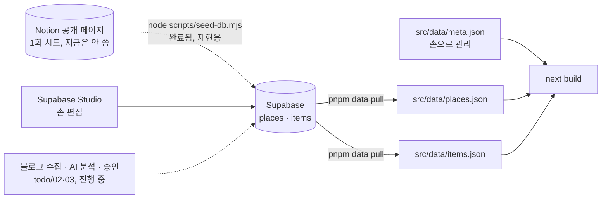
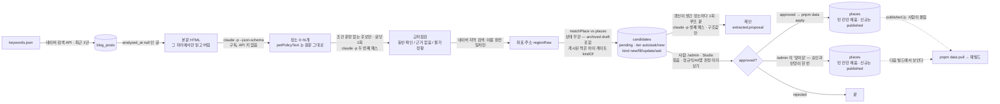

# 데이터 파이프라인 — Supabase → src/data

> 최종 수정: 2026-10-08 (v56: `pnpm data coverage`(todo/19 T2) — 원형 셋 × 6권역 표와 데이터 문턱. 앱의 `PLACES` 를 그대로 쓰려고 확장자 훅이 `.json` import 속성도 메운다)
> 이전 2026-10-07 (v55: 「재분석」 에 글 쪽 `다시 읽기`(수집 완료 칸, todo/09 T3.2)와 분석이 분석 제외한 글(`excluded_at`)을 안 고른다는 것)
> 이전 2026-10-07 (v54: **`pnpm data apply` 의 신규 장소도 곧바로 `published`** — `/admin` 과 같다(todo/13 §5.1). 같은 '승인' 이 길에 따라 사이트에 뜨고 안 뜨던 것을 맞췄다. 그 전에 들어간 초안(2곳)은 그대로 `draft`)
> 이전 2026-10-07 (v53: 리뷰 반영(todo/17) — 돌지 못한 요청은 queued 로 되돌린다(3번이면 done), 진척이 있으면 30분 안 기다린다, 막 승인된 후보는 60초 묵힌다, 요청 글의 정본은 `requested_at` 하나)
> 이전 2026-10-07 (v52: 워커가 Realtime 으로도 깬다(todo/17 T4) — 깨우는 길 셋, 폴링이 정본. 채널 토큰은 `realtime.setAuth` 가 아니라 클라이언트의 토큰 콜백이어야 RLS 를 통과한다)
> 이전 2026-10-07 (v51: 상주 워커 `pnpm data` · 한 바퀴 `once` 가 실제로 돈다(todo/17 T3) — 「워커 한 바퀴」 그림. 자동 분석은 `requested_at` 이 찍힌 글만, 추가 수집·재분석이 찍는다)
> 이전 2026-10-07 (v50: 진입점 하나 `pnpm data <하위 명령>`(`scripts/data.mjs`, ADR-024) — `data:*` 13줄이 한 줄, 터미널 검수 창 `data:review`·사진 스크립트 둘·`data:homepage` 를 지웠고, seed·normalize 는 `node scripts/…` 로 직접)
> 이전 2026-10-07 (v49: 추가 수집 — 요청 검색 실패는 그 요청만 대기로(키워드 수집분은 저장), 요청 글의 `keyword` 는 `추가 수집(/admin)`(상호명을 `검색어:` 로 주면 추출을 유도한다), `--only-requests` 는 `pipeline_runs` 에 안 남긴다(수집 칸의 '마지막 성공' 을 가린다))
> 이전 2026-10-07 (v48: **추가 수집 요청**(`collect_requests`) — `/admin` 이 남긴 상호명 검색어를 `data:collect` 가 키워드 뒤에 한 페이지(30건)씩 돌고(`--only-requests` 면 요청만), `data:analyze` 는 그 글을 미분석 줄 맨 앞에 세운다. 표가 없으면 경고 한 줄 뒤 요청 없이 돈다 — [features/admin-review 「추가 수집」](../features/admin-review.md))
> 이전 2026-10-06 (v47: **읍면은 읽을 때 정본으로 접는다** — `parseRegion` 이 `서귀포`→`서귀포시` 를 한다(07 U8). 어느 쓰기 길도 저장 값을 고치지 않아, 시드의 `남쪽 (서귀포)` 1행은 손으로 고쳐야 했다)
> 이전 2026-10-06 (v46: 심장을 **쓰기 스크립트 넷 모두** 찍는다 — collect(페이지마다)·`data:review`(행마다)가 빠져 있어 10분 넘게 도는 실행이 살아 있어도 운영 현황에 "중단된 듯" 으로 떴다)
> 이전 2026-10-06 (v45: **실행마다 `pipeline_runs` 한 행** — collect·analyze·apply·`data:review approve|reject` 가 시작에 insert, 끝에 상태·stats·분류 문구를 남긴다(analyze 는 그 사이 심장). 기록 실패는 경고 한 줄뿐이고 작업은 그대로 돈다. 콘솔 요약 줄은 `src/lib/runSummary.ts` 로 옮겨 화면과 같은 함수를 쓴다 — 그래서 `data:collect`·`data:analyze`·`data:apply` 도 `--experimental-strip-types` 로 돈다([ADR-023](../decisions/ADR-023-ops-dashboard-and-run-log.md), [todo/15](../todo/15-ops-dashboard.md) T2))
> 이전 2026-10-06 (v44: **추출 정확도 평가** — 시드 86곳은 사람이 같은 블로그 글을 읽고 적은 값이라, 그 글을 운영 추출에 다시 넣어 채점한다(`pnpm data:eval`, [features/extraction-eval](../features/extraction-eval.md)). 정답은 `data/golden/seed-extract.json` 에 얼리고, 지표는 칸 일치율보다 **판정 뒤집힘**. golden 은 정규식이 사람 문장을 읽은 값이라 틀릴 수 있어 사람이 `review` 로 보정한다)
> 이전 2026-10-06 (v43: **업종은 종류와 맞을 때만 싣는다** — 네이버 업종과 종류(시드·AI)는 출처가 달라 어긋난다(식당 '정체불명' 의 `카페,디저트`). 종류가 이기고 맞지 않는 업종은 바꿔 적지 않고 **버린다**(`scripts/lib/placeCategory.mjs`). 분석은 버린 원래 값을 `extracted.categoryNaver` 로 남기고, 승인 반영(채우기·덮어쓰기·신규)도 최종 종류로 한 번 더 거른다 — 규칙 전에 쌓인 후보 때문. 화면(`categoryLabel`)도 같은 규칙이라 이미 들어간 시드 행은 종류 이름으로 보인다(12 U3.6))
> 이전 2026-10-04 (v42: **이름은 안 맞는데 같은 자리 · 독립 글 · 이름 속 지명** — ① "본카페" ↔ "애월본카페" 는 이름 키가 '본'(1자)·'애월본' 이라 부분 일치도 지점 꼬리도 못 잡았지만 주소는 표기만 같다(`sameSpot` — 주소 'same', 두 좌표가 다 있으면 100m 안). 신규 후보끼리는 키를 물려받아 한 줄로 서고(`newSiblingOf`, 이미 쌓인 후보는 화면이 묶는다 — `mergeSameSpotGroups`), **기존 장소와 같은 자리면 '확인'(0.5)에 고정**한다(`matchPlace` 의 둘째 예외 — 가점을 얹지 않는다: 같은 건물의 다른 가게도 같은 주소라 자동 병합까지 가면 안 된다). 주소 대조 규칙은 분석(plain node)도 쓰게 되어 `scripts/lib/addressMatch.mjs` 로 옮겼다 ② **독립 글** — 같은 블로그이거나 같은 제목 틀(가게 이름을 뺀 제목이 이어진 10자 이상 같고 3일 안)인 글은 하나로 센다(`postClusters`). 이틀 사이 "제주공항 근처 애견동반식당 …" 틀의 글 5건이 검수 순서 앞자리와 "근거 글 둘 이상" 을 통과했다. 검수 순서·완화 제안이 이 수로 센다 ③ 주소·AI 둘 다 지역을 못 정하면 **이름의 지점 꼬리**의 지명으로("…월정리점" → 구좌읍, `regionFromBranchName`). 지명 → 읍·면 → 방향의 정본 표는 `scripts/lib/jejuRegions.mjs` 하나다(안덕면은 남쪽 — 추출 프롬프트와 같다))
> 이전 2026-10-04 (v41: **첫 114건 실측에서 나온 대조 규칙 둘** — ① 상호 검색은 AI 가 읽은 지역(읍·면, 없으면 시)과 **다른 지역의 동명 가게를 받지 않는다**(`pickNaverPlace`, 탈락 사유 `지역불일치`). 맞는 것이 없으면 첫 결과로 물러서던 길로 애월읍 글 2건에 서귀포 좌표가 붙었다 — 이제 원글 주소 → 좌표 축으로 물러선다. ② **지점 표기만 다른 이름**("성산점" ↔ "제주성산점")은 이름 점수가 0 이어도 좌표가 100m 안이면 부분 일치(0.7)로 친다(`sameBranchStem`). 좌표 조건이 없으면 체인의 다른 지점이 합쳐진다 — `normalizeName` 에 넣지 않은 이유 그대로다. 신규 후보끼리도 같은 규칙으로 `dupOf` 를 붙이고 먼저 난 쪽의 `nameKey` 를 물려준다(검수 묶음이 그 키로 묶인다). "본카페" ↔ "애월본카페" 처럼 지점 꼬리가 없는 쌍은 여전히 두 줄이다 — v42 가 주소로 닫았다)
> 이전 2026-10-04 (v40: **이름이 지명인 가게** — `normalizeName` 이 '제주' 를 벗긴 나머지가 지명이면 벗기지 않고, `nameSimilarity` 는 포함된 짧은 쪽이 지명이면 부분 일치로 치지 않는다. "제주하도" 의 키가 '하도' 가 돼 하도리의 다른 펜션 글이 그 카드에 붙었다)
> 이전 2026-10-04 (v39: `--focused-only` — 앞줄만 분석하고 비면 exit 1. 저수지는 앞줄에서 멈춘다(todo/03))
> 이전 2026-10-04 (v38: **`data:analyze` 는 한 번에 하나** — tmpdir 잠금 파일(`runLock.mjs`). 동시에 둘이 돌면 시작할 때 같은 글을 골라 후보가 겹친다(실제 2쌍). 주제 글 단어에 이동·안내(비행기·항공·규정·입장료·고르는 법 등)를 더했다)
> 이전 2026-10-03 (v37: **한 가게만 되풀이하는 블로그를 뒤로** — 분석 끝난 글이 2건 이상인데 나온 가게 이름(후보+제외)이 하나 이하인 블로그의 글은 집중이어도 맨 뒤(`singlePlaceBlogs`). 업주 블로그 하나가 미분석 283건이었고 제목 패턴으로는 222건이 안 걸렸다. 글 수로 자르지 않는 이유 — 67건·17건짜리 블로그는 여러 가게를 다니는 후기 블로거였다. 「제N편」 은 잘린 꼬리 `제11....` 도 잡는다)
> 이전 2026-10-03 (v36: **장소 없는 주제 글도 뒤로** — 제목에 오름 정리·배편·선적·배 타고·올레길·명소·축제·스노클링·「제N편」이 있으면 `isFocusedTitle` 이 앞줄에서 뺀다(`TOPIC_TITLE_SOURCE`). 첫 30건 중 8건이 이런 글이었고, 남은 앞줄 995건 중 88건이 걸린다(업주 연재 63). 산책·해변·운동장 같은 말은 가게 후기 제목에 흔해 넣지 않았다)
> 이전 2026-10-02 (v35: **읍면 대조는 경고만** — `pull`·`normalize` 끝에 `region.town` 이 주소의 읍면과 다른 곳, 같은 읍면이 두 방향인 곳을 `⚠` 로 찍는다(`scripts/lib/regionCheck.mjs`, [todo/12](../todo/12-ux-audit-2026-10-02.md) U0.2))
> 이전 2026-10-02 (v34: **블로그 경로 데이터 초기화** — `blog_posts` 4,896 · `candidates` 327 · `place_sources` 1 · blog 출처 `places` 1(테스트로 내린 곳)을 지웠다. Notion 시드 86곳(내린 2곳·확인 날짜 포함)과 `rebuild_log` 는 남겼다. 운영자 GRANT 에 delete 가 없어 `supabase db query --linked`(postgres)로 한 트랜잭션. 백업은 사용자 로컬. 수집 키워드는 52개로([todo/02](../todo/02-collect-naver-blog.md) v7))
> 이전 2026-10-02 (v33: 제외 이유 `noPetEvidence` — **신규**이고 교차점검이 `동반 근거 없음` 이면 후보로 만들지 않는다(ADR-019 v8 임시 단계, 재검색 없이). 제외 줄에 `town`·`address`·`recheck: null` 이 실린다)
> 이전 2026-10-02 (v32: **분석 순서 — 제목이 한 가게 후기로 보이는 글을 먼저.** 첫 실측 30건에서 후보 59건 중 50건이 `동반 근거 없음`(목록·일정 글의 이름 나열)이었다. 제목에 반려동물 말이 있고 목록·일정형이 아닌 글(`isFocusedTitle`)을 서버 쿼리로 먼저 고르고, 나머지는 지우지 않고 뒤로 민다(분석 전 4,839건 중 3,053건이 앞줄). 정규식은 쿼리와 JS 가 같은 문자열)
> 이전 2026-10-02 (v31: **동반 불가 글도 게시된 가게의 갱신이 된다** — 추출이 `petAllowed: 'no'` 로 낸 장소를 바로 버리지 않고 짝을 찾아, 게시된 곳과 확실히 같으면(`auto` + `published`, 옛 글·목록글 아님) `update` 후보로 올린다.
> 그 밖은 지금처럼 `notAllowed` 제외 — 신규 가게의 동반 불가가 후보가 되면 BUG-008 이 돌아온다. 그래서 동반 불가 장소도 네이버 검색 한 번을 쓴다)
> 이전 2026-10-02 (v30: **분석이 Claude 를 세 번 부른다** — 셋째 패스 「제안」(`scripts/analyze/proposePlaces.mjs`, [todo/11](../todo/11-continuous-review-and-update-proposals.md) U3).
> 루프가 끝난 뒤 이번 실행에서 `update` 후보가 생긴 장소마다 한 번, 사이트 값과 그 장소의 pending 후보 전부를 **구조값으로**(본문 없음) 넘기고 칸별 `keep/change` 를 받는다.
> 코드가 다시 거른다(근거 글 없음·인용 불일치 → keep, 소개는 덧붙임만, 판단은 `correctPetPolicyFacts`, 충돌은 코드가 센다). 결과는 가장 새 글의 행 `extracted.proposal`, 옛 제안은 `superseded: true`.
> `--no-propose` 로 끄고 `PROPOSE_MODEL` 로 모델을 덮는다. 계량기 셋째 줄 · 요약 `· 제안 N/M곳`)
> 이전 2026-10-02 (v29: **차이 게이트** — 게시된 곳을 쓴 글은 사이트와 **다른 사실**을 말할 때만 후보가 된다(`kindOf`, [todo/11](../todo/11-continuous-review-and-update-proposals.md) U1).
> 제외 이유 `alreadyHave` 가 셋으로 갈렸다 — `sameAsSite`(같은 말) · `stale`(확인 날짜보다 옛 글) · `weak`(목록글·동반 근거 없음). 후보는 `extracted.match.kind`(`new`·`ask`·`fill`·`update`)를 싣는다)
> 이전 2026-10-01 (v28: `places.stay_environment`(숙소 환경 jsonb, 마이그레이션 `20261001160000`) → JSON `stay.environment`. 추출 스키마의 `stayEnvironment` 가 원천이고, 쓰는 쪽(`toNewPlaceRow`·`mergeIntoExisting`·`overwriteWithLatest`)은 행에 칸이 있을 때만 싣는다)
> 이전 (v27: `data:pull` 이 `place_report_flags()`(마이그레이션 `20261001150000`)로 **열린 폐업 제보 표식**을 장소 끝 키 `openReportKinds` 로 얹는다 — 상세가 그때 확인 날짜를 안 그린다. 함수가 없으면 경고 한 줄 뒤 표식 없이 계속)
> 이전 (v26: `places.verified_at`(사람이 마지막으로 확인한 시각, 마이그레이션 `20261001140000`) → JSON `verifiedAt`(한국 날짜). **트리거가 아니라 쓰는 코드가** 찍는다 — 승인·덮어쓰기·주소 고치기·제보 `고쳤어요`·다녀왔어요 반영. 칸이 없는 원격에서는 쓰지 않는다)
> 이전 (v25: 스키마 요약에 `place_reports`(사용자 제보, 마이그레이션 `20261001130000`, 원격 미적용) 한 줄 — [ADR-021](../decisions/ADR-021-place-reports.md))
> 이전 (v24: `archived` 짝은 블랙리스트에 없을 때만 생긴다 — 등록 해제 폼이 `place_blocks` 를 같이 쓰므로(09 T1.4) 이름 축에서 먼저 걸리고, 되살리면 풀린다)
> 이전 (v23: 제외 넷째 이유 `blocked` — 분석이 `place_blocks` 를 읽어 걸린 가게는 후보를 만들지 않는다. 표가 없으면 차단 0건 + 경고 한 줄)
> 이전 (v22: 스키마 요약에 `place_blocks`(가게 차단 목록, 마이그레이션 `20261001120000`, 원격 미적용) 한 줄 — [ADR-020](../decisions/ADR-020-pipeline-stages-and-blocklist.md))
> 이전 (v21: 제외 이유 `edited` — 사람이 고친 pending 후보가 있는 같은 글·같은 가게는 다시 읽어도 새로 만들지 않는다. 고친 이름의 원래 키는 `extracted.editedFrom.nameKey`)
> 이전 (v20: 「재분석」 머리에 "지우지 않는다 — 수집 완료로 되돌린다" 한 줄)
> 이전 2026-09-30 (v19: **AI 판단의 요금이 구조가 됐다** — `feeLines: string[]` → `fees: TFeeRule[]`(금액·마리당/정액·몸무게 경계·몇째 마리부터·1박당),
> 앱이 칸으로 계산한다. 그리고 AI 판단이 있으면 앱은 정규식으로 메우지 않는다([ADR-017](../decisions/ADR-017-ai-structured-pet-policy.md) v5). `PROMPT_VERSION` 이 바뀌었다 — 요금 계산을 받으려면 재분석)
> 이전 (v18: 재분석 1·2단계(후보 눕히기 · `analyzed_at` 비우기)가 `/admin` 의 버튼이 됐다 — 손으로 할 일은 3단계 `data:analyze` 뿐)
> 이전 (v17: 재분석 값을 기존 장소에 반영하는 길 — `/admin` 의 **최신본으로 저장하기**(합치기는 빈 칸만 채워 새 판단이 안 들어간다))
> 이전 (v16: **공식 홈페이지 카드** — `places.homepage_url·homepage_name·homepage_image`(마이그레이션 `20260930120000`) →
> `TPlace.homepage`. 채우는 길은 `data:analyze`(새 후보)·`data:homepage`(쌓인 pending 후보) → 승인. 사진은 URL 만([ADR-002](../decisions/ADR-002-no-place-photos.md) v3))
> 이전 (v15: **AI 판단의 요금이 목록이 됐다** — `TPetPolicyFacts.feeText`(문장 하나) → `feeLines: string[]`(기준마다 한 줄).
> `PROMPT_VERSION` 이 바뀌었다 — 옛 프롬프트로 분석된 글을 다시 읽히려면 `analyzed_at` 을 비우고 그 글의 `pending` 후보를 눕힌다(아래 「재분석」))
> 이전 (v14: **이미 게시된 곳은 후보를 만들지 않는다** — 짝짓기 결과가 `auto`(≥0.85)이고 그 짝이
> `published` 면 `candidates` 행을 넣지 않고 `analysis.excluded` 에 `alreadyHave` 로만 남긴다(`skipAsExisting`).
> 승인해도 하는 일이 기존 행의 **빈 칸 채우기**뿐인데 검수 목록에서는 신규와 같은 무게로 한 줄을 먹었다.
> ⚠️ **`draft`·`archived` 짝은 막지 않는다** — 전자는 초안을 게시로 올리는 유일한 길이고, 후자는 내린 가게가 다시
> 열렸다는 유일한 신호다. **비용은 줄지 않는다**(추출·네이버 조회가 끝난 뒤의 판정이라 DB 쓰기만 아낀다))
> 이전 (v13: **분석이 Claude 를 두 번 부른다** — 추출 뒤 「교차점검」 패스([ADR-019](../decisions/ADR-019-ai-cross-check-and-address-rules.md)).
> 동반 조건 문장이 **없는** 후보만 묶어 글당 한 번, "강아지를 데리고 들어간 근거가 본문에 있나" 를 다시 묻는다 — 추출 패스는
> "반려견 동반 여행기" 를 전제로 읽어 강아지를 두고 들른 일반 카페도 장소로 뽑았다. ⚠️ **`--limit` 을 절반으로 본다**(`--no-verify` 로 끈다).
> 함께: 후보의 두 주소 대조가 문자열 비교에서 규칙(`src/lib/addressMatch.ts`)으로 — 실측 43쌍 중 39쌍이 `제주특별자치도`↔`제주` 뿐이었다)
> 이전 (v12: **`archived` 에 사람이 누르는 길이 생겼다** — `/admin` 의 '올린 장소' 칸에서 내리고 되살린다([ADR-018](../decisions/ADR-018-in-app-admin-review.md)).
> 그리고 **대조 corpus 가 `archived` 까지 읽는다**(세 곳 모두): 빼 두면 내린 곳을 쓴 새 글이 '신규' 가 돼 같은 가게가 새 id 로 되살아났다.
> 재빌드도 둘 바뀌었다 — `published` 가 끼는 변경만 훅을 부르고, 부른 결과가 `rebuild_log` 에 남아 `/admin` 머리글에 한 줄로 뜬다)
> 이전 (v11: **운영자 검수 화면 `/admin` 이 두 번째 쓰기 경로가 됐다**([ADR-018](../decisions/ADR-018-in-app-admin-review.md)) — 브라우저가 `apply-approved.mjs` 와
> 같은 순서로 `pending → approved → merged` 를 한 번에 밟고, **신규 장소는 곧바로 `published`** 다(CLI 는 그대로 `draft`). 그래서 "런타임 fetch 없음" 은
> **사용자 화면에 대한 말**로 좁혀 적었다 — 운영자 화면 하나는 publishable 키로 Supabase 를 직접 부른다)
> 이전 (v10: **첫 `data:analyze` 실측(글 50건 → 후보 160건)과 설계 검토를 반영** — 이용 조건의 구조화를 AI 가 뽑을 때 판단한다
> ([ADR-017](../decisions/ADR-017-ai-structured-pet-policy.md), `petPolicy`·`places.pet_policy`) · 추출 필드에 `visited`(목록 글 표식)·`petAllowed`(동반 불가면 후보 제외)·숙소 요금/용품 ·
> 글 단위 결과가 `blog_posts.analysis` 에 남는다(후보 0건의 이유·프롬프트 버전) · 같은 가게의 후보는 `nameKey`/`dupOf` 로 묶인다 · 한 실행에 블로그당 2건(`--max-per-blog`) ·
> `--dump` 로 후보를 로컬 JSON 으로 · **검수 창 `pnpm data:review`**(묶음 · 정규식/AI/앱 판정 미리보기 · 승인/반려) · 반영 게이트(지역 없으면 pending 되돌림 · ask 구간 재대조는 사람에게) ·
> 마이그레이션 `20260928150000`. 빈 이용 조건이 '갈 수 있어요' 로 판정되던 [BUG-008](../bugs/BUG-008-empty-pet-policy-judged-ok.md) 고침)
> 이전 (v9: **좌표 보강에 두 번째 축(주소 → 좌표, NCP Geocoding)이 생겼다** — 이름 축이 못 붙인 후보에만 붙고
> 키가 다르다(Maps Application). 「왜 그 5곳인가」 의 선택지 목록에 이 축을 더했지만 **그 5곳에는 닿지 않는다**(후기가 수집 창 밖이다))
> 이전 (v8: **좌표 미확보 5곳의 이유를 실측해 적었다** — 데이터가 아니라 네이버 쪽에 그 플레이스 엔트리가 없다.
> 스크레이퍼를 다시 돌려도, `data:analyze` 의 좌표 보강으로도 채워지지 않는다는 것까지 근거와 함께 남겼다)
> 이전 (v7: 4a 는 끝났다 — `vercel.json` 의 `buildCommand` 가 `pnpm data:pull && pnpm build` 로 커밋돼 프로덕션이 그 경로로 Ready(실측).
> "아직 안 바뀌어서 커밋된 스냅샷을 쓴다" 는 문장과 "잠들어도 마지막 스냅샷으로 빌드된다" 를 걷었다 — 배포는 `data:pull` 로 시작하므로 DB 가 잠들면 재배포가 막힌다.
> JWT expiry 43200 반영 — `--limit` 을 나누는 이유는 이제 세션 창이 아니라 구독 5시간 한도)
> 이전 (v6: GitHub Actions 폐지 — 수집·분석·반영은 사용자 터미널에서 `pnpm data:collect` → `data:analyze` → `data:apply`(운영자 세션). 인증 출처는 둘 —
> 세션(JWT)+RLS 와 publishable(anon). service 키는 env 에 있으면 쓰기 스크립트가 멈춘다. 네이버 키는 env 또는 TTY 숨김 입력. ADR-016 v5)
> 이전 (v5: 인증 출처 세 가지 — Actions 는 service_role env, 로컬은 `pnpm data:login` 세션(JWT)+RLS, Vercel 빌드는 publishable(anon). ADR-016 v4)
> 이전 (v4: 키는 CI·Vercel 에선 env, 로컬에선 로그인된 `supabase` CLI 에게 실행 시점에(ADR-016). `.env.local` 은 선택 설정만)
> 이전 (v3: "수집 · 분석 · 승인" 절을 실제 흐름·상태 머신으로. Claude 는 구독 `claude -p`. Vercel 빌드 명령 전환[4a]·`fromPlaceRow`)
> 이전 (v2: 원본을 Supabase 로 전환[ADR-015]. Notion 경로는 1회 시드 이력으로 내리고, 갱신 경로·`sort`·`data:normalize` 의 바뀐 역할을 적음)
> 이전 (v1: 신설 — Notion 이 원본이던 시절)

## 개요

**사용자가 보는 화면**이 읽는 데이터는 여전히 `src/data/` 의 JSON 세 개가 전부이고, 그 화면들엔 **런타임 fetch 가 없다.** 바뀐 건 그 JSON 을
누가 만드느냐다 — 원본은 이제 **Supabase**([ADR-015](../decisions/ADR-015-supabase-source-and-rebuild.md))고,
Notion 은 1회 시드 경로로만 남는다.

예외가 하나 있다: **운영자 검수 화면 `/admin`** 은 publishable 키로 Supabase 를 직접 읽고 쓴다([ADR-018](../decisions/ADR-018-in-app-admin-review.md)).
숨은 하위 화면이고 로그인·RLS 안에서만 동작하며, 장소·준비물 화면은 그 코드를 거치지 않는다.



- 장소·준비물 화면은 런타임에 아무것도 fetch 하지 않는다. 장소 86곳(숙소 26·식당 34·카페 26), 준비물 15가지 — 지금까지와 동일
  (승인한 장소가 `pnpm data pull` 로 들어오면 86 을 넘는다). `/admin` 만 예외다(위 예외 문단).
- 갱신은 여전히 사람이 **재배포를 일으켜야** 반영된다. Vercel 빌드 명령은 `pnpm data pull && pnpm build` 다(`vercel.json` 의 `buildCommand`, [todo/00](../todo/00-setup-supabase-vercel.md) 4a —
  끝났고 프로덕션 Ready 로 실측됐다), 그래서 **배포될 때마다 DB 를 새로 읽는다** — 커밋된 `src/data/*.json` 은 키 없이 `pnpm dev`·`pnpm test` 를 돌리기 위한 스냅샷이고, 배포 빌드는 그 위에 `pnpm data pull` 결과를 덮어쓴다.
  아직 없는 것은 4b 뿐이다: 승인이 **저절로** 재배포를 일으키는 DB 웹훅 → Deploy Hook. 그전까진 push 나 Redeploy 가 그 방아쇠다.

## 갱신 경로 — `pnpm data pull`

- 데이터를 고치는 곳은 이제 Supabase Studio(나중엔 관리 화면)지 Notion 이 아니다.
- 6권역 커버리지: `scripts/data-coverage.mjs`(`pnpm data coverage`, todo/19 T2) — 홈 카드와 **같은 셈**(`src/lib/areaGroups.ts` 의 `countByArea`)을 **같은 입력**(`src/lib/places.ts` 의 `PLACES`)에 돌린다.
  그래서 앱 TS 를 node 에서 부르고, `places.ts` 의 JSON import 때문에 `scripts/lib/tsExtResolve.mjs` 가 `with { type: 'json' }` 를 얹는다(places.json 을 따로 읽어 파싱하면 판정 입력이 화면과 갈린다).
  문턱 판정은 `src/lib/areaCoverage.ts`. 세션이 있을 때만 검수 대기 열(읽기만) — 없어도 멈추지 않는다
- `scripts/pull-db.mjs`(`pnpm data pull`) 가 `status='published'` 인 `places`·`items` 를 읽어 `src/data/places.json`·
  `items.json` 을 다시 쓴다.
- `src/data/*.json` 은 계속 **커밋**한다 — 키 없이도 `pnpm dev`·`pnpm test`·로컬 `pnpm build` 가 돌아야 해서다.
  **다만 4a 뒤로 이 스냅샷은 배포의 안전망이 아니다**: 배포 빌드는 `pnpm data pull` 로 시작하므로, Supabase 가 무료 티어 7일 비활성으로 잠들면
  `pnpm data pull` 이 exit 1 이고 **재배포가 막힌다**(이전 배포는 그대로 산다 — [todo/05](../todo/05-security.md)). 조용히 옛 데이터로 빌드되지 않게 한 것이 의도다.
- 접속이 안 되면 `pnpm data pull` 은 조용히 옛 스냅샷을 쓰는 대신 **명확히 실패한다**(`exit 1`) — Vercel 빌드가 조용히 옛 데이터로
  돌아가는 사고를 막기 위해서다. 인증은 `scripts/lib/supabaseClient.mjs` 가 고른다([ADR-016 v5](../decisions/ADR-016-secrets-by-login.md)) — 출처는 **둘**뿐이고
  스크립트 종류가 정한다: `pnpm data pull`(readOnly)은 publishable 키만(anon), 쓰기 스크립트(seed·collect·analyze·apply)는 키체인의 운영자 세션(`pnpm data login`, 만료면 멈춘다).
  `pnpm data pull` 은 세션이 있어도 **항상 anon** 이라 Vercel 빌드와 로컬이 같은 경로로 돌고, RLS 가 `places(published)`·`items` select 만 연다. 결과가 비면 파일을 덮어쓰지 않고 exit 1.
  쓰기 스크립트는 세션이 없으면 그 자리에서 "pnpm data login" 으로 멈춘다. service_role 키는 어디서도 안 쓴다 — env 에 남아 있으면 쓰기 스크립트는 **멈추고**(트립와이어),
  `pnpm data pull` 은 anon 으로 계속 가되 무시한 env 이름을 경고 한 줄로 찍는다. URL·publishable 키는 코드 상수(공개값). 어느 출처로 붙었는지는 첫 로그 줄 `Supabase 인증: …` 이 말한다.
  레포에 env 파일 없음 — `pnpm data …` 는 env 파일을 읽지 않는다(`ANALYZE_MODEL` 은 셸 env 로).
- **읍면 대조는 경고만 한다**(`scripts/lib/regionCheck.mjs`). `region` 은 사람이 고른 값이고 주소·좌표는 네이버에서 온 값이라 따로 움직인다 —
  어긋나면 '남원읍' 목록에 구좌읍 핀이 섞여도 빌드·테스트는 초록이다. 빌드를 막지 않는 이유는 고칠 곳이 여기가 아니라 `/admin`(원본 Supabase)이고,
  막으면 다른 승인까지 사이트에 못 나간다. 어느 쪽이 맞는지도 정하지 않는다 — 이름의 지명이 **주소가 틀렸다**는 단서일 때가 있다(ADR-019 의 동명 가게).

## 두 입구가 같은 바이트를 내는 이유 — `scripts/lib/placeFields.mjs`

`parseRegion`·`parsePrice`·`clean`·`toPlace`·`toItem`·`writeDataJson` 을 `normalize.mjs` 에서 뽑아
`scripts/lib/placeFields.mjs` 로 옮겼다. Notion 경로(`normalize.mjs`)와 Supabase 경로(`pull-db.mjs`) 가
**같은 함수**를 쓴다. `toPlace` 의 키 순서와 `writeDataJson`(들여쓰기 1칸, 끝 개행 없음)이 정확히 같아야
어느 입구로 들어와도 같은 JSON 바이트가 나오고, `git diff` 가 "진짜 바뀐 것" 만 보여준다.
실제로 시드 → `pnpm data pull` 왕복 뒤 `git diff src/data` 가 빈 것으로 확인했다.

## `scripts/normalize.mjs` 는 더 이상 데이터를 만드는 명령이 아니다

예전엔 이게 유일한 데이터 생성 경로였다. 지금은 Notion 원본을 **다시 Supabase 로 시드**하고 싶을 때만 쓴다
(예: Supabase 를 새로 만들어야 하는 재해복구 상황). 평소 갱신은 `pnpm data pull` 이다.
`data/jejudo-notion-export.json` 은 여전히 레포에 있다 — "다음 갱신 소스" 가 아니라 **1회 시드의 근거 기록**이다.

## `sort` 컬럼

Postgres 테이블엔 원래 순서 개념이 없는데, 화면은 "종류별 → Notion 원래 순서" 를 그대로 보여준다(준비물 카드
나열, 장소 목록 정렬 등). 시드할 때 배열 인덱스를 그대로 `places.sort`·`items.sort` 에 넣어 이 순서를 보존했다.
새로 추가되는 행은 `sort=null`, `pnpm data pull` 은 nulls last 로 정렬해 새 행이 끝에 붙는다.

## `archived` 는 pull 에서 빠진다 — 그것이 곧 소프트 삭제다

`places.status` 는 `draft`/`published`/`archived` 세 가지고, `pnpm data pull` 은 `published` 만 가져온다. 그래서
`archived` 로 내린 장소는 `places.json`·라우트·프리캐시에서 사라지고, 저장 목록에서도 함께 빠진다 —
`selectSavedPlaces` 가 `PLACES.filter` 라 모르는 id 는 오류 없이 버려진다(`src/lib/places.ts`).

**2026-09-29 부터 그 한 칸을 사람이 화면에서 바꾼다** — `/admin` 의 '올린 장소' 칸([features/admin-review](../features/admin-review.md)).
하드 삭제는 없다: GRANT 가 authenticated 에 `delete` 를 주지 않으므로(`20260922120000_narrow_grants.sql`)
브라우저에서 행을 지우는 길은 처음부터 42501 이고, `status` 한 칸이 유일한 수단이다. `places` 가 바뀌었으니
재빌드 트리거가 그 빌드를 알아서 부른다 — 내림에 새 장치를 붙이지 않았다.

⚠️ **대조 corpus 는 `archived` 를 빼지 않는다.** 빼면 내린 곳을 쓴 새 글이 `matchPlace` 에서 '신규' 로
판정돼, 승인 한 번에 **같은 가게가 새 id 로 되살아난다**(빌드·테스트는 전부 통과한다). 그래서 세 곳
(`analyze-candidates.mjs` · `apply-approved.mjs` · `src/lib/adminCandidates.ts`)이 상태를 가리지 않고 읽고,
짝이 내린 곳이면 CLI 는 영구 실패로 멈추고 화면은 '되살려서 합치기 / 아니에요' 를 묻는다.
점수가 **같을 때만** 살아 있는 쪽을 고른다(`matchPlace.mjs` 의 `preferLive`) — 점수가 다른데 내린 쪽을
밀어내면 조용히 틀린 병합이 되고, 내린 쪽이 이기면 사람에게 물으므로 **눈에 보이게** 실패한다.

⚠️ **이름 키가 지명이 되면 그 동네 가게가 전부 한 장소에 붙는다.** "제주하도"(구좌읍 하도리의 펜션)는 접사 '제주' 를
벗기면 키가 '하도' 였고, "하도리 ○○펜션" 이 부분 일치(0.7)+같은 읍(0.05)으로 그 장소 카드에 '확인 요청' 으로 섞였다 —
100m 안이면 0.9 로 자동 병합까지 간다. 그래서 `matchPlace.mjs` 의 지명 목록(`JEJU_TOPONYMS`, 리·동·읍·면)이 두 곳을 막는다:
`normalizeName` 은 지역 접사('제주'·'제주점')를 벗긴 나머지가 지명이면 **벗기지 않고**, `nameSimilarity` 는 포함된 짧은 쪽이
지명이면 부분 일치로 **치지 않는다**. 완전 일치는 그대로라 "제주 하도" 라고 쓴 글은 계속 붙고, 이웃 펜션은 신규 후보로 빠진다
(오병합보다 미탐). 키가 같은 함수라 차단(`place_blocks.name_key`)과 후보 묶음(`nameKey`)도 함께 갈린다 — '하도 ○○' 를 차단해도
"제주하도" 는 안 막힌다. 길이로 막지 않는 이유는 "카페살레"↔"살레"(2자)가 맞는 짝이어서다. 86곳 중 해당은 이 한 곳이다.
업체명 재검색(ADR-019 결정 7)을 구현할 때도 '이름 통째' 검사는 이 키가 아니라 **원래 이름**으로 한다.

⚠️ **이름이 축이라는 원칙의 예외는 둘이고, 둘 다 '자리' 를 조건으로 건다.** ① 지점 표기만 다른 이름(`sameBranchStem`)은 좌표 100m 안일 때만
부분 일치(0.7)로 친다. ② 이름이 전혀 안 맞아도 **같은 자리**(`sameSpot` — 주소가 표기만 같고, 두 좌표가 다 있으면 100m 안)면
'확인'(`SAME_SPOT_SCORE` 0.5)에 **고정**한다 — "본카페" ↔ "애월본카페"(키 '본' 은 1자라 부분 일치 문턱 2자에 못 미친다)나 이름을 바꿔 다시 연 가게가
'신규' 로 떨어져 같은 자리에 장소가 둘 서던 구멍이다. ②에 가점·감점을 얹지 않는 이유: 층·호는 주소 대조에서 버리므로 같은 건물의 1층 카페와
2층 식당도 같은 자리다 — 같은 읍·면 가점까지 받으면 병합 구간에 닿는다. 그래서 **사람에게 묻기만** 한다. 지번↔도로명(`'unknown'`)은 같은 자리가 아니다.
부수 효과 하나: 그 후보는 이제 '신규' 가 아니라 '확인' 이라 `isNoPetEvidenceNew` 의 신규 제외를 안 받는다(짝이 있는 후보는 원래 그 길이 아니다).
신규 후보끼리는 같은 규칙으로 먼저 난 쪽의 `nameKey` 를 물려받는다(`newSiblingOf`). 이미 쌓인 후보는 검수 묶기가 같은 판정으로 합친다
(`mergeSameSpotGroups` — 데이터가 아니라 **화면의 한 줄**을 합친다, 올릴지는 사람이 정한다). 판정은 `scripts/lib/addressMatch.mjs` 하나를
분석·묶기·화면이 같이 쓴다 — 분석이 plain node 라 TS 에 두면 두 벌이 된다.

"폐업" 을 사용자에게 보여주고 싶으면 archived 도 pull 해서 화면에 상태를 그려야 하는데, 이건 기능 변경이라
지금 범위 밖이다([todo/01](../todo/01-schema-and-seed.md)).

## 이미지

`places` 테이블에 `images` 컬럼은 없다. `pnpm data pull` 은 항상 `images: []` 를 쓴다. `TPlace` 계약(코드가 읽는
타입)은 그대로 남겨 뒀지만(→ [ADR-002](../decisions/ADR-002-no-place-photos.md), 사진 없음이 기본 디자인),
실제 값을 채우는 경로는 지금 없다.

사진이 화면에 나오는 길은 둘이고 **둘 다 파일을 갖지 않는다**(ADR-002 v2·v3):

- **네이버 플레이스 사진 탭으로 보내는 버튼** — `naverPlaceId` 에서 주소를 만든다. `naverUrl` 은 `naver.me` 단축 링크라 쓸 수 없다.
- **공식 홈페이지 링크 카드** — `places.homepage_*` 세 칸 → `TPlace.homepage`. 주소가 없으면 키째 빠져 시드 86곳의 `places.json` 바이트는 그대로다.
  분석이 카드를 만드는 것은 그 세 칸이 DB 에 있을 때뿐이다(`pnpm data analyze` 가 먼저 확인하고 없으면 카드만 끈다) — 없는 칸을 실은
  후보를 승인하면 insert 가 통째로 거절되기 때문이다. 같은 이유로 `toNewPlaceRow` 는 카드가 있을 때만 그 칸을 싣는다.

## 파싱은 여전히 런타임

이용 조건은 여기서 구조화하지 않는다. `petPolicyText` 원문을 `places` 에 그대로 두고 런타임에
`parsePetPolicy()` 가 읽는다([pet-policy-and-eligibility.md](./pet-policy-and-eligibility.md)). 블로그에서 AI 가
뽑아내는 조건도(todo/03) 같은 원칙 — **원문 문장으로** 넣는다. 파서 규칙을 고칠 때 데이터를 다시 만들 필요가
없게 하기 위함이다.

읍면·방향(`TRegion`)·숙소 요금(`TStayPrice`) 변환 로직 자체는 그대로다. 다만 이제 그 함수는
`scripts/lib/placeFields.mjs` 의 `parseRegion`·`parsePrice` 이고, 두 입구(Notion 재시드 / Supabase pull) 가
공유한다.

**읍면 표기는 쓰는 길이 아니라 읽는 길에서 하나로 접는다**(07 U8). 시를 읍면 자리에 쓴 `남쪽 (서귀포)` 는 `parseRegion` 이
town `서귀포시` 로 읽는다(`jejuRegions.mjs` 의 `canonicalTown` — `regionCheck` 도 같은 표를 쓴다). 쓰는 길은 넷인데(시드 ·
AI 분석 · 승인 · /admin 고치기) 저장 값을 고치는 곳은 하나도 없다 — AI 길이 깨끗한 것은 읍면을 **주소 토큰**에서 뽑기 때문이고,
시드의 그 1행은 DB 에서 손으로 고쳤다. 네 길을 각각 막는 대신 모두가 지나는 `parseRegion`(시드·`pull-db`·대조·/admin) 한 곳에
걸었다. 그래서 분석 길(`resolveRegionRaw`)도 AI 가 준 `남쪽 (서귀포)` 를 null 대신 `남쪽 (서귀포시)` 로 받는다. `raw` 는 DB 값 그대로 둔다(golden 채점은 `raw` 를 보므로 그대로다) — 정본이 아닌 값이 DB 에 남아도 사이트·검색(`CITY_TOWNS`)·읍면 칩에는 `서귀포시` 로 간다.

## 수집 · 분석 · 승인 (첫 실행 2026-09-28 — 글 50건 → 후보 160건, 네이버 키 없이)

**사용자 터미널에서** `pnpm data collect` → `pnpm data analyze` → (검수·승인) → `pnpm data apply` 를 순서대로 돌린다 — 스케줄·CI 없음.
`pnpm data once` 는 그 셋 중 **할 것만** 한 번 돌고, 인자 없는 `pnpm data`(상주 워커)는 그것을 60초마다 돈다 — 아래 「워커 한 바퀴」.
(검수·승인은 2026-09-29 부터 앱 안 `/admin` 이 기본이고, 거기서 승인하면 `pnpm data apply` 단계까지 그 클릭이 대신한다 → [ADR-018](../decisions/ADR-018-in-app-admin-review.md)·[features/admin-review](../features/admin-review.md))
(ADR-016 v5, GitHub Actions 폐지). 셋 다 운영자 세션(`pnpm data login`)이 필요하고, `pnpm data collect` 는 네이버 검색 키까지 필요하다 — env
(`NAVER_CLIENT_ID`·`NAVER_CLIENT_SECRET`)로 넘기거나 없으면 터미널 숨김 입력으로 받는다(어디에도 저장 안 함 · 에이전트 세션에서는 입력을 거부).
그래서 수집은 사용자 몫이고 에이전트는 `pnpm data analyze`·`pnpm data apply` 만 돌린다. `blog_posts` 는 사용자가 돌릴 때만 찬다.
`/admin` 의 **추가 수집** 요청(`collect_requests`)은 같은 실행이 키워드 뒤에 돈다 — 요청마다 `제주 <상호명>` 한 페이지(30건), 결과(`found`·`to_read` — 아직 분석 안 된 글 · `post_urls`)는
upsert 가 끝난 **뒤에** 적는다(도중에 죽으면 대기로 남는다). 분석은 최근 30일 요청의 `post_urls` 를 미분석 줄 맨 앞에 세운다([features/admin-review 「추가 수집」](../features/admin-review.md)). 진행·결정은
[todo/02](../todo/02-collect-naver-blog.md)·[todo/03](../todo/03-analyze-and-review.md).



첫 실행에서 배운 것 넷(2026-09-28, 설계 검토 45건 중 검증 31건 반영):

- **이용 조건의 구조화는 AI 가 뽑을 때 판단한다**([ADR-017](../decisions/ADR-017-ai-structured-pet-policy.md)). 원문(`petPolicyText`)은 그대로 두고 `petPolicy`(실내·리드줄·무게·마릿수·요금…)를
  함께 뽑아 `places.pet_policy` 에 저장한다. 앱은 있으면 **판정을 그 값만으로** 정한다(`withPolicyFacts`, ADR-017 v5 — null 을 정규식으로 메우지 않는다). 정규식은 시드의 경로이자 검수의 대조군. 블로그 구어체 32건 중 20건을 정규식이 못 읽은 것이 계기다.
  **요금은 구조의 배열이다**(`fees`, ADR-017 결정 9) — 줄마다 표시용 `label` 과 계산용 칸(`amountWon`·`basis`·`minKg`/`maxKg`·`fromDog`·`perNight`).
  옛 후보·장소는 `feeText`(한 칸)나 `feeLines`(줄 목록)만 들고 있고 읽는 쪽이 `feeLinesOf` 로 합쳐 본다 — 소급 마이그레이션은 하지 않는다(요금 계산은 줄을 읽던 길로 물러난다).
- **후보 0건의 "왜" 가 `blog_posts.analysis` 에 남는다** — `{ model, promptVersion, candidates, candidateNames, excluded:[{name,type,reason}], skip }`. 제외 이유는 넷:
  `notJeju` · `other`(관광지·운동장 — 이름은 남는다) · `notAllowed`(본문이 동반 불가라고 함, [BUG-008](../bugs/BUG-008-empty-pet-policy-judged-ok.md)) ·
  **`sameAsSite` · `stale` · `weak`**(이미 게시된 곳을 쓴 글 — 아래 「차이 게이트」. v29 전 실행은 셋을 합쳐 `alreadyHave` 로 남겼다). 본문 인용은 넣지 않는다.
  **`blocked`**(넷째 이유) — 실행 시작에 `place_blocks` 를 읽어(`dry-run` 도 읽는다) 추출 직후 `blockFor` 로 건다: `name_key` 가 후보 이름 키와 같고, `town` 이 null 이거나 후보의 읍·면과 같거나 후보의 읍·면을 모르고,
  `lifted_at` 이 null 이고 `until` 이 null(영구)이거나 실행 시작 시각보다 뒤인 행. 만료는 비교이고 스케줄러는 없다([ADR-020](../decisions/ADR-020-pipeline-stages-and-blocklist.md) D1·D2).
  요약 줄에는 제외 합계 안 `· 차단 N`. **표가 원격에 없으면(마이그레이션 미적용) 조회 실패를 차단 0건으로 보고 경고 한 줄만 찍고 계속 간다.**
  **`edited`**(사람이 고친 후보가 이미 있는 같은 글·같은 가게 — 아래 「재분석」)도 추출 직후에 걸리지만 `excluded[]` 에만 남고 요약 줄에는 제외 합계 밖 `· 고침 유지 N` 로 따로 적는다.
  앞의 셋은 추출 **직후**(`exclusionReason`)에 걸리고 게이트의 셋은 **짝짓기 뒤**에 걸린다 — 단계가 다르지만 요약 한 줄에서는
  한 괄호에 넣는다(운영자가 읽는 뜻은 "후보로 안 들어간 수" 하나이고, 자리를 나누면 그 합을 사람이 더해야 한다).
  프롬프트를 고치면 `PROMPT_VERSION`(스키마+프롬프트의 sha256 앞 8자)이 바뀌고, `analysis->>'promptVersion'` 이 다른 글만 골라 재분석할 수 있다.
  **`noPetEvidence`** — 짝짓기 뒤, **신규**(`tier new`)이고 교차점검(`verify`)이 `동반 근거 없음` 이면 뺀다(`isNoPetEvidenceNew`, ADR-019 v8 의 임시 단계). `verify: null`(안 봤다)은 빼지 않는다. 제외 줄에 재검색 재료(`town`·`address`)와 `recheck: null` 을 남긴다 — 업체명 재검색(ADR-019 결정 7)이 생기면 이 줄들만 다시 본다.

  ### 재분석 — 프롬프트를 고친 뒤 같은 글을 다시 읽힌다

  **지우지 않는다 — 글을 수집 완료(`analyzed_at` 비움)로 되돌리고, 그 글의 검수 대기 후보만 목록에서 뺀다. 등록한 장소는 그대로.**

  **사람이 고친 후보는 다시 읽어도 되살아나지 않는다**(D3). 분석이 실행 시작에 읽은 pending 중 `reviewer_note` 에 `[admin] 고침` 이 있는 행의
  (`post_url`, `nameKey`) 집합(`editedKeysFor`)에 걸리는 추출은 후보를 만들지 않는다(제외 이유 `edited`). 이름을 고친 행은 `nameKey` 가 새 이름으로
  다시 계산되므로 `extracted.editedFrom.nameKey`(처음 고치기 전 키, 처음 한 번만)도 집합에 넣는다 — 이미 고친 뒤의 행은 그 키가 없어 지금 키만 걸린다.
  같은 가게라도 **다른 글**이면 만든다(새 근거). 머리표 `[admin] 고침` 은 `EDITED_NOTE`(TS)와 `analyzeCandidates.mjs` 의 상수 둘이고 테스트가 같은 값인지 묶는다.

  **`pnpm data analyze` 에 그 스위치는 없다.** 글을 고르는 조건은 `analyzed_at is null` 하나뿐이라(`analyze-candidates.mjs:207`),
  재분석은 **DB 를 손으로 되돌려** 그 조건에 다시 걸리게 하는 일이다. 순서가 중요하다:

  **1·2단계는 `/admin` 의 `분석 지우고 다시 읽기`(한 줄) · `고른 것 재분석 준비`(여러 줄)가 한다**(`src/lib/adminReanalyze.ts`,
  [admin-review 「분석 지우고 다시 읽기」](../features/admin-review.md)). 아래는 그 버튼이 지키는 규칙이자, 버튼 없이 손으로 할 때의 절차다.
  글 쪽에서도 같다 — 수집 완료 칸의 `다시 읽기`(줄·일괄)가 같은 `prepareReanalyze` 를 부른다(형제 후보까지 눕힘, 사람이 반려한 후보가 딸린 글은 계획에서 뺌 — [admin-review 「수집 완료 칸」](../features/admin-review.md)).
  분석은 `excluded_at` 이 빈 글만 고른다(`scripts/lib/postExclusion.mjs` — 수집 완료 칸의 `분석 제외`). 칸이 없으면(마이그레이션 미적용) 경고 한 줄을 남기고 조건 없이 고른다 — 미적용이라고 분석이 멈추면 안 된다.

  0. **지금 버전을 코드에서 읽는다** — 문서에 적어 두면 프롬프트를 한 번 더 고친 순간 거짓이 된다:
     `node -e "import('./scripts/analyze/extractPlaces.mjs').then(m=>console.log(m.PROMPT_VERSION))"`.
     그 값과 다른 `analysis->>'promptVersion'` 을 가진 글이 재분석 대상이다.
  1. 되돌릴 글의 `pending` 후보를 **먼저 치운다.** 안 치우면 같은 가게의 후보가 옛 판단·새 판단 두 벌로 쌓이고,
     `groupCandidates` 가 그것을 한 묶음으로 묶어 대표(`lead`)를 confidence 로 고른다 — 운영자가 보는 한 줄이 어느 판단인지 알 수 없다.
     **지우는 것이 아니라 `status = 'rejected'` 로 눕힌다** — `candidates` 의 GRANT 에 delete 가 없다(`20260922120000_narrow_grants.sql`,
     `places` 의 소프트 삭제와 같은 경계). 행이 남으니 옛 판단과 새 판단을 나중에 대 볼 수도 있다.
     `approved`·`merged`·`rejected` 는 건드리지 않는다(사람이 이미 결정한 것이다).
     **사람이 고친 후보(`reviewer_note` 에 `[admin] 고침`)도 뺀다** — 눕히면 그 손질이 새 후보에 묻힌다(`EDITED_NOTE`, `src/lib/adminApply.ts`).
     눕힐 때 `reviewer_note` 에 `[admin] 재분석` 한 줄을 덧붙여 사람이 반려한 것과 구별해 둔다(반려 사유 칩·집계가 이 칸을 읽는다).
  1-1. **글 단위로 되돌린다.** 글 하나를 다시 읽으면 그 글의 장소가 **전부** 다시 후보가 된다 — 요금 문장이 있는 후보만
     골라 눕히면 형제 후보가 새 행으로 또 생겨 같은 가게가 두 줄이 된다(`dupOf`·`중복표시`).
  2. 그 글의 `analyzed_at` 을 `null` 로 되돌린다. `analysis` 는 두어도 된다 — 다음 실행이 덮는다.
     버튼은 `requested_at` 도 찍는다 — 상주 워커(`pnpm data`)가 그 글을 요청 글로 보고 바로 읽는다(`--requested-only`). 손으로 되돌린 글은 이 칸이 없으면 저수지에 섞여 기다린다.
  3. `pnpm data analyze --limit 2` 로 **먼저 두 건만** 돌려 결과를 `/admin` 에서 확인한 뒤 나머지를 돌린다.
     `claude -p`(구독)를 쓰므로 5시간 한도를 한 번에 태우면 그 실행이 중간에 멈춘다.

  ⚠️ 승인·반려로 **사람이 이미 결정한 글을 되돌리면 그 결정이 되살아나지 않는다** — 후보만 다시 생긴다.
  재분석한 값을 **이미 있는 장소에 반영**하려면 `/admin` 의 **최신본으로 저장하기**를 쓴다 — 합치기는 빈 칸만 채워 새 판단이 안 들어간다
  ([admin-review 「최신본으로 저장하기」](../features/admin-review.md)).
  ⚠️ 재분석은 **네이버 쿼터와 Claude 한도를 다시 쓴다.** 교차점검이 켜져 있으면 `--limit` 이 사실상 절반이다(`--no-verify` 로 끈다).
  ⚠️ **`--no-geo` 로 싸게 돌리지 않는다.** 좌표가 없으면 동명 가게가 `ask` 대신 `auto` 로 판정되고, `auto` 는 곧바로
  `approved` 로 들어가 사람이 보지도 못한 채 합쳐진다(`analyze-candidates.mjs` 머리 주석의 그 이유 그대로).
  싸게 보려면 키를 그대로 두고 **`--dry-run --dump --limit 3`** 으로 돌려 JSON 의 `petPolicy.fees` 를 먼저 읽는다 — DB 에 아무것도 쓰지 않는다.
- **같은 가게가 여러 글에서 나온다** — 첫 실행에서 한 펜션(자사 홍보 블로그, 저수지의 12%)이 13건, 목록 글 하나가 101건. 그래서 한 실행에 블로그당 2건(`--max-per-blog`, 넘친 글은 닫지 않고 뒤로 밀린다), 그리고 **제목이 한 가게 후기로 보이는 글이 먼저**다(`isFocusedTitle` — 반려동물 말 · 제주 지명 있음 · 목록·일정형 아님 · 장소 없는 주제 글(오름 정리·배편·업주 「제N편」 연재 등) 아님, 나머지는 뒤로 · 한 가게만 되풀이하는 블로그(`singlePlaceBlogs`)는 그보다도 뒤로),
  `extracted.nameKey`(`normalizeName`)와 `dupOf`(먼저 난 pending 후보 id)로 묶고, `visited: false`(이름만 나열된 목록 글)를 표식으로 남긴다. 후보는 그래도 넣는다 — evidence 가 다른 글이다.
- **차이 게이트 — 게시된 곳을 쓴 글은 사이트와 다른 사실을 말할 때만 후보가 된다**(`kindOf`, `scripts/analyze/analyzeCandidates.mjs` · 사실 비교 `scripts/analyze/siteChanges.mjs`).
  v14 는 `auto` + `published` 짝을 **전부** 버렸다(같은 말을 하는 글이 신규와 같은 무게로 한 줄을 먹어서). 그런데 그 길로 "대형견 불가로 바뀜" 같은
  **갱신 신호도 같이 버려졌다**([todo/11](../todo/11-continuous-review-and-update-proposals.md) G1). 지금은 짝 행과 대 봐서 종류를 정한다:
  `update`(이미 찬 칸과 다른 사실) · `fill`(빈 칸만 채움) · 둘 다 없으면 후보 없음(`sameAsSite`). 다른 사실이 있어도 목록글·교차점검 '동반 근거 없음' 이면
  `weak`, 글 날짜가 그 장소의 `verified_at` 보다 앞이면 `stale` 로 뺀다. 교차점검 '동반 불가 정황' 은 다른 칸이 없어도 `update` 다.
  ⚠️ **"다른 사실" 은 `overwriteWithLatest` 의 patch 가 아니다** — 그 patch 는 글자가 다른 칸이라, 두 글이 같은 조건을 다른 문장으로 쓰거나
  네이버 주소 표기·좌표가 몇 m 다르기만 해도 서고, 그대로 쓰면 v14 의 소음이 돌아온다. 그래서 조건은 **구조 판단끼리**(후보가 `unknown`·`null`·`false` 로
  "말하지 않은" 칸은 세지 않는다), 숙박 요금은 **금액끼리**, 숙소 환경은 **둘 다 값이 있는 칸끼리** 대 보고, 이름·주소·좌표·카테고리·홈페이지·소개·시설은 세지 않는다
  (그 칸들은 덮어쓰기 화면에서 여전히 고른다). 사이트 판단(`pet_policy`)이 없는 시드는 "모른다" 와 대 보므로 조건을 말한 글이 전부 `update` 다 — 11 §4-5 의 **첫 갱신 물결**.
  **거르는 것은 `published` 짝뿐이다.** `draft` 짝의 승인은 초안을 게시로 올리는 유일한 길이고(`adminApply.ts`), `archived` 짝은 내린 가게를 쓴 새 글이 났다는 뜻이라
  **재개업을 아는 유일한 신호**다('되살려서 합치기') — 둘 다 늘 후보이고 종류만 붙는다. 단 그 가게가 블랙리스트에 있으면 이름 축에서 먼저 걸린다(해제 폼이 함께 거는 `place_blocks`, 09 T1.4 — 되살리면 풀린다).
  `status` 나 짝 행을 모르면(시드·테스트 경로) 거르지 않는다 — 모르는 것을 "이미 있다" 로 읽으면 후보가 조용히 사라지고, 그 반대는 사람이 화면에서 본다.
  **비용은 줄지 않는다**(추출·네이버 조회·홈페이지 읽기가 끝난 뒤의 판정이다) — 아끼는 것은 운영자가 훑을 줄 수다. 요약 줄에 `갱신 N · 보강 M` 과 제외 괄호의 `같은 말 · 옛 글 · 근거 약함`.
- **검수는 `/admin`** — pending 을 같은 가게로 묶어 검수 순서(`reviewPriority`, 🙋 사용자가 다듬는 자리)대로 보여 주고(글 수는 **독립 글**로 센다 —
  같은 블로그·같은 제목 틀의 글은 하나, `postClusters`. URL 다섯이 다섯 사람의 말이 아닌 광고성 복제 글이 앞자리를 차지했다), 후보마다 정규식·AI·앱 판정과 표식을 보인다
  (묶기·표식은 `scripts/analyze/reviewCandidates.mjs`). 터미널 검수 창 `pnpm data:review` 는 ADR-024 로 지웠다. Studio 는 그대로 쓸 수 있다.

2026-09-30 에 하나 더 배웠다(사용자 지적).

- **`동반 조건 문장이 없어요` 후보에 애견 카페가 아닌 곳이 섞인다.** 추출 프롬프트가 "반려견 동반 여행 블로그" 를 전제로 읽어,
  강아지를 차·숙소에 두고 들른 평범한 카페·식당도 여행기의 장소로 뽑힌다(pending 58건 중 조건 문장 없는 것 28건). 그래서
  **두 번째 Claude 패스**가 전제를 뒤집어 다시 읽는다(`scripts/analyze/verifyPlaces.mjs`) — 판단은 후보의 `extracted.verify`
  (`{ petAllowedHere, dogWasThere, quote, why }`)에 남고, 근거가 없으면 **버리지 않고 표식만** 단다(`/admin` 의 걸러 보기로 모아 일괄 반려).
  `verify: null` 은 "근거 없음" 이 아니라 **"안 봤다"** 다 → [ADR-019](../decisions/ADR-019-ai-cross-check-and-address-rules.md).
- **후보의 두 주소(네이버 ↔ 원글) 대조는 AI 가 아니라 규칙이다**(`scripts/lib/addressMatch.mjs` — 화면은 `src/lib/addressMatch.ts` 래퍼로 부른다). 문자열로 비교하던 경보가 실측 43쌍 중
  40번 울려(39쌍이 `제주특별자치도`↔`제주` 뿐) 정말 다른 2쌍을 아무도 보지 않았다. 지번↔도로명은 조회해야 아는 것이라 판단 보류(`'unknown'`).

세 가지가 비직관적이다.

- **본문은 저장하지 않는다.** DB 에 남는 건 링크·제목·날짜와 AI 가 뽑은 사실·인용문(`extracted`)뿐이다(저작권·약관, ADR-002 와 같은 기준).
- **Claude 는 API 가 아니라 구독**이다. `scripts/analyze/extractPlaces.mjs` 가 `claude -p` 를 자식 프로세스로 돌리고 결과 JSON 의
  `structured_output` 을 읽는다. 인증은 이 머신에 로그인된 `claude`(키체인)뿐 — 토큰 env 는 자식 프로세스에 넘기지 않는다. 글당 비용은 0 이지만 **세션 한도를
  대화와 공유**한다 — 대량 처리는 `--limit` 로 나눈다(`--limit 30` 씩). 실행 전체가 운영자 세션 창(JWT expiry − 30분 skew) 안에도 끝나야 하는데,
  그 창은 2026-09-22 대시보드 JWT expiry 가 43200 이 된 뒤로 **11.5시간**이라 사실상 걸리지 않는다 — 지금 `--limit` 을 나누는 이유는 세션 창이 아니라 **구독 5시간 한도**다.
- **`analyzed_at` 이 "다시 안 읽는다" 의 표시**다. 후보가 0개여도, 다시 받아도 같을 실패(삭제된 글·본문 없음)여도 찍는다 — 단 그 실행에서
  성공한 글이 1건 이상일 때만(전부 실패면 파이프라인 고장으로 보고 아무것도 닫지 않는다). 잠깐의 실패(403·5xx·한도·타임아웃)는 비워 둬 재시도.

### 후보의 상태 머신

| `candidates.status` | 누가 바꾸나 | 뜻 |
|---|---|---|
| `pending` | `pnpm data analyze` 가 만든다 | 사람이 볼 차례. `extracted.match.tier` 가 `auto`(≥0.85 — 기존 장소와 사실상 같음) · `ask`(0.4~0.85 — `match_place_id` 는 제안) · `new`(신규) |
| `approved` | 사람(`/admin` · Studio). `AUTO_APPROVE=true` 면 `auto` 는 자동 | `pnpm data apply` 가 반영한다. `ask` 인데 신규가 맞으면 **`match_place_id` 를 비우고** 승인. `/admin` 에서는 이 상태가 **지나가는 자리**다 — 같은 클릭이 이어서 `places` 까지 쓰고 `merged` 로 넘긴다. 중간에 실패하면 여기 남고 `pnpm data apply` 가 이어받는다 |
| `rejected` | 사람 | 끝. `reviewer_note` 에 이유 |
| `merged` | `pnpm data apply` 또는 `/admin` | `places` 에 반영됐다(보강, 또는 신규 — 어느 길이든 `published` + `place_sources` 링크). `extracted.applied = { placeId, kind, patchKeys, at }` 로 어느 칸을 채웠는지 남는다(되돌릴 때 그 칸을 null 로) |

`pnpm data apply` 가 **반영하지 않고 pending 으로 되돌리는** 경우(사유는 `reviewer_note`): `regionRaw` 가 없거나 형식이 아님 · 신규 후보가 현재 장소와 ask 구간(0.4~0.85)으로 닮음(같은 곳이면
`match_place_id` 를 채우고, 다른 곳이면 `extracted.match.tier` 를 `ask` 로 바꿔 재승인) · 대상이 archived(다시 연 가게면 `/admin` 의 '되살려서 합치기') · type other. 신규 숙소는 `stayPriceText`·`stayAmenitiesText` 가 `stay_*` 로 들어간다.

신규 장소는 **어느 길로 승인해도 곧바로 `published`** 다 — `pnpm data pull` 은 `published` 만 가져오고, insert 가 재빌드를 부르므로 1~2분 뒤 사이트에 보인다.

| 승인한 곳 | 완성도 게이트(종류·이름·지역) |
|---|---|
| `/admin`(운영자 화면) | 버튼 **앞**에서 — 못 넘으면 버튼 대신 이유와 최소 편집 |
| `pnpm data apply`(터미널) | 반영 **때** `toNewPlaceRow` 가 같은 검사로 막고 후보를 pending 으로 되돌린다 |

예전엔 CLI 만 `draft` 로 넣었다([ADR-018 §4](../decisions/ADR-018-in-app-admin-review.md) v9). "사람이 한 번 더 본다" 는 뜻이었지만, 사람의 눈은
`approved` 로 바꿀 때 이미 거쳤고(분석의 `AUTO_APPROVE` 는 꺼져 있고, 켜도 `auto` 는 기존 장소 보강이라 새 행을 만들지 않는다) 남은 효과는
"같은 승인이 길에 따라 뜨고 안 뜬다" 와 올리기를 잊은 초안뿐이었다(todo/13 §5.1). 그 전에 들어간 초안은 그대로 `draft` 다 — `/admin` '올린 장소' 에서 다룬다.
기존 장소에 병합하는 경우는 양쪽 다 `status` 를 건드리지 않는다 — 단 `/admin` 은 대상이 예전 초안(`draft`)이면 그때 `published` 로 올린다.

## 워커 한 바퀴 — `pnpm data` · `pnpm data once`

상주 워커([ADR-024](../decisions/ADR-024-local-worker-and-db-queues.md))는 큐를 새로 두지 않고 **상태 칸을 센다**. 한 바퀴는 단계를 하나 돌 때마다
다시 센다 — 수집이 요청 글에 `requested_at` 을 찍어야 분석할 것이 생기고, 분석이 auto 후보를 바로 `approved` 로 넣어야 반영할 것이 생기기 때문이다.

```
 깨우기: Realtime(~1초) · 60초 폴링 · 09:00 KST(폴링이 시각을 넘었는지 본다) ──▶ wake() ─ 도는 중이면 끝난 뒤 한 번 더
                                                                                  │
   ┌──────────────────────────────── 세기(head count) ◀──────────────────────────┘◀──────────┐
   │  collect_requests queued · blog_posts(requested_at, 미분석) · candidates approved      │
   │  · pipeline_requests queued/10분 넘은 taken                                             │
   ▼                                                                                          │
 planCycle ─▶ collect   정기·「지금 수집」→ 키워드 전체 / 추가 수집 요청 → --only-requests    │
   (이미 돈       └─ 요청이 담은 미분석 글에 requested_at                                     │
    단계 제외)  analyze  요청 글 → --requested-only(저수지는 안 읽는다)                       │
               analyze  「지금 분석 N건」 → --limit N(저수지 포함) · Claude 한도면 둘 다 쉼   │
               apply    승인 후보 · 「지금 반영」                                             │
   └─ 하나 돌고(workers.phase · run_id, pipeline_requests taken → done) ───────────────────────┘
      할 것이 없으면 끝. 지워지지 않는 일감(계속 403 인 요청 글 등)은 수가 늘거나 30분이 지나야 폴링이 다시 깨운다
      (지난 실행이 수를 **줄였으면** 진척이라 바로 다시 — 30분은 수가 그대로였을 때만)
```

- **깨우는 길은 셋이고 정본은 폴링이다.** Realtime(`scripts/lib/workerRealtime.mjs` — `collect_requests`·`pipeline_requests` INSERT · `candidates` 가 approved 가 된 UPDATE ·
  `blog_posts` 가 요청 글이 된 UPDATE)이 주 길이고, 끊기면 supabase-js 의 자동 재연결에 맡긴 채 60초 폴링이 받친다 — 가장 나쁜 경우가 "60초 늦음". 09:00 정기 수집도 폴링이 본다.
  이벤트가 깨운 단계는 재시도 간격(30분)을 건너뛴다. 채널이 세션 JWT 를 싣는 것은 `createSupabase` 의 `realtime.accessToken` 콜백이다 —
  `realtime.setAuth(jwt)` 는 heartbeat(25초)마다 콜백 값(publishable 키)으로 되돌아가, 구독은 SUBSCRIBED 인데 RLS 가 anon 이라 이벤트가 0건이 된다. `--no-realtime` 이면 폴링만.
- **단계는 각 스크립트의 `main` 을 같은 프로세스에서 부른다.** 그래서 프로세스 누계(`readNaverCalls`)는 실행마다 시작 값을 빼고, analyze 의 잠금은 끝날 때 바로 푼다
  (exit 훅에만 맡기면 두 번째 분석이 자기 pid 의 잠금에 막힌다).
- **세션은 단계를 부르기 전에 본다** — `createSupabase` 는 만료면 `process.exit(1)` 이라 워커째 죽는다. 다시 로그인하면 풀리는 거부에만 `loginNeeded` 표식이 있고,
  그때 워커는 `phase: login-needed` 로 적고 그 자리에서 `login.mjs` 의 숨김 입력을 부른다(TTY 가 아니면 끝낸다).
- **Claude 한도**(`isQuotaExhausted` — 429·`limit reached` 류, 5xx 는 아니다)를 만나면 analyze 가 루프를 끊고(`Claude 한도`) 워커는 리셋 시각까지(못 읽으면 30분) 분석만 쉰다 — `phase: rate-limited`.
- 워커에서는 한 단계가 실패해도 다음 단계로 간다(승인 반영은 분석 실패와 무관하다). `once` 는 T1 대로 거기서 멈춘다.
- **요청 행(`pipeline_requests`)을 닫는 규칙** — 성공이거나 실행 행이 선 실패면 `done`(+ `run_id`). **돌지 못한 실패**(실행 행이 서기 전 — 잠금·키·세션)와
  **Claude 한도로 끊긴 실패**만 `queued` 로 되돌린다(`taken_at` 비움, `workerLoop.requestClose`). 되돌릴 때마다 `args.attempts` 를 세고 **3번째면 `done` + 경고** —
  같은 요청이 영원히 되돌아오지 않게. 그래서 손으로 돌린 긴 `pnpm data analyze` 가 잠금을 쥔 동안 들어온 「지금 분석」 은 약 3분(바퀴 셋) 만에 포기된다. 「지금 분석」 이 여럿이면 가장 오래된 하나만 집는다.
- **막 승인된 후보(`reviewed_at` 60초 안)는 반영하지 않는다** — 승인한 쪽이 아직 쓰는 중일 수 있다(쌍둥이 장소, todo/17 리뷰 18). 워커의 세기도 같은 식이라 그 60초가 지나면 수가 늘어 바로 돈다.
  `/admin` 의 승인은 이제 `approved` 를 거치지 않는다(pending → merged 한 번).
- 단계는 묻지 않는다(`nonInteractive` — 네이버 키는 env 나 `~/.zgnn-naver.env` 에), 신호도 워커가 받는다(collect 의 SIGINT 핸들러를 끄고, 워커가 도는 단계의 실행 행과 `workers` 행을 같이 닫는다).

## 실행 기록 — 실행마다 `pipeline_runs` 한 행

쓰기 스크립트 셋(`pnpm data collect` · `analyze` · `apply` — 옛 `data:review approve|reject` 의 행도 남아 있다)은 실행마다 `pipeline_runs`(마이그레이션 `20261006120000`)에
한 행을 남긴다 — 시작에 `running`, 끝에 `ok`·`partial`·`failed` + `stats` + `error`. 같은 운영자 세션으로 쓰므로 키·출처가 늘지 않는다. 읽는 쪽은 운영 현황
화면(`/admin/ops`, [todo/15](../todo/15-ops-dashboard.md) T3 — 아직 없다)과 rpc `ops_overview()`. 결정은 [ADR-023](../decisions/ADR-023-ops-dashboard-and-run-log.md).

비직관적인 것:

- **기록은 본업을 막지 않는다.** `scripts/lib/runLog.mjs` 는 어떤 실패도 던지지 않는다 — insert 가 안 되면(표가 없다 · 세션 만료 · 네트워크)
  `⚠️ 실행 기록 못 남김: …` 한 줄을 찍고 빈 핸들로 계속 간다. 그래서 `pipeline_runs` 는 analyze 의 시작 점검(컬럼·마이그레이션 사전 검사)에 **넣지 않는다**.
  닫기(`end`)가 실패하면 행이 `running` 으로 남아 화면에 "중단된 듯" 으로 보인다 — 콘솔에 `기록 못 닫음 — 화면에 중단된 듯으로 보일 수 있어요` 한 줄.
- **시작 기록은 사전 점검이 다 지난 뒤다.** 키·컬럼·places 비어 있음 같은 점검의 `process.exit(1)` 은 "돌지 않은 것" 인데, 그 앞에서 행을 열면
  `process.on('exit')` 안에선 await 를 못 써 닫을 수 없어 전부 거짓 "중단된 듯" 이 된다. 같은 이유로 `runLock` 에 막힌 analyze · `--dry-run` 은 남기지 않는다.
- **심장(`heartbeat_at`)은 쓰기 스크립트 셋 모두 찍는다** — analyze 는 글마다·"분석 불가" 닫기·제안 루프, apply 는 후보마다, collect 는 검색 페이지마다 `tick()`. 실제 쓰기는 60초에 한 번이라 자주 불러도 된다. 하나라도 빠지면 10분 넘게 도는 그 실행이 살아 있어도 화면에 "중단된 듯"(실패)으로 뜬다. 죽은 프로세스는 `running` 인데
  심장이 멎은 행으로 드러난다(화면 판정은 10분). analyze 에는 SIGINT 핸들러가 없다 — `claude -p` 자식도 같은 신호를 받아서, 끝내지 않는 핸들러를 두면 루프가 계속 돈다.
  collect 는 Ctrl-C 를 `중단(SIGINT)` 으로 닫고(3초 상한) 130 으로 끝낸다.
- **`error` 칸은 분류 문구 여섯뿐이다** — `Claude 인증 실패` · `Claude 한도`(구독 5시간 창, analyze 가 루프를 끊을 때) · `네이버 검색 429` · `DB 쓰기 실패` · `중단(SIGINT)` · `알 수 없음`. 던지는 자리가
  `runError` 로 붙이고 `classifyRunError` 는 메시지를 읽지 않는다. 원문은 콘솔에만 — PostgREST details 에 `Key (…)=(값)` 꼴로 장소명이 섞이고, 이 칸은 Slack(T5)이 읽는다.
  `args` 도 플래그 **이름**만(`--note` 의 문장 · `--dump` 경로 · `--merge-into` id 는 싣지 않는다).
- **`stats` 는 콘솔 요약 줄의 입력 그대로다.** 스크립트가 한 객체를 `src/lib/runSummary.ts` 로 찍고 같은 객체를 `end()` 에 넘긴다 — 화면이 그 stats 로
  터미널과 글자까지 같은 줄을 다시 만든다(`runSummary.test.ts` 가 옮기기 전 줄을 fixture 로 지킨다). 그래서 키 이름은 함수가 읽는 이름이다(analyze 는 `auto`·`ask`·`new` …).
  analyze 는 여기에 패스별 Claude 계량기(`meters{extract,verify,propose}`) · 좌표 · 홈페이지 · `naverCalls` 를 더한다. 키 표의 정본은 [todo/15](../todo/15-ops-dashboard.md) T2.1.
- **`naverCalls` 는 검색 API 요청 수다**(`scripts/lib/naverSearchApi.mjs` 의 프로세스 카운터 — 블로그·지역, 응답 전에 센다. 실패도 한 번). Geocoding 은 다른 쿼터라 안 센다.
- **스크립트가 `src/lib` 의 `.ts` 를 읽는다**(`runSummary.ts` — import 없는 지울 수 있는 TS 만). 그래서 진입점 `scripts/data.mjs` 가
  `node --experimental-strip-types` 로 돈다(`package.json` 의 `data` 한 줄). `/admin` 번들에 들어가는 `.mjs`(`analyzeCandidates.mjs`)에는 `.ts` import 를 넣지 않는다.

## 추출 정확도 평가 — `pnpm data eval`

프롬프트를 고칠 때 "좋아졌나" 를 재는 자리다. 시드 86곳은 짱구누나가 **글 하나씩**(`reviewUrl`)을 쓰고 그 글을 보며 조건을 적었으므로,
같은 글을 운영 추출(`extractPlaces` — 같은 함수, 같은 보정)에 넣어 나온 값과 비교한다. 정답은 `data/golden/seed-extract.json` 에 얼려 두고(places.json 은 앞으로 바뀐다),
추출은 `data/raw/eval/`(gitignored)에 프롬프트 버전별로 캐시하며, 채점은 Claude 를 부르지 않는다. Supabase 는 쓰지 않는다.

비직관적인 것 둘: golden 은 사람 문장이 아니라 **그 문장을 정규식이 읽은 값**이라(요금 구간 kg 을 무게 상한으로 읽는 등) AI 의 '놓침' 중 일부는 golden 쪽 오류다 —
사람이 `review` 로 판정하고, AI 가 맞은 곳은 사이트 데이터를 `/admin` 에서 고친다. 그리고 `claude -p` 는 실행마다 흔들려서 버전 간 몇 건 차이는 소음이다.
명령·비용·보정 형식은 [features/extraction-eval](../features/extraction-eval.md).

## 스키마 요약

`src/types.ts` 가 계약이다. 화면과 lib 는 이 타입만 본다.

| 타입 | 핵심 필드 | 비고 |
|---|---|---|
| `TPlace` | `id`, `type`, `name`, `region`, `features`, `petPolicyText`, `geo?`, `address?`, `naverUrl?`, `reviewUrl?`, `verifiedAt?`, `stay?` | `id` 는 Notion 블록 id 를 시드 때 그대로 옮겼다. 라우트 `/place/[id]` 와 저장 목록의 키. `verifiedAt` 은 `places.verified_at` 의 **한국 날짜**(UTC 앞 10자를 자르면 밤 9시 뒤 확인이 전날이 된다) — 사람이 "지금도 맞다" 고 본 날이라 트리거가 아니라 쓰는 코드가 찍는다(ADR-021 R5). 시드는 null → 키 없음 |
| `TStayInfo` | `price: TStayPrice`, `amenitiesText` | 숙소만. `amenitiesText` 는 준비물 화면의 구비 용품 매핑에 쓰인다(`src/lib/amenities.ts`) |
| `TItem` | `id`, `name`, `emoji`, `seasons`, `reason`, `linkUrl?`, `variants?` | 준비물. `linkUrl` 은 쿠팡 파트너스 링크라 `meta.disclosure` 를 함께 표시. `variants` 는 원본의 여러 줄을 `lib/places.ts` 의 `ITEM_VARIANTS` 가 한 항목으로 합치면서 생긴다(기내용 가방의 5kg 이하/이상) — DB·JSON 어디에도 없는 파생 필드다 |
| `place_blocks`(DB 표, `TPlace` 아님) | `name_key`, `town?`, `display_name`, `reason`, `until?`(null=영구), `lifted_at?`, `candidate_id?`, `place_id?` | 분석이 실행마다 읽는 **가게 차단 목록**(마이그레이션 `20261001120000`, 원격 미적용 — 🧑 `db push`). `until is null or until > now()` 이고 `lifted_at` 이 null 인 행이 "걸린 것" — 스케줄러 없이 비교로 만료. DELETE grant 없음, 공개 역할 grant 없음 → [ADR-020](../decisions/ADR-020-pipeline-stages-and-blocklist.md) D1·D2 |
| `place_reports`(DB 표, `TPlace` 아님) | `place_id?`(제안만 null), `kind`, `note?`(≤200), `app_build?`, `status`(open·handled·dismissed), `handled_note?`, `handled_at?` | 사이트 상세의 **사용자 제보**(마이그레이션 `20261001130000`, 원격 미적용 — 🧑 `db push`). 비로그인은 열 단위 insert 만(select 없음), 운영자는 select·update, DELETE 없음. **재빌드 트리거에 안 걸려 있다**(의도) → [ADR-021](../decisions/ADR-021-place-reports.md) |
| `openReportKinds?`(`TPlace` 끝 키) | `['closed'\|'replaced']` | 빌드 때 `pnpm data pull` 이 `place_report_flags()`(security definer — 비로그인 역할에게 표를 열지 않고 **장소 id·종류만**)로 얹는다. 있으면 상세가 "최근 확인" 을 그리지 않는다(ADR-021 R5). 맨 뒤 키라 없는 장소의 JSON 바이트는 그대로. 함수가 원격에 없으면 경고 한 줄 뒤 표식 없이 — 날짜 하나 숨기자고 배포를 멈추지 않는다 |
| `stay.environment?`(`TStayInfo`) | `{ standalone, yard, fencedYard, stairs }` 칸마다 true·false·null | `places.stay_environment`(마이그레이션 `20261001160000`). AI 가 원문에서 읽고 근거 단어로 거른 값(`correctStayEnvironment`). 시드는 없다 — 앱이 소개·용품을 정규식으로 읽어 합친다(`TPlaceEntry.environment`). **판정에 안 들어간다**(선호, ADR-017 결정 12). 쓰는 쪽은 행에 칸이 있을 때만 싣는다 — 없는 칸을 쓰면 insert·update 가 통째로 거절된다 |
| `TMeta` | `author`, `sourceUrl`, `intro`, … | 화면 문구. 손으로 관리 |

## 관련 파일

- `scripts/lib/placeFields.mjs` — 두 입구가 공유하는 변환 함수. `fromPlaceRow`(DB 행 → `TPlace`)는 `pull-db.mjs`·`analyze-candidates.mjs`·`apply-approved.mjs` 가 같이 쓴다.
  **node 모듈을 import 하지 않는다** — 브라우저(`src/lib/admin*.ts`)가 이 파일을 그대로 가져가므로 `node:fs` 한 줄이 다시 들어오면 `/admin` 번들이 깨진다.
  파일을 쓰는 쪽은 `scripts/lib/dataJson.mjs`(`writeDataJson`)로 떼어 놨다. 공개 상수(`PROJECT_REF`·`PUBLISHABLE_KEY`·`PROJECT_URL`)도 같은 이유로 `scripts/lib/supabasePublic.mjs`(import 없음)에 있다
- 운영자 검수 화면: `src/lib/admin{Session,Supabase,Candidates,Apply}.ts` · `src/screens/adminPage*.tsx` · `src/app/admin/` — 순수 로직은 위 `scripts/` 모듈을 그대로 import 한다(두 벌로 만들지 않는다)
- 진입점: `scripts/data.mjs`(`pnpm data <하위 명령>`, ADR-024) — 각 스크립트의 `main(argv)` 를 골라 부른다. 모르는 하위 명령이면 사용법
- 워커: `scripts/worker.mjs`(인자 없음 = 상주 · `once`) — 판단은 `scripts/lib/workerLoop.mjs`(순수, 테스트), 한 바퀴의 조율은 `workerCycle.mjs`(의존 주입, 테스트), 세기는 `workerQueue.mjs`, 심장은 `workerHeartbeat.mjs`
- 수집·분석·승인: `scripts/collect-blog.mjs`(`pnpm data collect`) · `scripts/analyze-candidates.mjs`(`pnpm data analyze`) · `scripts/apply-approved.mjs`(`pnpm data apply`) · 한 바퀴 `pnpm data once` —
  순수 함수는 `scripts/collect/*`·`scripts/analyze/*`(각각 `*.test.mjs`). 스케줄은 없다 — 사용자 터미널에서 돌린다(ADR-016 v5)
- 인증·입력: `scripts/lib/supabaseClient.mjs`(출처 선택), `scripts/login.mjs`(`pnpm data login`), `scripts/lib/readHidden.mjs`(비밀번호·네이버 키 숨김 입력, 두 소유자)
- `scripts/pull-db.mjs`(`pnpm data pull`), `scripts/seed-db.mjs`(`node scripts/seed-db.mjs` 로 직접 — 1회용이지만 재해복구용으로 레포에 둔다)
- `scripts/normalize.mjs`(`node scripts/normalize.mjs` 로 직접, 이제는 Notion 재시드 전용)
- `data/jejudo-notion-export.json`(1회 시드 근거), `src/data/*.json`, `src/types.ts`
- 빌드 시 라우트 목록도 `places.json` 에서 만든다: `next.config.mjs`(프리캐시), `src/app/place/[id]/page.tsx`(`generateStaticParams`)
- Vercel 은 `vercel.json` 의 `buildCommand: "pnpm data pull && pnpm build"` 로 빌드 안에서 DB 를 읽는다(4a). `outputDirectory` 는 비워 둔다(BUG-005)
- Supabase 스키마·RLS·시드 절차: [todo/01](../todo/01-schema-and-seed.md)

## 부록 — Notion 시드가 만들어진 과정 (역사 기록, 지금은 안 씀)

지금의 86곳·15개는 애초에 아래 순서로 한 번 만들어졌다. 다시 시드할 일이 생기면 참고한다.

### 1. 추출 (Notion → export)

Notion 페이지는 공개라 인증 없이 `POST /api/v3/loadPageChunk` 와 `POST /api/v3/queryCollection` 으로 받았다.
HTML 만 받으면 "Notion" 한 단어뿐이라 API 를 써야 했다. DB 는 준비물(15)·숙소(26)·식당(34)·카페(26) 네 개.
collection/view id 는 Claude 메모리(`zgnn-notion-data-source`)에 있다. 결과는 `data/jejudo-notion-export.json` 에
커밋돼 있다.

### 2. 좌표·주소 보강

장소 86곳 전부 네이버 플레이스 단축링크(`naver.me`)를 가진다. HEAD 요청의 Location 에 placeId 가 나오고,
53곳은 좌표까지 같이 나왔다. 나머지는 `https://m.place.naver.com/place/{placeId}/home` 을 모바일 UA 로 받아
HTML 안의 `"coordinate":{"x","y"}` 와 `roadAddress`, `category` 를 읽었다. 결과: 좌표 81곳, 도로명주소 76곳.
**미확보 5곳**(요호르기 스테이, 미트타운, 개떼목장, 브릭스제주, 롯지먼트)은 지도에서 빠지고 화면이
"좌표 없는 5곳 제외" 로 알린다. 억지로 좌표를 지어내지 않았다.

**새 후보의 좌표는 축이 둘이다**(`pnpm data analyze`). 순서가 있고, 키가 서로 다르다.

| | 이름 축 | 주소 축 |
|---|---|---|
| 코드 | `scripts/analyze/naverLocal.mjs` | `scripts/analyze/naverGeocode.mjs` |
| 무엇으로 찾나 | 장소 **이름**(네이버 지역 검색) | AI 가 본문에서 읽은 **주소**(NCP Geocoding) |
| 키 | `NAVER_CLIENT_ID`·`NAVER_CLIENT_SECRET`(API HUB) | `NAVER_MAP_CLIENT_ID`·`NAVER_MAP_CLIENT_SECRET`(**Maps**) |
| 언제 도나 | 늘 먼저 | 이름 축이 **좌표를 못 붙였을 때만** |
| 함께 주는 것 | 좌표 · 주소 · `category` | 좌표 · 주소만(업체를 모른다 — `category`·`naverLink` 는 `null`) |
| 키 오류(401/403/429) | **실행을 세운다** | 그 실행 동안 **축만 내린다** |
| 키가 **없을 때** | 사람 터미널이면 숨김 입력 · 물을 수 없으면 **시작에서 exit 1** | 사람 터미널이면 숨김 입력 · 물을 수 없으면 **경고하고 진행** |

이름 축이 먼저인 이유는 업체 엔트리가 `category` 까지 주기 때문이고, 주소 축이 뒤인 이유는 이름 축의 엄격함
(정규화 이름 **완전 일치**만 채택 — 동명 가게의 좌표가 실리는 것이 좌표 없는 것보다 나쁘다)이 만드는 빈자리를 메우는 것이 그 일이라서다.
실패 정책이 갈리는 이유도 거기서 나온다 — 주소 축은 **이미 좌표가 없는** 후보에만 붙으니 죽어도 어제까지의 동작으로 돌아갈 뿐이다.
후보에는 어느 축에서 왔는지가 `geoSource`(`'local'`|`'geocode'`)로 남는다.

이름 축의 `category` 는 **종류와 맞을 때만** 후보에 실린다(`categoryForType`). 확실한 어긋남만 본다 — 식당의 카페·숙박 업종, 숙소의 비숙박 업종,
카페의 숙박 업종. `브런치`·카페의 음식점 업종처럼 양쪽에 걸치는 말은 둔다. 버린 값은 `categoryNaver` 에 남는다(검수 단서).
**키가 없을 때의 세기도 같은 이유로 갈린다**(`keyGate`, 2026-09-30). 예전에는 둘 다 로그 한 줄만 찍고 그냥 돌았는데,
그 결과가 2026-09-28 의 첫 실행이다 — 글 50건을 다 읽고 Claude 한도를 쓴 뒤에야 좌표 0건인 걸 알았고 후보 160건을 통째로 버렸다.
지금은 **이름 축의 키가 없으면 Claude 를 부르기 전에 멈춘다**(좌표 없이 대조하면 동명 가게가 `ask` 가 아니라 `auto` 로 올라간다).
좌표 없이 돌릴 작정이면 `--no-geo` 를 명시한다 — 그때는 묻지도 세우지도 않는다.
키는 **세션·마이그레이션 검사 뒤에** 묻는다(먼저 물으면 키 넷을 치고 나서 `pnpm data login` 으로 멈춰 헛수고가 된다).
⚠️ 주소 축은 **거친 주소를 스스로 거른다** — Geocoding 은 "제주시 애월읍" 에도 `status OK` 로 읍 중심점을 주고 그 점은 제주 범위 박스 안이다
(→ [03](../todo/03-analyze-and-review.md) 의 두 겹 방어).

**왜 그 5곳인가 — 우리 쪽 실패가 아니다**(2026-09-28 실측). 좌표는 **네이버 플레이스 엔트리에만** 있고,
그 5곳의 엔트리가 지금 없다. 근거 셋:
1. 정상 장소는 `/place/{id}/home` 이 **종류별 경로로 302** 된다(솔숲펜션 → `/accommodation/1118214877/home`, 570KB)
   그리고 그 HTML 안에 `"coordinate":{"x":"126.8488419","y":"33.5111848"}` 가 있다 — 위 스크레이퍼가 읽은 바로 그 필드다. **방법은 지금도 유효하다.**
2. 그 5개 id 는 **302 가 없고** 일반 셸을 200 으로 돌려준다. 바이트 길이가 **없는 id(`999999999999`)의 응답과 같다** — "존재하지 않는 장소" 의 모습이다.
3. 네이버 검색도 제주에서 그 이름들을 모른다 — 개떼목장·롯지먼트·요호르기(스테이) 0건,
   미트타운은 원주 「다한울미트타운」, 브릭스제주는 서귀포 호텔 「제주브릭스」 로 **다른 가게만** 나온다.

그래서 **재시도로 채워질 자리가 아니다**:
- 스크레이퍼를 다시 돌려도 같다(엔트리가 없다). 폐업·통합·삭제 중 무엇인지는 이 신호로 가려지지 않는다 — "엔트리가 없다" 까지만 말한다.
- `pnpm data analyze` 의 **이름 축**(`naverLocal.mjs`)으로도 안 채워진다. 그쪽은 **정규화 이름 완전 일치 + 제주 범위**만 채택하므로,
  0건이거나 원주·서귀포의 **다른 가게**인 위 결과는 설계대로 전부 탈락한다. 이건 가드가 제 일을 하는 것이다(동명 가게의 좌표가 실리는 것이 더 나쁘다).
- **주소 축**(`naverGeocode.mjs`)이 원리상 이 문제를 푼다 — 엔트리가 없어도 주소는 좌표를 유일하게 정하고, 이 5곳의 주소는 후기에서 실측해
  [03](../todo/03-analyze-and-review.md) 에 표로 있다. 그런데 **이 5곳에는 닿지 않는다**: 축은 `candidates` 를 만드는 경로에만 있고
  그 5곳의 후기는 수집 창(365일) 밖이라 그 경로에 들어오지 않는다. 다른 최신 글에 같은 가게가 나오면 그때 후보가 된다.
- 남는 선택지는 넷이다: 그대로 둔다(현재 설계 — 화면이 "좌표 없는 N곳 제외" 로 알린다) · Studio 에서 사람이 넣는다(표의 주소가 있다) ·
  실제로 폐업이면 `status` 를 `archived` 로 내린다 · 최신 글에 다시 등장해 주소 축이 후보로 만들 때까지 기다린다.
  **⚠️ 순서가 있다 — 영업 확인이 좌표보다 먼저다.** 후기가 1.4~3년 전이고 엔트리가 없어 폐업이 의심되는데, 문 닫은 가게에 좌표를 넣으면
  지도에 핀이 찍혀 "좌표 없어 제외" 보다 **나쁘다**(가서 보니 없다). 그리고 **좌표를 추정해 넣지는 않는다**
  (→ [ADR-008](../decisions/ADR-008-map-provider.md) 의 datum 함정과 같은 이유).
