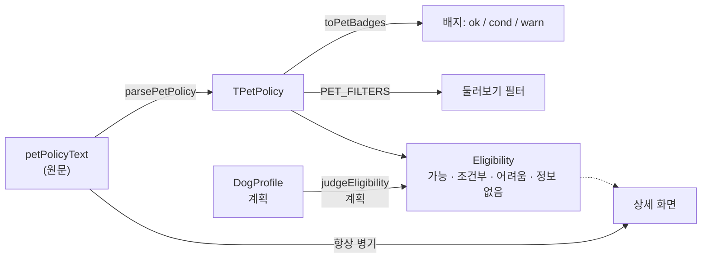

# 반려동물 이용 조건 파서와 "우리 강아지 갈 수 있나" 판정

> 최종 수정: 2026-09-15 (v1: 신설. 파서(구현됨)와 판정(계획)을 한 문서에 두고 경계를 표시)
> v2: 파서에 `tiers`(계단식 무게·마릿수) · `outdoorFree` · `unlimitedDogs` · `feeLines` · `sources`(근거 문장) 추가. 판정 층이 "가장 센 조건" 을 고를 재료를 여기서 만든다 — §1 참고.

## 개요

장소마다 반려동물 이용 조건이 사람이 쓴 문장(`petPolicyText`)으로 있다. 이 문서는 두 층을 다룬다.

1. **파서(구현됨)** — 문장 → `TPetPolicy`. 화면 배지와 필터가 쓴다.
2. **판정(계획, v1)** — `DogProfile × TPetPolicy → Eligibility`. 앱의 목적 그 자체다(→ [CONCEPT.md](../CONCEPT.md)).

## 1. 파서 — `src/lib/petPolicy.ts`

### 출력 `TPetPolicy`

| 필드 | 의미 | 값이 없을 때 |
|---|---|---|
| `indoor` | `free`(실내 자유) / `cage`(실내는 케이지·이동가방·유모차) / `outdoorOnly` / `unknown` | `unknown` — 숙소는 대부분 여기 |
| `weightLimitKg?` | "10kg 이하" 같은 상한 | 없으면 제한 언급 없음 |
| `smallDogOnly` · `mediumDogOk` · `largeDogOk` | 크기 언급 | 전부 false 면 크기 언급 없음 |
| `maxDogs?` | 마릿수 상한. "견수 제한 없음" 처럼 숫자가 없으면 비움 | 비움 — 숫자를 지어내지 않는다 |
| `leash` · `callFirst` | 리드줄 필수 / 사전 전화 | false |
| `feeFree` · `feeText?` | 추가 요금 없음 / 요금 원문(= `feeLines[0]`) | |
| `noInfo` | 원문이 비었거나 "정보 없음" | |
| `tiers` | 계단식 무게·마릿수 조건. `{ maxWeightKg?, weightInclusive?, maxDogs?, source }[]`. 웨스티하우스 → `[{10,미만,2},{20,미만,1}]`. `weightLimitKg`/`maxDogs` 는 여기서 최댓값을 뽑아 파생(화면·필터 호환) | `[]` |
| `outdoorFree` | "실외는 자유", "실내외 모두 가능" 이거나 `indoor==='outdoorOnly'` — 야외 이용이 열려 있음 | `false` |
| `unlimitedDogs` | "견수 제한 없음" 처럼 숫자 없이 마릿수 무제한. `maxDogs` 가 비어 있어도 필터가 "2마리 이상" 으로 잡을 수 있게 한다(백화stay) | `false` |
| `feeLines` | 요금 문장 전부(원문 순서). 구간 요금표("1~5kg 1만원.\n6~10kg 1.5만원.")도 여기엔 두 줄로 남는다 | `[]` |
| `sources` | 규칙별 근거 문장(원문 그대로). `indoor`\|`largeDogOk`\|`mediumDogOk`\|`smallDogOnly`\|`callFirst`\|`leash`\|`feeFree`\|`noInfo` 키만 있고, 실제로 해당 규칙이 걸린 곳만 채워진다. 판정 층이 `reasons[].quote` 로 쓴다 | `{}` |

### 규칙 테이블

파일 상단에 정규식 테이블로 모여 있고 **위에서부터 먼저 걸리는 규칙이 이긴다.**
"실내외 모두 가능하지만 실내에서는 유모차 필요" 처럼 두 조건이 한 문장에 있으므로 더 제한적인 쪽(`outdoorOnly` → `cage` → `free`)을 먼저 본다.
새 표현이 나오면 정규식 한 줄을 추가하고 `pnpm test` 로 확인한다(`src/lib/petPolicy.test.ts`).

### 파서가 하지 않는 것

- **판정하지 않는다.** "대형견은 야외만" 을 `largeDogOk=true, indoor=outdoorOnly` 로 쪼갤 뿐, 우리 강아지가 갈 수 있는지는 말하지 않는다.
- **추측하지 않는다.** 숫자·상한이 안 적혀 있으면 비워 둔다. 필터 결과가 실제보다 적을 수는 있어도 틀린 "가능" 은 내지 않는다.
- 그래서 화면은 **항상 원문을 함께** 보여준다(→ [ADR-004](../decisions/ADR-004-pet-policy-parser.md)).

## 2. 배지와 필터 (구현됨)

- `toPetBadges(policy)` → `{ label, tone: 'ok' | 'cond' | 'warn' }[]`. 카드·상세 상단에 3개 이하로 보인다.
- `PET_FILTERS`(`src/lib/placeFilters.ts`) 는 종류별로 다르다. 식당·카페는 실내/케이지/대형견/리드줄, 숙소는 추가요금/대형견/2마리 이상.
  원문에 적힌 정보의 종류가 다르기 때문이다.

## 3. 판정 — 계획 (v1)

### 입력 `DogProfile`

| 필드 | 타입 | 왜 필요한가 |
|---|---|---|
| `name` | string | 화면 문구("짱구가 갈 수 있는 곳") |
| `weightKg` | number | `weightLimitKg` 비교, 크기 분류 |
| `size` | `small` / `medium` / `large` | 몸무게에서 기본값을 내되 사용자가 고칠 수 있게. 기준(소형 <10kg, 중형 10~25, 대형 >25)은 통상 관례라 데이터 원문의 "대형견" 과 정확히 일치한다는 보장이 없다 |
| `count` | number | `maxDogs` 비교 |
| `hasCarrier` | boolean | 케이지·이동가방·유모차가 있는가. `indoor === 'cage'` 인 곳의 실내 가능 여부가 여기서 갈린다 |
| `needsIndoor` | boolean | 야외석만 가능한 곳을 "조건부" 로 볼지 "어려움" 으로 볼지 |

프로필은 기기 안(localStorage, `useAppStore`)에만 둔다. 여러 마리는 우선 `count` 로만 다루고, 마리별 프로필은 범위 밖.

### 판정 규칙 (초안)

결과는 네 단계다. **위에서부터 먼저 걸리는 규칙이 결과**이고, 근거 문구를 함께 돌려준다.

| 순서 | 조건 | 결과 | 근거 문구 예 |
|---|---|---|---|
| 1 | `policy.noInfo` | 정보 없음 | "이용 조건이 적혀 있지 않아요" |
| 2 | `weightLimitKg` 있고 `dog.weightKg > weightLimitKg` | 어려움 | "10kg 이하만 가능해요" |
| 3 | `maxDogs` 있고 `dog.count > maxDogs` | 어려움 | "2마리까지만 가능해요" |
| 4 | `smallDogOnly` 이고 `dog.size !== 'small'` | 어려움 | "소형견만 가능해요" |
| 5 | `dog.size === 'large'` 이고 `largeDogOk === false` | 조건부 | "대형견 가능 여부를 확인해 주세요" |
| 6 | `indoor === 'outdoorOnly'` | `needsIndoor` 면 어려움, 아니면 조건부 | "야외 자리만 가능해요" |
| 7 | `indoor === 'cage'` 이고 `!dog.hasCarrier` | 조건부 | "실내는 이동가방이 필요해요" |
| 8 | `callFirst` | 조건부 | "방문 전 전화 확인이 필요해요" |
| 9 | 그 외 | 가능 | `feeText` 가 있으면 "추가 요금 {feeText}" 를 정보로 덧붙임 |

- "어려움" 을 "불가" 라 부르지 않는다. 파서가 놓친 예외("대형견은 사장님 재량")가 실제로 있어서다. 상세 화면은 어려움이어도 원문과 네이버 링크를 그대로 둔다.
- 규칙 5·6 의 강도(조건부로 볼지 어려움으로 볼지)는 **제품 판단**이라 사용자가 정한다. 코드로 옮길 때 이 표를 그대로 테이블 상수로 만들고 순서를 바꾸는 것으로 조정할 수 있게 한다.

### 화면 반영 (계획)

- 목록·지도 카드: 판정 배지 하나를 종류 색 옆에. 정렬은 가능 → 조건부 → 정보 없음 → 어려움.
- 상세: 판정 + 근거 문구 → 그 아래 기존 원문 카드.
- 프로필이 없으면 지금과 같은 화면(필터만). 홈에 "우리 강아지 등록하기" 진입.

## 관련 파일

- 구현: `src/lib/petPolicy.ts`, `src/lib/petPolicy.test.ts`, `src/lib/placeFilters.ts`, `src/components/petBadges.tsx`
- 계획: `src/lib/eligibility.ts`(신규), `src/store/useAppStore.ts`(프로필 필드), [features/dog-profile.md](../features/dog-profile.md)
