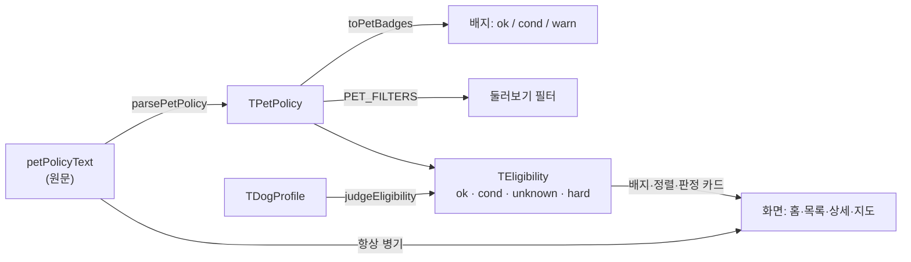

# 반려동물 이용 조건 파서와 "우리 강아지 갈 수 있나" 판정

> 최종 수정: 2026-10-06 (v34: **야외 차선 한 줄을 누르면 그 곳들만 시트로** — `outdoorFallback` 이 수 대신 곳들을 돌려준다. 지도의 「지도에 없는 N곳」 과 같은 줄 목록(`PlaceLinkList`), 14 W261006.5a)
> 이전 2026-10-06 (v33: **목록의 과반이 같은 근거 문장이면 머리가 한 번 말하고 카드는 뺀다** — 식당 29곳이 같은 줄을 되풀이했다. 가능 0곳이면 "야외 자리로는 N곳" 차선 한 줄, 14 W261006.5)
> 이전 2026-10-06 (v32: 판정 근거 문장의 `사실 — 할 일` 줄표를 **두 문장**으로("케이지라고 적혀 있어요. 이동가방도 되는지 확인해 주세요") — 한국어 화면에서 줄표는 번역문·문서체로 읽힌다(디자인 리뷰 §7-3, 14 D261006.7))
> 이전 2026-10-06 (v30: **카드의 요금 칩 하나는 우리 강아지 구간 줄이다** — 첫 줄을 세워 20kg 아이에게 "1~5kg 1만원" 을 보였다. 구간에 안 들면 금액 대신 "10kg 까지 요금표", 07 U5)
> 이전 2026-10-06 (v29: **U1 보강을 지웠다** — v25 뒤로 `noInfo`+`largeDogOk` 조합이 생기지 않아(AI 경로는 `noInfo: false`) 닿는 길이 없었다. `primaryReason` 의 unknown 힌트 갈래도 함께, 14 W261006.19)
> 이전 2026-10-06 (v28: **케이지 배지는 근거 문장이 적은 장비로** — '이동가방 필요'·'유모차 필요'·'가방·유모차 필요', 아무것도 안 적었을 때만 '케이지 필요'. 판정 C2·C3 과 같은 식(`BAG_ALLOWED`·`STROLLER_ALLOWED`, 이제 `petPolicy.ts` 소유)을 본다, 14 W261006.18)
> 이전 2026-10-06 (v27: **카드·지도 시트·근처 장소의 판정 배지도 `headlineFor` 를 쓴다** — 블리스풀이 카드는 "확인이 필요해요", 상세는 "야외 자리에서 갈 수 있어요" 였다. 색은 레벨 그대로, 14 W261006.4)
> 이전 2026-10-06 (v26: **조건부 요금 줄은 곱하지 않고 고른다** — 캄 : Kalm `1마리당 3만원. (2마리 또는 10kg 이상 4만원)` 이 몇 마리·몇 kg 이든 "원문 요금 · …" 이었다. 조건이 맞으면 둘째 줄 금액, 아니면 첫 줄, 14 W261006.2)
> 이전 2026-10-06 (v25: **"정보 없음" 도 조건이 한 줄 읽히면 정보 없음이 아니다** — 맘앤도그가 '확인된 정보가 없어요' 와 '대형견 OK' 를 함께 냈다. 남은 "문의해 보세요" 는 C6, 14 W261006.3)
> 이전 2026-10-06 (v24: **C2 는 원문이 이동가방을 적었으면 물러난다** — 카페스누피 이동가방 보호자에게 "케이지라고 적혀 있어요" 가 떴다, 14 W261006.4)
> 이전 2026-10-06 (v23: **요금표 상한은 크기와 무관하게 본다(C10)** — 구간 상한 검사가 C5(대형견) 안에만 있어 솔숲펜션 12kg·20kg 이 '갈 수 있어요' 였다, 14 W261006.1)
> 이전 2026-10-06 (v22: **C5 는 몸무게가 있는 구간만 본다** — 마릿수만 있는 구간('최대 2마리')도 `tiers` 라 C5 가 물러나, 크기를 말하지 않은 곳의 대형견이 '갈 수 있어요' 로 나왔다. `data:eval` 의 첫 채점(솔숲펜션)이 찾았다)
> 이전 2026-10-05 (v21: **C9 — 확인 기록 없는 일반 허용 문장은 '확인이 필요해요'**(todo/13 A2). "애견동반 가능해요" 한 줄은 읽은 원문이라 C7 이 아니고
> 그동안 아무 규칙도 안 걸려 '갈 수 있어요' 였다. 같은 문장이라도 시드는 작성자가 다녀온 곳이고 블로그에서 온 곳은 아무도 조건을 본 적이 없어서, 규칙을
> 문장이 아니라 **확인 여부**(`verifiedAt`)에 건다 — 문장으로 일괄 바꾸면 시드의 맞는 답까지 흐려진다. 파서는 `genericOnly` 만 세우고, 확인 기록은 장소를
> 싣는 `places.ts` 가 `withVerifiedAt` 으로 얹는다(판정은 정책만 받는다 — 부르는 곳마다 날짜를 넘기면 한 곳만 빠져도 목록과 상세가 다른 답을 한다).
> ⚠ **`/admin` 에서 승인한 블로그 장소에는 안 걸린다** — 그 승인이 확인 날짜를 찍는다(`approveGroup` → `markPlaceVerified`). 걸리는 곳은
> 날짜 없이 게시된 곳 — CLI `pnpm data:apply`(`apply-approved.mjs` 는 날짜를 안 찍는다)로 반영된 곳, `/admin` 승인이 끊겨 CLI 가 이어받은 곳,
> 확인 날짜 칸(`20261001140000`)이 생기기 전에 승인된 곳. 승인 ≠ 조건 확인으로 바꿀지는 열린 결정이다(todo/13 T2.1). 시드는 일반 허용 문장뿐인 곳이 0곳이라 판정이 하나도 안 바뀐다 — `eligibility.test.ts` 가 못 박는다)
> 이전 2026-10-01 (v20: **다두 what-if** — 어려움인 곳에서 마리 부분집합으로 판정을 다시 돌려 "초코만 데려가면 갈 수 있어요" 한 줄(`dogSubsetWhatIf`, 10 F11). 규칙을 새로 쓰지 않는다)
> 이전 2026-10-01 (v19: 숙소 **환경 필터**(독채·마당 있음·울타리 마당·계단 없음)는 반려동물 조건과 **다른 묶음**이고 **판정에 들어가지 않는다**(10 F6, ADR-017 결정 12))
> 이전 2026-10-01 (v18: **예방접종 필수가 동반 조건이 됐다**(ADR-017 v6) — AI 판단에 `vaccineRequired` 칸, 배지 `예방접종 필수`, 판정 C8(확인 필요).
> 정규식 규칙은 두지 않는다 — "접종 권장" 과 "접종 완료견만" 은 글자로 못 가른다. 전엔 이 조건이 `notes` 로만 남아 C7(원문 확인)으로 떨어졌다)
> 이전 (v17: **AI 판단이 있으면 판정은 AI 가 정본이다**(ADR-017 v5) — AI 의 null 을 정규식으로 메우지 않는다(다와풀빌라의 `19kg 이하` 요금 구간이
> 무게 상한이 되어 25kg 가 H1 이던 것), "제한은 정규식이 이긴다" 를 거뒀다, 요금은 AI 가 구조(`fees`)로 뽑고 `formatDogFee` 가 그 칸으로 계산한다. 시드는 그대로)
> 이전 (v16: **요금 배지 라벨은 정규화한 줄이다** — 원문 표기가 제각각이라(`(2만원 추가)`·`20,000원`·`숙박일 관계없이 청소비 5만원 추가`) 숙소 배지가 흩어졌다. `scripts/lib/feeLine.mjs` 의 `normalizeFeeLines` 가 `1마리당 N만원`·`A~Bkg N만원`·`청소비 N만원`·`추가 N만원` 으로 맞춘다. 분석 시점에 저장 전 한 번(원문 대조 **뒤**), 앱의 `toPetBadges` 가 한 번 더(시드·옛 후보). 금액 단위 변환은 모델이 아니라 이 규칙이 하고, 원문 대조(`feeTextGrounded`)는 금액을 원 단위 숫자로 본다 — 글자로 보면 방금 바꾼 줄을 지어낸 것으로 뺀다. 원문에 없는 기준은 붙이지 않는다: `(2만원 추가)` 는 마리당인지 몰라 `추가 2만원`)
> 이전 (v15: **unknown 머리글은 강아지가 아니라 장소가 주어다** — "보리는 확인된 정보가 없어요" → "이곳은 반려견 동반 조건이 공개돼 있지 않아요"(`verdictFor`). unknown 은 원문에 조건이 없어 강아지와 무관하게 같은 결과라, 이름을 앞세우면 없는 판정을 한 것처럼 읽혔다. 상세 카드는 머리글과 같은 말인 U1 근거를 뺀다)
> 이전 (v14: **요금은 목록이다** — AI 판단의 `feeText`(문장 하나) → `feeLines: string[]`(기준마다 한 줄), 근거 확인도 줄마다.
> `toPetBadges` 가 요금 줄을 **전부** 배지로 낸다(전엔 `feeLines[0]` 만 — 구간 요금표의 둘째 줄이 사이트에서 사라졌다).
> 배지가 자기 축(`TBadgeAxis`)을 들고 나온다 — 사이트는 안 쓰고 `/admin` 표가 열을 가르는 데 쓴다(ADR-017 v3))
>
> 이전 (v13: **"안 된다" 와 "못 읽었다" 가 판정에 닿는다**(todo/06 A-1·A-2). `largeDogNo` → H7(대형견은 어려움),
> `unread` → C7(원문은 있는데 아무도 못 읽음 → 확인 필요 — 전엔 '갈 수 있어요'), `feeCharged` → '추가요금 있음' 배지.
> AI 판단은 덮기 전에 **원문에 대 보고** 근거 없는 값을 뺀다(`correctPetPolicyFacts`, §4) · 제한은 정규식이 이긴다. 시드 86곳의 판정은 그대로다)
>
> 이전 (v12: 이동 수단 what-if(`carrierWhatIf`) — **판정을 바꾸지 않고 안내만 한다**. 목록 카드 근거 한 줄(`primaryReason`)·홈과 목록 머리의 레벨별 수(`countByLevel`)를 화면 반영에 적었다)
>
> v11: 상세 머리글이 근거 하나뿐이면 근거를 따르고(C1 → "야외 자리에서 갈 수 있어요"), cond 는 목록 배지와 같은 말로. 근거에 규칙 ID 를 싣는다)
>
> v10: H1 문구가 한도를 넘는 강아지 이름을 적는다)
>
> v9: C5 가 정보 없음이면 물러나고, 요금 줄의 kg 조건·구간표 상한을 짚는다 — "대형견 언급이 없어요" 가 원문과 반대로 말하던 곳)
>
> v8: 곱하지 못한 요금 줄은 이름 대신 "원문 요금 · …" 으로, 어려움 판정에는 요금을 싣지 않는다 — 못 가는 곳의 청소비가 우리가 낼 돈으로 읽혔다)
>
> v7: **블로그 경로 대응**([ADR-017](../decisions/ADR-017-ai-structured-pet-policy.md)·[BUG-008](../bugs/BUG-008-empty-pet-policy-judged-ok.md)) — 빈 원문은 `noInfo`(코드가 이 표를 따르게 됐다) ·
> "동반 안 됨" 문장은 `notAllowed` → 판정 H0(hard) · AI 구조화 판단(`TPlace.petPolicy`)이 있으면 `withPolicyFacts` 가 파서 결과를 덮는다 · 블로그 구어체 어휘(야외 좌석만 · 테라스만 · 켄넬/이동장 챙기기 · 목줄/하네스) 추가)
>
> v6: 리뷰 P1 — 형제 줄에 마릿수·무게 조건이 남아 있으면 곱하지 않는 가드(캄 사례)와 구간 합산의 `maxDogs` 가드. 입력 표를 `dogs[]` 로)
>
> v5: 요금 문구가 마릿수 합산 규칙을 갖는 `formatDogFee`(`dogFee.ts`)로 옮겨 갔고, 이름 붙는 문장은 `korean.ts` 의 조사·애칭 헬퍼를 쓴다. 프로필은 마리별 이름(`dogs[]`)을 갖는다 — ADR-005 v3)
>
> v4: 화면 반영 완료를 반영 — 판정이 홈·둘러보기·상세·지도에 붙었다. "다음 웨이브"·"계획" 표기를 걷어냈다)
>
> v3: 판정(§3)을 "구현됨" 으로. `judgeEligibility` 가 "먼저 걸린 규칙" 대신 **전부 평가해 가장 센 레벨** 을 채택하도록 바뀌었고, `DogProfile` 스펙이 v2(마리별 몸무게 배열·이동 수단 4택·`needsIndoor` 분리)로 확정됐다 — [ADR-005](../decisions/ADR-005-dog-profile-eligibility.md).
>
> v2: 파서에 `tiers`(계단식 무게·마릿수) · `outdoorFree` · `unlimitedDogs` · `feeLines` · `sources`(근거 문장) 추가. 판정 층이 "가장 센 조건" 을 고를 재료를 여기서 만든다 — §1 참고.
>
> 2026-09-15 (v1: 신설. 파서(구현됨)와 판정(계획)을 한 문서에 두고 경계를 표시)

## 개요

장소마다 반려동물 이용 조건이 사람이 쓴 문장(`petPolicyText`)으로 있다. 이 문서는 두 층을 다룬다.

1. **파서(구현됨)** — 문장 → `TPetPolicy`. 화면 배지와 필터가 쓴다.
2. **판정(구현됨, v1)** — `DogProfile × TPetPolicy → Eligibility`. 앱의 목적 그 자체다(→ [CONCEPT.md](../CONCEPT.md)).

## 1. 파서 — `src/lib/petPolicy.ts`

### 출력 `TPetPolicy`

| 필드 | 의미 | 값이 없을 때 |
|---|---|---|
| `indoor` | `free`(실내 자유) / `cage`(실내는 케이지·이동가방·유모차) / `outdoorOnly` / `unknown` | `unknown` — 숙소는 대부분 여기 |
| `weightLimitKg?` | "10kg 이하" 같은 상한 | 없으면 제한 언급 없음 |
| `smallDogOnly` · `mediumDogOk` · `largeDogOk` | 크기 언급 | 전부 false 면 크기 언급 없음 |
| `largeDogNo` | **"대형견은 어려워요"·"대형견 입장 불가"** — 크기의 부정. `largeDogOk` 한 칸으로는 "불가" 와 "언급 없음" 이 둘 다 false 라 따로 둔다. 둘이 같이 걸리면 `largeDogOk` 를 끈다(제한을 믿는다). '대형견 제한 없음' 은 허용이라 걸리지 않는다. '어려워요' 에는 '어렵' 이 없어(ㅂ 불규칙) 정규식이 둘 다 적는다 | `false` |
| `maxDogs?` | 마릿수 상한. "견수 제한 없음" 처럼 숫자가 없으면 비움 | 비움 — 숫자를 지어내지 않는다 |
| `leash` · `callFirst` | 리드줄 필수 / 사전 전화 | false |
| `feeFree` · `feeText?` | 추가 요금 없음 / 요금 원문(= `feeLines[0]`, 옛 화면 호환). **배지는 `feeText` 가 아니라 `feeLines` 전부로 만든다** | |
| `feeCharged` | 추가 요금이 **있다고만** 읽었다(AI `feeFree: false`, 금액 문장 없음). 정규식은 세우지 않는다 | `false` |
| `noInfo` | 원문이 비었거나 "정보 없음" — 빈 원문은 2026-09-28 부터 실제로 여기 걸린다(BUG-008 전에는 문자열만 봤다). **다른 조건이 한 줄이라도 읽히면 서지 않는다** — 맘앤도그 "정보 없음. (문의해보시면 …) 대형견도 동반 가능!!" 은 `largeDogOk` + `callFirst`(남은 "문의해 보세요" 를 C6 로) 다. 전엔 '확인된 정보가 없어요' 판정 옆에 '대형견 OK' 칩이 떴다(14 W261006.3). 전화 확인만 붙은 "정보 없음" 은 그대로 여기 | |
| `unread` | 원문이 **있는데** 이 표의 조건이 하나도 안 섰다(정규식도 AI 도 못 읽음). "애견동반 가능해요!" 처럼 **일반 허용 문장만** 있으면 읽은 것으로 본다 — 단 그 문장에 야외·kg·케이지·요금 같은 제한 암시어가 섞이면 일반 허용이 아니다. 필드를 새로 더하면 `readNothing` 에도 더한다(빠지면 읽은 원문이 '못 읽음' 이 된다) | `false` |
| `genericOnly` | 원문이 **일반 허용 문장뿐**이다 — `unread` 의 반대편(읽었는데 조건이 없다). C9 가 `verified` 와 같이 본다. AI 판단 경로에서는 AI 가 읽은 조건 · `notes` · 정규식에만 남는 허용 단서(`outdoorFree`·`unlimitedDogs`)가 하나라도 있으면 아니다 | `false` |
| `verified` | 장소에 사람이 확인한 기록(`verifiedAt`)이 있다. 원문이 아니라 **장소에서** 온다 — 파서는 늘 `false`, `places.ts` 의 `withVerifiedAt` 이 얹는다 | `false` |
| `notAllowed` | "애견동반은 안됩니다" 처럼 주어(애견·반려견·강아지…)+동반/출입/입장 뒤에 불가·안 됨·금지. 견종 뒤의 '불가'(대형견 불가)는 아니다 | 배지 '동반 불가' |
| `tiers` | 계단식 무게·마릿수 조건. `{ maxWeightKg?, weightInclusive?, maxDogs?, source }[]`. 웨스티하우스 → `[{10,미만,2},{20,미만,1}]`. `weightLimitKg`/`maxDogs` 는 여기서 최댓값을 뽑아 파생(화면·필터 호환) | `[]` |
| `outdoorFree` | "실외는 자유", "실내외 모두 가능" 이거나 `indoor==='outdoorOnly'` — 야외 이용이 열려 있음 | `false` |
| `unlimitedDogs` | "견수 제한 없음" 처럼 숫자 없이 마릿수 무제한. `maxDogs` 가 비어 있어도 필터가 "2마리 이상" 으로 잡을 수 있게 한다(백화stay) | `false` |
| `feeLines` | 요금 문장 전부(원문 순서, 중복 제거). 구간 요금표("1~5kg 1만원.\n6~10kg 1.5만원.")는 두 줄로 남고 **두 줄 다 배지가 된다**. AI 가 요금을 읽었으면 그 목록이 이 값을 통째로 덮는다(§4) | `[]` |
| `sources` | 규칙별 근거 문장(원문 그대로). `indoor`\|`largeDogOk`\|`largeDogNo`\|`mediumDogOk`\|`smallDogOnly`\|`callFirst`\|`leash`\|`feeFree`\|`noInfo` 키만 있고, 실제로 해당 규칙이 걸린 곳만 채워진다. 판정 층이 `reasons[].quote` 로 쓴다 | `{}` |

### 규칙 테이블

파일 상단에 정규식 테이블로 모여 있고 **위에서부터 먼저 걸리는 규칙이 이긴다.**
"실내외 모두 가능하지만 실내에서는 유모차 필요" 처럼 두 조건이 한 문장에 있으므로 더 제한적인 쪽(`outdoorOnly` → `cage` → `free`)을 먼저 본다.
새 표현이 나오면 정규식 한 줄을 추가하고 `pnpm test` 로 확인한다(`src/lib/petPolicy.test.ts`).

### 파서가 하지 않는 것

- **판정하지 않는다.** "대형견은 야외만" 을 `largeDogOk=true, indoor=outdoorOnly` 로 쪼갤 뿐, 우리 강아지가 갈 수 있는지는 말하지 않는다.
- **추측하지 않는다.** 숫자·상한이 안 적혀 있으면 비워 둔다. 필터 결과가 실제보다 적을 수는 있어도 틀린 "가능" 은 내지 않는다.
- 그래서 화면은 **항상 원문을 함께** 보여준다(→ [ADR-004](../decisions/ADR-004-pet-policy-parser.md)).

## 2. 배지와 필터 (구현됨)

- `toPetBadges(policy)` → `{ label, tone: 'ok' | 'cond' | 'warn', axis: TBadgeAxis }[]`. 카드·상세 상단에 3개 이하로 보인다.
  순서는 이 함수 하나가 정하고 그것이 곧 사이트의 순서다: 동반 불가 → 실내 → **요금(줄마다 하나)** → 크기 → 무게 → 마릿수 → 리드줄 → 확인 필요.
- **카드는 요금 줄을 첫 줄만 세운다**(`limit` 이 주어진 뷰 — 카드·지도 시트·근처 목록). 요금은 개수 상한이 없고 순서에서
  크기·확인 필요보다 앞이라, 그대로 자르면 경고 배지가 `+N` 뒤로 숨는다. 접힌 수는 거른 뒤가 아니라 전부에서 센다.
  프로필이 있으면 그 한 줄은 첫 줄이 아니라 **가장 무거운 아이가 들어가는 줄**이다(`dogFee.ts` 의 `feeChipForWeight`, 07 U5).
  몸무게로 갈리지 않는 기본 줄(마리당)이 있으면 구간 밖일 때 그 줄, 줄이 전부 구간인데 안 들면 금액을 고르지 않고 "10kg 까지 요금표",
  하한 줄만 있고 그 아래면 칩을 뺀다 — 원문이 그 몸무게의 요금을 말하지 않는다. 상세(`limit` 없음)는 그대로 전부다.
- `axis` 는 **사이트가 그 밖에는 안 쓴다**(한 줄에 전부 세운다). `/admin` 검수 표가 `동반 조건`·`강아지 요금`·`필요 장비` 세 열로 가르는 데 쓴다
  (`adminPreview.ts` 의 `policySplit`). 라벨로 가를 수 없어서 값에 싣는다 — 요금 배지의 라벨은 요금 줄을 정규화한 문장이라("1마리당 2만원") 라벨만으로는 축을 알 수 없다.
- **요금 배지 라벨은 `normalizeFeeLines`(`scripts/lib/feeLine.mjs`)를 거친다.** `feeLines` 자체는 원문 그대로 두는데, 판정(C5 의 `N kg 이상`·구간 상한)과
  `formatDogFee` 가 같은 배열을 앵커된 정규식으로 읽고 시드 파싱 결과가 테스트에 못 박혀 있어서다. 정규화 결과는 그 정규식들이 읽는 모양(`1마리당 N만원`·`A~Bkg N만원`·`Nkg 이상`)을
  그대로 지키므로, 분석 시점에 저장되는 AI 요금 줄은 정규화된 채로 들어가도 판정·요금 문구가 깨지지 않는다. 한 줄에 금액이 둘 이상이면 기준마다 나눈다 — 경계는 쉼표·마침표 뒤 공백과 **공백으로 둘러싸인** `/`·`·` 뿐이다(`중·대형견`·`2만원/박` 에서 자르면 중형견 요금·단위가 떨어져 나간다). 금액 없는 조각이 `kg`·`마리` 조건이면 다음 기준에 붙이고(C5 가 `10kg 이상` 을 읽는다), 조건 없는 설명문만 버린다. 분석 시점에 저장된 줄은 되돌릴 수 없으니 분할 규칙을 넓힐 때는 이 점부터 본다.
  `'gear'`(챙겨 갈 것)만 **값으로 갈린다**: `indoor: 'cage'`("케이지 필요")는 실내 판단에서 나오지만 사람이 할 일은 가방을 챙기는 것이라 장비 축이고,
  `free`·`outdoorOnly` 는 챙길 것이 없어 `'indoor'` 로 남는다.
- `PET_FILTERS`(`src/lib/placeFilters.ts`) 는 종류별로 다르다. 식당·카페는 실내/케이지/대형견/리드줄, 숙소는 추가요금/대형견/2마리 이상.
  원문에 적힌 정보의 종류가 다르기 때문이다.
- **숙소 환경 필터**(`ENV_FILTERS` — 독채 · 마당 있음 · 울타리 마당 · 계단 없음)는 **판정에 들어가지 않는다.** 갈 수 있는지와 무관한 선호라
  `eligibility.ts` 를 지나지 않고, 화면에서도 반려동물 조건과 **다른 묶음**("숙소 환경")으로 그린다 — 한 줄에 섞으면 "대형견 OK" 와 "마당 있음" 이 같은 무게로 읽힌다(08 T2.3).
  true 로 확인된 곳만 걸린다(모르는 곳을 넣으면 "계단 없음" 에 계단 있는 곳이 섞인다). 데이터에 걸리는 곳이 없는 칩은 그리지 않는다 — 시드에는 울타리·단층 문장이 없어
  지금은 `독채`·`마당 있음` 둘만 선다. 값은 `TPlaceEntry.environment`(AI `stay.environment` 칸마다 우선 + 정규식, `scripts/lib/stayEnvironment.mjs`).

## 3. 판정 — 구현됨

### 입력 `TDogProfile` (`src/types.ts`)

| 필드 | 타입 | 왜 필요한가 |
|---|---|---|
| `dogs` | `{ name: string; weightKg: number }[]` (1~3) | 마리별 이름·몸무게. 무게 상한 비교는 **최댓값**(`maxWeightKg`, `dogProfile.ts`), 마릿수는 `length`. 28kg+17kg 를 `count=2, weightKg=28` 로 뭉개면 실제보다 후하게 판정한다(디자인 리뷰 §1③). 이름이 마리별인 이유는 [ADR-005 v3](../decisions/ADR-005-dog-profile-eligibility.md) |
| `carrier` | `'none' \| 'bag' \| 'cage' \| 'stroller'` | 케이지 필수인 곳에서 슬링백을 케이지로 오해하면 위험하다(리뷰 §1③) — 넷으로 나눠 판정을 갈랐다 |
| `sizeOverride?` | `TDogSize` | 몸무게 기준 자동 계산(소형 <10kg · 중형 10~25kg · 대형 >25kg)이 원문의 "대형견" 과 어긋날 수 있어 프로필 폼의 "크기 수정" 으로 고칠 수 있다 |

`needsIndoor`(실내 자리가 꼭 필요한지)는 프로필이 아니라 **여행 정보**라 스토어의 별도 토글(`useAppStore.needsIndoor`)로 분리했다 — 계절이 바뀌면 강아지는 그대로인데 필요한 자리는 바뀐다(리뷰 §1②).

프로필은 기기 안(localStorage, `useAppStore`)에만 둔다. 마리별 프로필(성향·견종)은 범위 밖.

### 판정 규칙 — `src/lib/eligibility.ts` 의 `RULES`

**"먼저 걸린 규칙이 이긴다" 던 초안과 달리, 전부 평가해 가장 센 레벨을 채택한다** — 한 문장에 여러 조건이 섞인 원문(예: "실내는 케이지, 실외는 자유")에서 근거 하나를 놓치지 않기 위해서다. 레벨은 hard 하나라도 있으면 hard, 아니면 `noInfo` 면 unknown, 아니면 cond 있으면 cond, 그 외 ok. reasons 는 심각도순(hard→cond→unknown→info)으로 정렬한다.

| # | 조건 | 레벨 | 문구 |
|---|---|---|---|
| H0 | `notAllowed` | hard | "반려견 동반이 안 된다고 적혀 있어요" — 강아지 조건과 무관 |
| H1 | `tiers` 중 무게 조건이 있는 칸이 있는데, 최댓값 몸무게가 그 어느 칸에도 못 들어감 | hard | "{이름}({몸무게}kg)는 {N}kg {미만/이하} 조건을 넘어요" · 여럿이면 "{이름(kg)}·{이름(kg)} 모두 …" — 한도를 넘는 아이만 적는다 |
| H2 | 무게로 들어가는 칸은 있지만(칸이 여럿이면 마릿수 상한이 가장 큰 칸 기준) 그 칸의 마릿수 상한보다 마릿수가 많음 | hard | "{N}kg {미만/이하}은 {M}마리까지예요" |
| H3 | `smallDogOnly` · size ≠ small | hard | "소형견만 가능해요" |
| H7 | `largeDogNo` · size==='large' | hard | "대형견은 어렵다고 적혀 있어요" — 번호는 나중에 생겨서 H7, 표시 순서는 H3 옆. 전엔 "불가" 가 "언급 없음" 과 같아져 C5(확인 필요)로 떨어졌다 |
| H4 | `indoor==='cage'` · size==='large' · carrier≠'cage' | !outdoorFree ? hard : (needsIndoor ? hard : cond) | "실내는 케이지 필수라 대형견은 어려워요" / "…야외 자리만 가능해요" |
| H5 | `indoor==='cage'` · carrier==='none' · !outdoorFree · size≠'large' | hard | "케이지 동반시에만 가능해요" (대형견은 H4 가 대신) |
| H6 | `indoor==='outdoorOnly'` · needsIndoor | hard | "야외 자리만 가능해요" |
| C1 | `indoor==='outdoorOnly'` · !needsIndoor | cond | "야외 자리만 가능해요" |
| C2 | `indoor==='cage'` · carrier==='bag' · **실내 근거 문장이 이동가방을 적지 않음**(`가방`·`슬링`, 뒤 16자 안 `불가`·`안 돼`·`금지` 면 허용 아님 — 잘못 물러나면 지어낸 '갈 수 있어요') | cond | "케이지라고 적혀 있어요. 이동가방도 되는지 확인해 주세요". `cage` 는 "케이지·이동가방·유모차 중 하나" 라 카페스누피("실내에서는 유모차/이동 가방 필요")의 이동가방 보호자에게 되물으면 원문이 허락한 것을 의심하게 만든다 — C3 의 유모차 물러남과 같다(14 W261006.4) |
| C3 | `indoor==='cage'` · carrier==='stroller' · 원문에 "유모차" 언급 없음 | cond | "케이지라고 적혀 있어요. 유모차도 되는지 확인해 주세요" |
| C4 | `indoor==='cage'` · carrier==='none' · outdoorFree | needsIndoor ? hard : cond | "실내는 케이지, 야외는 자유예요" |
| C5 | size==='large' · !largeDogOk · **!largeDogNo**(H7 이 말한다) · **몸무게 있는** `tiers` 없음(마릿수만 있는 구간은 크기를 말하지 않았다) · H4 미해당 · **`noInfo` 아님**(정보 없음이면 U1 이 말한다 — 대형견 문구가 unknown 근거보다 먼저 읽혀 엉뚱한 이유처럼 보였다) | cond | 요금 줄에 `N kg 이상` 이 있으면 "{N}kg 이상 요금이 적혀 있어요. {최대 몸무게}kg 도 되는지 확인해 주세요"(원문이 무게를 말했는데 "언급이 없다" 고 하면 반대다) · 요금 구간표 상한을 넘으면 물러난다(C10 이 말한다) · 그 외 "대형견 언급이 없어요. 확인해 주세요" |
| C10 | 요금표가 **몸무게 구간으로만** 짜여 있고(`feeRules` 의 마리당 줄이 전부 `maxKg` 를 가짐 / 없으면 `feeLines` 의 `a~N kg` 줄 · 위로 열린 줄 없음) 어느 마리든 그 끝을 넘음 · `noInfo` 아님 · H1 미해당(무게 상한이 이미 어려움이면 덧붙이지 않는다) | cond | "{N}kg 초과 요금이 적혀 있지 않아요. 콩이(12kg)도 되는지 확인해 주세요" — 넘는 아이만 이름. **크기와 무관하다**: 전엔 C5 안에 있어 대형견만 잡혔고 솔숲펜션(`1~5kg · 6~10kg`)의 12kg·20kg 이 요금 줄도 없이 '갈 수 있어요' 였다(14 W261006.1). "10kg 이상 4만원"·무게 조건 없는 마리당 요금("1마리당 2만원")·크기를 말하는 다른 줄이 있으면 표가 위로 열린 것이라 걸지 않는다 |
| C6 | `callFirst` | cond | "방문 전 전화 확인이 필요해요" |
| C8 | `vaccineRequired` | cond | "예방접종을 마친 강아지만 들어갈 수 있어요. 접종 증명을 챙겨 주세요". **AI 판단에서만** 선다(정규식 규칙 없음, 시드는 늘 false). 프로필에 접종 칸이 없어 어려움이 아니다 |
| C7 | `unread` | cond | "조건 문장을 자동으로 읽지 못했어요. 원문을 확인해 주세요". 어려움이 아닌 이유: 원문이 무엇을 막는지 모른다. 전엔 아무 규칙도 안 걸려 **'갈 수 있어요'** 였다(todo/06 A-1 — 첫 분석에서 조건 문장 32건 중 20건이 정규식 0) |
| C9 | `genericOnly` · **!verified** | cond | "조건이 적혀 있지 않아요. 가기 전에 확인해 주세요". 원문이 일반 허용 문장뿐("애견동반 가능해요")이고 사람이 확인한 기록(`verifiedAt`)이 없다. C7 과 배타적이다(`genericOnly` 는 읽은 원문, `unread` 는 못 읽은 원문). 확인 기록이 있으면 같은 문장이 '갈 수 있어요' 그대로다 — 무게가 문장이 아니라 출처에 있다(todo/13 A2) |
| U1 | `noInfo` (빈 원문 포함) | unknown | "이용 조건이 적혀 있지 않아요" |
| I1 | `formatDogFee(policy, dog)` 결과(아래 §요금) | info | "악동이는 3만원" · "악동이와 두부는 2.5만원 (1~5kg 1만원 · 6~10kg 1.5만원)" — 이름까지 붙은 완성 문장 |

carrier 에 따라 H5/C2/C3/C4 는 배타적이다(정확히 한 갈래만 걸린다). H4(대형견+케이지 미보유)는 이들과 별개로 평가되되, 대형견이면 H5 가 물러나 같은 문장을 두 번 근거로 내지 않는다. H4 가 걸리면 C5 도 다시 내지 않는다. 야외 자리를 답으로 내리는 H4·C4 는 둘 다 `needsIndoor` 를 본다.

### 요금 — `formatDogFee(policy, dog)` (`src/lib/dogFee.ts`)

목록 카드·상세의 info 근거가 **같은 문자열**을 그대로 출력한다(예전에는 화면이 이름을 따로 붙였다). 원칙은 파서와 같다 — **숫자를 지어내지 않는다.** 마릿수만큼 곱해도 되는 것이 원문에서 확실할 때만 곱한다.

| 원문 줄 | 곱하나 | 문구(악동 4kg · 두부 8kg 기준) |
|---|---|---|
| `feeFree` | — | "악동이와 두부는 추가 요금 없음" |
| 마리당 단일 금액 `1마리당 3만원` (괄호·뒤의 "추가" 허용) | 곱한다 — 단 `maxDogs` 를 넘는 마릿수면 그 요금이 우리에게 적용된다고 볼 수 없어 안 곱한다 | 1마리 "악동이는 3만원" / 2마리 "악동이와 두부는 6만원 (1마리당 3만원)" |
| 무게 구간 `1~5kg 1만원` · `6~10kg 1.5만원` | **마리별 몸무게**로 각자 구간을 찾아, 모든 마리가 들어가고 금액이 단일값이면 합산. 쓰인 구간만 `feeLines` 순서로 나열(중복 제거) | 1마리 "악동이는 1만원 (1~5kg)" / 2마리 "악동이와 두부는 2.5만원 (1~5kg 1만원 · 6~10kg 1.5만원)" |
| 그 외 — 범위 금액 `1마리당 1-2만원`, 단위 불명 `5만원`, `(2만원 추가)`, 청소비 등 | 안 곱한다 | "원문 요금 · 2만원 추가" (앞뒤 괄호는 벗긴다) |
| 마리당 줄 + **바꿔 붙는** 줄 정확히 둘 — 캄(Kalm) `1마리당 3만원. (2마리 또는 10kg 이상 4만원)` | 안 곱하고 **고른다**(`withAlternative`). 둘째 줄은 마리당이 아니라 그 조건일 때의 요금이다 — "2마리" 가 조건이라 2마리에 4만원(첫 줄을 곱한 6만원도, 둘째 줄을 곱한 8만원도 아니다). 마릿수가 조건 이상이거나 한 마리라도 kg 하한 이상이면 둘째 줄, 아니면 첫 줄. 조건 마릿수를 넘으면(3마리) 원문이 말하지 않아 물러난다. 요금 구조(`feeRules`)가 이 줄을 `amountWon: null` 로 못 담아도 같은 길로 고른다 | 4kg 1마리 "두부는 3만원 (1마리당 3만원)" / 12kg 1마리·2마리 "악동이와 두부는 4만원 (2마리 또는 10kg 이상 4만원)" |
| 곱할 줄 **말고 다른 줄**이 마릿수·무게 조건을 말함(위 모양이 아님) | 안 곱한다. 조건 줄까지 함께 보여준다 | "원문 요금 · …" |

**요금 구조(`feeRules`)가 있으면 위 표를 안 탄다**(v17, ADR-017 결정 9) — 블로그 경로의 새 판단은 AI 가 줄마다 `amountWon`·`basis`·`minKg`/`maxKg`·`fromDog`·`perNight` 를
뽑고, `sumByRules` 가 그 칸으로 계산한다. 마리마다 몸무게에 맞는 마리당 줄을 골라 더하고(`fromDog` 앞 순번은 0원), 청소비(`flat`)는 한 번 더한다.
물러나는 경우: 금액이 빈 줄이 하나라도 있음(`또는`·범위 금액) · 몸무게가 어느 줄에도 안 들어감(19.5kg) · 한 마리에 줄이 둘 맞음 · 1박당과 한 번이 섞임 · `maxDogs` 초과.

| 구조 | 문구 |
|---|---|
| `19kg 이하 1마리당 2만원` + `20kg 이상 1마리당 3만원`, 보리 28kg · 콩 17kg | "보리와 콩이는 5만원 (19kg 이하 1마리당 2만원 · 20kg 이상 1마리당 3만원)" |
| `2마리부터 1마리당 2만원`, 1마리 | "악동이는 추가 요금 없음 (2마리부터 1마리당 2만원)" |
| `1마리당 3만원` + `청소비 5만원`, 2마리 | "악동이와 두부는 11만원 (1마리당 3만원 · 청소비 5만원)" |
| `1박당 2만원`, 2마리 | "악동이와 두부는 1박 4만원 (1박당 2만원)" |

`maxDogs` 가드는 마리당 곱셈과 구간 합산 양쪽에 걸린다. 구간 합산에서 "안 쓴 구간 줄" 은 조건이 아니라 같은 요금표의 다른 칸이라 가드 대상이 아니다. 줄을 고르는 순서는 예전 `feeForDog` 그대로다: 최대 몸무게가 들어가는 구간 줄 → 구간이 아닌 첫 줄 → 없으면 비운다. 한 마리라도 구간 밖이면 합산하지 않고 이 순서로 물러난다 — 28kg 강아지에게 "1~5kg 1만원" 을 이름까지 붙여 확정된 숫자처럼 보여주지 않기 위해서다. 금액은 만원 단위 소수 1자리(15000 → "1.5만원"), 1만 미만은 "5,000원".

**이름은 곱셈이 성립했을 때만 붙인다.** 곱하지 못한 줄은 "우리 강아지 기준" 이 아니라 원문을 옮긴 것이라 "원문 요금 · …" 으로 연다 — "대장이와 초코 · 청소비 5만원" 은 우리가 낼 돈이 확정된 것처럼 읽혔다. 그리고 **판정이 어려움(hard)이면 요금 자체를 싣지 않는다**(`fee` 도, I1 근거도) — 못 간다는 곳에 붙은 요금은 답이 아니라 소음이다.

### 한국어 호칭 — `src/lib/korean.ts`

이름이 들어가는 문장은 전부 이 헬퍼를 거친다. 자리마다 따로 구현하면 한 곳만 고쳐져 어긋난다.

- `dogCallName(name)`: 보호자가 부르는 이름. 받침으로 끝나면 '이' 를 붙인다(우현 → 우현이). 받침이 없으면 그대로라 이미 '악동이' 로 등록한 이름에 '이' 가 겹치지 않는다.
- `dogCallNames(names)`: 여러 마리를 한 덩어리로 — "악동이" / "악동이와 두부" / "악동이, 두부, 콩이". **조사는 붙이지 않는다** — 호출부가 문맥에 맞는 조사를 `withJosa(word, '은/는' | '이/가' | '을/를' | '과/와' | '이랑/랑' | '아/야')` 로 붙인다. 그래야 "악동이와 두부**는** 갈 수 있어요" 와 "악동이와 두부**랑** 제주 어디 갈까요?" 가 한 함수에서 나온다.
- 받침 판별은 한글 완성형(U+AC00–D7A3)만. 영문·숫자는 받침 없음으로 보고 뒤 조사를 쓴다("Coco는") — 발음을 추측하지 않는다.

### 검증 — 보리+콩(28kg+17kg·이동 수단 없음) 실사 재확인

디자인 리뷰 §1 의 사람 판단과 구현 결과를 86곳 전체로 비교했다(`eligibility.test.ts`):

| 구분 | 사람 판단 | 구현 |
|---|---|---|
| 가능 | 9 | 7 |
| 조건부 | 30 | 32 |
| 어려움 | 42 | 42 |
| 정보 없음 | 5 | 5 |

전부 ±5 안. 규칙표를 억지로 맞추지 않고 그대로 채택했다.

**미해결 제품 판단 1건**: 원 스펙 초안은 "필요한 이동 수단을 정확히 갖춘 경우(예: 케이지 필수 식당에 케이지를 들고 감)" 도 조건부로 봤으나, carrier 4택을 배타적으로 나눈 규칙표(H5/C2/C3/C4)에는 그 조합에 해당하는 규칙이 없어 `ok` 로 판정된다 — 정확한 이동 수단을 가진 경우까지 조건부로 만들면 케이지/이동가방을 구분한 의미가 없어지기 때문(§2 리뷰어③ 지적과 같은 맥락)에 규칙표를 그대로 두었다. 더 보수적인 판정을 원하면 `ruleLargeNeedsCage`/`ruleNoCarrierNoOutdoor` 옆에 "carrier==='cage' 도 cond" 규칙을 추가하면 된다.

### 화면 반영 (구현됨)

- 목록·지도 카드: 판정 배지 하나를 종류 색 옆에. 정렬은 ok → cond → unknown → hard. 배지 라벨은 문장형("갈 수 있어요 / 확인이 필요해요 / 정보가 없어요 / 이용하기 어려워요"). 판정 배지가 있는 줄에서는 원문 배지 "확인된 정보 없음" 을 뺀다(`PetBadges hideNoInfo`) — 같은 말을 두 번 하지 않기 위해
  (`src/lib/sortByEligibility.ts`, `src/components/eligibilityBadge.tsx`).
- 상세: 판정 + 근거 문구(`reasons[].quote`)를 판정 카드로, 그 아래 원문 카드에서 강조
  (`src/screens/placeDetailEligibilityCard.tsx`).
  **머리글은 근거가 하나뿐일 때 근거를 따른다**(`headlineFor`) — cond 근거가 C1(야외 자리만) 하나뿐이면 "야외 자리에서 갈 수 있어요", 그 밖의 cond 는 목록 배지와 같은 "확인이 필요해요". "확인해야 알 수 있어요" 바로 아래 "야외 자리만 가능해요" 가 오면 머리글과 근거가 싸웠다. 규칙 판별은 문구가 아니라 근거에 실린 규칙 ID(`TReason.rule`)로 하고, 요금(I1)은 세지 않는다.
  **unknown 은 이름을 빼고 장소를 주어로 말한다**(`verdictFor`, 공유 글도 같은 함수) — "이곳은 반려견 동반 조건이 공개돼 있지 않아요". unknown 은 `noInfo` 에서만 생기고 강아지 조건과 무관한데, "보리는 …" 으로 시작하면 보리를 기준으로 무언가 판정한 것처럼 읽혔다. 상세 카드는 머리글과 같은 말인 U1 근거를 목록에서 뺀다.
- 둘러보기: "어려운 곳 숨기기" · "실내 자리 필요" 토글(`src/screens/placesPageEligibilityToggles.tsx`).
- 목록 카드: 요금 줄 아래 근거 한 줄(`primaryReason` — 최종 레벨과 같은 레벨의 첫 근거). 7곳을 다 눌러야 왜 "확인" 인지 알던 것을 목록에서 읽게.
  - **목록의 과반이 같은 문장이면 머리로 올린다**(3곳 이상 + 과반, `placesPageRepeatedReason`). 식당 34곳 중 29곳이 "케이지라고 적혀 있어요. 이동가방도 되는지 확인해 주세요" 를 한 줄씩 되풀이해, 목록이 걸러 주는 게 없어 보였다(6/6, 14 W261006.5). 머리가 "29곳은 같은 이유예요" 로 한 번 말하고, 그 문장과 **같은** 카드만 줄을 뺀다 — 야외만·전화 확인처럼 다른 카드는 그대로라 다른 것만 눈에 띈다. 칩은 새로 만들지 않았다: 식당(케이지)에서는 남는 판정 배지("확인이 필요해요")와 원문 배지("케이지 필요")가 그 칩이다. 받칠 원문 배지가 없는 문장(카페 × 대형견의 "대형견 언급이 없어요")은 머리 상자의 곳 수 + 문장이 대신한다. 키는 규칙 ID 가 아니라 **문장**이다(같은 H1 이라도 kg 숫자가 다르다).
  - **갈 수 있는 곳이 0곳이면 야외 차선**을 같은 머리에 한 줄 — 야외 자리가 열려 있고(`outdoorFree`) 어려움이 아닌 곳들(`outdoorFallback` — 수가 아니라 곳을 돌려준다). 「야외 자리 N곳 보기」 를 누르면 그 곳들만 시트로 펼쳐 바로 상세로 잇는다 — 목록에서는 확인 필요·정보 없음 사이에 흩어져 있어 3곳을 찾으러 34곳을 훑게 된다. 실내 자리가 꼭 필요하면(`needsIndoor`) 말하지 않는다. 지금은 식당 × 대형견에서만 열린다(3곳).
- 홈·목록 머리: 레벨별 곳 수를 **같은 함수**(`src/lib/eligibilityCounts.ts` 의 `countByLevel`)로 — 홈 "가능 3 · 확인 3", 목록 "26곳 · 가능 4 · 확인 4 · 정보 없음 4 · 어려움 14"(→ [features/home-header.md](../features/home-header.md)).
- **이동 수단 what-if**(식당 탭, 프로필이 `none` 일 때): 지금 결과 중 어려움인 곳을 `carrier: 'bag'` 으로 다시 판정해 어려움에서 벗어나는 수를 "이동가방이 있으면 N곳이 '확인 필요' 로 바뀌어요 · 우리 강아지 정보 고치기" 로 알린다(`carrierWhatIf`, `src/screens/placesPageResults.tsx`). 같은 이유 문장·야외 차선과 **한 상자**에 모인다 — 케이지 이유와 그 출구가 따로 쌓이면 같은 이야기를 두 번 한다. **what-if 는 판정을 바꾸지 않고 안내만 한다** — 등급·배지("케이지 필요")·준비물 표(`ITEM_NEEDS`, ADR-009)는 그대로고, 바꾸는 길은 프로필(`/dog`) 하나다. 대형견은 가방이어도 H4 가 그대로라 0 → 줄을 그리지 않는다.
- 지도: 마커 색과 시트 라벨이 판정 레벨을 따른다(`src/screens/mapPage.tsx`, `mapPageSheet.tsx`).
- 프로필이 없으면 필터만 있는 화면으로 폴백하고, 홈에 "우리 강아지 등록하기" 진입(`/dog`).

### 다두 what-if — `src/lib/dogSubsetWhatIf.ts`

여러 마리인데 **어려움**이면, 마리 부분집합(3마리면 6개)마다 `judgeEligibility` 를 다시 돌려 갈 수 있는 조합 하나를 상세 판정 카드에 한 줄로 말한다 —
"초코만 데려가면 갈 수 있어요"(10 F11, 태호). 규칙을 새로 쓰지 않으니 무게·마릿수·요금 규칙이 바뀌어도 따라간다.

- **어려움일 때만.** 확인 필요(cond)에서 "한 마리만 가면 확인 없이" 는 판정을 뒤집는 말이 아니라 소음이다. 정보 없음(unknown)이 나오는 조합은 고르지 않는다.
- **가장 많이 데려가는 조합**(두고 갈 아이가 적은 쪽) → 판정이 나은 쪽 → 무거운 쪽.
- **크기 수정(`sizeOverride`)은 가져가지 않는다** — 가장 큰 아이를 고친 값이라, 작은 아이만 남으면 틀린 크기가 된다. 이동 수단은 그대로(보호자 것).

## 4. AI 구조화 판단 — `withPolicyFacts` (블로그 경로, ADR-017)

블로그에서 온 장소는 `TPlace.petPolicy`(`TPetPolicyFacts`, DB `places.pet_policy`)에 AI 가 원문을 읽고 판단한 값이 있다 — 실내 정책 · 리드줄 · 대형견 · 소형견만 ·
전화 확인 · 추가 요금(`fees`) · 무게 상한 · 마릿수 · 비고. `src/lib/places.ts` 가 `withPolicyFacts(parsePetPolicy(text), petPolicy, text)` 를 부르고,
**facts 가 있으면 판정 필드를 그 값만으로 정한다**(v17, ADR-017 v5). `unknown`/`null` 은 "모름" 이 아니라 "읽어 봤는데 그런 조건이 없다" 다 —
스키마가 모든 칸을 요구하므로. 정규식 결과는 근거 문장(`sources`, AI 와 같은 판단을 짚었을 때만)과 AI 에 칸이 없는 허용 단서
(`outdoorFree`·`unlimitedDogs`)에만 남는다. 무게·마릿수는 한 칸짜리 `tiers` 로 넣어 H1·H2 가 같은 숫자를 본다.

**왜 정규식으로 메우지 않나** — 정규식은 무게 상한과 요금 구간을 가르지 못한다. 다와풀빌라 `19kg 이하 1마리당 20,000원` 에서 AI 는 상한 없음(null)으로 맞게 읽었는데,
v16 까지는 null 을 "언급 없음" 으로 보고 정규식의 `~19kg` 을 남겨 25kg 강아지를 H1 **어려움**으로 보냈다. 어긋남은 검수의 `AI≠정규식` 표식이 보여 준다.

요금은 두 갈래다. **구조(`fees`)가 있으면** 그 label 이 `feeLines` 가 되고 `feeRules` 로 실려 `formatDogFee` 가 칸으로 계산한다(§3 요금). **구조가 없는 옛 판단**은
v14 의 잔여 병합 그대로다 — AI 목록을 앞에 세우고 파서 줄은 **금액(원 단위)이 전부 덮인 것만** 버린다. 옛 후보는 요금이 한 칸(`feeText`)이라, 통째로 믿으면
원문 `1마리당 3만원. (2마리 또는 10kg 이상 4만원)` 의 둘째 줄이 사라져 2마리를 "6만원" 으로 곱한다(원문은 4만원). 금액을 숫자 조각이 아니라 원 단위로 대 보는 것은
`2만원`(정규화된 AI 줄)과 `20,000원`(원문 줄)을 같은 요금으로 보기 위해서다 — 전에는 같은 요금이 두 번 섰다.
시드 86곳은 `petPolicy` 가 없어 이 함수를 그대로 통과한다 — 정규식이 시드의 유일한 경로다(AI 판단 채우기는 보류, ADR-017 결정 10).
왜 정규식만으로 안 됐나 — 첫 `data:analyze`(2026-09-28)의 조건 문장 32건 중 20건을 어떤 규칙도 못 읽었다. 구어체는 끝이 없어 판단을 모델에 맡기고,
사람 검수(`pnpm data:review`)가 `정규식 [..] · AI [..] · 앱 [..]` 을 나란히 보며 어긋남을 잡는다.

### 덮기 전의 보정 — AI 판단도 원문에 대 본다 (v13)

모델은 원문에 없는 것을 낸다 — "애견동반 가능해요!" 에 `weightLimitKg: 10` 을 붙이면 그 숫자가 대형견을 H1 로 **어려움**에 보낸다.
틀린 제한은 틀린 허용만큼 해롭다(갈 수 있는 곳을 지운다). 그래서 `withPolicyFacts` 는 쓰기 전에 원문에 대 본다.

1. **`correctPetPolicyFacts(facts, text)`**(`scripts/lib/petPolicyFacts.mjs`) — 판단마다 원문에 근거가 있어야 남는다.
   숫자는 그 숫자가 원문에 `N kg`·`N마리`(한글 수사 포함)로 있어야 하고, 참/거짓은 근거 단어(대형·소형·리드·전화·야외…)가 있어야 한다.
   "대형" 이란 말 없이 무게 상한에서 추론한 `largeDogOk: false` 도 뺀다 — 그 제한은 무게 상한이 이미 H1 로 말한다.
   한 판단 안의 모순(소형견만 + 대형견 가능 · 금액 있는 요금 문장 + 추가 요금 없음)은 **허용 쪽**을 뺀다.
   **같은 함수가 두 곳에서 돈다** — 분석 시점(`extractPlaces.normalizePetPolicy`, 저장 전)과 앱(`withPolicyFacts`, 읽을 때). 앱에서도 부르는 이유는
   보정 전에 분석된 후보(2026-09-28 첫 실행 160건)가 DB 에 그대로 있어서다. 두 번 불러도 결과가 같다(테스트가 잡는다).
   **요금은 줄마다 따로, 금액 토큰째로** 대 본다(v14). 숫자 조각만 보면 줄이 짧아진 만큼 검사가 약해진다 —
   `청소비 5만원` 의 `5` 는 원문 `1박 15만원부터` 안에도 있다. 금액(`5만원`)을 찾고 앞에 숫자가 붙지 않은 자리만 인정한다. 한 덩어리로 보면 근거 있는 줄 하나가 지어낸 줄들을 통과시키고, 반대로 지어낸 줄 하나가 옳은 구간표를 통째로 지운다.
   '금액 있는 요금 + 추가 요금 없음' 모순도 **어느 줄에서든** 금액을 보면 성립한다 — 첫 줄만 보면 "첫 마리 무료, 둘째부터 2만원" 을 놓친다.
   옛 후보·장소는 `feeText` 하나만 들고 있어 읽는 쪽이 `feeLinesOf` 로 둘을 합쳐 본다(소급 마이그레이션 없음).
   **요금 구조는 줄과 계산 칸을 따로** 본다(v17). 줄이 원문에 없으면 뺀다. 줄은 있는데 금액·몸무게 경계·몇째 마리가 원문과 안 맞으면 **계산에서만** 뺀다(`amountWon: null`).
2. ~~**제한은 정규식이 이긴다**~~ — v17 에서 거뒀다(ADR-017 v5 결정 7). 정규식이 읽은 '제한' 이 선택지(`리드줄이나 케이지`)·권유(`켄넬을 챙겨가면 더 쾌적`)·
   요금 기준(`19kg 이하 …원`)에서 왔고, 대조한 세 건 모두 AI 가 맞았다. 근거 없이 지어낸 허용은 1번이 막는다.

검수 화면은 뺀 것을 숨기지 않는다 — `previewPolicy` 가 `corrections` 를 싣고 표식 `AI 판단 보정`(`/admin` 에선 `AI 판단 일부 뺌`)을 붙이며,
펼친 상세에 "원문에 없어 뺀 것: …" 줄이 뜬다. `facts` 자체는 모델이 낸 그대로 둔다 — 무엇을 잘못 읽었는지가 프롬프트를 고칠 재료라서다.

## 관련 파일

- 파서: `src/lib/petPolicy.ts`, `src/lib/petPolicy.test.ts`, `scripts/lib/petPolicyFacts.mjs`(+test — AI 판단 보정, §4), `src/lib/placeFilters.ts`, `src/components/petBadges.tsx`
- 판정: `src/lib/eligibility.ts`, `src/lib/eligibility.test.ts`, `src/lib/eligibilityCounts.ts`(+test — 레벨별 수·이동 수단 what-if)
- 요금·호칭: `src/lib/dogFee.ts`(+test), `src/lib/korean.ts`(+test)
- 프로필: `src/types.ts`(`TDogProfile`·`TDogEntry`), `src/lib/dogProfile.ts`(`sanitizeDog` 옛 모양 변환, `maxWeightKg`), `src/store/useAppStore.ts`, `src/store/useDogEligibility.ts`, `src/screens/dogProfilePage.tsx`, [features/dog-profile.md](../features/dog-profile.md)
- 화면 반영: `src/components/eligibilityBadge.tsx`, `src/lib/sortByEligibility.ts`,
  `src/screens/{placeDetailEligibilityCard,placesPageEligibilityToggles,homePage,mapPage,mapPageSheet,placeDetailNearby}.tsx`,
  `src/components/placeCard.tsx`
