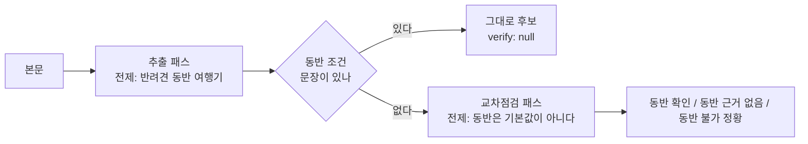

# ADR-019: 교차점검은 AI 가, 주소 대조는 규칙이 한다

> 최종 수정: 2026-09-30 (v3: 결정 6 — **`주소 다름` 은 표시만이 아니라 승인을 멈춘다.** 실데이터에서 뱃지가 뜬 후보의
> '맞아요, 장소로 올리기' 가 그대로 켜져 있었고 일괄 올리기도 지나갔다. 가드를 `approveGroup` 에 두어 사람이 어느 주소가 맞는지 고르게 했다)
> 이전 (v2: 결정 4 에 **축**을 넣었다 — 대조하기 전에 "그 주소가 어디서 왔나" 를 먼저 묻는다.
> 주소→좌표 축의 주소는 원글 주소에서 나온 것이라 원글과 견주면 **순환**이고, 그 '같다' 를 경보 없는 상태로 그리면
> 상호 검색으로 확인된 주소와 구별되지 않았다. `src/lib/adminAddress.ts` 의 `addressView`)
> 이전 (v1: 신설 — `pnpm data:analyze` 에 두 번째 Claude 패스를 넣고, 주소 표기 대조는 규칙으로 뺐다)
> 상태: **구현됨.** 코드는 `scripts/analyze/verifyPlaces.mjs` · `src/lib/addressMatch.ts`. 실제 글로는 아직 안 돌렸다(운영자 터미널 몫).

## 맥락 — 검수 화면이 두 가지로 사람을 속이고 있었다

2026-09-30 에 운영자가 `/admin` 에서 실제로 걸린 것 둘.

**(1) 주소 경보가 늘 켜져 있었다.** 후보에는 주소가 둘 실린다 — 네이버 지역 검색이 준 것(`extracted.address`)과
AI 가 본문에서 읽은 것(`extracted.addressAi`). 화면은 이 둘이 **문자열로** 다르면 "원글에는 다른 주소가 적혀
있어요" 를 띄웠다. pending 후보의 불일치 **43쌍을 실측**하니:

| 갈래 | 쌍 |
|---|---|
| `제주특별자치도` ↔ `제주` 접두어만 다름 | 39 |
| 정말 다른 곳(`제주시 애월읍 신엄안3길 95` ↔ `서귀포시 대포로 93`) | 2 |
| 지번 ↔ 도로명(`조천읍 함덕리 272-4` ↔ `조천읍 함덕27길 18-2`) | 2 |

경보가 40번 울리면 남은 2번을 아무도 안 본다. 그리고 그 2번이 값어치의 전부다 — **`naverLocal` 이 동명의
다른 가게를 집었다**는 뜻이고, 그대로 승인하면 엉뚱한 좌표·`category` 가 `places` 로 들어간다.

**(2) `동반 조건 문장이 없어요` 후보에 애견 카페가 아닌 곳이 섞여 있었다.** 추출 패스의 시스템 프롬프트는
"제주도 반려견 동반 여행 블로그" 를 전제로 글을 읽는다. 그래서 글쓴이가 강아지를 차·숙소에 두고 들른 평범한
카페·식당도 여행기의 장소로 뽑힌다. 그 후보를 승인하면 앱은 조건 없는 장소를 '갈 수 있어요' 로 읽는다
([BUG-008](../bugs) 과 같은 방향의 사고이고, 그때는 "동반 안 된다" 문장이 있어 `exclusionReason` 이 걸렀다).

pending 58건 중 **조건 문장이 없는 것이 28건**(`petAllowed` 가 `unknown` 인 9건 포함)이었다.

## 결정

### 1. 두 번째 Claude 패스를 넣는다 — 전제를 뒤집어 다시 읽는다

`scripts/analyze/verifyPlaces.mjs`. 묻는 것은 하나다: **"글쓴이가 이 장소에 강아지를 데리고 들어갔다는 근거가
본문에 있나?"** 판단은 `{ petAllowedHere: yes|no|unclear, dogWasThere, quote, why }`.

**왜 호출을 한 번 더 하나 — 추출 프롬프트에 필드를 하나 더 붙이는 편이 싸다.** 그런데 같은 호출 안에서
"뽑아라" 와 "정말인가" 를 같이 물으면 모델이 자기가 방금 뽑은 것을 변호한다. 교차점검의 값은 전제를 뒤집는
데서 나오고, 그 프롬프트는 "동반 가능은 기본값이 아니다" 로 시작해야 한다. 그래서 프롬프트·스키마·지문
(`VERIFY_PROMPT_VERSION`)을 따로 둔다.

**비용을 누르는 세 장치.**
- 조건 문장이 없는 후보가 **하나라도** 있을 때만, 그 후보들을 **묶어 글 하나당 한 번** 부른다(`needsDogCheck`).
- 제외될 장소(제주 아님·`other`·동반 불가)는 넣지 않는다 — 버릴 것에 근거를 물어 봐야 결정이 안 바뀐다.
- 계량기를 **따로** 센다(`createUsageMeter('교차점검')`). 합쳐 세면 구독 5시간 한도를 무엇이 태웠는지 가릴 수 없다.
- 끄는 스위치는 `--no-verify`. 모델은 `VERIFY_MODEL` 로 따로 고른다(기본은 추출과 같다).

**실패는 글을 버리지 않는다.** 주소→좌표 축([ADR-008](ADR-008-map-provider.md) · `naverGeocode.mjs`)과 같은
정책이고 이유도 같다: 이 패스는 표식을 **더하기만** 하므로 죽으면 결과가 어제까지의 동작으로 돌아갈 뿐
그 아래로 내려가지 않는다. 한 번 실패하면 그 실행 동안 패스를 내린다(`verifyAxisOff`) — 남은 글마다 같은
실패로 한도를 더 태울 이유가 없다. 인증·CLI 없음(fatal)만 루프를 끊는다.

### 2. 근거 없는 후보는 **버리지 않고 표식만 단다**

`verify.petAllowedHere === 'no'` 라고 자동 반려하지 않는다. 모델이 단락을 놓치는 일이 있고
(`missingVerdict` 이 그 경우다), 자동 반려는 조용하다 — 운영자가 무엇이 사라졌는지 못 본다.
대신 접힌 줄에 뱃지를 달고, **걸러 보기 칩('동반 근거 없는 것만')** 으로 모아 일괄 반려(`AdminPageBulkBar`)에
넘긴다. 속도는 그대로 얻고 잃는 것은 없다. [ADR-018](ADR-018-in-app-admin-review.md) 의 "코드가 정하면 어느
쪽이든 조용히 틀린다" 와 같은 값이다.

### 3. **네 번째 상태를 지킨다 — 미점검은 '괜찮다' 가 아니다**

`extracted.verify` 는 넷을 말한다: `null`(점검 안 함) · 동반 확인 · 동반 근거 없음 · 동반 불가 정황.
`verify` 의 truthy 만 보면 미점검과 '근거 없음' 이 같은 모양이 되고, 그러면 아직 안 본 후보가 "괜찮다" 로
읽혀 이 ADR 을 만든 이유가 그대로 되돌아온다. `null` 이 되는 경우는 넷이다 — 조건 문장이 있었다 ·
`--no-verify` · 그 패스가 실패했다 · **이 패스가 생기기 전의 후보다**(지금 쌓인 218건 전부).
화면은 그때 뱃지를 **안 그린다**(`verifyView` 가 `null` 을 돌려준다). 초록도 회색도 거짓말이다.

### 4. 주소 대조는 **AI 에게 묻지 않는다** — 규칙 + 판단 보류

`src/lib/addressMatch.ts` 의 `sameAddress(a, b) → 'same' | 'different' | 'unknown'`.
시·도 접두어·괄호·쉼표를 걷어 내고 `(행정구역 사슬, 도로명|지번 이름, 번호)` 를 뽑아 비교한다.
실측 43쌍이 **39 / 2 / 2** 로 갈린다(위 표와 같다).

**왜 여기만 AI 를 안 쓰나.** 남은 갈래가 지번↔도로명인데, 그 둘이 같은 건물인지는 **조회해야** 아는 것이라
모델은 그럴듯하게 지어낸다. 그리고 지어낸 '같다' 는 위 `different` 2쌍을 덮어 버린다 — 하나 있는 진짜
신호를 잃는다. 그래서 종류가 갈리면 `'unknown'` 을 돌려주고, 화면은 그것을 **경보가 아니라 참고**로 적는다
("원글 표기 — …"). 누가 맞는지는 사람이 링크를 열어 본다.

**분석 때 계산해 저장하지 않고 화면이 그때그때 부른다.** 저장하면 이미 쌓인 후보 218건은 영원히 옛 경보를
쓴다. 앱 런타임(`src/lib/`)에 두면 다음 분석을 기다리지 않고 지금 고쳐진다.

### 5. 대조하기 전에 **축**을 묻는다 — 검증된 주소는 상호 검색 축 하나뿐이다

v1 은 주소 둘을 **언제나** 견줬다. 그런데 `extracted.address` 한 칸의 뜻이 축마다 다르다
(`analyzeCandidates.mjs` 의 `toCandidateRow`):

| `geoSource` | `address` 가 무엇인가 | 원글과 대조하면 |
|---|---|---|
| `'local'` | **상호 검색이 준 주소** — 이름이 정규화 후 완전 일치한 업체의 등록 주소 | 뜻이 있다 |
| `'geocode'` | 원글 주소를 좌표로 바꾼 뒤 그 표준 표기 | **순환이다** |
| 없음 | 두 축이 다 실패해 남은 **원글 주소 그대로** | 순환이다(같은 값이다) |

가운데 줄이 문제였다. 그 축의 주소는 원글 주소에서 **나온** 것이므로 둘이 같아도 확인한 것이 없는데,
화면은 그 '같다' 를 **경보가 없는 상태**로 그렸다 — 상호 검색으로 확인된 주소와 눈으로 구별되지 않는다.
실측(2026-09-30, pending 58건): 상호 검색 42 · 주소→좌표 10 · 둘 다 실패 6. **여섯 중 하나가 순환 대조였다.**

그래서 `src/lib/adminAddress.ts` 의 `addressView` 가 축을 먼저 정하고, `verified` 는 **상호 검색 축에만** 참을 준다.
순환인 축에는 대조를 아예 걸지 않고("원글에 적힌 주소를 표준 표기로 바꾼 것이에요") 접힌 줄에 `원글 주소` 한 단어를 붙인다.
결정 3 과 같은 규칙이다: **안 본 것을 봤다고 하지 않는다.** `geoSource` 가 아예 없는 옛 후보도 검증으로 읽지 않는다 —
덜 말하는 쪽으로 틀리는 것이 안전하다.

**원글 주소는 이미 교차검증에 쓰이고 있었다** — `pickNaverPlace` 가 동명 결과 중에서 원글의 읍·면
(`townOf(regionRaw) ?? townOf(address)`)이 맞는 것을 고르고, 이름 축이 실패하면 `naverGeocode` 가 그 주소로 좌표를
구제한다. `places.address` 에 들어가는 것도 `extracted.address` 하나뿐이다(`applyApproved.mjs`) — `addressAi` 는
`places` 로 새지 않는다. 바꾼 것은 파이프라인이 아니라 **화면이 그 사실을 말하는 방식**이다.

**운영자가 고치면 검증이 풀린다**(`addressEdited`, `buildEdit`). `geoSource` 로는 갈릴 수 없다 — 그 칸은 좌표의
출처라 주소를 고쳐도 `'local'` 로 남고, 그것만 보면 손으로 적은 주소가 '상호 검색으로 확인된 주소' 로 그려진다.
`editedAt` 으로도 안 된다(소개 문장만 고쳐도 찍힌다). 한 번 서면 되돌리지 않는다 — 네이버가 줬던 값은 이미 덮였다.

**다시 확인하는 길은 링크뿐이다.** 브라우저에는 네이버 키가 없으므로([ADR-016](ADR-016-secrets-by-login.md))
화면에서 재검색할 수 없다. `addressView.mapUrl` 이 파이프라인과 **같은 검색어**(`제주 <이름>`)로 네이버 지도를 연다 —
주소는 검색어에 붙이지 않는다: 주소가 틀렸을 때 그 주소로 찾으면 틀린 곳이 그대로 나와 확인이 되지 않는다.

### 6. `주소 다름` 은 **승인을 멈춘다** — 사람이 어느 주소가 맞는지 고른다

결정 4·5 로 경보가 43건 → 2건이 되고 그 2건이 뱃지로 **보이게** 됐지만, 보이기만 했다. 2026-09-30 실데이터 검수에서
`엔젤하우스`(원글 `애월읍 신엄안3길 95` ↔ 상호 검색 `서귀포시 대포로 93`)의 레일에는 '맞아요, 장소로 올리기' 가 주 버튼으로 켜져 있었고,
`고른 것 올리기` 도 비슷한 곳·내린 곳에서만 멈췄다. 한 번의 클릭이 엉뚱한 주소·좌표·지역을 `places` 에 싣는 길이 열려 있었다.

그래서 `approveGroup` 이 **짝을 정하기 전에** 충돌을 보고, 확인 표식(`addressConfirmed`) 없이 오면 쓰기 전에 `addressConflict` 로 돌려준다.
짝보다 먼저인 이유: 틀린 가게를 집었다면 그 주소로 계산한 짝·재대조도 믿을 수 없고, 합치기·최신본 덮기도 틀린 주소를 기존 장소에 싣는다.
자동으로 원글 주소를 고르지 않는 이유는 결정 4 와 같다 — 원글이 옛 주소일 수도 있고, 어느 쪽이 맞는지는 지도를 보고 사람이 안다.
판정은 뱃지와 **같은 함수**다(`addressConflictOf` → `addressView`). 표기 차이·순환 축은 여전히 조용하다.

## 결과

- 주소 경보가 43건 → **2건**으로 줄고, 그 2건이 접힌 줄의 `주소 다름` 뱃지로 **보이게** 됐다.
- (v3) 그 2건은 한 줄 승인이든 일괄이든 **사람이 주소를 고르기 전에는 올라가지 않는다.**
- (v2) 주소가 검증된 것인지 화면이 말한다. 접힌 줄에 주소가 보이고, 검증 못 한 것에만 한 단어가 붙는다
  (pending 58건 기준 16건 — 주소→좌표 10 · 주소 없음 6).
- 조건 문장이 없는 후보에 `동반 확인` / `동반 근거 없음` / `동반 불가 정황` 중 하나가 붙는다(다음 분석부터).
- `pnpm data:analyze` 의 Claude 호출이 글마다 최대 **한 번 더** 늘었다 → `--limit` 을 절반으로 보는 것이 안전하다([docs/todo/03](../todo/03-analyze-and-review.md)).
- 요약 한 줄에 `교차점검 N건(근거 없음 · 동반 불가 정황 · 실패)` 이 붙는다. **점검 수와 갈래를 같이** 적는 이유:
  `근거 없음 0` 만 적으면 "전부 근거가 있었다" 와 "패스가 안 돌았다" 를 구별할 수 없는데, 운영자가 할 일은 정반대다.

## 열린 것

- 🙋 **이미 쌓인 후보 218건은 동반 근거 점검을 못 받는다.** 본문을 다시 받아 교차점검만 돌리는
  `--reverify-pending` 모드가 필요하다(주소 쪽은 화면 계산이라 이미 고쳐졌다).
- 지번↔도로명 `'unknown'` 은 **Geocoding 으로 풀 수 있다** — 본문 주소를 좌표로 바꿔 네이버 점과의 거리를
  `WEIGHT.GEO_NEAR_M`(100m)과 비교하면 된다. 실측 2쌍뿐이고 지금은 경보가 아니라 참고로 적히므로 미뤘다.
- `sameAddress` 를 `matchPlace` 의 신호로도 쓸 수 있다(주소 일치 → 가점). 임계값을 건드리는 일이라 따로 본다.
