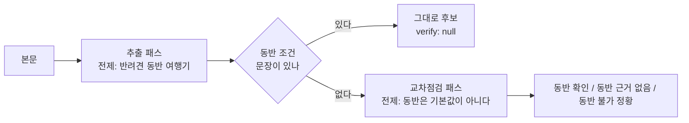
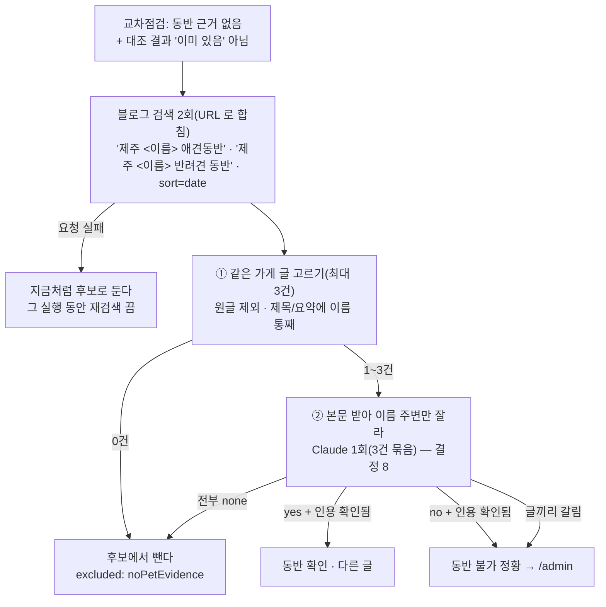

# ADR-019: 교차점검은 AI 가, 주소 대조는 규칙이 한다

> 최종 수정: 2026-10-02 (v8: **결정 7·8 의 임시 단계를 먼저 넣었다 — 재검색 없이 뺀다.** 첫 실측(글 30건)에서 신규 후보 58건 중 50건이 `동반 근거 없음` 이었고
> (목록 글의 이름 나열), 그대로 전수(4,839건)를 돌리면 검수 대기가 9,000건대가 된다. 그래서 **신규**(`tier new`)이고 교차점검이 `동반 근거 없음` 이면
> 재검색을 기다리지 않고 `noPetEvidence` 로 뺀다(`isNoPetEvidenceNew`). 결정 7 의 ①·② 는 **아직 없다** — 대신 제외 줄에 `recheck: null`(재검색 안 함)과
> 재검색 재료(이름·종류·읍·면·주소)를 남겨, 결정 7 이 생기면 `recheck` 가 null 인 줄만 골라 되살릴 수 있다. `verify: null`(안 봤다)은 빼지 않는다.
> 짝이 있는 후보는 그대로 `kindOf` 의 `weak` 가 본다. 수집 완료 칸이 이 수를 「신규지만 글에 동반 근거가 없던 가게」 로 센다)
> 이전 2026-10-02 (v7: **셋째 호출이 생겼다** — 갱신 후보가 생긴 장소마다 「제안」 패스([todo/11](../todo/11-continuous-review-and-update-proposals.md) U3, `proposePlaces.mjs`).
> 이 문서의 원칙(지어내지 않는다 — 인용은 대 본다 · 주소는 규칙이다)을 같은 모양으로 따른다: 입력은 구조값, 근거 없는 change 는 코드가 keep 으로, 주소·좌표·이름·종류는 제안 밖. 결정 본문은 ADR-020 개정 때)
> 이전 2026-10-01 (v6: 「고려했다 버린 것」 의 관광공사 API 줄에 **실측**을 적었다 — 연동해 돌려 보니 제주 23곳 중 음식점 0곳, 게시 장소·후보와 겹침 0)
> 이전 (v5: 교차검토 — **결정 7 에서 요약문으로 '동반 확인' 을 내는 길(②)을 뺐다.** 검색어에 `애견동반` 이 들어가므로
> 요약문은 그 말 주변을 잘라 오고(`<b>` 강조), 이름과 동반 표현의 **같은 요약문 안 동거는 검색어가 만든 것**이라 근거가 아니다 — 강아지를
> 차에 두고 들른 가게가 "동반 확인(다른 글)" 이 되는 길이고, 그것이 결정 1 이 막으려던 사고다. 확인은 **본문(③)에서만**, 요약문은 거르기에만.
> 검색은 수집 키워드와 같은 폭으로 둘(`애견동반`·`반려견 동반`), 재검색은 **대조 뒤**(이미 있는 곳엔 안 돈다), 표식은 `recheck` 가 이긴다.
> 같은 원칙으로 **결정 1 의 인용도 이제 본문에 대 본다**(`quoteInBody`, 구현됨) — 8-2 를 새 길에만 두면 첫 패스의 지어낸 인용은 그대로였다)
> 이전 (v4: **결정 7·8 신설(제안) — `동반 근거 없음` 이면 업체명으로 블로그를 한 번 더 찾고, 그래도 없으면 후보에서 뺀다.**
> 결정 2(버리지 않고 표식만)를 그 갈래에 한해 **번복**한다. 지울 수는 없으므로(GRANT 에 delete 가 없다) 빼는 자리는 `blog_posts.analysis.excluded` 다.
> 재검색 글의 본문은 그 가게 이름 주변만 잘라 읽히고, 인용 문장이 정말 본문에 있는지 코드가 확인한다.
> 네이버 플레이스 화면 데이터(업주 '반려동물' 체크)는 공식 API 에 없고 긁지 않기로 했다 — 「고려했다 버린 것」. 구현 전이라 「검증 계획」 을 같이 적었다)
> 이전 (v3: 결정 6 — **`주소 다름` 은 표시만이 아니라 승인을 멈춘다.** 실데이터에서 뱃지가 뜬 후보의
> '맞아요, 장소로 올리기' 가 그대로 켜져 있었고 일괄 올리기도 지나갔다. 가드를 `approveGroup` 에 두어 사람이 어느 주소가 맞는지 고르게 했다)
> 이전 (v2: 결정 4 에 **축**을 넣었다 — 대조하기 전에 "그 주소가 어디서 왔나" 를 먼저 묻는다.
> 주소→좌표 축의 주소는 원글 주소에서 나온 것이라 원글과 견주면 **순환**이고, 그 '같다' 를 경보 없는 상태로 그리면
> 상호 검색으로 확인된 주소와 구별되지 않았다. `src/lib/adminAddress.ts` 의 `addressView`)
> 이전 (v1: 신설 — `pnpm data:analyze` 에 두 번째 Claude 패스를 넣고, 주소 표기 대조는 규칙으로 뺐다)
> 상태: 결정 1~6 **구현됨**(코드는 `scripts/analyze/verifyPlaces.mjs` · `src/lib/addressMatch.ts`, 실제 글로는 아직 안 돌렸다 — 운영자 터미널 몫).
> 결정 1 의 인용 대조(v5)도 구현됨.
> 결정 7·8 은 **제안** — v8 에서 **빼는 쪽만 임시로** 들어갔다(재검색 없이, `recheck: null`). 진행은 [docs/todo/03](../todo/03-analyze-and-review.md) 의 「근거 없음 재검색」.

## 맥락 — 검수 화면이 두 가지로 사람을 속이고 있었다

2026-09-30 에 운영자가 `/admin` 에서 실제로 걸린 것 둘.

**(1) 주소 경보가 늘 켜져 있었다.** 후보에는 주소가 둘 실린다 — 네이버 지역 검색이 준 것(`extracted.address`)과
AI 가 본문에서 읽은 것(`extracted.addressAi`). 화면은 이 둘이 **문자열로** 다르면 "원글에는 다른 주소가 적혀
있어요" 를 띄웠다. pending 후보의 불일치 **43쌍을 실측**하니:

| 갈래 | 쌍 |
|---|---|
| `제주특별자치도` ↔ `제주` 접두어만 다름 | 39 |
| 정말 다른 곳(`제주시 애월읍 신엄안3길 95` ↔ `서귀포시 대포로 93`) | 2 |
| 지번 ↔ 도로명(`조천읍 함덕리 272-4` ↔ `조천읍 함덕27길 18-2`) | 2 |

경보가 40번 울리면 남은 2번을 아무도 안 본다. 그리고 그 2번이 값어치의 전부다 — **`naverLocal` 이 동명의
다른 가게를 집었다**는 뜻이고, 그대로 승인하면 엉뚱한 좌표·`category` 가 `places` 로 들어간다.

**(2) `동반 조건 문장이 없어요` 후보에 애견 카페가 아닌 곳이 섞여 있었다.** 추출 패스의 시스템 프롬프트는
"제주도 반려견 동반 여행 블로그" 를 전제로 글을 읽는다. 그래서 글쓴이가 강아지를 차·숙소에 두고 들른 평범한
카페·식당도 여행기의 장소로 뽑힌다. 그 후보를 승인하면 앱은 조건 없는 장소를 '갈 수 있어요' 로 읽는다
([BUG-008](../bugs) 과 같은 방향의 사고이고, 그때는 "동반 안 된다" 문장이 있어 `exclusionReason` 이 걸렀다).

pending 58건 중 **조건 문장이 없는 것이 28건**(`petAllowed` 가 `unknown` 인 9건 포함)이었다.

## 결정

### 1. 두 번째 Claude 패스를 넣는다 — 전제를 뒤집어 다시 읽는다

`scripts/analyze/verifyPlaces.mjs`. 묻는 것은 하나다: **"글쓴이가 이 장소에 강아지를 데리고 들어갔다는 근거가
본문에 있나?"** 판단은 `{ petAllowedHere: yes|no|unclear, dogWasThere, quote, why }`.



**왜 호출을 한 번 더 하나 — 추출 프롬프트에 필드를 하나 더 붙이는 편이 싸다.** 그런데 같은 호출 안에서
"뽑아라" 와 "정말인가" 를 같이 물으면 모델이 자기가 방금 뽑은 것을 변호한다. 교차점검의 값은 전제를 뒤집는
데서 나오고, 그 프롬프트는 "동반 가능은 기본값이 아니다" 로 시작해야 한다. 그래서 프롬프트·스키마·지문
(`VERIFY_PROMPT_VERSION`)을 따로 둔다.

**비용을 누르는 세 장치.**
- 조건 문장이 없는 후보가 **하나라도** 있을 때만, 그 후보들을 **묶어 글 하나당 한 번** 부른다(`needsDogCheck`).
- 제외될 장소(제주 아님·`other`·동반 불가)는 넣지 않는다 — 버릴 것에 근거를 물어 봐야 결정이 안 바뀐다.
- 계량기를 **따로** 센다(`createUsageMeter('교차점검')`). 합쳐 세면 구독 5시간 한도를 무엇이 태웠는지 가릴 수 없다.
- 끄는 스위치는 `--no-verify`. 모델은 `VERIFY_MODEL` 로 따로 고른다(기본은 추출과 같다).

**인용은 코드가 본문에 대 본다**(v5, `quoteInBody`). `yes`·`dogWasThere` 는 본문 문장 하나를 `quote` 로 내야 하는데, `null` 이 아닌지만
보면 모델이 지어낸 한 문장이 확인 도장이 된다. 글자·숫자만 남긴 뒤 부분 문자열로 찾고(띄어쓰기·문장부호·이모지는 모델이 바꿔도 같은
문장이다), 없으면 `quote` 를 비우고 `yes` 를 `unclear` 로 내린다 — `correctPetPolicyFacts` 가 원문에 없는 숫자를 빼는 것과 같은 원칙이다.
내린 이유는 `why` 끝에 남는다. 본문을 안 넘긴 호출은 대 보지 않는다("안 봤다" 는 "없었다" 가 아니다 — 결정 3).

**실패는 글을 버리지 않는다.** 주소→좌표 축([ADR-008](ADR-008-map-provider.md) · `naverGeocode.mjs`)과 같은
정책이고 이유도 같다: 이 패스는 표식을 **더하기만** 하므로 죽으면 결과가 어제까지의 동작으로 돌아갈 뿐
그 아래로 내려가지 않는다. 한 번 실패하면 그 실행 동안 패스를 내린다(`verifyAxisOff`) — 남은 글마다 같은
실패로 한도를 더 태울 이유가 없다. 인증·CLI 없음(fatal)만 루프를 끊는다.

### 2. 근거 없는 후보는 **버리지 않고 표식만 단다**

`verify.petAllowedHere === 'no'` 라고 자동 반려하지 않는다. 모델이 단락을 놓치는 일이 있고
(`missingVerdict` 이 그 경우다), 자동 반려는 조용하다 — 운영자가 무엇이 사라졌는지 못 본다.
대신 접힌 줄에 뱃지를 달고, **걸러 보기 칩('동반 근거 없는 것만')** 으로 모아 일괄 반려(`AdminPageBulkBar`)에
넘긴다. 속도는 그대로 얻고 잃는 것은 없다. [ADR-018](ADR-018-in-app-admin-review.md) 의 "코드가 정하면 어느
쪽이든 조용히 틀린다" 와 같은 값이다.

> **v4 에서 `동반 근거 없음` 갈래만 번복했다 → 결정 7.** 근거가 **한 글 안에서만** 찾아졌기 때문에 사람에게 넘겼는데,
> 같은 가게를 다른 글로 다시 찾을 길이 생기면 "두 번 찾아도 없다" 는 사람이 링크 하나 열어 보는 것보다 넓은 확인이다.
> `동반 불가 정황` 은 여전히 자동으로 닫지 않는다(부정문은 오독이 잦고, 블로그끼리 말이 갈리면 사람이 고른다).
> 결정 2 가 걱정한 "조용함" 은 결정 7 이 세 가지로 막는다: 뺀 것을 **이유와 함께 남긴다** · 요약 줄에 **센다** ·
> 검색이 **실패한 후보는 빼지 않는다.**

### 3. **네 번째 상태를 지킨다 — 미점검은 '괜찮다' 가 아니다**

`extracted.verify` 는 넷을 말한다: `null`(점검 안 함) · 동반 확인 · 동반 근거 없음 · 동반 불가 정황.
`verify` 의 truthy 만 보면 미점검과 '근거 없음' 이 같은 모양이 되고, 그러면 아직 안 본 후보가 "괜찮다" 로
읽혀 이 ADR 을 만든 이유가 그대로 되돌아온다. `null` 이 되는 경우는 넷이다 — 조건 문장이 있었다 ·
`--no-verify` · 그 패스가 실패했다 · **이 패스가 생기기 전의 후보다**(지금 쌓인 218건 전부).
화면은 그때 뱃지를 **안 그린다**(`verifyView` 가 `null` 을 돌려준다). 초록도 회색도 거짓말이다.

### 4. 주소 대조는 **AI 에게 묻지 않는다** — 규칙 + 판단 보류

`src/lib/addressMatch.ts` 의 `sameAddress(a, b) → 'same' | 'different' | 'unknown'`.
시·도 접두어·괄호·쉼표를 걷어 내고 `(행정구역 사슬, 도로명|지번 이름, 번호)` 를 뽑아 비교한다.
실측 43쌍이 **39 / 2 / 2** 로 갈린다(위 표와 같다).

**왜 여기만 AI 를 안 쓰나.** 남은 갈래가 지번↔도로명인데, 그 둘이 같은 건물인지는 **조회해야** 아는 것이라
모델은 그럴듯하게 지어낸다. 그리고 지어낸 '같다' 는 위 `different` 2쌍을 덮어 버린다 — 하나 있는 진짜
신호를 잃는다. 그래서 종류가 갈리면 `'unknown'` 을 돌려주고, 화면은 그것을 **경보가 아니라 참고**로 적는다
("원글 표기 — …"). 누가 맞는지는 사람이 링크를 열어 본다.

**분석 때 계산해 저장하지 않고 화면이 그때그때 부른다.** 저장하면 이미 쌓인 후보 218건은 영원히 옛 경보를
쓴다. 앱 런타임(`src/lib/`)에 두면 다음 분석을 기다리지 않고 지금 고쳐진다.

### 5. 대조하기 전에 **축**을 묻는다 — 검증된 주소는 상호 검색 축 하나뿐이다

v1 은 주소 둘을 **언제나** 견줬다. 그런데 `extracted.address` 한 칸의 뜻이 축마다 다르다
(`analyzeCandidates.mjs` 의 `toCandidateRow`):

| `geoSource` | `address` 가 무엇인가 | 원글과 대조하면 |
|---|---|---|
| `'local'` | **상호 검색이 준 주소** — 이름이 정규화 후 완전 일치한 업체의 등록 주소 | 뜻이 있다 |
| `'geocode'` | 원글 주소를 좌표로 바꾼 뒤 그 표준 표기 | **순환이다** |
| 없음 | 두 축이 다 실패해 남은 **원글 주소 그대로** | 순환이다(같은 값이다) |

가운데 줄이 문제였다. 그 축의 주소는 원글 주소에서 **나온** 것이므로 둘이 같아도 확인한 것이 없는데,
화면은 그 '같다' 를 **경보가 없는 상태**로 그렸다 — 상호 검색으로 확인된 주소와 눈으로 구별되지 않는다.
실측(2026-09-30, pending 58건): 상호 검색 42 · 주소→좌표 10 · 둘 다 실패 6. **여섯 중 하나가 순환 대조였다.**

그래서 `src/lib/adminAddress.ts` 의 `addressView` 가 축을 먼저 정하고, `verified` 는 **상호 검색 축에만** 참을 준다.
순환인 축에는 대조를 아예 걸지 않고("원글에 적힌 주소를 표준 표기로 바꾼 것이에요") 접힌 줄에 `원글 주소` 한 단어를 붙인다.
결정 3 과 같은 규칙이다: **안 본 것을 봤다고 하지 않는다.** `geoSource` 가 아예 없는 옛 후보도 검증으로 읽지 않는다 —
덜 말하는 쪽으로 틀리는 것이 안전하다.

**원글 주소는 이미 교차검증에 쓰이고 있었다** — `pickNaverPlace` 가 동명 결과 중에서 원글의 읍·면
(`townOf(regionRaw) ?? townOf(address)`)이 맞는 것을 고르고, 이름 축이 실패하면 `naverGeocode` 가 그 주소로 좌표를
구제한다. `places.address` 에 들어가는 것도 `extracted.address` 하나뿐이다(`applyApproved.mjs`) — `addressAi` 는
`places` 로 새지 않는다. 바꾼 것은 파이프라인이 아니라 **화면이 그 사실을 말하는 방식**이다.

**운영자가 고치면 검증이 풀린다**(`addressEdited`, `buildEdit`). `geoSource` 로는 갈릴 수 없다 — 그 칸은 좌표의
출처라 주소를 고쳐도 `'local'` 로 남고, 그것만 보면 손으로 적은 주소가 '상호 검색으로 확인된 주소' 로 그려진다.
`editedAt` 으로도 안 된다(소개 문장만 고쳐도 찍힌다). 한 번 서면 되돌리지 않는다 — 네이버가 줬던 값은 이미 덮였다.

**다시 확인하는 길은 링크뿐이다.** 브라우저에는 네이버 키가 없으므로([ADR-016](ADR-016-secrets-by-login.md))
화면에서 재검색할 수 없다. `addressView.mapUrl` 이 파이프라인과 **같은 검색어**(`제주 <이름>`)로 네이버 지도를 연다 —
주소는 검색어에 붙이지 않는다: 주소가 틀렸을 때 그 주소로 찾으면 틀린 곳이 그대로 나와 확인이 되지 않는다.

### 6. `주소 다름` 은 **승인을 멈춘다** — 사람이 어느 주소가 맞는지 고른다

결정 4·5 로 경보가 43건 → 2건이 되고 그 2건이 뱃지로 **보이게** 됐지만, 보이기만 했다. 2026-09-30 실데이터 검수에서
`엔젤하우스`(원글 `애월읍 신엄안3길 95` ↔ 상호 검색 `서귀포시 대포로 93`)의 레일에는 '맞아요, 장소로 올리기' 가 주 버튼으로 켜져 있었고,
`고른 것 올리기` 도 비슷한 곳·내린 곳에서만 멈췄다. 한 번의 클릭이 엉뚱한 주소·좌표·지역을 `places` 에 싣는 길이 열려 있었다.

그래서 `approveGroup` 이 **짝을 정하기 전에** 충돌을 보고, 확인 표식(`addressConfirmed`) 없이 오면 쓰기 전에 `addressConflict` 로 돌려준다.
짝보다 먼저인 이유: 틀린 가게를 집었다면 그 주소로 계산한 짝·재대조도 믿을 수 없고, 합치기·최신본 덮기도 틀린 주소를 기존 장소에 싣는다.
자동으로 원글 주소를 고르지 않는 이유는 결정 4 와 같다 — 원글이 옛 주소일 수도 있고, 어느 쪽이 맞는지는 지도를 보고 사람이 안다.
판정은 뱃지와 **같은 함수**다(`addressConflictOf` → `addressView`). 표기 차이·순환 축은 여전히 조용하다.

### 7. (제안) `동반 근거 없음` 이면 업체명으로 블로그를 다시 찾고, 그래도 없으면 **후보에서 뺀다**

**맥락.** 수집 검색어가 "제주 애견 동반 카페" 류라 걸린 글은 동반 여행기일 확률이 높다 — 그래서 추출은 동반을 전제로
장소를 뽑는다(결정 1 의 문제). 교차점검이 `동반 근거 없음` 을 내도 그 가게가 동반 불가라는 뜻은 아니다. **그 글이 말하지
않았을 뿐**이다. 사용자(운영자)의 요구는 이 갈래를 사람에게 그대로 넘기지 말고, 다른 글에서 한 번 더 찾아 보고 정리하는 것이다.

**네이버 공식 API 에는 이 값이 없다**(2026-10-01 확인, 「고려했다 버린 것」). 지역 검색 API 는 `title·link·category·description·
telephone·address·roadAddress·mapx·mapy` 아홉 칸뿐이고, 업주가 스마트플레이스에서 고르는 편의시설('반려동물')·대표 키워드
(`애견동반`)는 네이버 자기 화면이 쓰는 내부 데이터에만 있다. 그래서 다시 찾는 곳은 **이미 쓰는 블로그 검색 API** 다.



**요약문으로는 확인하지 않는다(v5).** v4 는 "요약문 안에 이름과 동반 표현이 함께 있으면 Claude 를 안 부르고 동반 확인" 이었다.
그런데 검색어 자체에 `애견동반` 이 들어 있고 네이버는 **검색어 주변을 잘라** 요약문을 만든다(`<b>` 강조). ① 을 지난 글은 거의
전부 그 조건을 만족하므로 ② 는 사실상 "검색에 걸렸으면 확인" 이고, 그러면 "애견동반 여행 2일차 … <이름> 에서 점심(강아지는 차에)" 이
동반 확인이 된다 — 결정 1 을 만든 바로 그 사고다. 그래서 요약문은 **같은 가게인지 거르는 데만** 쓰고, 확인은 본문(결정 8 의 창 + 인용 대조)
에서만 난다. 글이 하나라도 있으면 Claude 를 한 번 부른다 — 후보당 1회라 상한은 그대로다.

**단계별 규칙.**

| 단계 | 보는 것 | 결과 | Claude |
|---|---|---|---|
| 대상 | `verifyLabel` 이 `동반 근거 없음` 인 후보만. `null`(미점검)·`동반 확인`·`동반 불가 정황` 은 건드리지 않는다. **대조(`matchPlace`) 뒤**에 돈다 — `alreadyHave` 로 빠질 장소에 검색·Claude 를 쓰지 않는다(교차점검이 제외될 장소를 안 넣는 것과 같은 이유) | — | — |
| 검색 | `제주 <이름> 애견동반` 과 `제주 <이름> 반려견 동반` **둘**(이름이 이미 `제주` 로 시작하면 겹치지 않게 — `naverLocal` 과 같은 규칙), `sort=date`, URL 로 합친다. 수집 키워드(`keywords.json`)가 쓰는 두 말이다 — 한 말만 쓰면 `반려견 동반 가능` 으로만 적힌 가게가 0건이 되어 빠진다. 지역 검색 API 와 달리 블로그 검색은 하루 25,000회라 두 번은 공짜다 | — | — |
| ① 같은 가게 | 원글 URL 은 뺀다. 제목·요약문에 **정규화한 이름이 통째로** 있어야 한다(`pickNaverPlace` 가 부분 일치를 안 받는 것과 같은 이유 — "고기부엌" 이 "협재고기부엌" 을 집는다). 읍·면은 **가게의 읍·면(`naverLocal` 주소)을 알 때만** 본다: 요약문에 읍·면이 적혀 있는데 그중에 가게의 것이 **없으면** 뺀다(여행기 요약문은 여러 읍·면을 적으므로 "다른 읍·면이 하나라도 있으면" 은 너무 넓다) | 최신 글부터 최대 3건 | 안 부름 |
| ①′ 0건 | 그 가게를 말하는 다른 글이 없다. 검색 결과는 있었는데 ① 이 전부 거른 경우도 같다(이름이 부분 일치뿐이면 다른 가게다) — 다만 `hits` 수를 함께 남겨 표본 실측(C)에서 둘을 가를 수 있게 한다 | **뺀다**(`noPetEvidence`) | 안 부름 |
| ② 본문 | 고른 1~3건의 본문(결정 8 의 창). 요약문의 동반·금지 표현은 **아무것도 정하지 않는다** — 프롬프트에 참고로도 싣지 않는다 | `yes` → 동반 확인(다른 글) · `no` → 불가 정황 · 글끼리 갈림 → 불가 정황 · 전부 `none` → **뺀다** | **후보당 1회** |

**빼는 자리는 `blog_posts.analysis.excluded` 다 — 지우지 않는다.**
- **지울 수가 없다.** 운영자 GRANT 는 `select, insert, update` 뿐이다(`20260922120000_narrow_grants.sql`).
- **지우면 되돌아온다.** `data:collect` 는 `url` 충돌을 건너뛰는 upsert 라, 지운 글은 다음 수집에서 새 글로 들어와
  `analyzed_at` 이 빈 채로 다시 분석된다 — 추출·교차점검·재검색이 매 실행 되풀이된다.
- **글과 장소는 1:N 이다.** 한 글에서 카페 셋이 나온다. 단위는 글이 아니라 그 글에서 나온 **장소 하나**다.
- 그 칸은 이미 "왜 이 장소가 후보가 아닌가" 를 남기는 곳이다(`toPostAnalysis` — 제주 아님·`other`·동반 불가·이미 있음).
  이유 하나(`noPetEvidence`)를 더하고 재검색 요약(`{ queries, hits, posts: [url…] }` — `hits` 는 검색이 돌려준 수, `posts` 는 ① 을 지난 글)을
  붙인다. **본문 인용은 넣지 않는다**(02 의 저장 원칙).

**후보로 남는 쪽의 기록.** `extracted.verify` 에 `recheck` 를 얹는다 —
`{ verdict: 'yes' | 'no' | 'split', url, postdate, quote, promptVersion }`. 원글 판단(`petAllowedHere`·`quote`)은 **그대로 둔다** —
덮어쓰면 "원글엔 근거가 없었다" 가 사라진다. 대신 표식은 `recheck` 가 이긴다: `verifyLabel`(CLI)·`verifyView`(`/admin`) 둘 다
`recheck` 를 먼저 읽어 `동반 확인(다른 글)` · `동반 불가 정황` 을 내고, 그래서 상태는 넷에서 **다섯**이 된다(결정 3 의 표와
CLAUDE.md 의 "넷" 을 그때 같이 고친다). 걸러 보기 칩('동반 근거 없는 것만')은 `recheck` 가 `yes` 면 세지 않는다.
`/admin` 은 "동반 확인 — 다른 글" 을 원글 확인과 **구별해** 그리고 그 글 링크를 건다([06 의 G](../todo/06-admin-review.md), 하이라이트 대상).

**실패는 빼지 않는다.** 검색 API 실패·본문 받기 실패·Claude 실패는 그 후보를 **지금처럼 `동반 근거 없음` 으로 남긴다.**
"찾아봤는데 없다" 와 "찾지 못했다" 를 섞으면 실패 한 번이 후보를 조용히 지운다 — 결정 3 과 같은 함정이다.
한 번 실패하면 그 실행 동안 재검색을 내린다(결정 1 의 `verifyAxisOff` 와 같다).

**비용.** 대상 후보 1건당: 블로그 검색 2회(무료, API HUB 한도 안) · 본문 최대 3건 · Claude 최대 1회(① 을 지난 글이 하나라도 있을 때).
계량기는 따로(`createUsageMeter('재검색')`), 끄는 스위치는 `--no-recheck`. 요약 줄에 `재검색 N건(확인 a · 불가 b · 뺌 c · 실패 d)` —
**뺀 수와 실패 수를 같이** 적는다(결과의 `근거 없음 0` 과 같은 이유).

### 8. (제안) 재검색 글의 본문은 **그 가게 주변만** 읽히고, 인용은 코드가 원문에 대 본다

결정 7 의 ② 에 해당한다. 첫 추출은 글 전체에서 장소를 찾아야 하므로 지금대로(`MAX_BODY_CHARS` 2만 자) 둔다.
8-2 의 인용 대조는 v5 에서 **결정 1 의 교차점검에도** 들어갔다(`quoteInBody`) — 재검색이 쓸 때는 같은 함수를 창에 대고 부른다.

| # | 무엇 | 왜 | 상태 |
|---|---|---|---|
| 8-1 | **이름 주변만 자른다.** 본문에서 이름(정규화·공백 무시)이 나오는 문단과 앞뒤 몇 문단만, 글당 상한을 두고 넘긴다. 이름이 본문에 없으면 그 글은 버린다 | 여행기 한 편에 가게가 5~10곳이다. 통째로 주면 **다른 가게의 "강아지 OK" 를 이 가게 것으로** 읽는다 — 근거 없음을 확인으로 잘못 올리는 가장 흔한 길. 프롬프트도 작아진다 | 바로 만든다. 창 크기·상한은 실측으로 정한다 |
| 8-2 | **인용 확인.** `yes`/`no` 는 본문 문장을 그대로 `quote` 로 내야 하고, 그 문장이 **넘긴 창 안에 실제로 있어야** 한다(글자·숫자만 남기고 부분 문자열 — `quoteInBody`). 없으면 `none` | `correctPetPolicyFacts`(BUG-009)와 같은 원칙 — 원문에 근거 없는 판단은 지운다. 지어낸 확인이 후보를 살리는 길을 막는다 | **구현됨**(결정 1 쪽, `verifyPlaces.mjs`) — 재검색은 같은 함수를 쓴다 |
| 8-3 | **최신 글 우선 · 날짜를 함께.** 검색은 `sort=date`, 프롬프트에 각 글의 `postdate` 를 싣는다. 글끼리 갈리면 고르지 않고 `split` → 불가 정황으로 사람에게 | 동반 정책은 바뀐다. 다만 최신이 이긴다고 코드가 정하면 조용히 틀린다(ADR-018) | 바로 만든다 |
| 8-4 | **글 안의 지도 카드로 같은 가게 확인.** SmartEditor ONE 의 장소 첨부에 이름·주소(·플레이스 id 로 보이는 값)가 있다고 **알려져 있다** — 그 주소를 `naverLocal` 주소와 `sameAddress` 로 대 보고 `different` 면 그 글을 버린다 | 동명의 다른 가게 글을 Claude 전에 거른다. 글쓴이가 넣은 값이라 플레이스 화면 긁기와 다르다 | **구조 확인 뒤**(검증 계획 A) |
| 8-5 | **글 태그(`#애견동반카페`)를 보조로.** 프롬프트에 참고로만 싣고, 태그만으로 `yes` 를 주지 않는다 | 작성자가 고른 말이라 신호가 세지만, 가게와 무관한 태그를 습관처럼 다는 글이 있다 — 요약문의 동반 표현을 안 믿는 것(결정 7 v5)과 같은 이유로 **태그 하나로 글 전체에 붙는 신호는 가게 하나의 근거가 못 된다** | **구조 확인 뒤** — 태그가 본문 컨테이너 밖이라 지금은 빠진다. PostView 에 같이 오는지 모른다 |

**하지 않는 것: 사진.** 매장 안에 강아지가 찍힌 사진은 좋은 근거지만 이미지를 받아 모델에 보이는 것은 비용이 크고
사진을 다루지 않는다는 원칙([ADR-002](ADR-002-no-place-photos.md))과 부딪힌다. 사진 **캡션** 글자는 지금도 본문에 들어온다.

### 고려했다 버린 것 (2026-10-01)

| 길 | 버린 이유 |
|---|---|
| 네이버 지역 검색 API 의 반려동물 칸 | **칸이 없다.** 아홉 칸 고정. `category` 의 `…>애견카페` 와 이름의 `애견`·`펫` 은 단서지만 "애견카페"(강아지가 주인공)와 "동반 가능한 일반 카페"(업종 `카페`)는 다르다 — 확인 방향의 약한 보조로만 쓸 수 있다. 지금 `naverLocal` 은 업종의 마지막 마디만 남긴다 |
| 네이버 지도 API(NCP Maps) | 지도 그리기·주소↔좌표뿐, 업체 정보가 없다 |
| 네이버 플레이스 화면 데이터 긁기(업주 '반려동물' 체크·`keywordList`) | **사용자 결정: 스크래핑하지 않는다.** 약관·`robots.txt` 가 막고, 내부 구조(`__ref`·`InformationFacilities:`)가 예고 없이 바뀌면 에러 없이 값만 사라지며, 한 페이지에 다른 업체 데이터가 섞인다. [ADR-002](ADR-002-no-place-photos.md) v2 가 플레이스 사진 수집을 접은 것과 같은 판단 |
| 한국관광공사 반려동물 동반여행 API(`KorPetTourService2`) | **연동해 실측하고 접었다.** 제주 **23곳** — 관광지 17 · 레포츠 3 · 숙박 2 · 문화시설 1 · **음식점 0**. 게시 장소 86곳·pending 후보 25곳과 **겹침 0**(이름 + 거리 1km). 오름·해변 목록이라 카페·식당·숙소와 안 겹치고, 짝 기준을 풀어도 같다. 다시 붙인다면: 2 판은 작업 이름에도 `2` 가 붙는다(`areaBasedList2`·`detailPetTour2` — 빼면 `NO_OPENAPI_SERVICE_ERROR`), 옛 판 `KorPetTourService` 는 폐기 |
| Google Places `allowsDogs` | 유료 등급·결제 카드·키 하나 더, 제주 데이터가 빈약해 빈 칸이 대부분일 것 |
| "<이름> 애견동반" 검색에 그 가게가 **나오는지**로 판단 | 결과가 업주 키워드 때문인지 이름이 비슷해서인지 API 가 말하지 않는다 |
| 근거 없는 글을 `blog_posts` 에서 지우기 | 위 결정 7 — 지울 권한이 없고, 지우면 다시 수집·분석된다 |

### 검증 계획 (결정 7·8 을 구현할 때 이 순서로 확인받는다)

**A. 구조 확인 — 사용자 터미널(이 클라우드 세션은 네이버가 403 이다).** 8-4·8-5 를 열기 전에.
지도 카드가 있는 글 하나, 태그가 달린 글 하나의 PostView 를 받아 아래가 나오는지 본다.

```bash
u="https://blog.naver.com/PostView.naver?blogId=<id>&logNo=<no>"
curl -s "$u" | grep -oE "se-(module-)?(map|placesMap)[a-zA-Z_-]*|data-linkdata='[^']{0,300}" | head   # 지도 카드
curl -s "$u" | grep -oiE '(post_?tag|tag_?list|wrap_tag)[^>]{0,200}' | head                               # 태그 자리
```
나오는 키 이름을 이 절에 적고 나서 8-4·8-5 를 만든다. 안 나오면 둘 다 접는다.

**B. 단위 테스트 — 순수 함수로 나눈다**(이름은 구현 때 정한다):
대상 고르기(`null`·확인·불가 정황·`alreadyHave` 는 대상 아님) · 같은 가게 글 고르기(원글 제외, `<b>` 를 벗긴 뒤 통째 일치, 부분 일치 거부,
가게의 읍·면이 빠진 요약문 거부, 가게의 읍·면을 모르면 안 거름, 최신 3건, 두 검색을 URL 로 합침) · **요약문의 동반 표현은 아무것도 정하지 않음** ·
이름 주변 창(이름 없음 → 버림, 상한) · 인용 확인(창 밖 인용 → `none`, `quoteInBody`) · 갈래 합치기(`split`) · `recheck` 가 표식을 이김
(`verifyLabel`·`verifyView` 가 같은 말) · **실패 → 빼지 않음** · `analysis.excluded` 모양(본문 인용 없음, `hits` 있음).

**C. 표본 실측 — `pnpm data:analyze --limit 20 --dry-run` 덤프로.** 사람이 링크를 열어 본다.
- 대상 수와 갈래 분포(확인 / 불가 / 뺌·검색 0건 / 뺌·전부 none / 실패).
- **뺀 것 10건**: 그 가게가 실제로 동반 가능한가(놓친 비율). 🙋 허용선은 사용자가 정한다 — 제안: 10건 중 1건 이하.
- **확인(다른 글) 10건**: 정말 그 가게의 동반 근거인가, 다른 가게 문장을 붙인 것은 없나(8-1 의 효과).
- Claude 호출 수와 구독 한도 소모(`재검색` 계량기).

**D. 조용히 깨지는 것 점검.** 검색 키 없이 돌리면 재검색이 **꺼졌다고** 찍히고 아무것도 빠지지 않는지 ·
`--no-recheck` 가 결정 1~6 의 동작과 같은지 · 덤프의 `excluded` 에 `noPetEvidence` 가 이유와 함께 남는지.

## 결과

- 주소 경보가 43건 → **2건**으로 줄고, 그 2건이 접힌 줄의 `주소 다름` 뱃지로 **보이게** 됐다.
- (v3) 그 2건은 한 줄 승인이든 일괄이든 **사람이 주소를 고르기 전에는 올라가지 않는다.**
- (v2) 주소가 검증된 것인지 화면이 말한다. 접힌 줄에 주소가 보이고, 검증 못 한 것에만 한 단어가 붙는다
  (pending 58건 기준 16건 — 주소→좌표 10 · 주소 없음 6).
- 조건 문장이 없는 후보에 `동반 확인` / `동반 근거 없음` / `동반 불가 정황` 중 하나가 붙는다(다음 분석부터).
- `pnpm data:analyze` 의 Claude 호출이 글마다 최대 **한 번 더** 늘었다 → `--limit` 을 절반으로 보는 것이 안전하다([docs/todo/03](../todo/03-analyze-and-review.md)).
- 요약 한 줄에 `교차점검 N건(근거 없음 · 동반 불가 정황 · 실패)` 이 붙는다. **점검 수와 갈래를 같이** 적는 이유:
  `근거 없음 0` 만 적으면 "전부 근거가 있었다" 와 "패스가 안 돌았다" 를 구별할 수 없는데, 운영자가 할 일은 정반대다.

## 열린 것

- 🙋 **(결정 7) 이미 쌓인 pending 후보에도 재검색을 돌릴지.** 돌린다면 `--reverify-pending`(아래)과 같은 모드에 얹고,
  이미 `/admin` 에 있는 후보는 `analysis.excluded` 로 옮길 수 없다(이미 `candidates` 행이다). 코드가 `rejected` 로 바꿀지,
  표식만 바꾸고 일괄 반려('동반 근거 없는 것만' 칩)는 사람이 할지 정해야 한다 — 앞의 것은 사람이 이미 본 줄을 코드가 치우는 일이다.
- **(결정 7) 뺀 것을 되살리는 길.** `analyzed_at` 이 찍혀 다시 분석되지 않는다. 기준을 바꾼 뒤 `analysis.excluded[].reason = 'noPetEvidence'`
  인 글만 골라 다시 돌리는 모드가 필요하다(`promptVersion` 으로 재분석 대상을 고르는 것과 같은 이음새).

- 🙋 **이미 쌓인 후보 218건은 동반 근거 점검을 못 받는다.** 본문을 다시 받아 교차점검만 돌리는
  `--reverify-pending` 모드가 필요하다(주소 쪽은 화면 계산이라 이미 고쳐졌다).
- 지번↔도로명 `'unknown'` 은 **Geocoding 으로 풀 수 있다** — 본문 주소를 좌표로 바꿔 네이버 점과의 거리를
  `WEIGHT.GEO_NEAR_M`(100m)과 비교하면 된다. 실측 2쌍뿐이고 지금은 경보가 아니라 참고로 적히므로 미뤘다.
- `sameAddress` 를 `matchPlace` 의 신호로도 쓸 수 있다(주소 일치 → 가점). 임계값을 건드리는 일이라 따로 본다.
