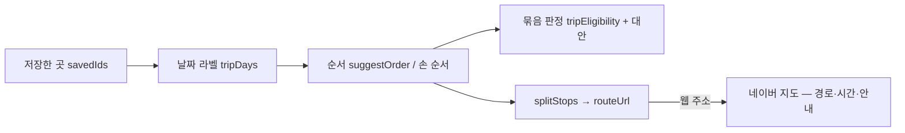

# ADR-026 — 경로는 우리, 운전 안내는 네이버 (Directions API 를 들이지 않는다)

> 최종 수정: 2026-10-08 (v1: 신설 — [todo/16](../todo/16-trip-route-planner.md) 의 제안 P1·P4·P5 를 결정으로. 16 이 처음 적은 앱 스킴(`nmap://`) 대신
> **웹 주소**로 간 것(T1.3·T1.5)이 문서에 없어서 같이 적는다)

## 상태

채택. 순수 함수(`tripPlan` · `tripRoute` · `tripEligibility` · `tripAlternatives` · `naverRouteLink`)와 한 곳짜리 길찾기는 들어갔다.
저장 화면의 하루 보기·묶음 판정 줄은 임시안(16 T1.4 · T2.3). **경유지 주소의 꼴은 폰에서 확인 전**이다(16 H.1, 아래 「잃은 것」).

## 맥락

경쟁 앱 비교(2026-10-06) 뒤 "루트 짜 주는 것까지 하면 빡셀까" 가 열렸다. 동선 기능은 세 층으로 갈린다 —
(1) 저장한 곳을 날짜로 묶고 순서 정하기, (2) 그 묶음에 우리 강아지 판정 얹기, (3) 실제 운전 경로·소요 시간·턴바이턴.

(3) 을 하려면 Directions API 가 필요한데, 이 앱은 정적 내보내기라 키를 둘 곳이 없다([ADR-001](ADR-001-pwa-static-export.md)).
키를 숨기려면 서버 함수를 들여야 하고, 그 순간 "사이트는 런타임에 fetch 하지 않는다"([ADR-015](ADR-015-supabase-source-and-rebuild.md) 결정 2)가
제보 insert([ADR-021](ADR-021-place-reports.md)) 다음으로 두 번째 깨진다. 호출당 비용도 생긴다. 한편 제주는 섬 하나라 직선거리로
순서를 정해도 크게 어긋나지 않고, "몇 분" 은 네이버가 우리보다 잘 안다.

## 결정

### 1. 일정은 저장 위에 얹는다 (P1)

일정은 `savedIds` 의 부분집합에 날짜 라벨(1~4일, 없음 = 미정)을 붙인 것이다. 하트를 지우면 일정에서도 빠진다 — 저장 메모와 같은 생명주기.
**저장하지 않은 곳을 일정에 넣는 길은 두지 않는다.** 두면 "저장" 이 "관심 있는 곳" 과 "갈 곳" 둘로 갈리고, 준비물([ADR-009](ADR-009-trip-derived-checklist.md))이
어느 쪽에서 파생되는지 다시 정해야 한다. 날짜별 준비물도 하지 않는다 — 준비물은 날짜를 몰라도 같은 답이 나온다.

### 2. 순서는 우리가 정한다 — 직선거리 그리디, 숙소는 마지막

`tripRoute.ts` 의 `suggestOrder` 가 시작점(공항 · 전날 숙소 · 내 위치)에서 가까운 순으로 잇고 숙소를 끝에 세운다. 직선거리다.
사용자가 손댄 날의 순서는 따로 저장하고 자동 제안이 덮지 않는다(P2). 내 위치는 누를 때 한 번 받고 버린다(P3 · [ADR-012](ADR-012-personal-data-and-consent.md)).

### 3. 운전 안내는 네이버 지도로 넘긴다 — 앱 스킴이 아니라 **웹 주소** (P4)

Directions API 를 부르지 않는다. 그 날의 순서를 `map.naver.com/p/directions/{출발}/{도착}/{경유}/car` 한 줄로 조립해 넘기고,
경로·소요 시간·안내는 네이버가 한다. 서버·키·호출 비용은 0 으로 남고, **우리 지도를 더 띄우지 않으므로**
[ADR-008](ADR-008-map-provider.md) 의 과금("지도를 띄운 방문 수")에도 더해지지 않는다.

16 은 처음에 앱 스킴(`nmap://route/car` · `nmap://navigation`)을 적었다. 웹 주소로 바꾼 이유:

| | 앱 스킴 `nmap://` | 웹 주소 `map.naver.com/p/directions/…` |
|---|---|---|
| 앱이 없는 기기 | 아무 반응이 없다 | 웹 길찾기가 열린다 |
| 열렸는지 알기 | iOS 는 알 수 없다 — 타임아웃 뒤 App Store 로 보내는 폴백이 필요 | 필요 없다. 폰에서는 네이버가 "앱으로 열기" 를 띄운다 |
| 안드로이드 | `intent://…` 폴백을 따로 | 같은 주소 |
| `appname` | 필수 | 없음 |

**우리가 앱 유무를 판별하지 않는 것**이 핵심이다. 판별은 기기·OS 버전마다 갈라지고, 틀리면 버튼이 조용히 아무것도 안 한다.

- 한 곳짜리는 `naverDirectionsUrl`(`lib/naverPlaceLink.ts`) — 출발 칸을 비워(`-`) 네이버가 현재 위치로 채운다. 저장 카드 · 상세 액션 줄 · 지도 시트의 "길찾기".
- 여러 곳은 `splitStops` → `routeUrl`(`lib/naverRouteLink.ts`). 주소 한 줄에 새 지점 6곳(경유 5 + 도착)이고, 넘치면 다음 묶음으로 나눈다.
  **두 번째 묶음부터 출발 = 앞 묶음의 도착** — 비워 두면 다음 링크를 미리 열었을 때 지금 있는 자리에서 출발한다.
- 칸 순서는 `{출발}/{도착}/{경유}/car` — **경유가 도착 뒤에** 온다. 지점 한 칸(`{lng},{lat},{이름}`, 경도가 먼저)은
  `naverDirectionsPoint` 하나를 두 곳이 나눠 쓴다. 따로 적으면 경·위도 순서가 두 군데서 갈라진다.
- 좌표가 없는 곳(86곳 중 5곳)은 주소에서 빼고 "지도에 없는 N곳" 으로 따로 돌려준다 — 사용자가 끌어 바꾼 순서에서는 중간에 낄 수 있어
  순서에 기대지 않는다.

### 4. 판정은 "조건" 까지 — 영업시간·휴무는 지금 하지 않는다 (P5)

하루 묶음의 판정은 장소별 `eligibility` 를 모은 것이다(`tripEligibility` — 가장 나쁜 수준, 장소별 걸린 이유, "이 날은 콩이만").
걸린 곳의 대안은 같은 종류·같은 읍면의 '갈 수 있어요' 셋까지(`tripAlternatives`). 영업시간·휴무·계절 충돌은 데이터가 없어
**하지 않는다**. 묶음 판정이 처음부터 `reasons[]` 를 돌려주는 것은, 데이터가 생기면 규칙 하나만 더하면 되게 하려는 것이다.

### 5. 길찾기 벤더는 네이버 하나

카카오내비·티맵은 붙이지 않는다. 지도 벤더([ADR-008](ADR-008-map-provider.md))와 맞추고, 경유지를 주소 한 줄로 받는 것도 네이버가 가장 단순하다.
요청이 오면 `naverRouteLink.ts` 옆에 같은 모양의 파일 하나를 더하는 구조로만 남긴다.

## 결과

- 우리 몫은 "어디를 어떤 순서로, 우리 강아지가 다 갈 수 있게" 까지다. 경쟁 앱에 없는 부분이 여기다(판정을 묶음에 얹는 것).
- 서버·키·호출 비용·지도 로드 모두 늘지 않는다.

### 잃은 것

- **소요 시간·차로 거리를 화면에 못 그린다.** "1일차 총 2시간 10분" 같은 줄은 없다 — 보려면 네이버로 넘어가야 한다.
  우리가 아는 것은 직선거리뿐이고, 그것은 순서를 정하는 재료다(차로 거리의 대신이 아니다).
- **경유지 주소의 꼴이 확인 전이다.** 경유 구분자 `:`(`WAYPOINT_SEPARATOR`)와 상한 5(`MAX_WAYPOINTS`)는 문서·검색 기준이고,
  테스트는 우리가 정한 모양을 고정할 뿐 네이버가 받는다는 증거가 아니다. 폰(iOS·Android)에서 한 번씩 눌러 봐야 한다(16 H.1).
  다르면 그 두 상수만 고친다. 웹 주소가 폰에서 앱으로 넘어가는지도 그때 함께 본다.
- 네이버가 웹 길찾기 주소 꼴을 바꾸면 버튼이 엉뚱한 화면으로 간다. 공식 계약이 있는 앱 스킴과 달리 웹 주소는 계약이 아니다 —
  앱 유무 판별을 안 하는 값으로 받아들인다.

## 관련

- [todo/16](../todo/16-trip-route-planner.md) — 태스크·🙋 결정·실측 항목
- [docs/features/trip-route.md](../features/trip-route.md) — 사용자가 하는 것·비직관적인 것
- [ADR-008](ADR-008-map-provider.md)(지도 벤더·과금) · [ADR-009](ADR-009-trip-derived-checklist.md)(준비물 파생) ·
  [ADR-012](ADR-012-personal-data-and-consent.md)(위치를 저장하지 않는다) · [ADR-015](ADR-015-supabase-source-and-rebuild.md)(런타임 fetch 없음)
