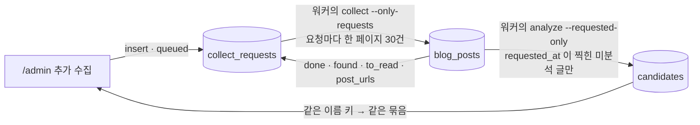

# 운영자 검수 화면 (`/admin`)

> 최종 수정: 2026-10-07 (v66: **일괄 처리에 진행 수와 멈추기**(todo/09 T6.5) — 돌고 있는 동안 일괄 줄에 `12 / 141` 과 `멈추기`. 멈추기는 **묶음 사이**에서만 선다(지금 쓰는 줄은 끝까지 — 반쯤 쓴 행을 남기지 않는다), 된 줄은 그때그때 목록에서 빠진다. 안 한 수는 결과 줄 끝 `멈춰서 N곳은 안 했어요`(`stoppedNote`) 로 실패와 따로 세고 색은 노랑. 화면은 못 봤다 — 로그인·실제 일괄이 필요하다)
> 이전 2026-10-07 (v65: **블랙리스트 칸에 목록 · 풀기 · 기간 바꾸기**(todo/09 T1.5) — 풀지 않은 행 전부(만료 지난 것도 회색 `지남` 으로)를 이름·읍·면·사유·남은 기간·어디서 열로 보이고, `풀기`(`lifted_at`)와 `기간 바꾸기`(3개월은 오늘부터 · 영구)를 줄에서 한다. 탭 건수·등록 해제 칸의 칩·이 목록이 한 번 읽은 행 하나에서 파생해 풀기 한 번에 같은 틱에 움직인다. 등록 해제 칩 옆 `블랙리스트 보기`, 블랙리스트 줄의 `장소 보기` 로 칸을 오간다. 아래 「블랙리스트」. 화면은 못 봤다 — 로그인 뒤 화면이다)
> 이전 2026-10-07 (v64: 펼친 카드의 교차점검 줄이 **'동반 불가 정황' 이면 인용에서 불가를 말한 곳을 빨갛게 칠한다**(`deniedQuoteView` — 동반·출입 말 뒤의 부정어 · 노펫존 · 차에 두고 간 정황). 결과 칸에 `불가 정황(칠함): …` 를 글로 다시 적고, 칠할 말이 없으면 그렇다고 적는다(06 G))
> 이전 2026-10-07 (v63: **일괄 뒤 기다리는 줄·실패한 줄이 접힌 채로 찾히고 결과 줄이 색으로 말한다**(todo/09 T6.4) — ① 사람이 골라야 해서 멈춘 줄(`similar`·`archived`)은 접힌 이름 옆 `골라 주세요` 뱃지 + 노란 줄기, 쓰기 실패한 줄은 빨간 줄기(`ADMIN_ROW_WAITING`·`ADMIN_ROW_FAILED`) ② 경고 드롭다운에 `결정 기다림`·`실패` 둘 — 후보 성질이 아니라 방금 일괄이 남긴 자리라 `경고 있는 것` 엔 안 센다 ③ 결과 줄 색은 `bulkTone` — 하나도 못 했으면 빨강, 일부가 남았으면 노랑, 전부 됐을 때만 초록. 전엔 "0곳 올렸어요 · 3곳 실패" 도 초록이었다. 화면은 못 봤다 — 뱃지·색은 일괄 쓰기 결과라 로그인·원격 쓰기 없이는 안 선다)
> 이전 2026-10-07 (v62: 올린 장소 고치기 폼의 `원문에 없어서 사이트가 빼고 보는 것` 도 검수 카드처럼 원문 인용에 칠한다 — 같은 줄이 두 모양이던 것을 맞췄다(06 G))
> 이전 2026-10-07 (v61: 승인이 `approved` 를 거치지 않는다 — pending → (places 쓰기) → `merged` 한 번에, 승인 메모·`reviewed_at` 도 그 update 에. 상주 워커의 apply 가 그 사이에 끼어 쌍둥이를 넣던 창을 닫았다(todo/17 리뷰 18). 중간에 끊기면 후보는 pending 이고 다시 누르면 이어진다)
> 이전 2026-10-07 (v60: 검수 대기 칸 맨 위에 **「저수지 N건 분석」**(10·30) — `pipeline_requests` 에 analyze 요청 한 줄, 대기 중이면 안 넣는다, 워커가 없으면 꺼진다. 머리글 워커 한 줄 뒤 `· 요청 N건 대기`(todo/17 T6). 아래 「저수지 N건 분석」)
> 이전 2026-10-07 (v59: 머리글 `운영 현황 →` 옆에 **로컬 워커 한 줄**(배지 점 + 단계), 워커가 없거나 멎었으면 경고 띠에 "로컬 워커가 없어요 — 추가 수집·재분석 요청이 처리되지 않아요"(todo/17 T5.3))
> 이전 2026-10-07 (v58: 추가 수집·재분석이 고른 글에 `blog_posts.requested_at` 이 찍힌다 — 상주 워커(`pnpm data`)가 그 글을 저절로 읽는다(ADR-024 결정 4, todo/17 T3). 터미널에서 따로 칠 명령이 없어졌다)
> 이전 2026-10-07 (v57: 터미널 검수 창 `pnpm data:review` 를 지웠다(ADR-024) — 이 화면이 유일한 검수 창이다. 그 창을 가리키던 두 문장을 정리)
> 이전 2026-10-07 (v55: 추가 수집 리뷰 반영 — 카드 줄은 **지금** 미분석 수를 다시 센다(수집 때 수는 분석 뒤에도 30일 남았다) · 요청은 묶음의 **모든 행의 이름 키**로 찾는다(대표가 바뀌면 버튼이 다시 켜졌다) · 요청 글의 `keyword` 는 상호명이 아니라 `추가 수집(/admin)` · 요청 검색 실패는 그 요청만 대기로 남긴다 · `--only-requests` 는 운영 현황에 안 남긴다)
> 이전 2026-10-07 (v56: `원문에 없어 뺀 것` 이 있으면 조건 원문 인용에서 보정이 대 본 말을 `<mark>` — 근거 단어가 없어 뺀 것은 칠할 게 없어 `원문에 없는 말` 을 글로(06 G). 아래 「펼치면 비교표」)
> 이전 2026-10-07 (v55: `주소 다름` 의 두 주소에서 실제로 다른 토큰만 `<mark>` — 판정과 같은 조각(`addressKey`)으로 고른다(06 G). 아래 「주소가 두 곳이면」)
> 이전 2026-10-07 (v54: 검수 대기 결정 줄에 **`추가 수집`** — 그 상호명(`제주 <이름>`)으로 블로그를 한 번 더 찾게 `collect_requests` 에 요청만 남긴다. 검색은 다음 `pnpm data:collect`, 담은 글은 다음 `data:analyze` 가 맨 앞에서 읽는다. 아래 「추가 수집」)
> 이전 2026-10-06 (v53: 재빌드를 **뒤쪽에서 합친다** — 쓰기는 줄(`queued`)만 세우고 cron 이 1분 조용해지면 한 번 부른다. 머리글에 '대기' 줄과 'cron 이 안 돈다' 경고, 여러 곳을 묶은 호출은 "바꾼 N곳 · N곳 묶어 한 번"([ADR-018](../decisions/ADR-018-in-app-admin-review.md) 결정 9 v7))
> 이전 2026-10-06 (v52: 머리글에 `운영 현황 →` 링크, 경고 띠에 **운영 현황의 가장 심한 칸 한 줄**("수집이 9일째 없어요 · 운영 현황 →") — 재빌드 경고·끊긴 반영처럼 이 화면이 이미 말하는 것은 빼고 고른다([ops-dashboard](ops-dashboard.md), todo/15 T4))
> 이전 2026-10-06 (v51: 재빌드 머리글이 **429 를 한도로** 말한다 — 폐기(404)와 같은 문장이라 멀쩡한 훅을 회전하게 했다([BUG-011](../bugs/BUG-011-rebuild-429-read-as-revoked-hook.md)).
> 재분석이 **고친 후보만 있는 묶음**에서 "분석을 지우고 있어요…" 로 멈추던 것을 고쳤다 — 그 줄은 남는 것이 맞고, 결과 줄이 "고친 후보 N건은 남았어요" 라고 말한다([BUG-010](../bugs/BUG-010-reanalyze-stuck-on-edited-only-group.md)))
> 이전 2026-10-06 (v50: **검수 화면 다듬기 일곱 가지**(todo/13 T4 · A7) — ① 재빌드 줄은 **자리를 먼저 잡는다**(읽는 중엔 흐린 `재빌드 상태 확인 중`) — 늦게 생기며 탭 줄을 밀었다.
> 실패(`warn`)면 머리글 대신 **탭 줄 바로 위의 경고 띠** ② 검수 대기에 **이름 검색**(대표·묶인 다른 이름·짝 장소 이름, 주소에 안 싣는다) ③ 걸러 보기의 `짝`·`할 일` 을 **`짝` 하나로**
> (전체 / 갱신 (기존) / 보강 (기존) / 확인 / 신규 — `?kind=`, 옛 `?tier=` 는 무시하고 다음 쓰기에 지운다) ④ 수집 완료 칸에 미분석 글의 **검색어별·달별 건수**와 **다음에 읽을 글 30건**(대략),
> 탭 라벨 옆 `미적용` 은 뺐다 ⑤ `?` 는 눌러서 연다 + `문장 없음`·`조건 미기재`·`원문 확인 필요` 세 줄 ⑥ 펼친 비교표에 `카테고리` 줄 ⑦ 근거 얇은 신규에 **문장 없음 + 동반 표기만**도 든다)
> 이전 2026-10-05 (v49: **근거 얇은 신규는 일괄 올리기에서 빠지고, 목록의 조건 칸은 올리면 나갈 조건이다**(todo/13 T2.2 · T2.3) —
> ① 새 장소로 올라갈 묶음이 `조건 미기재` 이면서 독립 글 1건이거나 `동반 표기만` 이면 일괄 올리기가 건너뛴다(`근거가 얇아 한 줄씩 봐야 하는 N곳`, `thinNewEvidence`).
> 막지 않는다 — 한 줄씩은 올린다. 일괄 버튼이 "봤다" 는 뜻을 잃지 않게 하는 것이다 ② 짝 장소가 있는 묶음의 동반 조건 칸은 기본 체크에서 조건 칸이 꺼져 있으면
> **사이트의 지금 조건**을 보이고, 글이 다르면 `사이트 조건 · 글은 다르게 말해요` 를 붙인다(`listPolicyCell`). 소길스테이 목록이 "대형견 OK" 를, 상세 제안이
> "10kg 미만 유지" 를 말해 둘이 반대였다. 한 줄·일괄·목록 칸이 기본 체크를 같은 함수(`overwriteDefault`)로 계산한다)
> 이전 2026-10-04 (v48: **운영자 검수에서 나온 일곱 가지 — 재분석 없이 이미 쌓인 후보에 바로 선다** — ① 이름 키가 달라도 **같은 자리**(주소가 표기만 같고 두 좌표가 다 있으면 100m 안)인 신규 묶음은 한 줄이다("본카페" ↔ "애월본카페", `mergeSameSpotGroups`). 묶인 다른 이름은 이름 옆 `같은 자리: …` 와 글마다 `이 글의 가게 이름` 으로 보이고, 제외+블랙리스트는 이름 키마다 한 줄씩 막는다 ② **독립 글** — 같은 블로그·같은 제목 틀(며칠 안)의 글은 하나로 센다. `글 5건 · 비슷한 글 묶음 1` 이 노란 글씨로 서고, 검수 순서와 완화 제안의 "근거 글 둘 이상" 이 이 수로 센다 ③ 동반 조건 칸의 `제한 없음` → **`조건 미기재`**(노란 칩) — "다 된다" 로 읽혔는데 그대로 올리면 사이트가 조건 없이 '갈 수 있어요' 로 내보낸다 ④ 제안이 없을 때 덮어쓰기의 기본 체크에서 **사이트에 값이 있는 이름·종류·소개를 끈다**(빈 칸 채우기는 켠다) — 일괄도 같은 식 ⑤ 교차점검 `동반 표기만`(노란 뱃지 — 본문이 동반 가능이라 적었을 뿐 강아지가 있었다는 서술은 없다)을 `동반 확인`(초록 글씨)에서 갈랐다. 걸러 내기·기본 동작은 그대로 ⑥ **종류 엇갈림** 뱃지 — 카테고리(없으면 요약)는 카페인데 종류가 식당(반대도) ⑦ 지역 고르기 선택지는 읍·면 하나당 정본 한 줄(안덕면은 남쪽, 서귀포는 서귀포시), 이름의 지점 꼬리("…월정리점")로 정한 지역을 **미리 골라 둔다**(저장은 운영자))
> 이전 2026-10-04 (v47: **장소 고치기의 세 규칙** — ① 확인 날짜는 사실 칸(조건 원문·판단 · 주소·좌표 · 숙박 요금·시설)을 고칠 때만 찍는다(`patchVerifies`) — 소개 오타가 "오늘 확인" 이 되면 안 된다 ② 이름 변경 경고는 좌표도 플레이스 id 도 없는 곳에서만(`renameRisksTwin`) ③ 플레이스 id 를 지우면 그 id 로 만든 링크만 함께 지우고 `naver.me` 단축 링크는 남긴다. 숙소 → 다른 종류로 바꿔도 숙소 칸 값은 남는다)
> 이전 2026-10-04 (v46: **검수 대기에서 `고치기` 를 뺐다** — 검수 대기는 AI 분석대로 올릴지만 정한다(올린다 · 사이트가 맞다 · 제외 · 재분석). AI 가 틀렸으면 안 올리거나 다시 분석하고, 값 수정은 등록 완료의 장소 고치기에서 한다(v45). 결정 줄의 아랫줄은 `올리지 않기  제외 · 재분석`. 후보 고치기 폼(`adminPageEditForm.tsx`)은 지우고 표 조각(`EditRow`·`TriButtons` …)만 `adminPagePlaceEditFormParts.tsx` 로 옮겼다. 주소 고르기(`원글/검색 주소로`)·지역 고르기는 결정의 일부라 남는다. 이미 고쳐 둔 후보의 `고친 내용` 목록도 그대로 보인다. ⚠️ 이름·주소가 틀려 엉뚱한 곳과 짝지어진 후보는 올린 뒤에 못 고친다 — `짝이 틀렸어요 — 새 장소로` 나 재분석으로 간다)
> 이전 2026-10-04 (v45: **등록 완료에서 장소의 칸 전부를 고친다** — 주소·좌표 셋뿐이던 폼을 `고치기` 하나로 넓혔다(이름·종류·지역·주소·좌표·네이버 플레이스·홈페이지 세 칸·카테고리·소개·조건 원문+동반 판단·숙소 두 칸). 모양은 후보 고치기와 같은 `지금 값 | 고칠 값` 표 + `저장하면 바뀌는 것`, 동반 미리보기는 사이트와 같은 `placeBadges`. 열려 있는 동안 상세 자리를 쓴다. "검수 대기는 판단만, 값 수정은 등록 완료에서" 의 첫 단계 → ADR-018 결정 12)
> 이전 2026-10-04 (v44: **원문 비교표에도 짱구누나 칸** — 짝지은 장소가 있으면 `블로그 원문 · 짱구누나(지금 사이트) · AI 정리` 세 칸으로 서서 아래 사이트 비교 분석과 순서가 같다. 그때 AI 칸 머리에서 `나갈 값` 을 뗀다(무엇이 나갈지는 아래 표의 체크가 정한다). 신규 묶음은 두 칸 그대로)
> 이전 2026-10-04 (v43: **표가 서면 승인 버튼은 표 발치의 둘뿐** — `체크한 N칸 덮어쓰기` · `바꾸지 않기 — 사이트가 맞아요`(갱신 묶음). `빈 칸만 채우기` 는 표가 있을 때 숨는다(체크를 끄는 것이 같은 일). 표가 없는 묶음(바뀔 칸 없음 · 신규)과 내린 곳·닮은 곳 갈래는 그대로다. 체크를 꺼도 빈 칸은 채워진다(`fillBlanks` 는 체크를 모른다) — 그 줄은 `체크를 꺼도 빈 칸이라 채워져요` 라고 적는다)
> 이전 2026-10-04 (v42: **체크 목록 · 비교표 · 덮어쓰기 버튼이 한 표가 됐다** — 사이트 비교 분석의 칸이 `블로그 · 짱구누나 → 바뀔 값 · AI 제안 근거` 로 바뀌고(지금 값과 바뀔 값이 한 칸에 화살표로), 줄 머리 체크가 그 줄을 바꿀지 정하고, 표 발치에 `체크한 N칸 덮어쓰기` 가 선다. 이름·주소·홈페이지처럼 비교 줄에 없던 칸도 바뀌면 표 끝에 줄이 선다. 순서는 원문 비교표(이 글을 어떻게 읽었나) → 사이트 비교 분석 → 결정 줄)
> 이전 2026-10-04 (v41: **세 칸 비교의 이름·순서·AI 칸** — 제목 `사이트 비교 분석`, 칸은 `블로그 → 짱구누나(지금 사이트) → AI 제안`(지금 값과 바뀔 값이 이웃이라야 변화가 읽힌다), AI 칸은 `게재될 내용` 과 `제안 이유` 두 토막으로 가른다)
> 이전 2026-10-04 (v40: **덮어쓰기 체크 목록이 결정 줄로 내려와 버튼과 한 상자가 됐다** — 목록은 근거 맨 위, `덮어쓰기 · 2칸` 은 근거 아래에 따로 서 있어 체크가 그 버튼의 것인지 안 읽혔다. 버튼 이름은 결과를 말한다(`합치기` → `빈 칸만 채우기`, `덮어쓰기 · N칸` → `체크한 N칸 덮어쓰기`). 버튼 줄은 둘 — 장소 결정 / `이 글 손보기`(제외·고치기·재분석))
> 이전 2026-10-02 (v39: **열 트랙을 표 상자가 소유하고 줄이 `subgrid` 로 물려받는다** — 줄마다 따로 grid 라 끝 열을 `10.5rem` 으로 박아 두었더니 등록 해제 칸의 `블랙리스트`+`되살리기(게시중으로)`(188px)가 글자 자리 144px 을 넘쳐 종류 칩을 덮었다. 버튼 열은 이제 `auto`)
> 이전 2026-10-02 (v38: 수집 완료 칸에 **기존 가게 갱신 준비** 두 단계(11 런북 2·3단계를 화면으로) — ① 시드 확인 날짜 찍기(2026-09-20, 빈 행만 · "9월 확인" 이 사이트에 보인다는 말을 버튼 옆에) ·
> ② 옛 규칙(`alreadyHave`)으로 기존 가게를 건너뛴 글 다시 열기(살펴보기 → 확인 문장 → 되돌리기, 사람이 반려한 형제가 딸린 글은 뺀다 · 고친 후보는 남긴다 · `prepareReanalyze` 와 같은 순서). 분석은 여전히 터미널)
> 이전 2026-10-02 (v37: **제보 ↔ 갱신이 서로 보인다**(11 T3.2) — 등록 완료 줄에 `검수 대기에 갱신 N`, 검수 대기의 묶음에 빨간 `사용자 제보 N`(짝 장소의 열린 `조건이 달라요`). 제보는 제안의 입력이 아니다 — 한 줄 메모라 인용 검증을 못 지난다)
> 이전 2026-10-02 (v36: 수집 완료 칸에 **`이미 있는 가게를 쓴 글 N · 같은 말 · 옛 글 · 근거 약함`**(11 T2.4) — 분석된 글의 `analysis->excluded` 를 1,000건씩 받아 센다. 옛 `alreadyHave` 는 같은 말에. 못 세면 줄이 없다)
> 이전 2026-10-02 (v35: **제안을 읽는다**(11 T2.2) — 갱신 묶음 머리에 `제안 N칸` 또는 회색 `제안 없음`(null 은 "안 봤다" — 초록이 아니다, `proposalView`).
> 제안이 있으면 사이트와 대 보기의 셋째 칸이 `제안`(값 · 이유)이 되고, 덮어쓰기의 '새 값' 도 제안 값이다(`withProposal` — 화면과 쓰기가 같은 함수). 기본 체크는 제안이 바꾸자는 칸만,
> 완화는 근거 글 둘 이상일 때만 켜진다. 소개는 덧붙임(기본 꺼짐). 일괄 덮어쓰기도 제안이 켠 칸만. `superseded` 제안은 읽지 않는다)
> 이전 2026-10-02 (v34: **조건 변화의 방향** — 덮어쓰기에서 동반 조건이 **더 쉬워지면**(대형견 불가→가능 · 무게 상한 해제 · 요금 인하 …, `src/lib/policyDirection.ts`)
> 조건 칸 체크가 꺼진 채 시작하고 `전화로 확인해 주세요` 가 선다(사이트와 대 보기의 동반 판단 줄 · 전·후 목록 제목). 강화는 그대로 켜진다. 막지는 않는다 — 켜면 쓴다(11 U6))
> 이전 2026-10-02 (v33: **`사이트가 맞아요`** — `갱신` 묶음의 둘째 결정(11 U8). 반려가 아니라 확인이다: 장소에 `verified_at` 을 찍고 후보를 `[admin] 사이트 확인` 으로 눕힌다(반려 집계와 다른 머리표), 블랙리스트는 건드리지 않는다.
> 그 뒤 분석은 확인 날짜보다 옛 글을 `stale` 로 거른다. 갱신 묶음의 제외 칩은 `글이 더 오래됨 · 홍보·협찬 · 정보 부족` 셋 — `폐업`·`동반 불가` 는 갱신에서는 반려가 아니라 덮어쓰기·등록 해제의 입구다)
> 이전 2026-10-02 (v32: **덮어쓰기에서 덮을 칸을 고른다** — 전·후 목록의 줄마다 체크, 짝 칸은 함께(11 T1.4). 전·후 목록에 `숙소 환경` 줄이 더해졌다 — patch 에 서는 칸이 목록에 없으면 칸을 고를 때 조용히 빠진다)
> 이전 2026-10-02 (v31: **사이트와 대 보기** — `갱신`·`보강` 묶음의 펼친 줄 맨 위에 항목 · 지금 사이트 · 글들이 말한 것(글마다, 새 글이 위) · 나갈 값 표(11 T1.3).
> 같은 칸에 글들이 다른 말을 하면 `글마다 달라요` + "최신 글(날짜)은 …". 칸은 글이 말하는 사실 칸만(조건 · 숙박 요금 · 환경 · 시설 · 소개 · 카테고리). 신규 묶음의 비교표는 그대로)
> 이전 2026-10-02 (v30: **할 일 축** — 묶음에 종류(`신규 · 보강 · 갱신 · 확인`, [todo/11](../todo/11-continuous-review-and-update-proposals.md) U2)가 붙는다. 짝과 다른 축이라 `기존 → 이름` 옆에 `갱신`(색)·`보강`(회색)이 따로 서고,
> 걸러 보기에 다섯째 드롭다운 `할 일`(`?kind=`). 묶음은 갱신 한 줄이면 갱신이고 검수 순서 맨 앞이다 — 사이트가 틀려 있을 수 있는 시간이 비용이다. 옛 후보(`match.kind` 없음)는 짝으로 정한다(`기존` → 보강))
> 이전 2026-10-01 (v29: 수집 완료 칸 아래 **「사용자가 알려 준 곳」**(장소 제안, 10 F8) — 이름 · 날짜 · 네이버에서 찾기 · `찾아봤어요`/`아니에요`. 여기서 장소를 만들지 않는다)
> 이전 2026-10-01 (v28: **다녀왔어요 → 최근 확인** — 줄에 초록 `다녀왔어요 N`(마지막 확인 뒤·30일 안), 2건이 되고 열린 폐업 제보가 없으면 펼친 판에 「최근 확인으로 반영」. 누르면 `verified_at` 을 찍고 센 것을 닫는다. 제보 `고쳤어요` 도 확인 날짜를 찍는다)
> 이전 2026-10-01 (v27: **사용자 제보를 처리한다**(10 T1.4 · [ADR-021](../decisions/ADR-021-place-reports.md)) — 등록 완료 줄에 빨간 `제보 N` · `제보 있는 곳 N` 걸러 보기 · 펼친 판의 제보 목록과 `고쳤어요 · 닫기`/`맞는 정보예요 · 무시`. 폐업 제보는 `등록 해제… (폐업)` 가 **기존 해제 폼**을 `폐업` 으로 연다(블랙리스트 영구가 기본), 해제되면 그 장소의 열린 제보가 함께 닫힌다. 머리글에 `열린 제보 N건 · 오늘 M건`)
> 이전 2026-10-01 (v26: **등록 해제에도 블랙리스트** — 해제 폼이 제외 폼과 같은 둘째 줄(`없음·3개월·영구`, `폐업`·`업장 요청` 은 영구 기본)을 갖고, 쓰기는 해제 먼저·`place_blocks` 나중. 되살리면 그 장소에서 건 열린 블랙리스트가 `lifted_at` 으로 풀린다. 등록 해제 칸의 줄에 블랙리스트 칩(`영구`·`~날짜`·`지남`·`없음`)과 넣기·바꾸기·풀기. 폼을 컴포넌트로 떼어 취소하면 사유·메모가 비워진다(09 T6.8))
> 이전 2026-10-01 (v25: **등록 완료 칸의 주소·좌표를 고칠 수 있다.** 사용자 지적 — 개떼목장이 게시중인데 주소·좌표가 비어 있었고
> 실제로는 주소가 있었다. 펼친 상세의 주소 줄에 `주소·좌표 고치기` 가 서고, 저장하면 `places` 의 세 칸만 바뀌어 재빌드 트리거가 다음 빌드를 부른다.
> 이름·종류·네이버 id 는 여전히 못 고친다(대조의 열쇠라 바꾸면 쌓인 후보의 짝이 조용히 바뀐다). `archive_note` 에는 적지 않는다)
> 이전 2026-10-01 (v24: **칸이 다섯이 됐다** — 수집 완료 · 검수 대기 · 등록 완료 · 등록 해제 · 블랙리스트. 탭 라벨에 건수, 못 센 것은 숫자 대신 `미적용`(표·칸이 원격에 없다), 탭·걸러 보기는 `?tab=&warn=&tier=&type=&policy=` 에 실려 새로고침 뒤에도 같은 자리, 칸을 바꿔도 언마운트하지 않는다(`hidden`). 등록 완료·등록 해제는 장소 목록 하나를 `status` 로 가른 것이라 되살리기 한 번에 두 건수가 같은 틱에 움직인다)
> 이전 2026-10-01 (v23: **반려가 `제외` 가 된다** — 사유 칩 밑에 `블랙리스트에: 없음 · 3개월 · 영구`(사유를 고르면 기본값이 따라가고 손으로 바꾸면 그 뒤론 안 따라간다), 클릭 수는 그대로. 쓰기는 반려 먼저·`place_blocks` 나중, 블랙리스트가 실패하면 "제외는 됐고 블랙리스트에는 안 들어갔어요"(표가 원격에 없으면 `미적용` 사유))
> 이전 2026-10-01 (v22: 재분석 문구·색을 사실대로 — 지우는 게 아니라 수집 완료로 되돌린다, 확인 버튼은 빨강이 아닌 secondary)
> 이전 2026-09-30 (v21: **올린 장소가 '내리기 버튼 목록' 에서 '사이트에 나가 있는 것' 을 보는 표가 됐다.** 열을 후보 표와 맞추고
> (장소 · 지역 · 동반 조건 · 소개 · 종류) 동반 조건은 사이트와 같은 배지 · 빠진 정보(좌표·주소·네이버·동반 조건·소개)는 이름 옆 노란 뱃지 ·
> 줄을 펼치면 원문·주소·좌표·링크·상태 이력 · 종류·빠진 정보 걸러 보기. 쓰기는 늘지 않았다 — 읽기만 넓혔다)
> 이전 (v20: **경고가 떠도 올리기가 평소와 같던 것을 막고, 정상인 줄은 조용하게.** `주소 다름` 이면 어느 주소가 맞는지
> 고르면 저장된다(`[원글 주소로] [검색 주소로]` — v19 의 가드는 그대로) · 교차점검 `동반 근거 없음` 이면 반려가 주 버튼 · 오른쪽 결정 레일을 근거 아래
> 한 줄 버튼으로 · 일괄 처리 줄은 고른 뒤에만 · `최신본으로 저장` → `덮어쓰기`, `재분석 준비`·`분석 지우고 다시 읽기` → `재분석` ·
> 정상 뱃지(`신규`·`글 1건`·`분석 완료`)를 걷고 설명문은 `?`·툴팁으로 · 요금·장비 열을 동반 조건 칸에 되돌림 · 경고 걸러 보기 ·
> `/admin` 에서 사이드바·뒤로가기를 뺐다 · 올린 장소의 `내리기` 는 회색, 이름은 사이트 링크. 근거: /admin UI 스냅샷 피드백 문서)
> 이전 (v19: **`주소 다름` 이 승인을 멈춘다 · 지역 고르기가 주소의 읍·면을 맨 위로 · '조건 없는 동반 가능' 을 '못 읽었어요' 라 부르지 않는다.**
> 실데이터 검수(21건)에서 `엔젤하우스` 가 원글은 애월인데 상호 검색이 서귀포의 동명 가게를 집었는데도 '맞아요, 장소로 올리기' 가 주 버튼으로 켜져 있었다 —
> 뱃지는 떴지만 한 번의 클릭(과 일괄 올리기)이 틀린 주소를 게시할 수 있었다. 이제 `approveGroup` 이 쓰기 전에 `addressConflict` 로 멈추고 레일이 두 주소를
> 나란히 묻는다. 안덕면처럼 방향이 갈리는 읍·면은 여전히 사람이 고르되 그 선택지를 위로 올렸고, "강아지 동반이 가능합니다" 한 줄(4건)은 파서가 **읽은** 것이라
> 문구를 `적힌 제한이 없어요 — 사이트엔 조건 없이 나가요` 로 바꿨다)
> 이전 (v18: **원문과 AI 를 색으로 가른다 · 펼친 영역이 한 장의 판 · 걸러 보기는 드롭다운 셋 · 일괄 처리 넷.**
> 블로그 원문 = 흰 종이, AI 정리 = 옅은 하늘색 + 칩(`adminSource.tsx`) — 같은 회색 글자로 섞여 어디까지가 블로그의 말인지 안 읽혔다.
> 펼친 영역은 한 톤 어두운 바탕 위에 카드로 서고 끝에 `여기까지 · 접기` 가 붙는다. 칩 11개이던 걸러 보기는 이름표 붙은 드롭다운 셋이 됐고
> 선택지마다 뜻이 적혀 있다. 표 위 줄(sticky)에서 고른 것을 올리기 · 최신본으로 저장 · 반려 · 재분석 준비 할 수 있다(사용자 요청))
> 이전 (v17: **재분석 준비 버튼** — 레일 맨 밑 `분석 지우고 다시 읽기` · 표 위 줄 `고른 것 재분석 준비`.
> DB 를 손으로 되돌리던 「재분석」 절차 1·2단계(후보 눕히기 → `analyzed_at` 비우기)를 그대로 옮겼다. 글 단위라 다른 줄의 형제 후보도 눕고,
> 사람이 고친 후보는 남는다. 그다음은 여전히 터미널의 `pnpm data:analyze` 다)
> 이전 (v16: **펼친 줄 = 왼쪽 근거 · 오른쪽 결정 레일.** 버튼이 근거 밑에 있어 펼칠 때마다 수백 px 을 내려가 눌렀고,
> 갈래마다 버튼이 세 줄 두 덩어리로 흩어졌으며 위험한 `새 장소로` 가 주 버튼과 같은 분홍이었다(사용자 요청: 구도·버튼 모임 점검).
> 레일은 상황 → 주 결정 → 최신본 → 고치기·반려 → 빠져나가는 길(회색) 순서이고 `lg` 에서 스크롤을 따라온다. 반려 폼은 레일 안에서,
> 고치기는 근거 자리를 대신 쓰며 저장 줄이 화면 아래에 붙는다. 접힌 줄은 `근거` 열이 빠져(글 수는 이름 뒤로) 동반 조건이 넓어졌고 칸이 전부 위쪽 정렬이다)
> 이전 (v15: **나갈 주소가 어디서 온 것인지 말한다** — `src/lib/adminAddress.ts` 의 `addressView`. 비교표의 주소 줄이
> 모든 주소를 `네이버 검색 결과` 로 적었는데, `extracted.address` 한 칸의 뜻이 축마다 달라서 거짓이었다: 상호 검색이 준 주소만 검증된 것이고,
> 주소→좌표 축의 주소는 **원글 주소에서 나온 것**이라 원글과 견줘 '같다' 가 나와도 확인한 것이 없다(순환). 그 순환 대조를 이제 걸지 않고,
> 검증 못 한 축에는 `원글 주소`·`직접 고침` 한 단어를 접힌 줄에 붙인다. 주소는 **접힌 줄에도** 보인다(위치 칸).
> 함께: 운영자가 주소를 고치면 `addressEdited` 가 서서 그 줄이 다시는 '확인됨' 으로 그려지지 않고,
> `고치기` 가 **펼친 세 갈래 전부**에 선다(닮은 곳 고르기·짝이 내린 곳에 없었다))
> 이전 (v14: **펼친 상세와 고치기 폼이 "원문 → 나갈 값" 비교 모양이 됐다**(사용자 지적: 원문이 무엇이고
> 무엇으로 바꾸려는지가 일목요연하지 않다). 상세는 `항목 | 원문 — 블로그에 적힌 것 | 사이트에 나갈 값` 표이고,
> 고치기 폼은 `지금 값 | 고칠 값` 표 + 저장 버튼 위의 **`지금 값 → 고칠 값`** 목록이다(`바뀐 것: 이름 · 동반 정보` 한 줄을 대신한다 —
> 동반 정보도 실내·무게·요금 칸마다 갈린다). 처음 고칠 때 AI 가 뽑은 값을 `extracted.aiOriginal` 에 떠 두어,
> 고친 후보의 상세 맨 위에 **AI 가 뽑은 값 → 지금 값** 이 뜬다)
> 이전 (v13: **고치기에 네이버 플레이스·홈페이지 칸** — 플레이스 주소를 붙여 넣으면 id 로 읽어 짝을 다시 계산하고(`naverPlaceId 일치` 1.0),
> 승인이 `naver_place_id`·`naver_url` 을 채워 상세에 '사진 보기' 가 생긴다. 펼친 줄에 홈페이지 카드(사진 썸네일)를 보여 준다 — og:image 가 로고일 때 사람이 뺀다)
> 이전 (v12: **구간 라벨을 두 자로** — `기존`·`확인`·`신규`. `이미 있는 곳`·`같은 곳일까요?`·`처음 보는 곳` 은
> 길이가 제각각이라 세로로 훑을 수 없고 문장처럼 읽혀 "그래서 뭐가 다른데" 가 됐다(사용자 지적). `기존`·`확인` 뒤에는
> 짝지은 이름이 화살표로 붙으므로 "어느 곳과" 는 라벨이 아니라 그 이름이 말한다. `필요 장비` 열은 6rem → 7rem(`케이지 필요` 가 접혔다))
> 이전 (v11: **`동반 정보` 한 칸이 세 열로 갈렸다** — `동반 조건` · `강아지 요금` · `필요 장비`.
> 운영자가 그 칸에서 찾는 것은 둘("얼마 드나" · "무엇을 챙기나")인데 실내·크기·무게·확인 필요와 같은 줄에 섞여 있었다.
> 가르는 기준은 라벨이 아니라 배지의 축(`TBadgeAxis` → `policySplit`)이고, 요금은 이제 **줄마다 칩 하나**다
> (AI 추출이 기준별로 나열한다 — ADR-017 v3). 고치기 폼의 `요금 문장` 한 줄 입력도 여러 줄 입력이 됐다.
> ⚠️ 열 폭은 **다시 잰 값이 아니라 계산으로 옮긴 값**이다(`adminTable.tsx` 의 주석) — 다음 방문 때 재야 한다)
> 이전 (v10: **승인 전 후보를 고칠 수 있다** — 펼친 줄의 `고치기` 버튼(`adminPageEditForm`).
> 고치는 칸은 이름·종류·주소·좌표·AI 요약·조건 원문·동반 정보 구조값이고, 대상은 `candidates.extracted` 뿐이다(게시된 `places` 는 안 건드린다).
> ⚠️ **이름·종류·주소·좌표를 고치면 짝을 다시 계산한다**(`buildEdit`) — 안 그러면 `주소 다름` 을 보고 주소를 고쳐도
> 승인은 여전히 그 엉뚱한 장소로 합쳐진다(`decideTarget` 은 tier 가 `new` 가 아니면 `match_place_id` 를 그대로 믿는다).
> 정체는 묶음의 **모든 행에**, 소개(`features`)는 대표 행에만 쓴다 — 대표만 고치면 다음 새로고침의 재묶기에서 한 줄이 갈라진다.
> **동반 정보는 구조값과 조건 원문을 같이 고치고**, 폼이 보정을 미리 돌려 "사이트에 이렇게 나가요 / 원문에 없어서 뺀 것" 을 보여 준다.
> AI 요약은 자르지 않고 전문을 보여 준다)
> 이전 (v9: 열이 둘 늘고 하나가 자리를 옮겼다 — **`AI 요약`** 열이 `동반 정보` 와 `근거` 사이에 서고
> (값은 새로 뽑는 게 아니라 이미 있던 `extracted.features`, 승인되면 그대로 사이트의 소개 문구가 된다),
> **`종류` 가 이름 앞의 칩에서 맨 오른쪽 자기 열로** 갔다(두 표 모두). 같은 축의 걸러 보기 칩이 생겨 걸러 보기가 **세 축**이다.
> `동반 조건` → **`동반 정보`**: 순서는 `toPetBadges` 가 사이트와 같게 이미 세워서 오고(여기서 다시 정렬하지 않는다),
> 주의 톤(`동반 불가`·`확인된 정보 없음`)만 노란 칩으로 갈리며, `지도에 안 보여요` 는 **지역 칸으로** 옮겼다 — 동반 얘기가 아니었다.
> 뱃지 `AI 분석 완료` → **`분석 완료`**(옆 열 이름이 AI 라고 이미 말한다).
> **분석기가 '이미 있는 곳' 후보를 더는 만들지 않는다** — `auto` 이고 짝이 `published` 면 행을 넣지 않는다(`skipAsExisting`).
> `draft`·`archived` 짝은 남긴다(각각 초안을 올리는 유일한 길, 재개업을 아는 유일한 신호).
> ⚠ 이미 쌓인 pending `auto` 후보는 그대로 있다 — 표에서 `기존` 칩으로 걸러 일괄 반려하면 된다)
> 이전 (v8: 첫 열이 `이름` 에서 **`장소`** 가 됐다 — 종류 칩(숙소·식당·카페)이 이름 **앞**에 서고
> 폭을 못 박아(`AdminTypeChip`) 줄마다 같은 자리에서 시작한다. 이름 뒤에 있던 동안은 종류가 이름 길이만큼
> 밀려 세로로 훑을 수가 없었다. 두 표('확인할 장소'·'올린 장소')가 같은 칩·같은 순서를 쓴다.
> **전부 고르기가 표 머리글의 체크박스로 옮겨 갔다**(`AdminTable` 의 `selectAll`) — 표 위 줄에는 `md` 이상에서
> 개수만 남고, 컨트롤은 `md` 미만에서만 거기 남는다(머리글이 그 아래에서 숨기 때문))
> 이전 (v7: **'이용 조건' 이 '동반 조건' 이 됐고, `조건 [A · B]` 대괄호가 빠져 낱개 칩으로 나열된다.**
> 대괄호는 뒤에 붙는 한마디(`지도에 안 보여요`)와 경계를 긋는 일도 하고 있었으므로 그 일을 **모양**이 대신한다(칩 vs 흐린 괄호).
> 함께 들어온 것 셋 — 주소 경보가 **표기 차이를 걸러** 43건에서 2건으로 줄고 그 2건이 `주소 다름` 뱃지로 접힌 줄에 뜬다 ·
> 조건 문장 없는 후보에 **교차점검** 뱃지(`동반 확인`/`동반 근거 없음`/`동반 불가 정황`)가 붙는다 ·
> 걸러 보기의 둘째 축이 토글 하나에서 **세 상태**가 됐다(전체 / 조건이 적힌 것만 / 동반 근거 없는 것만).
> 왜 이렇게 갈랐는지는 [ADR-019](../decisions/ADR-019-ai-cross-check-and-address-rules.md))
> 이전 (v6: **한 번에 여러 묶음을 반려**한다 — 줄마다 체크박스, 표 위에 고르기 줄
> (`전부 고르기` 는 화면에 그린 것이 아니라 **걸러 보기에 걸린 전부**를 고른다). 하나가 실패해도 멈추지 않고
> 끝까지 돈 뒤 `N묶음 반려 · M묶음 실패` 한 줄로 말하고, 실패한 것만 골라 둔 채 목록에 남긴다.
> 체크박스는 펼침 버튼 **바깥**에 선다 — 버튼 안의 버튼은 눌러도 펼침만 토글된다)
> 이전 (v5: 표에 **선을 그었다** — 줄은 `divide-y` 한 줄로 갈리고 칸은 세로선으로 갈린다(카드·간격 없음).
> 세로 여백이 칸 쪽에 있어야 격자 모서리가 만난다. 펼친 줄은 왼쪽 분홍 줄기 + 점선 윗선으로 패널까지 한 덩어리가 된다 —
> 승인·내리기 버튼이 그 패널에 있어 "어느 줄의 패널인가" 가 곧 오조작 여부다. 머리글은 sticky 로 하지 않았다(뒤로가기 띠가 투명하다))
> 이전 (v4: **화면이 표가 됐다** — 운영자는 PC 로 보므로 크기 축(`--spacing`)을 기준값 4px 에 못 박고
> (ADR-006 의 예외, `src/styles/adminDensity.css`) 한 장의 폭을 `max-w-7xl` 로 넓혔다. 두 목록은 머리글이 붙은 표가 되고
> 접힌 줄이 두 줄에서 **한 줄**로 줄었다. '더 보기' 버튼은 무한 스크롤 + 남은 수 한 줄로 바뀌었다.
> 판정·쓰기 로직은 한 줄도 건드리지 않았다 — 바뀐 것은 배치와 크기뿐이다)
> 이전 (v3: 화면 말을 운영자 말로 바꿨다 — 구간 라벨(`이미 있는 곳`·`같은 곳일까요?`·`처음 보는 곳`),
> 걸러 보기가 **두 축**으로 갈렸고(하나만 고르는 줄 + 따로 켜는 '조건이 적힌 것만'), `조건: 자유`·`정규식`·`AI`·`앱`
> 세 줄이 사라져 결론 한 줄 + 접는 줄이 됐다. 표식은 색·순서가 생기고 여섯이 뱃지에서 빠졌다.
> ⚠ **`pnpm data:review` 는 옛 말을 그대로 쓴다** — 표식·구간 문자열의 정본이 CLI(`reviewCandidates.mjs`)라
> 화면 쪽에 표기 층(`src/lib/adminPreview.ts`)을 따로 두었다)
> 이전 (v2: **칸이 둘이 됐다** — '후보 검수' 옆에 '올린 장소'. 이미 올린 곳을 내리고(소프트 삭제) 되살린다.
> 함께 들어온 것 셋: 짝이 내린 곳이면 승인 대신 **묻는다**(되살려서 합치기 / 아니에요), 대조 corpus 가 `archived` 까지 읽어
> 내린 곳이 새 id 로 되살아나지 않게 했고, 머리글에 **재빌드가 정말 걸렸는지** 한 줄이 붙었다)
> 이전 (v1: 신설 — 앱 안에서 후보를 보고 바로 올린다)

왜 이런 모양인지는 [ADR-018](../decisions/ADR-018-in-app-admin-review.md). 진행은 [docs/todo/06](../todo/06-admin-review.md).

블로그에서 찾은 **후보(`candidates`)** 를 사람이 눈으로 통과시키는 창이다. 터미널 검수(`pnpm data:review`)와 Studio 가 하던
세 단계(승인 → `pnpm data apply` → Studio 에서 `published`)를 한 번의 "맞아요" 로 합친다.

## 무엇이 어디서 나오나

### 칸 다섯

| 칸 | 개체 | 무엇을 하나 | 쓰는 것 |
|---|---|---|---|
| **수집 완료** | 글(`blog_posts`) | 전체·미분석·제외 건수와 다음 명령(`pnpm data analyze`), 미분석 글의 검색어별·달별 건수와 다음에 읽을 글 30건(v50) — 글 단위 제외는 09 T3.2 | `blog_posts`(건수는 `head` count · 집계는 칸을 처음 열 때 `keyword, posted_at` 만) |
| **검수 대기**(← 확인할 장소) | 후보 | 블로그에서 찾은 후보를 보고 올리거나 제외한다. 기본 칸 | `candidates` → `places` · `place_sources` |
| **등록 완료**(← 올린 장소) | 장소 | 게시중·게시 대기를 **내리고**(소프트 삭제) 본다 | `places.status` · `places.archive_note` |
| **등록 해제** | 장소 | 내린 곳(최근 해제 순)을 **되살린다** | 같은 `places` — 한 state 를 `status` 로 가른다 |
| **블랙리스트** | `place_blocks` | 막고 있는 가게의 **목록 · 풀기 · 기간 바꾸기**(아래 「블랙리스트」) | `place_blocks.lifted_at` · `until`(표가 없으면 `미적용`) |

탭 라벨에 건수를 싣는다(`검수 대기 21`) — "어디에 일이 있나" 가 탭 줄에서 읽혀야 한다. 못 센 것은 0 이 아니라 숫자를 안 단다.
`블랙리스트` 는 `place_blocks` 가 원격에 없으면 라벨 옆에 `미적용` 이 선다(마이그레이션은 사용자가 `db push`). `수집 완료` 에는 달지 않는다(v50) —
`blog_posts.excluded_at` 이 없는 것은 칸 전체가 아니라 '글 단위 분석 제외' 한 기능의 사정이라 라벨 옆에선 뜻이 안 읽혔다. 그 사정은 패널의 그 줄이 말한다.
**주소 쿼리**: `?tab=<posts|candidates|places|archived|blocks>` 와 검수 대기의 걸러 보기 `&warn=&kind=&type=&policy=`(기본값은 적지 않는다, 모르는 값은 기본값. 옛 `tier=` 는 무시하고 다음 쓰기에 지운다) —
`history.replaceState` 로 쓰고 마운트 때 읽는다(`adminUrlState.ts`). **칸을 바꿔도 다른 칸을 언마운트하지 않는다**(`hidden`) — 펼침·스크롤이 칸을 오가며 사라지지 않게.
고른 것(`selected`)은 검수 대기만 쓴다 — 다른 칸이 일괄을 갖게 되면 칸마다 따로 둔다(키 공간이 다르다).

**수집 완료 칸의 미분석 집계**(v50, todo/13 T4.4) — 미분석 6천 건이 "미분석 N건" 문장 하나로만 보여 어느 검색어를 더 모을지·어디서 멈출지를 정할 바탕이 없었다.
- **검색어별·달별 건수** 두 표(많은 쪽 · 최근 달이 위). 검색어×달 교차표가 아닌 이유: 검색어가 수십 개라 표가 가로로 터진다. 검색어·날짜가 없는 글도 한 칸에 모은다 — 합이 머리글의 미분석 수와 같아야 표를 믿는다.
  그래서 분석 제외 칸(`excluded_at`)이 있으면 집계도 그 글을 뺀다(머리글과 같은 집합).
- **다음에 읽을 글 30건** — 분석 스크립트의 집중 글 쿼리와 **같은 조건**(미분석 · 제목에 반려동물 말과 제주 지명 · 목록·주제 글 아님 · 최신순)이고, 정규식은 `analyzeCandidates.mjs` 에서 import 한다
  (갈라 두면 화면이 말한 30건과 터미널이 읽은 30건이 어긋난다). 블로그당 상한·한 가게 블로그 후순위는 터미널에서만 정해져 재현하지 않는다 — 그래서 "대략" 이라고 적는다.
- 6천 행을 1,000행씩 끝까지 읽으므로(`url` 정렬 고정) **칸을 처음 열 때** 한 번 읽는다 — 로그인 직후 자동이 아니다. 건수가 다시 세어지면(되돌리기 등) 다음에 열 때 다시 읽는다.

올리는 일과 내리는 일을 한 목록에 섞지 않는다 — 섞으면 "올리기" 옆에 "내리기" 가 붙어 실수 한 번의 값이 달라진다.
칸 전환은 **밑줄 탭**이고 제목도 칸마다 바뀐다(v20) — 채운 핑크 버튼이던 동안 가장 드문 동작이 주 버튼과 같은 모양이었다.
`올린 장소` 의 `내리기` 는 회색 보조 버튼이고(86줄 전부의 빨간 테두리가 표를 경고처럼 보이게 했다), 게시된 곳의 이름은 사이트 상세 링크다.

**올린 장소도 "무엇이 나가 있나" 를 접힌 줄에서 보여 준다**(v21). 이름·지역·상태만 있던 동안 이 칸은 내리기 버튼의 목록이었고,
동반 조건이 틀렸거나 좌표가 빠져 지도에 없는 곳을 찾으려면 한 곳씩 사이트를 열어 봐야 했다. 내릴지 말지는 **지금 나가 있는 값**을 보고 정하는 일이다.
- 동반 조건 칸은 **사이트와 같은 길**로 만든 배지다(`placeBadges` = `withPolicyFacts(parsePetPolicy(…))` → `toPetBadges`).
  후보 칸의 `previewFor` 를 쓰지 않는다 — 그쪽은 "승인하면 어떻게 읽힐까" 의 미리보기라 정규식·AI 비교까지 들고 있고, 두 길이 어긋나면 이 칸이 거짓말을 한다.
- 빠진 정보(`placeGaps`)는 **비면 사이트의 무엇이 사라지나** 로 골랐다 — 좌표(지도 핀) · 주소 · 네이버 링크(상세 버튼) · 동반 조건 원문(판정) · 소개.
  숙소 가격·홈페이지처럼 원래 없는 곳이 많은 칸은 넣지 않았다(거의 모든 줄에 뜨면 아무것도 말하지 않는다). 시드 86곳 기준 좌표 5 · 주소 10.
  내린 곳에는 띄우지 않는다 — 사이트에 없는 곳이라 고칠 까닭이 없고, 되살리기를 찾는 눈을 가린다.
- `게시중` 뱃지와 `내린 사유` 열을 걷었다 — 86줄 중 84줄이 같은 한 단어와 빈 칸이었다. 내림·게시 대기만 이름 옆 뱃지, 사유는 그 밑 한 줄.
- 줄을 펼치면 원문·배지·소개·숙소 칸·주소·좌표·카테고리·링크(사이트 상세·후기 원글·홈페이지·네이버)·상태 이력 전체. **빈 칸을 숨기지 않고 `없음`** 으로 적는다 —
  빠진 것을 찾는 것이 이 판을 여는 이유 중 하나다. 네이버 링크가 없으면 그 자리가 '네이버에서 찾기'(검색 주소)가 된다.
  줄 전체를 `<button>` 으로 만들 수 없어서(이름이 링크, 끝에 내리기 버튼) 상자는 클릭만 받고, 키보드는 이름 옆 화살표 버튼으로 연다.
- **등록 완료에서 장소의 칸 전부를 고친다**(v45 — 주소·좌표 셋뿐이던 v25 를 넓혔다, ADR-018 결정 12). 사용자 결정: **검수 대기는 판단만 하고, 값 수정은 등록 완료에서 한다.**
  펼친 상세 맨 위의 `고치기` 하나가 입구다 → 폼이 **상세 자리에** 열린다(왼쪽 열이 곧 지금 값이라 둘을 같이 두면 같은 값이 두 번 선다) → `updatePlace`.
  - **고치는 칸** — 이름 · 종류 · 지역 · 주소 · 좌표 · 네이버 플레이스 · 홈페이지(주소·이름·사진) · 카테고리 · 소개 · 조건 원문 + 동반 판단 · 숙박 요금·숙소 시설(숙소일 때만).
    고치지 않는 칸: 상태(내리기의 길) · 출처 · 순서 · 후기 원글 · 숙소 환경(AI 판단 — 폼 칸이 없다) · `archive_note`.
  - **모양은 후보 고치기와 같다** — `지금 값 | 고칠 값` 표(바뀐 줄 분홍) · 저장 버튼 위 `저장하면 바뀌는 것 — 지금 값 → 고칠 값`(`AdminChangeList`).
    초안 타입이 후보 초안을 넓힌 것이라 검사(`editProblem` — 이름·종류·반쪽 좌표·제주 밖·플레이스 주소·홈페이지·숫자 칸)와 칸 표기(`editChanges`)를 그대로 쓴다.
    다른 점: 지역은 기존 표기에서만 고르고(`regionOptionsFor` — 주소의 읍·면이 맨 위, 선택지 밖의 시드 표기는 지금 값으로 남긴다), 동반 미리보기는
    후보의 `previewFor` 가 아니라 **사이트와 같은 `placeBadges`** 다(접힌 줄과 같은 이유). 네이버 플레이스·지도 검색 링크는 폼 맨 위에 그대로 있다.
  - **바뀐 칸만, 짝은 짝으로 쓴다**(`placeEditPatch`) — 바뀐 칸이 없으면 쓰지 않는다(같은 값의 UPDATE 도 재빌드 훅을 부른다).
    짝: 위도+경도 · 조건 원문+판단(원문만 고치면 판단은 **원래 객체 그대로** 간다 — 폼 모양을 지나면 옛 판단의 `feeText` 가 빠진다. 원문을 비우면 판단도 비운다) ·
    플레이스 id+링크(넣으면 링크가 그 id 의 플레이스 홈, 지우면 둘 다 지운다 — 시드의 `naver.me` 링크는 id 칸을 안 건드리면 그대로) · 홈페이지 세 칸(주소를 비우면 카드째).
    숙소 칸은 고친 종류가 숙소일 때만 싣는다(다른 종류로 바꿔도 옛 값을 지우지 않는다). NOT NULL 칸(이름·지역·소개·조건 원문)의 빈 값은 `''` 다.
  - **대조 corpus** — 저장 뒤 `applyPlaceChange` 로 같은 세션의 대조 장부에도 반영한다. 이름·종류·플레이스는 짝 찾기의 열쇠라 폼이 저장 전에 말한다:
    이미 짝지어진 검수 대기 후보는 id 로 이 장소를 그대로 가리키고, 바뀌는 것은 앞으로의 짝 찾기다(옛 이름으로 쓴 새 글이 '신규' 가 될 수 있다 → ADR-018 결정 12).
  - **재빌드** — 새 장치가 없다. `places` UPDATE 라 내리기와 같은 트리거가 부른다(게시중인 곳만). 확인 날짜(`verified_at`)는 칸이 있으면 같은 쓰기에 싣는다.
  - **`archive_note`** — 적지 않는다. 그 칸은 게시 **상태**의 이력이고 내린 곳의 접힌 줄이 마지막 줄을 "왜 내렸나" 로 읽는다.
  - 나중에 들어온 후보의 '빈 칸만 채우기' 는 빈 칸만 채우므로(`mergeIntoExisting`) 고친 값을 덮지 않는다. 덮는 것은 운영자가 고르는 '덮어쓰기' 뿐이다.
  - 등록 해제(내린 곳)에는 버튼이 없다(사이트에 없는 곳이다).

| 파일 | 맡는 것 |
|---|---|
| `src/app/admin/page.tsx` | 주소·메타(`robots: noindex`)만. 서버 컴포넌트 |
| `src/app/admin/adminRouteClient.tsx` | `dynamic(..., { ssr: false })` — 세션이 localStorage 에만 있어 서버가 그릴 수 없다 |
| `src/screens/adminPage.tsx` | 상태 머신(`checking` → `signedOut` → `verifying` → `notOperator` \| `loading` → `ready` \| `error`) · 칸 전환 · 쓰기 잠금 · 재빌드 줄 |
| `src/screens/adminPagePlaceList.tsx` | '등록 완료'·'등록 해제' 칸(`mode`) — 검색·상태 칩·종류·빠진 정보 걸러 보기·펼침·페이징. 목록·줄 상태·쓰기는 `adminPage` 가 소유한다(두 칸이 한 state 를 가른다). 목록은 `placesRef` 와 **따로** 읽는다(아래 「왜 따로 읽나」) |
| `src/lib/adminUrlState.ts` · `adminPosts.ts` | 주소 쿼리 읽기·쓰기(순수) · 수집 글 건수 |
| `src/screens/adminPagePostsPanel.tsx` · `adminPageBlocksPanel.tsx` | 수집 완료 칸의 명령 안내 · 블랙리스트 칸(목록 — 줄은 `adminPageBlocksRow.tsx`) |
| `src/screens/adminPagePlaceRow.tsx` | 장소 한 줄 + 내림 사유 폼 |
| `src/screens/adminPagePlaceDetail.tsx` | 장소 한 줄의 펼친 상세(읽기 전용 — 맨 위의 `고치기` 버튼 하나만 있다) |
| `src/screens/adminPagePlaceEditForm.tsx` | 등록 완료 칸의 장소 고치기 폼 — 열리면 상세 자리를 쓴다. `EditRow`·`TriButtons` 는 `adminPagePlaceEditFormParts.tsx` 의 것(옛 후보 폼에서 옮겼다). 쓰기는 `adminPage` 의 `savePlace` 가 한다 |
| `src/lib/adminPlaceEdit.ts` | 장소 고치기의 초안·검사·바뀐 칸만 담는 쓰기(짝 칸 규칙)·전후 목록·동반 미리보기(순수)와 `updatePlace` |
| `src/lib/adminPlaces.ts` | 내리기·되살리기 쓰기와 순수 함수(정렬·검색·개수·기록·사이트 배지·빠진 정보) |
| `src/lib/adminPreview.ts` | 표식·조건 한 줄을 **화면 말**로 옮기는 표(라벨·색·자리). CLI 문자열을 키로 받는다 |
| `src/lib/adminRebuild.ts` | `rebuild_status()` 읽기 + 머리글 한 줄 판정(순수) |
| `src/screens/adminPageLogin.tsx` | 이메일·비밀번호 폼 |
| `src/screens/adminPageGroupCard.tsx` | 묶음 한 줄(접힘)과 펼친 줄의 틀(근거 · 결정 줄 · 고치기 전환) |
| `src/lib/adminBulk.ts` | 일괄 처리의 분류(덮어쓸 수 있는 곳·건너뛰는 이유 · 근거 얇은 신규 `thinNewEvidence`)와 결과 문장 |
| `src/lib/adminPairPolicy.ts` | 짝 장소가 있는 묶음의 덮어쓰기 기본 체크(`overwriteDefault` — 한 줄·일괄·목록 칸이 같이 쓴다)와 목록의 조건 칸(`listPolicyCell`) |
| `src/screens/adminSource.tsx` | 두 목소리(블로그 원문 · AI 정리)의 바탕색·칩 — 비교표·블로그 글·전후 목록이 같이 쓴다 |
| `src/lib/adminReanalyze.ts` | 재분석 — 계획(글 단위·형제 후보·고친 후보 제외)과 쓰기(후보 먼저, 글 나중) |
| `src/screens/adminPageGroupActions.tsx` | **결정 줄** — 버튼 전부(올리기·빈 칸만 채우기·되살려서 빈 칸만 채우기·같은 곳이에요·덮어쓰기 상자(체크 목록 + 버튼)·원글/검색 주소로·지역 고르기·반려·고치기·재분석·새 장소로), 진행·에러 줄 |
| `src/screens/adminPageGroupDetail.tsx` | 펼친 근거만 — 고친 내용(AI 값 → 지금 값) · 비교표(동반 조건·주소·지역·소개·교차점검을 원문 ↔ 나갈 값으로) · 합쳐질 장소 · 블로그 글과 인용. 버튼은 없다 |
| `src/screens/adminPagePlaceEditFormParts.tsx` | 장소 고치기 폼의 표 조각 — `EditRow`(`지금 값 \| 고칠 값` 한 줄) · `TriButtons` · 격자 상수 |
| `src/screens/adminChangeList.tsx` | `무엇이었는데 → 무엇으로` 목록 한 벌. 상세와 폼이 같이 쓴다 |
| `src/lib/adminAddress.ts` | 주소가 **어디서 왔고 검증됐는가**(`addressView`) — 축 · 검증 여부 · 원글 대조 · 네이버 지도 링크. 대조 자체는 `addressMatch.ts` 가 한다 |
| `src/screens/adminAddressLine.tsx` | 그 판정을 그리는 한 줄. **상세의 주소 줄과 고치기 폼의 주소 칸이 같이 쓴다** — 폼에서 주소를 고치면 같은 문장으로 대조가 다시 그려져야 한다 |
| `src/lib/adminBlocks.ts` | 블랙리스트 순수 함수(기본값·`until`·행 만들기·`미적용` 판별·줄 표기 `blockRowView`)와 `rejectAndBlock`(반려 → 차단 순서) · 칸의 읽기·쓰기(`fetchBlocks`·`liftBlock`·`extendBlock`) |
| `src/screens/adminPageRejectForm.tsx` | 제외 사유 칩 + 블랙리스트 기간 + 메모. 한 줄에서도 일괄에서도 **같은 컴포넌트**(`count` 를 주면 묶음 수를 말한다) |
| `src/screens/adminPageBulkBar.tsx` | 표 위의 고르기 줄 — 전부 고르기·개수·`고른 것 반려하기`·결과 한 줄 |
| `src/lib/adminSelection.ts` | 고른 키 집합의 순수 함수(켜고 끄기·합집합·차집합·목록과의 교집합·결과 문장) |
| `src/lib/adminSession.ts` | localStorage 세션 읽기·쓰기·만료 판정, `jwtExpiresAt`(브라우저는 `atob`), `appendReviewerNote` |
| `src/lib/adminSupabase.ts` | `createAdminClient` · `signInAdmin` · `isOperator` |
| `src/lib/adminCandidates.ts` | 행·묶음 타입, 조회, 묶기·미리보기·표식 래퍼, 지역 선택지 |
| `src/lib/adminApply.ts` | 승인·반려 오케스트레이션. `scripts/apply-approved.mjs` 와 **같은 순서** |

순수 로직은 새로 쓰지 않는다 — `scripts/analyze/*.mjs`·`scripts/lib/placeFields.mjs` 를 그대로 import 한다.
두 벌이 되면 CLI 와 화면이 다른 규칙으로 `places` 를 쓰기 시작한다(→ ADR-018 "왜 이것인가").

## 글씨가 커지지 않는다 (ADR-006 의 예외)

이 화면만 크기 축(`--spacing`)을 **기준값 4px 에 못 박는다**(`src/styles/adminDensity.css`).
ADR-006 이 "화면이 커지면 크기도 커진다" 고 정한 것은 **폰을 손으로 만지는 사용자**를 보고 한 결정이고,
검수 화면의 대상은 다르다 — 사내 운영자가 PC 로 열고, 한 화면에 몇 줄이 들어오는지가 곧 일의 속도다.
넓은 화면에서 본문이 커지는 만큼 한 화면에 들어오는 줄이 준다(원래 1024px 에서 20px 이던 때 40줄짜리 목록이 화면 두 장이었다).

- 스위치는 `AdminRouteClient` 의 `data-admin-dense` 한 칸이고, CSS 는 `:root:has([data-admin-dense])` 로 받는다.
  **화면 안쪽 상자에 `--spacing` 을 덮어쓰면 글자는 안 따라온다** — `--text-*` 는 `@theme` 이 `:root` 에 선언하고
  커스텀 프로퍼티의 `var()` 치환은 선언된 그 요소에서 끝나기 때문이다(여백·높이만 줄어 비율이 어긋난다).
- 그래서 `body` 로 새어 나가는 react-aria 팝오버까지 같이 줄어든다. 그것이 노림수다.
- **셸의 사이드바·뒤로가기는 이 화면에 없다**(v20, `appShell` 의 `bare` — 규격 `wide` 인 화면). 사이드바(홈·지도·…)는 PC 표의 260px 을 먹었고,
  뒤로가기(`/`)는 어디로 가는지 모를 화살표였다. 운영자에게 이 화면은 앱 안의 한 화면이 아니라 따로 여는 도구다.
- **줄이는 것이 아니라 커지는 것을 멈춘다** — `h-11` 은 4px × 11 = 44px 그대로다. 다만 이 화면의 버튼은 `sm`,
  `
` 는 `min-h-6` 이라 터치 바닥을 더는 세지 않는다(마우스로 누르는 화면이다).
- 한 장의 폭도 넓다 — `/admin` 만 `max-w-7xl`(1280px). 규격은 셸이 소유한다(`appShellSurface.ts` 의 `surfaceKindOf`).

## 목록은 저절로 이어 그린다

'더 보기' 버튼 대신 목록 끝의 감시판이 보이면 40줄씩 더 그린다(`src/screens/adminInfiniteScroll.ts`, 두 칸이 같이 쓴다).
말없이 멈추는 길이 둘 있어서 훅이 둘 다 막는다.

- **감시판이 계속 보이면 IntersectionObserver 는 한 번만 부른다.** PC 는 화면이 길어 40줄을 그려도 감시판이 여전히
  보이는 일이 흔하고, 그러면 목록이 거기서 멈춰 운영자가 "다 봤다" 로 읽는다. 그래서 지금까지 그린 수(`shown`)가
  바뀔 때마다 감시자를 다시 걸어 화면이 찰 때까지 스스로 이어진다.
- **칸을 오가면 감시판이 떨어졌다 새로 생긴다.** 두 칸은 한 갈래(`tab === 'places' ? … : …`)라서 그렇다.
  감시판을 `useRef` 로 들면 그 교체가 의존성에 나타나지 않아 감시자가 **떨어져 나간 옛 노드**를 계속 본다 —
  머리글은 `142묶음 중 40묶음` 이라고 말하는데 아무리 내려도 더 안 나온다. 그래서 콜백 ref 로 노드를 state 에
  올린다(교체가 곧 의존성 변화라 다시 거는 일이 정의상 빠질 수 없다).

감시판 자리에 **남은 수 한 줄**이 함께 있다(`142묶음 중 40묶음` / `142묶음을 모두 봤어요`). 버튼이 사라지면서
"몇 개 중 몇 개" 를 말하는 자리가 화면에서 통째로 없어지기 때문이다.

## 로그인은 하루에 한 번

이메일·비밀번호(`signInWithPassword`)로 붙고, 받은 것 중 **access token 만** 남긴다. refresh token 은 버린다 —
저장하면 사실상 영구 로그인이 돼 [ADR-016](../decisions/ADR-016-secrets-by-login.md) 의 경계(`exp` ≤ 1일)가 깨진다.
원격 JWT expiry 가 12시간이므로 **12시간마다 다시 로그인**한다. 헤더의 작은 줄이 `<이메일> · 오후 2:30 지나면 다시 로그인해요` 를 보여 주는 이유다.

운영자가 아닌 계정으로 들어오면 목록이 비는 대신 **"<이메일> 계정은 검수 권한이 없어요"** 가 뜬다. RLS 는 권한이 없는 사람에게
에러가 아니라 빈 결과를 주기 때문에, 그냥 그리면 "검수할 게 없다" 와 구분이 안 된다. 그래서 `rpc('is_operator')` 로 따로 묻는다.

**버튼을 누를 때마다 만료를 다시 본다.** 12시간을 넘긴 창에서 승인을 누르면 PostgREST 가 `JWT expired` 를 주는데, 그것을 카드에 그려 봐야
사람이 할 수 있는 일이 없다(새로고침을 떠올려야 한다). 그래서 쓰기 전에 만료를 보고, 지났으면 **처음 열 때와 같은 자리**로 —
`로그인이 만료됐어요. 다시 로그인해 주세요.` 가 붙은 로그인 폼 — 보낸다. 서버에 아무것도 보내지 않은 상태라 다시 로그인하면 그 카드부터 이어서 한다.

## 표 한 줄이 말하는 것

**`md` 이상에서는 두 목록 모두 머리글이 붙은 표다**(`src/screens/adminTable.tsx` 가 열 규격을 소유한다).
열 트랙은 **표 상자 하나에만** 있고 머리글·`<ul>`·`<li>`·줄 본체가 `subgrid` 로 물려받는다 — 줄마다 따로 grid 를 두면
줄끼리 서로의 내용을 몰라 폭을 숫자로 박아야 하고, 박은 열에 줄바꿈 안 하는 버튼이 늘면 조용히 넘친다(v39 가 그 사고다).
트랙을 함께 쓰니 '올린 장소' 의 버튼 열은 `auto` — 가장 넓은 줄의 버튼만큼 스스로 잡힌다. 펼친 패널은 `<li>` 의 직속 자식이라
`ADMIN_ROW` 한 곳이 전부 전체 폭(`col-span-full`)으로 세운다. 예전에는 같은 것을 두 줄로(이름줄 + 흐린 메타줄) 쌓았는데, 그러면 지역·조건이 줄마다 다른 가로
위치에서 시작해 세로로 훑을 수가 없다 — 142묶음을 보는 화면에서 그 훑기가 곧 일이다.
`md` 미만에서는 grid 를 켜지 않고 예전처럼 세로로 쌓는다. 셸의 스와이프 표면이 `overflow-x-clip` 이라 폭을 넘긴 표는
가로 스크롤 없이 **그냥 잘리기** 때문이다(운영자는 PC 로 보므로 폰은 "보이기만 하면 된다").

| 표 | 열 |
|---|---|
| 확인할 장소 | **장소**(이름 → 구간 뱃지 `기존`·`확인`·`신규` + 표식 뱃지) · 지역 · 동반 조건 · 강아지 요금 · 필요 장비 · AI 요약 · 종류 · 펼침 (글 수는 이름 뒤) |
| 올린 장소 | **장소**(이름 → 내림·게시 대기 · 빠진 정보 뱃지, 사유는 밑 한 줄) · 지역 · 동반 조건 · 소개 · 종류 · 내리기/되살리기 (앞 다섯 열이 후보 표와 같은 폭) |

'올린 장소' 의 버튼은 **줄 안에** 있다. 예전에는 줄마다 아래에 버튼 줄이 하나 더 붙어 한 장소가 두 줄을 먹었다.

**첫 열의 이름이 '이름' 이 아니라 '장소' 인 이유는 그 칸이 이름 하나가 아니라 승인을 막거나 미루는 표식까지 담기 때문이다.**

**종류는 맨 오른쪽의 자기 열이다**(2026-09-30). 그 전에는 이름 앞의 칩이었고, 그 전에는 이름 뒤였다.
지키려는 것은 내내 같았다 — 종류가 줄마다 같은 가로 위치에서 시작해야 세로로 훑을 수 있다. 이름 뒤는 이름 길이만큼
밀려 그것을 깼고, 이름 앞은 칩 폭을 못 박아 대체로 지켰고, 자기 열은 이름과 아예 무관해져 완전히 지킨다.
칩은 열이 생긴 뒤에도 **폭을 못 박는다**(`min-w-9`, `src/screens/adminTypeChip.tsx`) — 모르는 종류 문자열 하나가
열 밖으로 번지지 않게. 색은 지도 마커와 같은 값이다(`src/lib/places.ts`). 두 표가 같은 자리에 둔다.

**동반 정보는 낱개 칩이고, 이제 세 열로 갈라져 있다**(2026-09-30). 예전에는 `조건 [야외만 · 리드줄]` 한 줄이었고
(대괄호가 "조건이다" 를 말하는 일과 뒤의 한마디와 경계를 긋는 일을 겸했다), 그다음은 대괄호 없는 낱개 칩 한 칸이었다.
한 칸이던 동안 `야외만 · 1마리당 3만원 · ~10kg · 리드줄` 이 한 줄에 서서, 운영자가 찾는 두 가지를 나머지에서 눈으로 골라야 했다.

| 열 | 무엇이 서나 | 축(`TBadgeAxis`) |
|---|---|---|
| 동반 조건 | 동반 불가 · 실내 OK · 야외만 · 대형견 불가/OK · 소형견만 · `~10kg` · `최대 2마리` · 확인된 정보 없음 · 원문 확인 필요 · 전화 확인 | `notAllowed`·`indoor`·`size`·`limit`·`status` |
| 강아지 요금 | 추가요금 없음 · 요금 줄마다 칩 하나(`1마리당 3만원`·`청소비 5만원`) · 추가요금 있음 | `fee` |
| 필요 장비 | 케이지 필요(= 이동가방·유모차) · 리드줄 | `gear` |

- **가르는 기준은 라벨이 아니라 축이다**(`src/lib/adminPreview.ts` 의 `policySplit`). 요금 배지의 라벨은 원문 문장
  그 자체라("1마리당 2만원") 문자열로는 가를 수 없다. 새 배지가 생기면 타입이 축을 강제하고, 요금·장비가 아니면
  자동으로 `동반 조건` 칸에 선다 — 어느 칸에도 안 서서 조용히 사라지는 일이 없다.
- **`케이지 필요` 만 축이 값으로 갈린다.** 실내 판단(`indoor: 'cage'`)에서 나오지만 그 칸에서 운영자가 찾는 것은
  "무엇을 들고 가야 하나" 라서 장비 쪽이다. `실내 OK`·`야외만` 은 챙길 것이 없어 `동반 조건` 에 남는다.
- **요금은 줄마다 칩 하나다.** 기준이 마리당·무게 구간·부대비·조건부로 갈려 한 문장에 안 들어간다(ADR-017 결정 8).
  한 줄만 배지가 되던 동안 구간 요금표("1~5kg 1만원" + "6~10kg 1.5만원")의 둘째 줄이 **사이트에서도** 안 보였다.
- **`필요 장비` 만 고정폭**(`6rem`)이다. 들어올 값이 둘뿐이라 fr 로 두면 빈 칸이 대부분인 열이 글자가 찬 열의 몫을 먹는다.

나머지 규칙은 한 칸이던 때와 같다:

- **순서는 이 화면이 정하지 않는다.** `toPetBadges`(`src/lib/petPolicy.ts`) 하나가 세워서 오고 그것이 곧 사이트의
  순서다 — 동반 불가 → 실내 → 요금 → 크기 → 무게 → 마릿수 → 리드줄 → 확인 필요. 여기서 다시 정렬하면 펼친 상세의
  '사이트에 보일 동반 조건' 줄이 사이트에 없는 순서를 보여 준다.
- **톤도 그 함수가 매긴 것을 그대로 쓴다**(`mergedBadgeList`). 주의(`warn` — 동반 불가·확인된 정보 없음·전화 확인)만
  노란 칩이고 나머지는 회색이다(사이트의 `petBadges.tsx` 와 같은 위계). 라벨 문자열로 톤을 되찾는 표를 만들면
  요금 문장(`1마리당 2만원`)처럼 값 자체가 라벨인 것에서 반드시 틀린다.
- **`지도에 안 보여요` 는 지역 칸으로 갔다.** 이 칸에 붙던 유일한 한마디였는데 좌표 얘기라 애초에 동반 정보가 아니었다.

읽어낸 것이 없을 때만 문장이 오고, 그 문장은 **`동반 조건` 칸에만** 뜬다 — `동반 조건 문장이 없어요` ·
`적힌 제한이 없어요 — 사이트엔 조건 없이 나가요` · `동반 조건을 못 읽었어요` · `AI 는 읽었는데 사이트에 안 나와요`.
둘째는 원문이 "강아지 동반이 가능합니다" 처럼 **조건 없이 된다고만 하는** 경우다. 파서는 이것을 못 읽은 게 아니라 읽은 것으로 본다
(`petPolicy.ts` 의 `isGenericAllowance` — 제한을 암시하는 말이 섞이면 이 갈래에서 빠져 `원문 확인 필요` 배지가 된다).
'못 읽었어요' 라고 부르던 동안 운영자는 원문에 뭔가 더 있는 줄 알고 찾으러 갔고, 정말 못 읽은 원문과 구별되지 않았다. 세 칸이 각각 말하면 한 줄이 같은 말을 세 번 하고,
그러면 정말 비어 있는 칸이 안 보인다. **요금만 읽은 후보의 `동반 조건` 칸은 빈 칸**이다 — 못 읽은 것이 아니므로.

**`AI 요약` 은 새로 뽑는 값이 아니다.** 추출 프롬프트가 이미 받아 둔 `extracted.features` 이고
(`scripts/analyze/extractPlaces.mjs` — 해요체 1~2문장, 첫 문장은 어떤 곳인지, 둘째 문장은 강아지 편의),
승인되면 **그대로 사이트의 소개 문구가 된다**(장소 카드 · 상세 · 지도 시트 · 검색 대상). 그래서 이 칸을 읽는 것이
곧 사이트에 나갈 글을 미리 읽는 일이다. 두 줄에서 자르고(`clamp-2`) 전문은 펼친 상세의 `소개` 줄에 있다.

### 고치기 — 승인 전 후보만

펼친 줄의 `고치기` 가 연다: **이름 · 종류 · 주소 · 좌표 · 네이버 플레이스 · 홈페이지 · AI 요약 · 조건 원문 · 동반 정보 구조값**. 쓰는 곳은 `candidates.extracted` 뿐이고
**게시된 `places` 행은 닿지 않는다** — 그쪽은 되돌릴 길이 없고(변경이 곧 재빌드 트리거다) 여기는 승인 전이라 실수의 값이 작다.

- **`고치기` 는 펼친 세 갈래 전부에 선다**(2026-09-30): 기본 · `닮은 곳 고르기`(0.4~0.85) · `짝이 내린 곳`.
  예전에는 기본 갈래에만 있었는데, 정작 이름·주소가 틀렸을 가능성이 가장 높은 곳이 0.4~0.85 구간이다 —
  그 구간이 곧 "상호 검색이 동명의 다른 가게를 집었나" 를 사람이 가리는 자리이고, 거기서 고칠 길이 없으면
  틀린 주소를 그대로 올리거나 쓸 만한 후보를 버린다.
- **폼은 `지금 값 | 고칠 값` 표다**(v13). 입력칸만 있던 동안 몇 칸을 손대면 원래 값이 화면 어디에도 없었다. 바뀐 줄은 분홍 + `바뀜`,
  저장 버튼 바로 위에 `지금 값 → 고칠 값` 목록(`editChanges`)이 서고 버튼이 `N칸 바꿔서 저장` 이라고 말한다. 동반 정보는
  `동반 정보` 한 단어로 뭉개지 않고 실내·대형견·무게 칸마다 가른다. 사이트 미리보기도 **지금 → 저장하면** 둘을 나란히 둔다.
- **주소 칸 아래에 대조가 붙는다**(`AdminAddressLine`, 상세와 같은 컴포넌트). 초안을 그대로 견주므로
  "고쳤더니 원글과 맞았다" 가 그 자리에서 보인다. 고치면 `addressEdited` 가 서서 그 줄은 다시는 '확인됨' 이 아니다 —
  `geoSource` 는 **좌표**의 출처라 주소를 고쳐도 남고, 그것만 보면 손으로 적은 주소가 검증된 주소로 그려진다.
- **요금은 여러 줄 입력이다**(2026-09-30). 기준마다 한 줄로 적고 빈 줄·중복은 저장할 때 턴다. 한 줄 입력이던 동안
  기준이 둘 이상인 곳을 한 칸에 적을 수밖에 없었고, 그러면 사이트에도 한 칸으로 나갔다.
- **정체를 고치면 짝을 다시 계산한다**(`src/lib/adminEdit.ts` 의 `buildEdit`). 이 재계산이 없으면 이 폼의 주된 쓸모가
  그대로 깨진다 — `주소 다름` 뱃지를 보고 "네이버가 동명의 다른 가게를 집었구나" 하고 주소를 고쳐도, `decideTarget` 은
  tier 가 `new` 가 아니면 `match_place_id` 를 그대로 믿으므로 승인은 **여전히 그 엉뚱한 장소로 합쳐진다.**
  대조 corpus 는 `approveGroup` 이 쓰는 것과 같아야 한다(`toMatchablePlace` — `status` 가 실려야 동점에서 살아 있는 곳이 이긴다).
- **정체는 묶음의 모든 행에, 소개는 대표 행에만** 쓴다. 대표만 고치면 다음 새로고침에서 `groupCandidates` 가
  `nameKey`·`match_place_id` 로 다시 묶을 때 그 행만 딴 묶음으로 떨어져, 방금 고친 가게가 **두 줄**로 보인다.
  반대로 소개까지 전부에 쓰면 글마다 다른 문장을 한 글의 것으로 덮는다(승인이 읽는 것은 대표 하나뿐이다).
- **막는 것**(`editProblem`): 빈 이름 · `other` 종류 · 위경도 한 칸만 채움 · 제주 밖 좌표. 앞의 둘은 `toNewPlaceRow` 가
  영구 오류로 되돌리는 것과 같은 줄이고, 셋째는 `validGeo` 가 반쯤 채운 좌표를 통째로 버려 **조용히 사라지는** 갈래다.
  넷째는 위도·경도를 바꿔 넣은 실수를 잡는다(뒤집으면 둘 다 범위 밖이 된다).
- **네이버 플레이스 칸**(2026-09-30). AI·검색은 플레이스 id 를 못 채운다 — 지역 검색의 `link` 는 업체 홈페이지거나 비어 있다.
  사람이 `네이버 지도에서 찾기` 로 가게 화면을 열어 **주소창을 그대로** 붙여 넣는다. `naver.me` 단축 링크는 브라우저가 풀 수 없어(CORS) 이유와 함께 막는다.
  id 는 **정체**다 — 바꾸면 짝을 다시 계산하고, 같은 id 의 기존 장소가 있으면 그곳으로 1.0 짝이 붙는다(주소 꼴만 바꾼 것은 바뀐 게 아니다).
- **홈페이지 칸**(주소·사진). 사진만 비우면 사진 없는 카드로, 주소를 비우면 카드째 빠진다. 업체가 내려 달라고 하면 승인 전엔 여기서, 게시 뒤엔
  Studio 의 `places.homepage_image` 한 칸으로(ADR-002 v3).
- **지역은 이 폼에 없다** — 이미 '지역 고르기' 가 그 일을 하고, 선택지를 기존 86곳 표기로 묶어 두는 것이 그쪽의 요점이다.

**동반 정보는 구조값과 조건 원문을 한 상자에 두고, 결과를 그 아래 미리 보여 준다.** 셋을 떼어 놓을 수 없다:

- `correctPetPolicyFacts`(ADR-017 v2 "지어내지 않는다")가 **원문에 근거 단어가 없는 판단을 지우고**, 그 보정은
  분석 시점뿐 아니라 **사이트가 그릴 때마다** 다시 돈다(`places.ts` 의 `withPolicyFacts`). 사람이 넣은 값도 예외가 아니다.
- 조건 원문이 비면 `toNewPlaceRow`·`mergeIntoExisting` 이 `pet_policy` 를 **아예 쓰지 않는다**(2026-09-30 실측: 50묶음 중 22).

그래서 구조값만 고치게 두면 "고쳤는데 사이트에 안 나간다" 가 조용히 일어난다. **규칙은 그대로 두고 원문을 고칠 수 있게 했다** —
근거를 만들 수 있으면 보정과 싸울 일이 없다. 폼은 보정을 미리 돌려(`editPreview`) 무엇이 칩이 되고 무엇이 빠지는지
**같은 자리에서** 보여 준다. 실측 예: 원문이 `…확인하고 가시는 걸 추천드려요` 뿐일 때 무게 상한 10을 넣으면
`원문에 없어서 뺀 것: 무게 상한 10kg 이 원문에 없어 뺐어요` 가 뜨고 칩은 안 생긴다 — 원문에 `10kg 이하만 가능`을
더하는 순간 `~10kg` 칩이 나타난다.

삼항(`대형견`·`추가 요금`)은 **체크박스가 아니라 세 버튼**이다. `false`("불가라고 적혀 있다")와 `null`("언급이 없다")이
한 칸이 되면 판정이 정반대인 둘이 구별되지 않는다 — [BUG-009](../bugs/BUG-009-unread-and-denied-policy-judged-ok.md) 가 정확히 그 혼동이었다.
원문을 비우면 구조값도 함께 비운다(반영기가 어차피 안 쓰고, 남기면 화면만 '판단 있음' 으로 읽는다).

### 원문과 AI 를 색으로 가른다

펼친 줄에는 두 목소리가 섞여 있다 — 블로그에서 **수집한 글**(사람이 쓴 문장 그대로)과 **AI 가 정리한 값**(요약·조건 칩·주소 정리, 승인하면 사이트에 나갈 것).
같은 회색 글자이던 동안 "어디까지 읽어야 원문이고 어디부터 AI 인가" 가 안 읽혔다. 그래서 목소리마다 **바탕 하나 · 칩 하나**를 정했다(`src/screens/adminSource.tsx`).

| 목소리 | 바탕 | 칩 | 어디에 |
|---|---|---|---|
| 블로그 원문 | 흰 종이(`bg-primary`) | `블로그 원문` | 비교표의 원문 칸 · 블로그 글 카드(인용 포함) |
| AI 정리 | 옅은 하늘색(`utility-sky`) | `AI 정리` | 비교표의 나갈 값 칸 · `새 분석이 다르게 읽은 것` |

- **색을 자리마다 적지 않는다** — 한 곳만 바뀌면 같은 목소리가 두 색이 되고 색이 뜻을 잃는다. 표 하나(`SOURCE_TONE`)를 모두가 읽는다.
- ⚠️ **`indigo` 를 쓰지 않는다.** 이 팔레트는 indigo 를 산호색으로 바꿔 두어(`theme.css`) 분홍 주 버튼과 같은 계열로 보인다. 하늘색은 분홍(주 버튼)·노랑(주의)·
  초록(확인)·파랑(`신규` 뱃지) 어느 것과도 겹치지 않는다.
- 인용은 본문 문장 그대로라 **원문 색**이다. 어느 문장을 짚을지는 AI 가 골랐고, 그 사실은 머리 칩의 툴팁이 말한다.
  동반 조건 원문 칸에 이미 나온 문장은 인용에서 뺀다 — 같은 문장이 한 화면에 두 번 서 있었다.
- **테두리는 한 겹이다**(v20). 어두운 판 위에 근거 카드·결정 카드·인용 카드를 또 얹던 것을 걷고, 비교표 하나만 테두리를 갖고 나머지는 선으로 가른다.
  열린 줄은 왼쪽 한 줄기 색(`ADMIN_ROW_OPEN`)과 점선 윗선이 묶는다. 끝에는 `여기까지 · 접기` 가 있어 위로 올라가지 않고 접는다.
- **비교할 것이 없는 줄은 한 칸이다.** 소개·홈페이지는 블로그 원문이 없어 왼쪽이 늘 같은 안내문이었다 — 그 줄이 다와풀빌라가 두 화면을 먹던 주된 이유였다.
- **`카테고리` 줄**(v50, todo/13 T4.6) — 네이버 카테고리(`extracted.category`, 없으면 `없음`)와 짝 장소의 지금 카테고리. `종류 엇갈림` 뱃지가 선 묶음에서 운영자가 종류를 정할 근거다.
  엇갈림이면 값 옆에 `종류 칩과 엇갈려요` — **카테고리가 있을 때만** 붙인다. 표식은 카테고리가 비면 소개 문장으로 판정하는데, 그때 `없음` 옆에 붙이면 없는 카테고리가 엇갈린다고 말하게 된다.

### 걸러 보기 — 이름 검색 + 이름표 붙은 드롭다운 넷

칩 11개(4+5+2)가 같은 모양으로 한 줄에 서던 자리다. 무엇이 한 축인지, `기존·확인·신규` 가 무슨 뜻인지가 안 읽혔다(사용자 지적).
이제 축마다 **이름표가 붙은 드롭다운** 하나이고, 펼치면 선택지마다 **뜻 한 줄과 개수**가 나온다. 옆에 `N곳 보는 중 · 걸러 보기 풀기`.
화면의 단위는 **`곳` 하나**다(v20) — 머리글은 `21곳`, 옆은 `21묶음` 이던 때 둘이 다른 것을 세는 것처럼 읽혔다.
동반 조건 축은 토글이 아니라 값을 바로 고른다(같은 것을 다시 골라도 풀리지 않는다 — 풀기는 `전체` 나 `걸러 보기 풀기`).

**이름 검색**(v50, todo/13 T4.2) — 101곳에서 한 가게를 찾는 길이 스크롤뿐이었다. 대표 이름 · 같은 자리로 묶인 다른 이름 · 짝 장소 이름 중 하나라도 맞으면 남는다
(`matchesGroupQuery` — 등록 완료 검색과 같은 규칙: 공백·대소문자 무시, 대조용 정규화는 안 쓴다). 걸러 보기의 한 축으로 센다 — 검색 중에도 선택지 개수·`N곳 보는 중`·'전부 고르기' 가 검색 결과를 따른다.
주소에는 싣지 않는다(등록 완료 검색과 같은 결정 — 새로고침 뒤에 남은 검색어는 "목록이 왜 짧지" 가 된다). `걸러 보기 풀기` 는 검색어도 지운다.

### 걸러 보기 — 네 축(+ 이름 검색)

| 축 | 칩 | 무엇을 좁히나 |
|---|---|---|
| 경고(v20) | 전체 / 경고 있는 것 / 지역 없음 / 주소 다름 / 동반 근거 없음 / 종류 엇갈림(v48) | 올리기 전에 사람이 봐야 하는 것 — 21줄을 다 훑어야 경고를 찾던 자리다. 서로 겹칠 수 있다 |
| 짝(기존 장소와의 관계 · 올리면 무슨 일이 나나) | 전체 / 갱신 (기존) / 보강 (기존) / 확인 / 신규 | `group.kind`(`?kind=`). **v50 에 `짝`(tier)과 `할 일`(kind)을 하나로** — 신규·확인이 양쪽에 있고 `기존` = 갱신 + 보강이라 선택지가 사실상 같았고, 엇갈려 고르면 늘 빈 목록이었다. `kind` 가 `tier` 를 빈틈없이 나눈다(`summarizeGroup`) |
| 종류 | 전체 / 숙소 / 식당 / 카페 / 기타 | `lead.extracted.type` — 표의 맨 오른쪽 열과 같은 것 |
| 동반 조건 | 전체 / 조건이 적힌 것만 / 동반 근거 없는 것만 / 동반 표기만인 것(v48) | 조건 원문 유무 · 교차점검 |

**어떤 칩의 개수든 "나를 뺀 나머지 축을 적용한 뒤" 센다** — 누르면 보일 수와 칩의 숫자가 같아야 한다.
어긋나면 운영자가 "다 봤다" 를 개수로 잘못 읽는데, 조건 토글을 켠 채 짝 칩을 보던 시절에 실제로 난 일이다.
'기타' 칩은 평소 0이지만 없애지 않는다 — 없으면 '기타' 후보가 생긴 날 어떤 칩에도 안 걸려 **볼 수 없는 줄**이 된다.

### 이름 옆 뱃지 — 무엇이 승인을 망설이게 하나

빨강(승인을 막거나 되돌릴 수 없는 것)이 앞, 참고가 뒤다(`adminFlagView` 가 정렬해 온다). 2026-09-30 에 둘이 늘었다.

**정상은 안 보이고 이상만 뱃지다**(v20). `신규`(21/21)·`글 1건`·`분석 완료` 가 모든 줄에 붙어 있던 동안 문제 없는 줄도 경고 줄만큼 화려했다.
`신규` 는 쓰지 않고, `기존 → 이름`·`글 N건`(2건 이상만)은 회색 글씨다. 색 뱃지는 `확인`(사람이 고를 일)과 경고뿐이다.
`동반 확인` 은 v20 에 회색 글씨로 낮췄다 — 근거가 운영자 소개글뿐인 후보(엔젤하우스)에도 초록이 서서, 가장 센 표시가 가장 약한 근거에 붙었다.
v48 에 그 원인을 갈랐다: "적혀 있을 뿐" 인 것은 `동반 표기만`(노란 뱃지)이 되고, `동반 확인` 은 **강아지가 그 자리에 있었다**는 서술이 있을 때만
선다 — 그래서 다시 **초록 글씨**다(회색이던 동안 `문장 없음` 옆에서 경고처럼 읽혔다). 뱃지 아닌 글씨라 줄이 화려해지지 않는다.
`글 N건` 뒤의 `· 비슷한 글 묶음 K` 는 노란 글씨다(v48) — 같은 블로그거나 같은 제목 틀로 며칠 사이에 올라온 글은 하나로 센다(`postClusters`).
URL 이 다섯이라 "글 5건" 이던 광고성 복제 글(이틀 사이, 제목이 전부 "제주공항 근처 애견동반식당 …")이 검수 순서 앞자리와 "근거 글 둘 이상" 을 통과했다.
제목 틀은 **가게 이름을 뺀** 제목이 이어진 10자 이상 같은가로 본다 — 토큰·바이그램 겹침은 서로 다른 블로거의 평범한 후기("서귀포 카페 추천 …")와 가르지 못했다.
넘치게 묶으면 근거를 적게 세는 쪽(검수 순서가 뒤 · 완화가 꺼진 채)으로 틀린다 — 반대보다 안전하다.
이름 옆 `같은 자리: …`(노란 글씨, v48)는 **이름 키가 다른데 같은 자리라 한 줄로 묶인** 다른 이름이다(`mergeSameSpotGroups` — 주소가 표기만 같고 두 좌표가 다 있으면 100m 안).
같은 건물이라도 **종류가 다르면 묶지 않는다** — 1층 카페 "모루티" 와 위층 숙소 "스테이모루티" 는 다른 가게다(종류를 한쪽이라도 모르면 예전대로 묶는다). 종류까지 같은 다른 가게(1층 카페 · 2층 카페)는 여전히 같은 주소라 묶일 수 있어 이름을 숨기지 않는다. 올리면 대표 이름 하나로 서고 나머지 글은 그 장소의 출처가 된다.
제외에서 블랙리스트를 고르면 **이름 키마다 한 줄씩** 막는다(`blockRowsFor`) — 대표 키만 막으면 다른 이름의 글이 다음 분석에 그대로 올라온다.

| 뱃지 | 뜻 | 어디서 오나 |
|---|---|---|
| `주소 다름` | 검증된 주소와 원글 주소가 **정말** 다르다 — 검색이 동명의 다른 가게를 집었을 수 있다. **승인을 멈춘다**(아래 「주소가 원글과 다르면 먼저 묻는다」) | `src/lib/adminAddress.ts`(→ `addressMatch.ts`)를 화면이 그때그때 부른다. **대조에 뜻이 있는 축에서만 뜬다** |
| `동반 불가 정황` · `동반 근거 없음` · `동반 표기만` · `동반 확인`(초록 글씨) | 교차점검이 본문에서 강아지 근거를 찾았는가. `동반 표기만` 은 본문이 동반 가능이라 **적었을 뿐** 글쓴이의 강아지가 있었다는 서술은 없다(v48) — 근거로는 친다(결정 줄의 기본 동작·걸러 내기 그대로), 표시만 가른다 | `extracted.verify`(분석 때 저장) → `src/lib/adminVerify.ts` |
| `종류 엇갈림` | 네이버 카테고리(없으면 AI 요약)는 카페·디저트·베이커리인데 종류가 식당이다 — 반대도(v48). 그대로 올리면 종류 칩·지도 색이 틀린다. **카테고리가 있으면 카테고리만** 본다(요약의 "카페 같은 분위기" 를 종류로 읽지 않는다) | `src/lib/adminPreview.ts` 의 `typeMismatchFlags` 를 화면이 그때그때 부른다 |

**교차점검 뱃지가 없는 줄은 "괜찮다" 가 아니라 "안 봤다" 다.** 조건 문장이 있어 점검 대상이 아니었거나,
`--no-verify` 로 돌렸거나, 그 패스가 실패했거나, **이 패스가 생기기 전의 후보**다(지금 쌓인 218건 전부).
`verifyView` 가 그때 `null` 을 돌려주고 화면은 아무것도 안 그린다 — 초록도 회색도 거짓말이다.

### 선이 하는 일

- **줄을 가르는 선은 `<ul>` 이 긋고**(`divide-y`), **칸을 가르는 선은 grid 상수가 자식에게 먹인다.**
  줄마다 손으로 붙이면 한 칸만 빠뜨려도 그 줄에서 선이 끊기고, 끊긴 선은 "여기는 다른 칸" 이라는 거짓말을 한다.
- **세로 여백은 줄 상자가 아니라 칸이 갖는다**(`md:[&>*]:py-2` · `md:items-stretch`). 줄 상자에 주면 세로선이
  가로선에 8px 못 미쳐 멈춰 격자의 모서리가 만나지 않는다 — 표가 아니라 "선이 그려진 목록" 으로 보인다.
- **좁은 열은 선이 먹는 24px 만큼 넓혀 두었다.** `게시 대기`·`글 12건` 이 두 줄로 접히면 그 줄만 키가 커져
  격자가 어긋난 것처럼 보인다.
- **펼친 줄은 왼쪽 분홍 줄기(`inset` 그림자) + 점선 윗선**으로 패널까지 한 덩어리가 된다. 승인·내리기 버튼이
  그 패널에 있어서, 어느 줄의 패널인지 눈으로 정하지 못하면 그것이 곧 다른 가게를 올리거나 내리는 길이다.
  테두리가 아니라 그림자인 이유: `border-l-2` 는 그 줄만 내용을 2px 밀어 **열이 어긋난다.**
  배경색만으로 안 되는 이유: 이 팔레트에서 크림은 페이지 바탕과 같은 색이라 열린 줄이 표에서 빠져 보인다.
- **머리글은 sticky 가 아니다.** 셸의 뒤로가기 줄이 투명한 자리라(ADR-010) 붙여 둔 머리글 위의 그 띠로 지나가는
  줄이 비쳐 열 이름 위에 남의 줄 글자가 겹친다. 덮개를 깔면 안 붙어 있을 때 걸러 보기 줄을 덮는다.
- **버튼이 없는 줄에도 칸은 남긴다.** 자식 하나가 사라지면 grid 가 열을 하나 덜 세어 그 줄만 다른 자리에서
  시작한다 — 머리글과 어긋난 줄이 읽는 사람을 조용히 틀리게 만든다.

같은 가게를 말하는 후보들은 하나로 묶인다(`match_place_id` 가 있으면 그 장소로, 없으면 이름 키로). 접힌 줄에 있는 것:

- **이름**(종류는 이 칸이 아니라 맨 오른쪽 `종류` 열에 있다)
- **구간** — `기존 → 장소 이름`(AI 0.85 이상) · `확인 → 이름`(0.4~0.85) · `신규` · `새 장소로`(짝을 사람이 비운 것)
- **`분석 완료`** — AI 구조화 판단이 있는 후보에만 붙는 초록 뱃지. 없는 것이 기본이라 **있는 쪽**을 표시한다.
  2026-09-30 에 `AI 분석 완료` 에서 줄였다 — 이 줄은 막는 표식(빨강)이 서는 곳이라, 대부분의 카드에 붙는
  초록이 길면 그만큼 빨강이 줄 끝으로 밀린다. 무엇이 분석했는지는 옆 열 이름(`AI 요약`)이 이미 말한다
- **표식** — 승인을 막거나 뜻을 뒤집는 것만 뱃지로 남기고 색·순서를 준다(`src/lib/adminPreview.ts` 가 정한다)

  | 표식(CLI 가 내는 값) | 화면 | 색·자리 |
  |---|---|---|
  | `지역 없음` | `지역 없음` | 빨강 · 맨 앞(승인을 막는다) |
  | `동반불가 문장` | `동반불가 문장` | 빨강 · 둘째 |
  | `AI≠정규식(실내 …)` | `실내 조건 엇갈림` | 주황 · 셋째 (**보간 문자열이라 접두어로 잡는다**) |
  | 모르는 표식 | 원문 그대로 | 주황(회색 금지 — 새 표식이 묻힌다) |
  | `정규식 못읽음` | `기본 규칙 못 읽음` | 회색 · 읽어낸 조건이 있을 때만 |
  | `목록글` | `목록글` | 회색 · 맨 뒤 |
  | `좌표 없음` | `지도에 안 보여요` | **뱃지가 아니라** 둘째 줄 끝 |
  | `조건문 없음`·`AI 판단 없음`·`중복표시`·`짝 없음` | — | 감춘다(다른 자리가 같은 말을 한다) |

- **조건 한 줄** — `조건 문장이 없어요` / `조건 [야외만 · 리드줄]` / `조건을 못 읽었어요` 셋 중 하나
- **블로그 글 N건** — 이 묶음을 만든 글 수

펼치면 **비교표**가 나온다 — `항목 | 원문 — 블로그에 적힌 것 | 사이트에 나갈 값`. 줄은 동반 조건(조건 원문 ↔ 조건·요금·장비 칩과
`원문에 없어 뺀 것`) · 주소(원글 표기 ↔ 나갈 주소와 **그 주소가 어디서 왔는지**) · 지역 · 소개(AI 요약) · 교차점검(점검했을 때만)이고, 그 아래 합쳐질 기존 장소와
블로그 글 목록(제목·날짜·키워드·링크와 인용문)이 온다. 예전에는 이름표 한 줄씩 쌓고 `사이트에 보일 조건` 을 따로 띄워, "원문이 이런데
이렇게 나간다" 를 운영자가 두 자리를 오가며 맞춰야 했다.

`원문에 없어 뺀 것` 이 있으면 **조건 원문 인용에서 보정이 대 본 말을 `<mark>`(경고색)로 칠하고**, 그 줄 밑에 같은 말을 글로 다시 적는다(v56, 06 G).
뺐다는 것은 근거를 **못 찾았다**는 뜻이라 갈래마다 칠하는 것이 다르다:

| 보정 | 칠하는 것 | 줄 밑의 한마디 |
|---|---|---|
| 숫자(무게·마릿수·요금 금액) | 모델이 낸 숫자가 아니라 **원문에 실제로 있는 숫자**(`7kg`·`15만원`) | `원문에서 대 본 곳(칠함): 7kg` |
| 모순(소형견만 ↔ 대형견 가능 · 요금 ↔ 무료) | 원문에 있는 근거(`소형`·금액) | 같은 꼴 |
| 근거 단어 없음(실내·리드줄·전화·접종·대형견) | **없다** — 그 말이 원문에 없어서 뺀 것이다 | `원문에 없는 말: 리드·목줄·하네스` |

마지막 갈래가 글로 적히는 이유: 칠한 곳 없는 인용만 남으면 운영자는 "원문엔 문제가 없다" 로 읽는다. 무엇을 칠할지의 정규식은
`CORRECTION_CUES`(`scripts/lib/petPolicyFacts.mjs`) 하나가 정본이다 — 뺀 규칙(`GROUNDS`)과 칠한 규칙이 갈리면 둘이 서로 다른 말을 한다.
보정이 각 줄에 키를 붙여 내고(`dropped`), `correctionView`(`src/lib/adminCorrection.ts`)가 같은 원문 문자열에 다시 돌려 구간을 정한다.
**올린 장소 고치기 폼도 같은 칠하기다**(v62) — `placeEditPreview` 가 `dropped` 와 보정이 읽은 원문(`policyText`, 다듬은 값)을 같이 내고, "저장하면" 칸 밑에
원문 인용을 칠한다. 칠은 입력란이 아니라 그 미리보기에 — 입력란에 칠하면 운영자가 고치는 글자 위에 칠이 얹혀 어긋난다. 칠 모양은 `AdminMarkedSpans`(주소 다름과 나눠 쓴다).
2026-10-07 실측으로 판단이 있는 후보 501건 중 보정이 걸린 곳이 0건이라 검수 카드 쪽은 화면에서는 못 봤다(고치기 폼은 무게 상한만 넣으면 생긴다).

주소 줄의 나갈 값은 주소만 적지 않고 **어디서 온 주소인지**(상호 검색으로 확인 / 원글 주소를 표준 표기로 / 원글 주소 그대로 / 운영자가 고침)와
원글 대조, 네이버 지도 링크를 함께 적는다 — 다시 확인하는 길은 링크뿐이다(브라우저에 네이버 키가 없다, [ADR-016](../decisions/ADR-016-secrets-by-login.md)).

**사람이 고친 후보면 표 위에 `고친 내용 — AI 가 뽑은 값 → 지금 값` 이 뜨고, 고친 줄에 `고침` 표시가 붙는다.** 저장은 `extracted` 를
덮어쓰므로 그대로 두면 원래 값이 사라진다 — 그래서 **처음 고칠 때 한 번만** `extracted.aiOriginal` 에 떠 둔다(`buildEdit` 의 `aiOriginalOf`).
두 번째 저장부터 새로 뜨면 그것은 AI 의 값이 아니라 직전 손질이 된다. 묶음의 다른 행은 **자기 행의** 스냅샷을 든다. 반영기는 칸을 이름으로 읽어
이 칸은 `places` 로 새지 않는다. 이 기능 전에 고친 후보는 스냅샷이 없어 이 목록이 안 뜬다.

재료(`기본 규칙이 읽은 것` · `AI 가 읽은 것`)는 **「어떻게 읽었는지 보기」 안으로 접었고, 둘이 어긋날 때만 펼친 채로 열린다.**
두 판단을 나란히 두는 이유는 [ADR-017](../decisions/ADR-017-ai-structured-pet-policy.md) 에 있다 — 어긋남이 곧 "정규화가 잘 됐는가" 의 실측이다.
결론을 앞에 세운 이유는 운영자가 정할 것이 "올릴까 말까" 하나여서다. 판정 등급(`정보없음`·`동반불가`·`조건`·`자유`)은 **화면에서 사라졌다** —
조건 문장이 있는데 파서가 아무것도 못 읽으면 `자유`("제한 없음")라고 적혀 거짓말이 됐다.

## 펼친 줄 — 근거를 다 읽은 자리에서 정한다

| 자리 | 무엇이 서나 |
|---|---|
| 위(근거) | 비교표(원문 ↔ 나갈 값) → 블로그 글과 인용 |
| 아래(결정 줄, `여기까지 · 접기` 와 같은 줄) | 예외일 때만 상황 한두 줄 → **사이트 비교 분석 표**(줄 머리 체크 · `블로그 · 짱구누나 → 바뀔 값 · AI 제안 근거` · 발치에 `체크한 N칸 덮어쓰기`, 덮을 칸이 있을 때만 — 없으면 근거 끝에 읽기 전용으로) → `[주 버튼] 보조` → `이 글 손보기` 줄(`제외 · 고치기 · 재분석` → 빠져나가는 길, 회색 링크) |

- **오른쪽 결정 레일(카드)을 없앴다**(v20). 레일은 버튼마다 설명문을 달았고, 같은 동작이 표 위 일괄 줄에도 있어 두 겹으로 무거웠다.
  결정 줄은 근거 끝에 한 줄이다 — 근거를 다 읽은 자리가 곧 누르는 자리다. 설명문은 버튼 `title`(툴팁)로 갔다.
  react-aria 버튼은 `title` 을 DOM 으로 넘기지 않아(`filterDOMProps`) 감싼 칸에 단다(`TipButton`).
- **주 버튼(핑크)은 한 줄에 하나이고, 상황이 그것을 옮긴다.**

  | 상황 | 주 버튼 | 올리기는 |
  |---|---|---|
  | 평소 | 올리기(짝이 있으면 `합치기`) | — |
  | 교차점검 `동반 근거 없음`·`동반 불가 정황` | 반려 | 회색 보조 버튼 |
  | `주소 다름`, 아직 안 고름 | 없음 — `[원글 주소로] [검색 주소로]` | **없다**(아래 「주소가 두 곳이면」) |
  | 지역 없음 | 지역 저장 | 없다 |
  | 짝이 내린 곳 · 닮은 곳 | 그 갈래의 결정(되살려서 합치기 · 같은 곳이에요 — 합치기) | — |

- **빠져나가는 길**(`새 장소로` — 짝을 버린다)은 회색 링크로 줄 맨 끝이다. 닮은 곳 갈래만 예외로 `다른 곳이에요 — 새 장소로` 가 보조 버튼이다 —
  거기서는 두 선택이 동등하다.
- **합칠 곳은 결정 줄 바로 위 한 줄**이 말한다(게시된 곳이면 사이트 링크). 누를 버튼 바로 위라야 "어디에 합쳐지나" 가 읽힌다.
- **반려 폼·재분석 확인은 결정 줄 자리에서** 열린다 — 누른 자리에서 이어서 고르고, 근거는 위에 남는다.
- **고치기는 근거 자리를 대신 쓰고 결정 줄을 접는다.** 폼의 왼쪽 열이 이미 "지금 값" 이고, 고치는 동안 승인 버튼이 옆에 있으면
  "저장했나, 올렸나" 가 흐려진다.

접힌 줄은 **칸을 전부 위쪽 정렬**한다. 열은 `장소 · 지역 · 동반 조건 · AI 요약 · 종류` 다섯이다(v20) — `강아지 요금`·`필요 장비` 는 21줄 중 2~3줄만
차서 동반 조건 칸으로 되돌렸고(순서는 `toPetBadges` 그대로), 지역 칸의 주소(`제주 서귀포시 안덕면 …` 으로 잘렸다)는 상세로 보냈다.
펼침 화살표는 이름 옆이다 — 체크박스 밖 줄 전체가 펼침 버튼이고, 화살표가 맨 오른쪽에 있던 동안 한 줄의 두 손잡이가 화면 폭만큼 떨어져 있었다.
동반 조건 칸이 비면 **상태마다 다른 짧은 단어**다: `문장 없음`(흐린 글씨 — 정상) · `조건 미기재`·`못 읽음`(노란 칩 — 볼 일) · `읽었지만 안 나감`.
`조건 미기재` 는 v48 전까지 `제한 없음`(흐린 글씨)이었다. 원문이 "강아지 동반 가능해요" 한 줄이라 파서가 조건 없는 허용으로 **읽은** 상태인데,
운영자에게는 "다 된다" 로 읽혔다. 그대로 올리면 사이트는 소·중형견을 조건 없이 '갈 수 있어요' 로 내보내므로,
승인 전에 원문을 한 번 볼 자리로 칩 색을 올렸다. 상세 문장은 "글에 조건이 안 적혀 있어요 — 승인하면 사이트엔 '확인이 필요해요' 로 나가요(조건을 확인한 뒤 확인 날짜를 찍으면 '갈 수 있어요')".
판정에는 C9(확인 기록 없는 일반 허용 문장 → 확인 필요, todo/13 A2)가 생겼지만 **이 화면의 승인은 확인 날짜를 찍으므로** 여기서 올린 곳에는 걸리지 않는다 —
그래서 문장이 그대로 맞다(CLI `pnpm data apply` 로 반영된 곳은 날짜가 없어 C9 가 선다). 승인을 조건 확인으로 보지 않게 바꾸면(조건 미기재는 날짜를 안 찍는다) 이 문장도 같이 바꾼다.
비슷한 세 말 — `문장 없음`(본문에 조건 문장이 없다) · `조건 미기재`(문장은 있는데 조건이 없다 → '확인이 필요해요') · `원문 확인 필요` 칩(문장은 있는데 판정 규칙이 못 읽었다 → C7) —
의 차이는 머리글 `?` 가 한 줄씩 말한다(v50, todo/13 T4.5). `?` 는 **눌러서 여는** 목록이다(`
`) — `title` 툴팁만이던 동안 터치에서는 볼 길이 없었다.
단어는 상수(`POLICY_STATE_WORD` · `UNREAD_BADGE_LABEL`)에서 끼우므로 표의 단어가 바뀌면 도움말도 따라간다.

**짝 장소가 있는 묶음(갱신·보강·확인)의 조건 칸은 올리면 나갈 조건이다**(v49). 덮어쓰기 기본 체크에서 조건 칸이 꺼져 있으면(완화 · 제안이 '유지')
올려도 사이트의 조건은 안 바뀌므로 **사이트의 지금 조건**을 보이고, 글이 다른 말을 하면 흐린 글씨 `사이트 조건 · 글은 다르게 말해요` 를 붙인다.
켜져 있으면(또는 사이트 원문이 비어 올리기가 채우면) 글 쪽이다. 사람이 펼친 줄에서 체크를 바꾸면 칸이 따라 바뀐다.
글이 읽은 조건을 그대로 두던 동안 소길스테이 목록은 "실내 OK · 대형견 OK" 였고 상세의 제안은 "10kg 미만 1마리 유지" 였다 — 목록만 보면 올리는 순간
대형견이 되는 것처럼 읽혔다. 무엇이 다른지는 펼친 사이트 비교가 말한다(표식은 "다르다" 까지만).

## 주소가 두 곳이면 고르기 전에는 못 올린다

`주소 다름` 은 상호 검색이 **동명의 다른 가게**를 집었다는 거의 유일한 신호다(엔젤하우스: 원글 애월 `신엄안3길 95` ↔ 검색 서귀포 `대포로 93`).
지역도 검색 주소를 따라 `남쪽 (서귀포시)` 가 되어 있었고 AI 요약은 "제주 애월에 있는" 이라, 한 줄 안에서 모순인데 올리기는 평소와 같은 핑크 버튼이었다.

- 결정 줄에 **`어느 주소가 맞나요?` 와 두 주소**, `[원글 주소로] [검색 주소로]` 가 선다. 올리기는 없다.
- 두 주소에서 **실제로 다른 토큰만** `<mark>`(경고색)로 칠한다(v55, 06 G) — `대포로` ↔ `신엄안3길` 처럼. 어느 토큰인지는 판정과 같은 조각
  (`addressKey`)으로 `addressDiffSpans` 가 정한다: 한쪽에만 있는 시·읍면(생략), 도로명↔지번의 이름·번호(조회해야 아는 것),
  `제주특별자치도`·층·괄호 같은 표기 꼬리는 칠하지 않는다. 판정은 '같다' 인데 칠이 '다르다' 고 하면 칠이 판정을 거스르기 때문이다.
- **가드는 화면이 아니라 `approveGroup` 에 있다**(v19) — 확인 표식 없이 오면 쓰기 전에 `addressConflict` 로 돌려준다. 그래서 결정 줄을 거치지 않는
  `고른 것 올리기`·`덮어쓰기` 도 그 줄에서 멈추고 '직접 골라야 해요' 로 센다. 판정은 뱃지와 같은 함수(`addressConflictOf` → `addressView` 의
  `cross.tone === 'warn'`)다 — 둘이 다른 규칙이면 "뱃지는 떴는데 막히지 않는" 칸이 다시 생긴다.
- **고른 것은 저장된다**(v20). v19 에서는 `네이버 주소가 맞아요 — 올리기` 가 그 한 번의 승인에만 실리는 확인(`addressConfirmed`)이라, 올리지 않고
  접으면 다음에 또 묻고 일괄 올리기는 늘 멈췄다. 이제 고르는 것은 후보에 남는 선택(`addressChosen`)이고, 고르고 나면 경고가 내려가 가드도 풀린다.
  `TApplyOptions.addressConfirmed` 는 가드의 우회 표식으로 남아 있지만 화면은 쓰지 않는다.
- `검색 주소로` — 값은 그대로, `extracted.addressChosen='search'` 만 남는다. `addressView` 가 그 표식을 보고 경고를 내린다(무엇과 달랐는지는 적어 둔다).
- `원글 주소로` — 고치기와 같은 `buildEdit` 을 지나 주소를 바꾸고(짝 재계산 · `addressEdited` · AI 원본 스냅샷이 따라온다), **검색이 준 좌표를 버린다** —
  남기면 주소는 애월인데 마커는 서귀포에 선다. 좌표는 고치기에서 넣는다(브라우저에는 네이버 키가 없다). **지역도 원글 주소로 다시 뽑는다**
  (`resolveRegionRaw`, 분석기와 같은 함수) — 못 뽑으면 비워서 '지역 고르기' 로 보낸다.
- 정체(주소·좌표·짝·지역)는 묶음의 **모든 행**에 쓴다 — 대표에만 쓰면 새로고침 뒤 나머지 행이 옛 주소로 다시 경고를 띄운다.

## 버튼이 무엇을 쓰나

| 버튼 | 쓰는 것 |
|---|---|
| **올리기** / **합치기** | 묶음의 후보마다 병합이면 `places` 의 **빈 칸만** 채우는 patch(대상이 `draft` 면 `published` 로 올린다), 신규면 `places.insert`(**`status='published'`**·`source='blog'`) 후 **즉시** 후보에 `match_place_id` → `place_sources` upsert → `candidates.status='merged'` + `extracted.applied` + 승인 메모 + `reviewed_at`(한 번의 update — **`approved` 를 거치지 않는다**, 아래) |
| **제외**(← 반려) | 사유 칩(목록글 · 홍보·협찬 · 폐업 · 제주 아님 · 중복 · 동반 불가 · 정보 부족)과 메모를 골라 `status='rejected'`, `reviewer_note` 에 기존값 + `\n[admin] <사유>`. **블랙리스트에 없음/3개월/영구**를 고르면 그 뒤에 `place_blocks` 한 행(`name_key`·읍·면·사유·`until`·`candidate_id`)을 넣고 `[admin] 블랙리스트 3개월` 한 줄을 덧붙인다 — 사유별 기본값은 ADR-020. 반려가 먼저, 차단이 나중이라 차단만 들어가는 상태는 없다 |
| **제외**(표 위 일괄 줄) | 위와 **같은 쓰기**를 고른 묶음마다 차례로. 사유·메모·블랙리스트 기간은 한 번만 고르고 전부에 같은 값이 적힌다. 블랙리스트가 일부 실패하면 결과 줄이 "블랙리스트에는 N곳이 안 들어갔어요" 를 함께 말한다 |
| **짝이 틀렸어요 — 새 장소로** | 짝(`match_place_id`)을 무시하고 신규로 올린다. 재대조도 건너뛴다 — 사람이 "다른 가게" 라고 말한 것이므로 |
| **같은 곳이에요 — 합치기** / **다른 곳이에요 — 새 장소로** | 신규 후보가 기존 장소와 0.4~0.85 로 닮았을 때만 나온다. 이 구간은 코드가 정하지 않고 사람이 고른다. 이 갈래에도 **반려하기**를 함께 둔다 — 애매한 것이 모이는 구간이라 목록글·홍보글이 그대로 여기 오고, 둘 중 하나를 고르는 길만 두면 반려하려고 새로고침하게 된다 |
| **덮어쓰기** | 짝지은 장소를 대표 후보 값으로 **덮는다**(`overwriteWithLatest`) — 후보에 값이 있고 다른 칸만. 내린 곳이면 되살리기가 먼저 간다. 그 뒤는 합치기와 같다(빈 칸 채우기·출처·`merged`). 덮기 전 값은 `extracted.applied.overwritten` |
| **원글 주소로** / **검색 주소로** | `주소 다름` 일 때만. 위 「주소가 두 곳이면」 — `candidates.extracted`(와 짝·신뢰도)만 고쳐 쓴다 |
| **지역 고르기** + **저장** | `extracted.regionRaw` 만 고쳐 쓴다. 지역이 없으면 주 버튼이 이 자리로 바뀐다 |

`reviewed_at` 은 반려는 트리거가, 승인은 화면이 `merged` 와 함께 적는다 — 트리거는 `approved`·`rejected` 로 **바뀔 때만** 찍어, `approved` 를 건너뛰면 비어 운영 현황의 승인 수가 0 이 된다.
**`approved` 를 거치지 않는 이유**(todo/17 리뷰 18): 상주 워커(`pnpm data`)는 `approved` 를 보는 순간 반영한다. 예전 순서(approved → places insert → 짝 → merged)의 한가운데를 워커의 apply 가 집으면 짝이 아직 없어 같은 가게를 한 번 더 넣었다(쌍둥이). apply 쪽도 `reviewed_at` 이 60초 안인 approved 는 건너뛴다(Studio 손 승인·캐시된 옛 화면의 안전망).
삭제 버튼은 없다. `authenticated` 에 DELETE grant 가 없어서다(42501).

## 덮어쓰기 — 재분석한 값을 기존 장소에 덮는다

(v20 전 이름은 `최신본으로 저장하기`. 무엇이 사라지는지 이름이 말하지 않아 `덮어쓰기` 로 바꿨다 — `올리기`(신규)와 짝이 맞는다. 코드 안의 이름(`latest`·`overwrite`)은 그대로다.)

합치기(`합치기` · `되살려서 합치기` · `같은 곳이에요 — 합치기`)는 **빈 칸만** 채운다(`mergeIntoExisting` — 사람이 쓴 칸을 AI 가 덮지 않는다).
그런데 재분석(프롬프트를 고쳐 같은 글을 다시 읽힘)으로 나온 후보는 **칸이 이미 다 찬** 기존 장소에 짝이 붙는다 — 합치기를 눌러도
새 판단이 한 칸도 안 들어가고, 나갈 길은 반려·고치기뿐이었다. 그래서 세 패널(내린 곳 · 닮은 곳 · 짝 있는 줄)에 **덮는 길**을 따로 둔다.

- **덮을지는 사람이 정한다.** 원칙("AI 가 사람의 칸을 덮지 않는다")의 예외가 아니라 다른 절반이다 — 버튼 위에
  `지금 장소 값 → 새 분석 값` 목록이 먼저 서고(`src/lib/adminLatest.ts`), 그것을 읽은 뒤에만 누른다. 목록은 쓰기와 **같은 patch**
  (`overwriteWithLatest`, `scripts/analyze/applyApproved.mjs`)에서 나온다 — 본 것과 덮이는 것이 어긋날 수 없다.
- **덮을 칸을 고른다**(v32, [todo/11](../todo/11-continuous-review-and-update-proposals.md) U7). 목록의 줄마다 체크 — 처음엔 전부 켜져 있고, 버튼이 `체크한 N칸 덮어쓰기` 로 따라간다(다 끄면 꺼진다). v40 부터 목록과 버튼은 **한 상자**이고 결정 줄 바로 위에 선다 — 덮어쓰기는 빈 칸 채우기를 포함하므로(`approveGroup`) 발치에 `빈 칸도 함께 채워요` 가 붙는다.
  **짝 칸은 한 체크**다(조건 원문+판단 · 좌표 · 플레이스 id+주소 · 홈페이지 셋, `OVERWRITE_PAIRS`) — 원문만 바꾸고 옛 판단을 두면 판단이 다른 원문의 것이 된다.
  쓰기는 `overwriteWithLatest(…, { only })` 하나라 규칙은 그대로다. 조건은 받고 소개는 두고 싶을 때 `고치기` 를 먼저 거치지 않아도 된다.
  **기본 체크**(v48): 제안이 있으면 제안이 켠 칸만(`proposalPick`), 없으면 바뀌는 칸에서 완화된 조건과 **사이트에 값이 있는 이름·종류·소개를 끈다**
  (`defaultOverwritePick`). '확인' 묶음은 제안이 구조적으로 안 생기는데, 그때 "바뀌는 칸 전부" 가 기본이던 동안 사이트의 좋은 소개("커피 맛집이지만
  빵 맛집… 성산일출봉 뷰")가 후보의 한 줄("성산에 있는 카페예요.")로, 이름 "프릳츠" 가 "프릳츠 성산점" 으로 기본 덮어쓰기 됐다. 그 칸들은 사람이 쓴 것이다 —
  바꾸려면 사람이 켠다(꺼진 줄에 `사이트 값이 있어 기본으로 꺼 뒀어요`). 빈 칸을 채우는 것은 켠다. **일괄**(`bulkLatestTargets`)도 같은 식이다 —
  한 줄보다 공격적이면 "본 줄과 다른 것이 덮였다" 가 된다. 꺼진 칸만 바뀌는 묶음은 일괄에서 건너뛴다(`이름·소개처럼 사람이 켜야 하는 칸만 바뀌는 N곳`).
- **후보가 비어 있는 칸은 지우지 않는다.** 비어 있음은 "새 판단" 이 아니라 "못 읽음" 이다. 형식이 안 맞는 지역도 덮지 않는다(읍·면 칩에서 빠진다).
- **짝으로 움직이는 칸은 짝으로 덮는다** — 좌표 두 칸 · 조건 원문 + 판단(원문이 같아도 판단이 바뀌면 둘 다) · 플레이스 id + `naver_url` · 홈페이지 세 칸.
  `review_url`·`status`·`source`·`sort` 는 안 건드린다.
- **덮기가 첫 장소 쓰기다**(되살리기 다음). 후보는 끝(`merged`)까지 `pending` 이라 실패해도 다시 누르면 되고, 이미 덮인 칸은 "같다" 로 빠진다.
- **덮기 전 값은 `extracted.applied.overwritten` 에 남는다.** 빈 칸 채우기는 그 칸을 비우면 되돌아가지만 덮은 칸은 이 값이 없으면 못 되돌린다.
- 바뀌는 칸이 없으면 버튼을 안 그린다 — 빈 update 도 재빌드 트리거를 부른다.
- 터미널(`pnpm data apply`)에는 이 길이 없다. 터미널에는 전·후를 보여 줄 자리가 없다.

## 추가 수집

검수 대기의 결정 줄 끝(`올리지 않기 · 제외 · 재분석 · 추가 수집`). 근거가 한 글뿐이거나 교차점검이 `동반 근거 없음` 을 낸 후보를 **올리지도 빼지도 않고
글을 더 모아 본다.** 누르면 `collect_requests` 에 한 줄(검색어 `제주 <상호명>` · 이름 키 · 후보 id)이 남을 뿐이고 사이트·후보는 그대로다.

- **버튼이 검색하지 않는다.** 사이트는 서버가 없고 네이버 검색 키는 운영자 로컬에만 있다(ADR-016 v5) — 브라우저가 부르면 키가 번들에 실린다.
  `재분석` 이 `analyzed_at` 만 되돌리고 분석을 기다리는 것과 같은 틀이다. 상주 워커(`pnpm data`)가 60초 안에 요청을 집는다 — 손으로는 `pnpm data once`
  (요청 수집 → 요청 글 분석 → 반영 한 바퀴) 또는 `pnpm data collect --only-requests`.
- **수집이 담은 미분석 글에 `requested_at` 을 찍는다**(이미 분석된 글은 안 건드린다). 워커의 자동 분석은 이 칸이 있는 글만 읽는다 — 저수지는 안 읽는다(ADR-024 결정 4).
- **검색어에 `애견동반` 을 붙이지 않는다.** 검색어에 든 말은 요약문에 그대로 걸려 나와 근거처럼 보인다(ADR-019 v5) — 동반 여부는 본문 분석이 정한다.
  `제주` 를 붙이는 이유는 수집이 제목·요약에 "제주" 가 없는 글을 버리기 때문이다.
- **요청마다 최신 30건 한 페이지만.** 가게 하나의 근거를 더 보는 일이라 1년치를 다 돌 이유가 없고, 담은 글마다 분석이 `claude -p` 를 한 번 부른다.
- **분석이 그 글을 맨 앞에 세운다**(최근 30일 안에 끝난 요청의 `post_urls`). 안 세우면 미분석 수천 건 뒤에 밀리고, 업주 블로그 글은 '한 가게 블로그' 로
  맨 뒤에 간다. 블로그당 상한(`--max-per-blog`)은 그대로 — 업주 블로그 한 곳이 실행을 다 채우지 않게.
- **새 후보는 따로 합치지 않는다.** 같은 가게면 이름 키가 같아 같은 묶음에 근거로 붙는다(`groupCandidates` — 앞선 pending 의 키를 물려받는다).
  이름 키가 다르게 뽑히면 다른 줄로 선다 — 그때는 지금처럼 사람이 본다.
- 카드 밑 한 줄이 마지막 요청을 말한다 — 대기 중 · `글 N건 중 M건이 아직 분석 전이에요` · `다 읽었어요` · `모두 이미 분석이 끝난 글이었어요` · `찾은 글이 없어요`.
  M 은 **화면을 열 때 다시 센 지금 미분석 수**(`post_urls` 중 `analyzed_at` 빈 글)다. 수집이 적은 `to_read` 는 그때의 스냅숏이라 그대로 쓰면 분석이 다 읽은 뒤에도
  "먼저 읽어요" 가 30일 남는다 — 다시 세지 못했을 때만 "수집 때 미분석 M건" 으로 물러난다. 둘 다 **DB 에 없던 글이 아니라 아직 분석 안 된 글**을 센다:
  미분석으로 쌓여 있던 글도 이 요청 덕에 맨 앞에 서서 읽히므로, 새 글만 세면 "읽을 게 없다" 고 말한 뒤 분석이 그 글들에서 후보를 만든다.
- **요청은 묶음의 모든 행의 이름 키로 찾는다**(검색어는 대표 이름). 대표는 confidence 가 가장 높은 행이라 추가 수집이 다른 표기의 후보를 데려오면 대표가 바뀐다 —
  대표 키로만 찾으면 그 순간 줄이 사라지고 버튼이 다시 켜져 같은 가게를 다른 키로 또 찾는다.
- **요청 글의 `keyword` 는 상호명이 아니라 `추가 수집(/admin)`** 이다. 추출 프롬프트가 이 칸을 `검색어:` 로 읽어, 상호명을 주면 이름만 스친 글에서 그 가게를 뽑게 유도한다.
  어느 요청이 담았는지는 `collect_requests.post_urls` 가 말한다(첫 실측의 20건은 `제주 심바카레` 로 남아 있다).
- **요청 검색이 실패하면 그 요청만 대기로 남는다**(429 면 남은 요청도) — 키워드 수집분은 그대로 저장된다. 요청 단계는 키워드 뒤 · 저장 앞이라, 던지면 그 실행의 수집이 통째로 버려지고
  늘 실패하는 요청 하나가 매 실행을 같은 자리에서 죽인다. 요청 목록을 못 읽어도 경고 한 줄 뒤 키워드만 돈다.
- **알고 두는 것: 계속 403 인 요청 글은 30일 동안 매 분석의 맨 앞 자리를 하나 차지한다.** 403 은 일시 실패로 보고 `analyzed_at` 을 비워 두기 때문이다.
  블로그당 상한(2건)과 "성공 0 이면 exit 1" 이 있어 한 실행에 몇 자리를 넘지 않는다 — 시도 횟수 칸을 표에 더할 만큼의 피해가 아니라 두었다.
- **`--only-requests` 실행은 운영 현황(`pipeline_runs`)에 남기지 않는다.** 수집 칸의 "N일째 없음" 은 마지막 성공으로 가르는데, 요청만 돈 실행이 그 자리를 차지하면
  키워드 수집이 멈춰도 칸이 초록이다. 결과는 요청 행(`done_at`·`found`)에 남는다.
  같은 가게는 대기 중인 요청이 하나뿐이다(유일 인덱스) — 대기 중이면 버튼이 꺼진다.
- 표가 원격에 없으면(마이그레이션 미적용) 버튼이 꺼지고 `title` 이 그렇게 말한다. `pnpm data collect`·`pnpm data analyze` 는 경고 한 줄 뒤 요청 없이 그대로 돈다.
- ADR-019 결정 7(업체명 재검색, 제안)이 **자동으로** 하려던 일의 수동판이다 — 운영자가 고른 후보에만, 같은 검색어 축(`제주 <이름>`)으로.

### 저수지 N건 분석

검수 대기 칸 맨 위에 **하나**(카드의 결정 줄이 아니다 — 저수지는 어느 후보에도 딸리지 않아 카드마다 서면 같은 버튼이 수십 번 반복된다). 목록이 비어도 선다.
`[10건 ▾] 미분석 M건 중 N건 분석` — 누르면 `pipeline_requests` 에 `kind: 'analyze', args: {limit: N}` 한 줄(`src/lib/adminRequests.ts`)이고, 워커가 `analyze --limit N` 을 돈다.
워커의 자동 분석은 요청 글(`requested_at`)만 읽으므로(ADR-024 결정 4) **저수지를 읽히는 길은 이것 하나**다.

- **대기 중인 analyze 요청이 있으면 넣지 않는다** — "이미 대기 중인 요청이 있어요". 세기와 넣기가 원자적이지 않아도 워커가 대기 중인 analyze 를 가장 큰 limit 하나로 합쳐 돈다.
- 선택지는 10·30 뿐이다(100 은 워커 상한이라 검증은 받지만 버튼으로는 열지 않는다 — 한 요청이 구독 한도 창을 다 쓴다).
- **워커가 없거나 멎었으면 꺼진다**("워커를 켜 주세요(터미널에서 pnpm data)"). 한도 휴식·로그인 기다림이면 켜 둔다 — 요청은 남고 깨어나면 돈다.
  한도로 분석이 중간에 끊겨도 그 요청은 `done` 이라(워커의 "실패해도 done") 남은 건수를 다시 세워 주지 않는다 — 한도 휴식 힌트가 "끊기면 다시 눌러 주세요" 라고 말한다.
  집계를 못 읽어 워커를 모르면 켜 둔다(모르는 것을 "워커 없음" 으로 말하지 않는다).
- M 은 `ops_overview` 의 `backlog.count`(머리글이 이미 받는 응답). 요청 뒤 그 집계를 다시 읽어 머리글 워커 한 줄 뒤의 `· 요청 N건 대기` 가 갱신된다.

## 재분석

**지우지 않는다 — 글을 수집 완료로 되돌린다.** 확인 문장·버튼(secondary)도 그렇게 말한다(`reanalyzeSummary`). 이미 등록한 장소와 사람이 고친 후보는 그대로다.

(v20 전에는 한 줄의 `분석 지우고 다시 읽기` 와 일괄의 `재분석 준비` — 같은 동작이 두 이름이었다.)

프롬프트를 고친 뒤 같은 글을 새로 읽히는 절차([data-pipeline 「재분석」](../architecture/data-pipeline.md))의 DB 손질을 버튼으로 옮겼다.
한 줄은 결정 줄의 `재분석`, 여러 줄은 표 위 일괄 줄의 `재분석`. 둘 다 확인 문장을 먼저 보여 주고(`reanalyzeSummary`) 누르면:

1. 고른 묶음의 **글**에서 나온 `pending` 후보를 전부 눕힌다(`rejected` + `[admin] 재분석`) — **다른 줄의 형제 후보까지.** 이 줄만 눕히면
   글을 다시 읽을 때 형제가 새 행으로 또 생겨 같은 가게가 두 줄이 된다. 확인 문장이 "다른 줄 포함" 수를 말하는 이유다.
2. 그 글의 `analyzed_at` 을 비우고 `requested_at` 을 찍는다 — `pnpm data analyze` 가 고르는 조건은 앞의 것 하나고, 뒤의 것은 상주 워커가
   그 글을 저수지와 갈라 바로 읽게 하는 표시다(`--requested-only`, ADR-024 결정 4).

- **사람이 고친 후보(`[admin] 고침`)는 남긴다** — 눕히면 그 손질이 새 후보에 묻힌다. 재분석 뒤 같은 줄에 옛(고친) 판단과 새 판단이 함께 묶이면
  '덮어쓰기' 가 아니라 고친 쪽을 보고 정하면 된다.
- **후보 먼저, 글 나중.** 거꾸로면 그 사이 터미널에서 돈 `pnpm data analyze` 가 새 후보를 만들고 옛 후보가 pending 이라 두 벌로 묶인다.
- 지우지 않고 눕힌다(`candidates` 에 DELETE grant 가 없다). 머리표가 반려 사유 칩과 달라 반려 집계에 섞이지 않는다.
- 끝나면 표를 **다시 묶는다**(`groupPending`) — 형제가 다른 줄에 섞여 있어 줄 단위로 지우면 대표 없는 줄이 남는다. 결과 한 줄은 표 위 줄에 남는다.
- **분석 자체는 여기서 돌지 않는다.** `claude -p`(구독)와 네이버 키는 운영자 터미널의 것이다 — 터미널에 `pnpm data`(상주 워커)가 떠 있으면 60초 안에 읽고,
  없으면 `pnpm data once` 를 한 번 친다.

## 고른 것 한 번에 — 올리기 · 덮어쓰기 · 반려 · 재분석

표 위 줄(`AdminPageBulkBar`)이 체크한 줄들에 네 동작을 건다. 반려 하나뿐이던 자리다 — 재분석 뒤 수십 줄에 같은 판단(모두 올리기, 모두 새 값으로 덮기)을
되풀이하려면 한 줄씩 눌러야 했다.

- **한 줄 버튼과 같은 함수를 차례로 부른다**(`approveGroup` · `rejectGroup` · `prepareReanalyze`) — 가드가 같다.
- **사람이 골라야 하는 줄은 넘기지 않는다.** 닮은 곳(0.4~0.85)·짝이 내린 곳이 오면 그 줄은 **쓰기 전에** 멈춘 것이라, 그 줄에 고를 패널을 세워 두고 다음으로 간다.
  결과 한 줄이 "N곳 올렸어요 · M곳은 직접 골라야 해요 · K곳 실패" 로 **기다리는 것과 실패를 따로** 센다(`summarizeBulk`) — 할 일이 다르다.
- **덮어쓰기는 덮을 수 있는 곳만** 돈다(`bulkLatestTargets`): 짝이 있고 · 내린 곳이 아니고 · 바뀌는 칸이 있는 것. 버튼 라벨이 그 수를 싣고
  확인 문장이 "N묶음 · 모두 M칸, 무엇을 왜 건너뛰나" 를 말한다. 짝이 내린 곳이면 되살릴지를 한 줄에서 사람이 정한다.
- **줄은 고른 뒤에만 나타난다**(v20) — `3곳 고름 · 올리기 · 덮어쓰기 · 반려 · 재분석 · 선택 해제`. 늘 떠 있던 동안 버튼 대부분이 꺼진 채였고,
  꺼진 `고른 것 올리기` 도 핑크라 눌리는 것처럼 보였다. 펼친 줄과는 **맥락으로** 가른다 — 여기는 "고른 것들", 펼친 줄은 "이 줄".
  `덮어쓰기` 는 고른 것 중 덮을 수 있는 게 있을 때만 선다. 결과 한 줄이 있으면 고른 것이 없어도 줄이 남는다. 좁은 화면에서는 전부 고르기 때문에 늘 선다.
- `주소 다름` 을 안 고른 줄은 일괄 올리기에서도 올라가지 않는다(`approveGroup` 의 `addressConflict` — '직접 골라야 해요' 로 센다).
- **근거 얇은 신규는 일괄 올리기에서 빠진다**(v49, todo/13 A3). 새 장소로 올라갈 묶음이 `조건 미기재`("가능" 한 줄뿐)이면서 독립 글이 1건이거나
  교차점검이 `동반 표기만` 이면 일괄은 보내지 않고 확인 문장에 `근거가 얇아 한 줄씩 봐야 하는 N곳` 으로 센다(주 버튼도 내린다). 한 줄씩은 그대로 올린다 —
  이런 줄은 원문을 한 번 읽어야 하는 자리인데, 백 줄을 한 번에 고르면 그 한 번이 사라진다. 집계와 보낼 줄 고르기가 같은 분류(`bulkApproveSlot`)를 지난다 —
  확인 문장이 "건너뛰어요" 라고 한 줄이 실제로 올라가면 안 된다.
  **`문장 없음` 이면서 `동반 표기만`** 인 신규도 얇다(v50, todo/13 A7) — 조건 문장도 강아지가 있었다는 서술도 없어 근거가 "동반 가능" 표기 하나뿐이다(독립 글 수와 무관).
  `문장 없음` + `동반 확인` 은 그대로 올라간다 — 교차점검이 개가 있었다고 봤다.
- **줄이 표 위에 붙는다**(`md` 이상, sticky, 맨 위 — `/admin` 에는 셸의 뒤로가기 줄이 없다). 내려가며 고르다 보면 화면 밖으로 나가 다시 올라와야 했다. `fixed` 가 아니라 `sticky` 다(CLAUDE.md).
- **확인은 하나씩만 열린다**(`mode`). 반려는 사유 폼, 나머지는 한 문장 + 버튼. 불리언 여럿이던 때는 둘이 같이 열릴 수 있었다.

## 한 번에 여러 묶음 반려하기

분석 한 번이 140묶음을 만드는 일이 실제로 있다(2026-09-28: 글 50건 → 159후보 → 141묶음). 프롬프트가 바뀌어
그 전부를 버리고 다시 분석해야 하는 날, 한 줄씩 누르는 길만 있으면 그것은 **운영자가 할 수 있는 일이 아니다.**

- **줄마다 체크박스**, 표 위에 고르기 줄(`adminPageBulkBar.tsx`). 사유·메모는 한 번만 고르고 고른 전부에 같은 값이 적힌다.
- **전부 고르기는 표 머리글의 체크박스다**(2026-09-30). 줄마다 있는 체크박스들의 맨 위가 그 일을 하는 자리로 읽힌다.
- ⚠️ **그것이 고르는 것은 "보이는 줄" 이 아니라 걸러 보기에 걸린 전부**다 — 무한 스크롤이라 그려진 것(기본 40묶음)과
  다르고, 141묶음 중 40묶음만 그려진 상태에서 눌러도 141묶음이 골라진다. 머리글에는 글자를 둘 자리가 없어 그 수를
  `aria-label` 에 싣고(`걸러 보기에 걸린 141묶음 전부 고르기`), 표 위 줄에 `걸러 보기에 걸린 141묶음` 한 조각을 남겨
  **숫자가 화면에서 사라지지 않게** 한다. 이 두 장치가 없으면 머리글 체크박스는 보이는 줄만 고른다는 거짓말을 한다.
- **좁은 화면에서는 머리글이 없다**(`md` 미만에서 grid 를 켜지 않는다). 그래서 표 위 줄의 체크박스를 `md:hidden` 으로
  남겨 뒀다 — 지우면 폰에서 전부 고르기가 통째로 사라진다.
- 걸러 보기를 바꾸면 그 밖의 것은 세지도 반려하지도 않는다(집합에는 남아 있어 되돌아오면 다시 잡힌다 — `visibleSelection`).
- **하나가 실패해도 멈추지 않는다.** 141묶음 중 3번째에서 세우면 나머지 138묶음이 그대로 남고 어디까지 됐는지가
  화면 어디에도 없다. 끝까지 돌고 **성공한 것만** 목록에서 뺀 뒤 `138묶음 반려 · 3묶음 실패` 로 말한다 —
  실패한 것은 골라 둔 채 목록에 남아 다시 누르면 된다.
- **결과 한 줄은 목록이 비어도 남는다.** 전부 반려한 직후 화면은 '확인할 장소가 없어요' 가 되는데, 그 자리에서
  이 줄까지 사라지면 방금 한 일이 됐는지 안 됐는지 말해 주는 것이 하나도 없다.
- 체크박스는 펼침 `<button>` **바깥**에 선다(`ADMIN_LEAD_CELL` 이 머리글과 폭을 함께 소유한다). 버튼 안에 두면
  버튼 안의 버튼이라 눌러도 체크가 아니라 펼침이 토글된다 — 빌드·테스트는 그대로 통과한다.
- 쓰기 잠금은 하나 그대로다(`beginWrite`). 일괄 반려가 도는 동안 줄의 버튼을 누르면 "다른 작업을 처리하고 있어요".

- **끝난 줄은 고를 수 없다.** 승인·반려가 끝난 묶음은 초록 한 줄로 3초 더 머무는데(`DONE_LINGER_MS`), 그 3초를
  고르기 범위에 남겨 두면 전부 고른 뒤 한 줄을 승인한 운영자가 이어서 일괄 반려를 눌렀을 때 **방금 `merged` 가 된
  후보에 반려를 덮어쓴다** — 뒤에 이미 게시된 `places` 행이 있는데 후보만 버려진 꼴이 된다.

터미널 일괄 반려(`pnpm data:review reject`)는 ADR-024 로 지웠다.
이 화면보다 더 크게(전부) 버려야 하면 DB 에서 직접 하고, 그때 `reviewer_note` 의 머리표를 `[admin]` 이 아닌
다른 것(예: `[db]`)으로 둬 사유 칩 집계와 섞이지 않게 한다 — 2026-09-30 의 159건이 그 경우다.

## 지역이 없으면 올라가지 않는다

`region_raw` 가 없거나 `동쪽 (구좌읍)` 형식이 아니면 상세 화면이 그 장소를 '기타' 로 보내고 방향 필터에서 고를 수 없게 된다.
그래서 지역은 반영의 **유일한 필수 칸**이고, 없으면 주 버튼 대신 지역 선택이 뜬다. `type` 이 3종이 아니거나 이름이 비어 있으면 아예 올릴 수 없다(이유를 카드에 그린다).
좌표가 없는 것은 막지 않는다 — 올라가고 **지도에만 안 나온다**.

**주소에 읍·면이 있으면 그 선택지를 맨 위로 올린다**(`regionOptionsFor`). 이 셀렉트가 뜨는 후보의 대표가 안덕면처럼
기존 데이터에서 방향이 **갈리는** 읍·면이다 — 분석(`inferRegionRaw`)이 일부러 비운다(시로 뭉개지 않는다).

**선택지는 읍·면 하나당 정본 한 줄이다**(v48 — `scripts/lib/jejuRegions.mjs`). 그 전에는 기존 장소의 `방향|읍·면` 문자열로 모아
`서쪽 (안덕면)`/`남쪽 (안덕면)`, `남쪽 (서귀포)`/`남쪽 (서귀포시)` 가 같이 섰다 — 시드의 비정규 표기 하나씩(개떼목장 · 그리너리빌리지 펜션) 때문이다.
방향은 추출 프롬프트의 표를 따른다(안덕면은 남쪽). 이미 게시된 장소의 비정규 값은 DB 라 여기서 고치지 않는다 — 등록 완료의 장소 고치기에서 한다.

**이름의 지점 꼬리로 정한 지역은 미리 골라 둔다**(v48). 주소 없는 "이춘옥고등어쌈밥 월정리점" 이 '지역 없음' 이었는데 '월정리' 는 구좌읍이다.
분석은 이제 같은 규칙을 마지막 폴백으로 쓰지만(`resolveRegionRaw`) 이미 쌓인 후보는 화면이 그때그때 계산한다. **꼬리('…점')만** 본다 —
이름 앞의 지명은 본점 위치이거나 상호의 일부다("함덕해물라면"). 주소의 읍·면과 갈리면 고르지 않는다. 저장은 여전히 운영자가 누른다.

## 올린 뒤 사이트에 보이기까지

DB 에 `published` 장소가 생겨도 **정적 사이트가 다시 빌드돼야** 보인다(`pnpm data pull && pnpm build`).
그래서 성공 문구가 "올렸어요 · 사이트에는 다음 빌드에서 보여요" 다. 자동 빌드(웹훅, [04](../todo/04-deploy-and-propagate.md) 의 4b)가 붙기 전까지는
Vercel 대시보드의 **Redeploy** 가 방아쇠다. 문구가 "반영됐어요" 라고 말하지 않는 이유는 그게 거짓말이기 때문이다.

## 조용히 깨지는 것들

- **`extracted.verify` 의 `null` 을 "근거 없음" 과 섞으면 미점검 후보에 표식이 붙는다.** 상태는 셋이 아니라 **다섯**이고
  (미점검 · 동반 확인 · 동반 표기만 · 동반 근거 없음 · 동반 불가 정황), `verify` 의 truthy 만 보는 구현은 아직 안 본 후보를
  "봤고 괜찮았다" 로 보여 준다 — 교차점검을 만든 이유가 그대로 되돌아온다. 걸러 보기 칩도 같은 규칙이다
  (`verifyNeedsLook` 은 **점검한 것 중** 근거를 못 찾은 것만 센다). 빌드·테스트는 그대로 통과한다
  (→ [ADR-019](../decisions/ADR-019-ai-cross-check-and-address-rules.md) 결정 3).
- **주소 대조에 AI 를 붙이면 하나 있는 진짜 신호를 잃는다.** 남은 갈래가 지번↔도로명인데 모델은 그것을 지어내고,
  지어낸 '같다' 가 `주소 다름` 2건을 덮는다. `sameAddress` 가 그때 `'unknown'` 을 돌려주는 것은 포기가 아니라 결정이다
  (→ [ADR-019](../decisions/ADR-019-ai-cross-check-and-address-rules.md) 결정 4).
- **중간에 실패해도 안전하다 — 대신 실패를 삼키지 않는다.** PostgREST 에 트랜잭션이 없어 `places.insert` 는 됐는데 `merged` 쓰기가 실패할 수 있다.
  그러면 후보는 `pending` 그대로이고(v61 전에는 `approved` 로 남아 `pnpm data apply` 가 이어받았다) **다시 누르면 이어진다** — 신규는 `match_place_id` 를
  즉시 적어 뒀으므로 두 번째 승인은 그 장소로 합친다(두 번 만들지 않는다). 화면은 실패한 단계와 메시지를 카드에 빨간 한 줄로 그린다 — 삼키면 사람이 다시 누르고 장소가 두 개 생긴다.
  머리글 아래 `approved` 수의 노란 줄은 이제 Studio 손 승인·옛 화면에서 끊긴 것만 센다(워커가 켜져 있으면 곧 반영된다). 예전 설명 —
  **그 빨간 줄은 메모리에만 있다**: 목록은 `pending` 만 읽으므로 새로고침하면 그 카드가 조용히 사라진다. 그래서 머리글 아래에 `approved` 수를 세어
  `반영이 끊긴 후보 N건이 있어요 — 터미널에서 pnpm data apply 를 한 번 돌려 주세요.` 를 노란 줄로 띄운다(불러올 때와 **승인이 실패한 직후**에 다시 센다 —
  어느 단계에서 끊겼는지는 메시지에만 있어 짐작으로 더하지 않는다). 그 줄이 없으면 실패가 성공처럼 보인다.
- **쓰기는 한 번에 하나만 돈다.** 카드별 버튼 비활성은 같은 카드만 막는데, 승인이 도는 중에 그 카드를 접고 다른 카드를 펴서 누르는 길이 열려 있다.
  두 번째 승인은 첫 번째가 아직 목록에 넣지 않은 장소를 못 보고 재대조하므로, 같은 가게가 이름만 달라 두 묶음이면(`숨도`·`숨도카페`) 장소가 두 개 생긴다.
  그래서 다른 묶음이 쓰는 동안 누르면 `다른 묶음을 처리하고 있어요 — 끝나면 다시 눌러 주세요.` 가 뜨고 아무것도 보내지 않는다(CLI 는 한 줄씩 돌아 이 창이 없다).
- **짝지은 장소가 목록에 없으면 "새로고침" 이 답이 아니다.** 목록은 상태를 가리지 않고 읽으므로(2026-09-29) 여기 오는 것은 **id 가 아예 없는** 경우다 —
  Studio 에서 지웠거나 다른 프로젝트의 id 다. 다시 읽어도 그 행은 또 없으니 문구가 새로고침이 아니라 `새 장소로 올리기` 와 Studio 확인을 가리킨다.
  내린 곳에 짝이 붙은 후보는 **다른 갈래**로 간다 → 아래 「내린 곳에 짝이 붙었을 때」.
## 올린 장소를 내린다 (소프트 삭제)

`올린 장소` 칸에서 검색(이름·지역·주소)하고 상태 칩(게시중 / 내림 / 게시 대기)으로 좁혀, 한 줄의 `내리기` 를 누른다.
사유 칩(`폐업`·`중복`·`정보가 틀림`·`동반 불가로 바뀜`·`업장 요청`·`기타`)을 고르고 메모는 선택이다.

- **하드 삭제는 없다 — 고른 게 아니라 정해져 있었다.** GRANT 가 authenticated 에 `select, insert, update` 만 주고
  `delete` 는 일부러 안 줬다(`20260922120000_narrow_grants.sql`, 정책에도 없다). 브라우저에서 행을 지우면 42501 이다.
  남은 수단은 `status` 한 칸이고, 그 한 칸이 나머지를 알아서 한다 — anon 정책(`using (status='published')`)과
  `pnpm data pull` 의 `.eq('status','published')` 가 같은 집합을 보므로 **다음 빌드의 `places.json` 에서 빠진다.**
- **사라지는 것은 다음 빌드부터다.** `places` 가 바뀌었으니 재빌드 트리거가 그 빌드를 부른다(새 장치를 붙이지 않았다).
  화면도 그렇게 말한다 — `내렸어요 · 다음 빌드부터 사이트에서 사라져요`.
- **저장한 사람에게는 조용히 빠진다.** `selectSavedPlaces` 가 `PLACES.filter` 라 모르는 id 는 오류 없이 버려진다.
  "폐업했어요" 를 보여 주려면 archived 도 pull 해야 하는데 그건 기능 변경이다(→ [data-pipeline](../architecture/data-pipeline.md)).
- **되살리기는 언제나 `published` 로** 간다. 이전 상태를 적어 두는 칸이 없어서인데, 숨은 규칙으로 두는 대신
  버튼에 그대로 쓴다 — `되살리기(게시중으로)`. 초안이었던 행을 되살리면 게시가 되고, 그건 사람이 고른 것이다.
  **초안(`게시 대기`)에는 올리는 버튼을 두지 않았다** — `restorePlace` 를 그대로 쓰면 지역 형식 검사를 건너뛰고
  `archive_note` 에 없던 `되살림` 이 적힌다. 초안을 올리는 길은 '확인할 장소' 의 승인이다(→ [todo/06](../todo/06-admin-review.md) 「열린 것」 F).
- **`archive_note` 는 덮지 않고 쌓는다**(`reviewer_note` 와 같은 어법). 내렸다 되살린 이력이 한 칸 안에 시간순으로
  남아야 "왜 내렸고 왜 되살렸나" 가 붙어 읽힌다. 그래서 줄마다 날짜가 있다 — `archived_at` 은 되살리면 null 이 된다.
- **블랙리스트를 같은 자리에서 고른다**(09 T1.4 · [ADR-020](../decisions/ADR-020-pipeline-stages-and-blocklist.md)). 사유 밑의 `블랙리스트에: 없음 · 3개월 · 영구` —
  `폐업`·`업장 요청` 은 영구, `동반 불가로 바뀜` 은 3개월이 기본이고 손으로 바꾸면 그 뒤론 안 따라간다. 블랙리스트에 있는 동안
  그 가게를 쓴 새 글은 분석이 후보로 만들지 않는다(이름 축 — 해제 때 만든 행도 `name_key` 를 갖는다). 없으면 지금처럼
  `archived` 짝 후보로 올라와 「내린 곳에 짝이 붙었을 때」 로 간다. **되살리면 그 장소에서 건 열린 블랙리스트가 풀린다** —
  남아 있으면 다시 연 가게의 새 글이 조용히 안 올라온다. 등록 해제 칸의 줄은 칩으로 지금 상태를 말하고 `블랙리스트` 로 바꾸거나 푼다.
- **`pnpm data:seed` 는 내린 곳을 건너뛴다.** 그 스크립트는 `status: 'published'` 를 못 박고 upsert 하므로, 안 막으면
  한 번 돌리는 것으로 운영자가 내린 곳이 전부 다시 게시된다 — 그것도 조용히(upsert 는 몇 행을 덮었는지 말하지 않는다).

### 왜 목록을 따로 읽나

`adminPage` 는 대조 장부를 `placesRef`(ref)로 들고 있고, `approveGroup` 이 그것을 **읽고 고친다** — 새 장소를
push 하고, 채운 칸을 그 행 객체에 `Object.assign` 한다. '올린 장소' 칸이 같은 배열을 state 로 그리면 승인 한 번이
리렌더 없이 이 목록의 내용을 바꿔 놓는다. 그래서 **따로 한 번 더 읽는다**(로그인 직후 한 번, 그리고 쓰기가 성공할 때마다 조용히 다시 —
승인이 만든 새 장소·바뀐 상태가 등록 완료 칸에 반영된다. 칸을 바꿔도 언마운트하지 않으므로 칸을 열 때 읽는 길은 없어졌다).

반대 방향은 손으로 맞춘다: 내리기·되살리기가 끝나면 `onPlaceChanged` 가 `placesRef` 의 같은 행에도 상태를 적는다.
**없으면 이런 일이 난다** — 방금 내린 장소가 장부에는 `published` 로 남아, 같은 세션에서 그 가게의 후보를 승인하면
`approveGroup` 이 내린 곳을 멀쩡한 짝으로 보고 **조용히 합친다**(내린 곳 가지를 지나쳐 버린다). 새로고침하면
사라지는 종류의 버그라 더 찾기 어렵다.

쓰기 잠금(`writingRef`)은 **두 칸이 하나를 나눠 쓴다.** 각자 들면 후보 승인과 장소 내리기가 동시에 돌고,
둘 다 `placesRef` 를 보는데 하나는 그것을 고친다.

## 블랙리스트

> 09 T1.5 · [ADR-020](../decisions/ADR-020-pipeline-stages-and-blocklist.md) D2·D6. 넣는 길은 둘 — 검수 대기의 **제외**(후보에서) · 등록 해제의 **블랙리스트에**(장소에서).

다섯째 칸이다. 등록된 적 없는 가게(제외한 후보)도 서는 표라 등록 해제 칸 안에 둘 수 없다. 줄은 이름 · 읍·면 · 사유(메모는 작게 아래) ·
남은 기간(`영구` · `~날짜` · `지남`) · 어디서(`후보` / `장소` — 장소면 `장소 보기` 가 그 장소가 있는 칸으로 탭을 바꾼다) · `풀기` · `기간 바꾸기`.

- **만료가 지난 행도 보인다**(회색 `지남`). 만료는 스케줄러가 아니라 비교라(D2) 지난 행은 아무도 지우지 않고, 분석은 읽는 순간 그 행을 건너뛴다.
  화면에서까지 빼면 "막아 둔 가게가 왜 다시 후보로 올라왔나" 를 읽을 자리가 없다 — 그 답이 `지남` 한 칸이다. 탭 건수는 **막는 중인 것만** 센다
  (머리글이 `N곳 막힘 · M곳 지남` 으로 둘을 같이 말한다).
- **DELETE 가 없다.** GRANT 가 애초에 주지 않는다(`place_blocks` 마이그레이션 — 장소와 같은 소프트 삭제 경계). 풀어도 행은 남아 언제 무슨 사유로
  막았다 풀었는지가 읽힌다. `풀기` 는 `lifted_at` 한 칸이고, 풀린 행은 이 칸에서도 분석에서도 사라진다.
- **기간 바꾸기는 `until` 한 칸이다.** 3개월은 처음 건 날이 아니라 **오늘부터** 센다 — 지난 행을 다시 막는 손잡이이기도 해서, 건 날부터 세면
  이미 지난 날짜가 나와 눌러도 아무 일이 없다. `없음` 이 없는 것은 그 자리가 `풀기` 라서다.
- **탭 건수 · 등록 해제 칸의 칩 · 이 목록이 한 번 읽은 행 하나에서 나온다**(`fetchBlocks`). 셋을 따로 읽던 동안에는 풀기 한 번에 세 값이
  다른 틱에 움직였다. 풀기·기간 바꾸기는 다시 읽지 않고 그 행을 제자리에서 고친다. 제외에서 블랙리스트를 고르면 그 뒤에 한 번 다시 읽는다.
- 비운영자는 이 칸까지 오지 않는다 — 운영자 확인에서 화면이 먼저 멈춘다. RLS 는 비운영자의 select 에 빈 배열을 주므로, 빈 목록을 "권한 없음" 으로
  읽으면 진짜 빈 상태를 틀리게 말한다.
- 등록 해제 칸의 칩 옆 `블랙리스트 보기` 가 이 칸으로 온다. 검수 대기의 제외 결과 줄에는 링크가 없다 — 그 줄은 몇 초 뒤 목록에서 사라진다.

## 사용자 제보

사이트 상세의 "정보가 달라요"([features/place-report.md](./place-report.md))가 `place_reports` 에 쌓인 것을 여기서 닫는다.
받는 쪽의 결정은 [ADR-021](../decisions/ADR-021-place-reports.md).

- **등록 완료 줄의 빨간 `제보 N`** — 빠진 정보 뱃지보다 앞이다. 사람이 직접 "틀렸다" 고 한 것이 가장 센 신호다.
  검색 줄의 `제보 있는 곳 N` 이 그 줄들만 남긴다(0 이면 버튼이 없다).
- **펼친 판에 제보 목록**(종류 · 한 줄 · 날짜 · 배포). 배포(`app_build`)는 그 사람이 본 사이트가 어느 커밋인지다 —
  이미 고친 것을 옛 배포로 보고 한 말이면 `맞는 정보예요 · 무시` 로 닫는다.
- **처리는 상태 한 칸이다.** `고쳤어요 · 닫기`(handled) · `맞는 정보예요 · 무시`(dismissed), 메모는 선택. 지우는 길은 없다 — `dismissed` 가 삭제다.
  고치는 일 자체는 이 판 밖에서 한다(주소는 위의 `주소·좌표 고치기`). 이 판은 "고쳤다" 를 적는 자리다.
- **폐업 제보에서 두 번째 내리기 버튼을 만들지 않았다.** `등록 해제… (폐업)` 는 줄의 **기존 해제 폼**을 사유 `폐업` 을 고른 채 연다
  (블랙리스트 `영구` 가 따라온다). 버튼이 둘이면 한쪽만 `place_blocks` 를 쓰게 되고, 그러면 내린 폐업 가게가 다음 분석에 다시 올라온다.
  해제가 끝나면 그 장소의 열린 제보는 **함께 `handled` 로 닫힌다**(사이트에 없는 곳에 대한 말은 더 할 일이 없다).
- **다녀왔어요는 처리할 것이 아니라 세는 것이다.** 줄의 초록 `다녀왔어요 N` 은 마지막 확인(`verified_at`) 뒤 30일 안의 것만 센다.
  2건이 되면 펼친 판에 `최근 확인으로 반영` 이 서고, 누르면 확인 날짜를 찍고 센 것들을 `handled` 로 닫는다. **자동으로 올리지 않는다** —
  열린 폐업 제보가 같이 있으면 버튼이 아예 서지 않는다("그대로였어요" 와 "문 닫았어요" 가 같이 있으면 사람이 먼저 봐야 한다).
- **확인 날짜(`verified_at`)를 찍는 길**: 승인·덮어쓰기 · 장소 고치기(**사실 칸을 고칠 때만** — 조건·주소·좌표·숙박 요금·시설) · 제보 `고쳤어요` · 위의 반영. `무시` 는 안 찍는다(고친 것이 없다).
- **장소 제안은 수집 완료 칸 아래** 「사용자가 알려 준 곳」 에 선다(장소가 없는 제보라 등록 완료 칸에 줄이 없다). 여기서 장소를 만들지 않는다 —
  이름으로 `네이버에서 찾기`, 블로그 글이 있으면 그 이름으로 수집, 그다음 `찾아봤어요`. 동반이 아니면 `아니에요`.
- **머리글 한 줄** `열린 제보 N건 · 오늘 들어온 것 M건` — 0 이면 말하지 않는다. 폭주가 보이면 대응은 정책 `anon_insert` 를 끄는 것이다(ADR-021 R2).
  표가 원격에 없으면 그렇게 말한다(마이그레이션 `20261001130000` 미적용).

## 내린 곳에 짝이 붙었을 때

**내리기만 만들면 내린 것이 되돌아온다.** 경로가 이렇다 — 폐업한 카페를 내린다 → 다음 달 그 카페를 쓴 블로그 글이
수집된다 → 대조 corpus 에 그 장소가 없으니 '신규' 로 판정된다 → 승인하면 **같은 가게가 새 id 로 다시 게시된다.**
되살아난 게 아니라 복제본이 생기는 것이고, 빌드·테스트는 전부 통과한다. 그래서 세 곳
(`analyze-candidates.mjs` · `apply-approved.mjs` · `fetchMatchablePlaces`)이 `archived` 까지 읽는다.

짝이 내린 곳이면 화면은 **쓰기 전에 멈추고 묻는다**(`archivedTarget`). `blocked` 문구로 뭉개지 않는 이유는 나갈 길이
다르기 때문이다 — `blocked` 는 "고칠 것이 있다" 지만 이것은 "고를 것이 있다" 다.

| 고르는 것 | 무엇이 되나 |
|---|---|
| `되살려서 합치기` | 그 장소를 `published` 로 돌리고 그 위에 빈 칸만 채운다. 다시 연 가게 |
| `반려하기` | 반려(폐업 그대로). 사유가 `reviewer_note` 에 남아 다음 분석이 또 올리지 않는다 |
| `정말 다른 가게예요 — 새 장소로` | 같은 이름의 **다른** 가게. 이 확인 없이는 새 장소가 만들어지지 않는다 |

- **되살리기가 첫 쓰기다.** 뒤가 죽어도 장소는 `published` 로 남아 다음 빌드에 사이트로 돌아오고, 후보는
  `pending` 그대로라 다시 누르면 이어진다(이미 게시중이라 되살리기는 건너뛴다). 반대 순서면 "승인은 됐는데 장소는 여전히 내려 있는"
  상태로 끊기고 그것은 **어느 화면에도 안 보인다.**
- **두 '골라 주세요' 패널은 서로를 지운다.** 카드가 `내린 곳 → 비슷한 장소` 순으로 그리므로, 한쪽을 세우면서
  다른 쪽을 남기면 먼저 온 쪽이 영원히 이긴다 — 되살려도 합쳐도 같은 패널이 다시 뜨고, 나갈 길이 반려(후보를
  버린다)나 '새 장소로'(복제본을 만든다)뿐인 막다른 길이 된다. 그리고 `되살려서 합치기` 는 **패널이 말한 그 짝 id 를
  실어 보낸다** — 안 실으면 짝을 다시 계산하고, tier 가 'new' 면 그 계산이 재대조라 사람이 읽은 이름과 실제로 쓰는
  곳이 갈릴 수 있다(조용한 오병합).
- **되살리기가 커밋된 뒤에 실패하면 문구가 그것을 말한다** — `…{이름} 은 이미 게시중으로 돌아갔어요. 반려하려면
  '올린 장소' 에서 다시 내려 주세요.` 그 말이 없으면 사람이 '반려하기' 를 누르고(candidates 만 건드린다) 내렸던
  곳이 다음 빌드에 사이트로 돌아간다.
- **접힌 줄에 `짝이 내린 곳` 배지가 뜬다.** 누르기 전에 안다 — `CANDIDATE_SELECT` 의 임베딩이 상태를 같이 실어 온다.
  그 배지가 있으면 평소의 `새 장소로 올리기` 는 **감춘다**: 그 버튼이 복제본을 만드는 가장 빠른 길이라, 같은 일을
  하려면 위 표의 확인을 지나야 한다.
- **0.4~0.85 패널도 상태를 안다.** 이웃이 내린 곳이면 `내림` 배지와 내린 사유가 붙고 `여기에 합치기` 가
  `되살려서 합치기` 로 바뀐다. 없으면 그 패널의 두 버튼이 **둘 다** 틀린 일을 한다.
- **CLI 는 묻지 않는다.** `pnpm data apply` 는 그 후보를 영구 실패로 pending 에 되돌리고 사유만 적는다 —
  터미널에는 물어볼 자리가 없다. 의도한 차이고 `adminApply.ts` 머리 주석에 적혀 있다.

## 재빌드가 정말 걸렸는지

머리글에 한 줄이 있다. 없던 동안에는 훅이 없어도·폐기됐어도 화면이 똑같이 "다음 빌드에서 보여요" 라고 말했고,
운영자가 그것을 앱 안에서 확인할 방법이 없었다. 판정은 `src/lib/adminRebuild.ts` 의 순수 함수가 한다.

**자리를 먼저 잡는다**(v50, todo/13 T4.1). 이 줄은 목록보다 늦게 읽혀서, 없던 줄이 생기며 탭 줄과 표를 한 줄 아래로 밀었다 — 누르려던 자리가 움직인다.
그래서 읽는 중에도 같은 높이로 서고(흐린 `재빌드 상태 확인 중`), 조회도 끊긴 반영 수를 기다리지 않고 목록과 함께 띄운다.
**실패(`tone: 'warn'`)는 머리글이 아니라 탭 줄 바로 위의 경고 띠**다(가로 전체 · 노란 바탕 · `role="alert"`) — 2026-10-02 부터의 429 를 머리글 셋째 줄의 주황 글씨로는
며칠을 못 보고 지나갔다. 띠가 설 때도 머리글 자리는 빈 채로 남는다. 문구는 아래 표 그대로(`rebuildHeadline`).

그 아래에 **운영 현황(`/admin/ops`)의 가장 심한 칸 한 줄**이 설 수 있다(v52) — "수집이 9일째 없어요 · 운영 현황 →". 고르는 것은 `adminOpsHealth.adminBandStage` 이고 **이 화면이 이미 말하는 것은 뺀다**: 재빌드 경고는 바로 위 줄이, 끊긴 반영(반영 칸의 주의)은 머리글의 "반영이 끊긴 후보 N건" 이 말한다. 집계(`ops_overview`)는 목록과 따로 늦게 받고(fire-and-forget) 못 읽으면 **아무 말도 하지 않는다** — 덤인 줄이 검수를 막거나 남의 고장으로 시끄러워지면 안 된다.

같은 응답의 `workers` 로 **로컬 워커 한 줄**도 선다(v59, todo/17 T5.3) — 머리글 `운영 현황 →` 옆에 배지 점과 `워커 분석 중`·`워커 없음`·`로그인 필요` 같은 한 마디(판정은 `adminOpsHealth.workerHealth`, 운영 현황의 워커 칸과 같은 함수). 열 때 한 번이고 구독하지 않는다. 워커가 없거나(행 없음) 멎었으면(심장 5분 넘게 조용) 경고 띠에 "로컬 워커가 없어요 — 추가 수집·재분석 요청이 처리되지 않아요" 한 줄 — 그 요청은 워커가 집어 간다. **승인은 말하지 않는다**: 승인은 이 화면이 곧바로 `places` 에 쓰므로(ADR-018) 워커와 무관하고, 그렇게 말하면 워커가 꺼진 대부분의 시간에 멀쩡한 승인을 고장이라 말하게 된다. 응답에 `workers` 키가 없으면(마이그레이션 전) 둘 다 말하지 않는다.

| 보이는 줄 | 무슨 뜻 | 할 일 |
|---|---|---|
| `재빌드 대기 중이에요(30초 전) — 변경이 1분 조용해지면 N곳을 묶어서 한 번 불러요` | 줄을 섰다 — 일괄 올리기 36곳도 훅은 한 번 | 없음 — 1~2분 |
| `{올린\|내린} 것이 아직 사이트에 반영되지 않았어요(…) — 재빌드 예약이 안 돌고 있어요…` | 가장 최근 `queued` 가 5분 넘게 남았다 = **cron 이 안 돈다** | `cron.job` 에 `flush-vercel-rebuild` 가 있나(`username` = postgres) → 있으면 `cron.job_run_details` 의 실패 문구([todo/04](../todo/04-deploy-and-propagate.md) 4b) — 바꾼 것은 DB 에 남아 있다 |
| `재빌드가 걸렸어요(2분 전) — 1~2분 뒤 사이트에 보여요` | Vercel 이 받았다 | 없음 — 1~2분 기다린다 |
| `사이트에 반영됐어요 · 마지막 재빌드 1일 전` | 받은 지 10분이 넘었다 | 없음. 하루 지난 기록에 "1~2분 뒤" 가 붙어 있던 자리다(v20). 2xx 코드는 적지 않는다 — 코드는 실패 줄에만 뜻이 있다 |
| `재빌드를 보냈어요 · 응답을 기다리고 있어요` | 아직 응답 전(실측 4.7초) | 새로고침 |
| `승인한 것이 사이트에 올라갔는지 알 수 없어요` | 3분 넘게 응답 없음 | Vercel 배포 목록 확인 |
| `{올린\|내린} 것이 아직 사이트에 반영되지 않았어요(… · 404)` | **훅이 폐기됐다** | 새 주소를 Vault 의 `vercel_deploy_hook` 에 |
| `{올린\|내린} 것이 사이트에 반영되지 않아요` | Vault 에 비밀이 없다 | [todo/04](../todo/04-deploy-and-propagate.md) 의 한 줄 |
| `사이트에 올라갔는지 지금은 확인할 수 없어요` | `rebuild_status()` 를 못 읽었다 | 마이그레이션 적용 여부 확인 · 검수는 계속해도 된다 |
| `최근 변경은 게시 중인 장소가 아니어서…` | 초안·내린 곳만 고쳤다 | 없음 — 부르지 않는 게 맞다 |

여러 곳을 묶은 호출이면 주어가 `바꾼 N곳` 이 되고 시각 뒤에 `· N곳 묶어 한 번` 이 붙는다 — 이름은 그중 마지막 하나뿐이라 홀로 보이면 그곳만 바뀐 것으로 읽힌다.
묶은 호출의 시각은 **쓴 시각이 아니라 부른 시각**이다(쓴 시각에서 재면 정상 대기 1~2분이 응답 대기 3분을 먹어 거짓 경고가 뜬다).

**내부 이름을 남긴 자리와 지운 자리의 기준**: 그것이 **유일한 복구 경로**면 남긴다. `vercel_deploy_hook`(위 표)과
`pnpm data apply`(반영이 끊긴 후보 줄)가 그렇다 — 운영자가 곧 Vault 를 고치는 사람이고(1인 운영), 그 이름 없이는
어디를 봐야 하는지 알 수 없다. 반대로 빈 화면의 `pnpm data analyze` 는 **지웠다**: 후보가 없는 것은 고장이 아니라
기다리면 되는 상태라 운영자가 지금 할 일이 없고, 명령만 남으면 "내가 뭘 돌려야 하나" 로 읽힌다.

**주어가 둘인 이유**: 승인만 이 트리거를 쓰는 게 아니다 — 내리기·되살리기도 같은 것을 쓰고, 이 머리글은 두 칸 위에
공용으로 뜬다. 주어를 "승인한 것" 으로 못 박으면 폐업 가게를 내린 직후 머리글이 **하지 않은 승인**을 말한다.
`rebuild_log.place_status` 가 `archived` 면 `내린 것`, 아니면 `올린 것` 이다.

- **못 읽었으면 "못 읽었다" 고 말한다.** 아무 말도 안 하면 이 줄이 고치려던 침묵이 그대로 돌아온다 —
  "재빌드가 안 걸렸다" 와 "진단기가 없다/고장났다" 가 다시 같은 얼굴이 된다. 다만 **"안 됐다" 로 단정하지도 않는다**(`tone: 'none'`).
- **`skipped` 는 건너뛰고 읽는다.** 초안을 고치면 빌드를 부르지 않는 것이 정상인데, 그 행이 맨 위에 있다고
  머리글이 바뀌면 방금 올린 장소가 반영 중인지를 가려 버린다.
- **`4xx` 를 따로 말하는 것이 이 줄의 요점이다.** Deploy Hook 을 폐기·재발급하고 Vault 에 잘못 붙여 넣으면
  증상이 "아무 일도 안 일어남" 이다 — 그 코드가 유일한 신호다. 회전을 안전하게 만드는 것은 새 주소가 아니라
  **됐는지 볼 수 있는 자리**다(→ [todo/05](../todo/05-security.md) 의 회전 절차).
  **429 만 그 문장에서 뺀다** — 시간당 60번 한도(일괄 작업이 행마다 부른다)라 훅은 멀쩡하고, 다음 성공한 호출이 거절된 변경까지 싣는다. 폐기와 같은 말로 하면 회전을 시킨다(BUG-011).

- **`/admin/index.html` 은 공개 파일이다.** 링크가 없을 뿐 주소를 치면 누구나 열린다. 경계는 RLS·GRANT 뿐이고, 숨은 주소는 보안이 아니다.
- **오프라인에서는 404 다.** 프리캐시 목록에 넣지 않았다(→ [pwa-offline](../architecture/pwa-offline.md)). 검수는 DB 를 읽어야 하니 오프라인에 의미가 없다.
- **첫 화면이 곱지 않은 것은 데이터 탓이다.** 2026-09-28 밤의 160건은 옛 프롬프트로 네이버 키 없이 돌린 결과라 `petPolicy`·`visited`·좌표가 없고,
  목록글 101건·홍보 블로그 13건이 섞여 있다. `AI 판단 없음`·`좌표 없음` 은 버그가 아니다 — 새 `pnpm data analyze` 를 돌리면 채워진다.
- **묶음의 두 번째 후보부터는 대표가 정한 장소로 들어간다.** 묶음 키는 짝(`match_place_id`)이 있으면 그 장소, 없으면 **정규화한 이름**이다 —
  그래서 이름이 같은 다른 가게(같은 브랜드의 다른 지점 같은)가 한 묶음이 되면, '맞아요' 한 번이 두 가게의 문장을 한 장소에 합친다.
  펼쳐서 **원글 인용과 주소를 먼저 읽는 것**이 그 방어이고, 갈라야 하면 각 후보를 따로 보는 대신 '새 장소로 올리기' 를 쓴다.
- **승인 N건 = 빌드 N번이 될 수 있다.** 웹훅을 붙인 뒤의 이야기이고, 관찰 항목은 [04](../todo/04-deploy-and-propagate.md) 에 있다.
