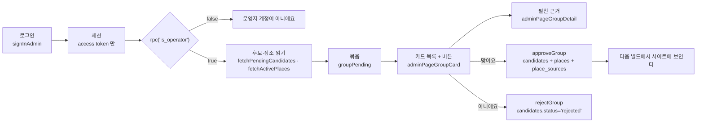

# 운영자 검수 화면 (`/admin`)

> 최종 수정: 2026-09-29 (v1: 신설 — 앱 안에서 후보를 보고 바로 올린다)

왜 이런 모양인지는 [ADR-018](../decisions/ADR-018-in-app-admin-review.md). 진행은 [docs/todo/06](../todo/06-admin-review.md).

블로그에서 찾은 **후보(`candidates`)** 를 사람이 눈으로 통과시키는 창이다. 터미널 검수(`pnpm data:review`)와 Studio 가 하던
세 단계(승인 → `pnpm data:apply` → Studio 에서 `published`)를 한 번의 "맞아요" 로 합친다.

## 무엇이 어디서 나오나

| 파일 | 맡는 것 |
|---|---|
| `src/app/admin/page.tsx` | 주소·메타(`robots: noindex`)만. 서버 컴포넌트 |
| `src/app/admin/adminRouteClient.tsx` | `dynamic(..., { ssr: false })` — 세션이 localStorage 에만 있어 서버가 그릴 수 없다 |
| `src/screens/adminPage.tsx` | 상태 머신(`checking` → `signedOut` → `verifying` → `notOperator` \| `loading` → `ready` \| `error`)과 모든 액션 |
| `src/screens/adminPageLogin.tsx` | 이메일·비밀번호 폼 |
| `src/screens/adminPageGroupCard.tsx` | 묶음 한 줄(접힘) **과 버튼 전부** — 맞아요·아니에요·새 장소로·지역 고르기·여기에 합치기, 진행·에러 줄 |
| `src/screens/adminPageGroupDetail.tsx` | 펼친 근거만 — 주소·소개·조건 원문·미리보기 3줄·짝지은 장소·원글과 인용. 버튼은 없다 |
| `src/screens/adminPageRejectForm.tsx` | 반려 사유 칩 + 메모 |
| `src/lib/adminSession.ts` | localStorage 세션 읽기·쓰기·만료 판정, `jwtExpiresAt`(브라우저는 `atob`), `appendReviewerNote` |
| `src/lib/adminSupabase.ts` | `createAdminClient` · `signInAdmin` · `isOperator` |
| `src/lib/adminCandidates.ts` | 행·묶음 타입, 조회, 묶기·미리보기·표식 래퍼, 지역 선택지 |
| `src/lib/adminApply.ts` | 승인·반려 오케스트레이션. `scripts/apply-approved.mjs` 와 **같은 순서** |

순수 로직은 새로 쓰지 않는다 — `scripts/analyze/*.mjs`·`scripts/lib/placeFields.mjs` 를 그대로 import 한다.
두 벌이 되면 CLI 와 화면이 다른 규칙으로 `places` 를 쓰기 시작한다(→ ADR-018 "왜 이것인가").

## 로그인은 하루에 한 번

이메일·비밀번호(`signInWithPassword`)로 붙고, 받은 것 중 **access token 만** 남긴다. refresh token 은 버린다 —
저장하면 사실상 영구 로그인이 돼 [ADR-016](../decisions/ADR-016-secrets-by-login.md) 의 경계(`exp` ≤ 1일)가 깨진다.
원격 JWT expiry 가 12시간이므로 **12시간마다 다시 로그인**한다. 헤더의 작은 줄이 `로그인 <이메일> · 만료 HH:MM` 을 보여 주는 이유다.

운영자가 아닌 계정으로 들어오면 목록이 비는 대신 **"운영자 계정이 아니에요"** 가 뜬다. RLS 는 권한이 없는 사람에게
에러가 아니라 빈 결과를 주기 때문에, 그냥 그리면 "검수할 게 없다" 와 구분이 안 된다. 그래서 `rpc('is_operator')` 로 따로 묻는다.

**버튼을 누를 때마다 만료를 다시 본다.** 12시간을 넘긴 창에서 승인을 누르면 PostgREST 가 `JWT expired` 를 주는데, 그것을 카드에 그려 봐야
사람이 할 수 있는 일이 없다(새로고침을 떠올려야 한다). 그래서 쓰기 전에 만료를 보고, 지났으면 **처음 열 때와 같은 자리**로 —
`로그인이 만료됐어요. 다시 로그인해 주세요.` 가 붙은 로그인 폼 — 보낸다. 서버에 아무것도 보내지 않은 상태라 다시 로그인하면 그 카드부터 이어서 한다.

## 카드 한 줄이 말하는 것

같은 가게를 말하는 후보들은 하나로 묶인다(`match_place_id` 가 있으면 그 장소로, 없으면 이름 키로). 접힌 줄에 있는 것:

- **이름**과 **종류**(숙소·식당·카페·기타)
- **구간** — `→ 기존 장소 이름`(일치, AI 0.85 이상) · `확인 요청`(0.4~0.85) · `신규`
- **지역** — 없으면 `지역?`. 이게 비어 있으면 올릴 수 없다(아래 「지역이 없으면」)
- **표식** — `지역 없음` · `좌표 없음` · `목록글`(이름만 나열된 글) · `중복표시` · `짝 없음` · `조건문 없음` · `정규식 못읽음` · `AI 판단 없음` · `동반불가 문장`
- **조건 한 줄** — 판정 등급(정보없음·동반불가·조건·자유)과 앱이 쓸 배지
- **글 N** — 이 묶음을 만든 원글 수

펼치면 주소 · 소개 · **이용 조건 원문** · 미리보기 세 줄(`정규식 [..] · AI [..] · 앱 [..]`) · 원글 목록(제목·날짜·키워드·링크와 그 글에서 뽑은 인용문)이 나온다.
두 판단을 나란히 두는 이유는 [ADR-017](../decisions/ADR-017-ai-structured-pet-policy.md) 에 있다 — 어긋남이 곧 "정규화가 잘 됐는가" 의 실측이다.

## 버튼이 무엇을 쓰나

| 버튼 | 쓰는 것 |
|---|---|
| **맞아요, 장소로 올리기** | 묶음의 후보마다 `candidates.status='approved'` → 병합이면 `places` 의 **빈 칸만** 채우는 patch(대상이 `draft` 면 `published` 로 올린다), 신규면 `places.insert`(**`status='published'`**·`source='blog'`) 후 **즉시** 후보에 `match_place_id` → `place_sources` upsert → `candidates.status='merged'` + `extracted.applied` |
| **아니에요** | 사유 칩(목록글 · 홍보·협찬 · 폐업 · 제주 아님 · 중복 · 동반 불가 · 정보 부족)과 메모를 골라 `status='rejected'`, `reviewer_note` 에 기존값 + `\n[admin] <사유>` |
| **새 장소로 올리기** | 짝(`match_place_id`)을 무시하고 신규로 올린다. 재대조도 건너뛴다 — 사람이 "다른 가게" 라고 말한 것이므로 |
| **여기에 합치기** / **새 장소로** | 신규 후보가 기존 장소와 0.4~0.85 로 닮았을 때만 나온다. 이 구간은 코드가 정하지 않고 사람이 고른다. 이 갈래에도 **아니에요**를 함께 둔다 — 애매한 것이 모이는 구간이라 목록글·홍보글이 그대로 여기 오고, 둘 중 하나를 고르는 길만 두면 반려하려고 새로고침하게 된다 |
| **지역 고르기** + **저장** | `extracted.regionRaw` 만 고쳐 쓴다. 지역이 없으면 주 버튼이 이 자리로 바뀐다 |

`reviewed_at` 은 쓰지 않는다 — 트리거가 `approved`·`rejected` 로 **바뀔 때** 찍는다.
삭제 버튼은 없다. `authenticated` 에 DELETE grant 가 없어서다(42501).

## 지역이 없으면 올라가지 않는다

`region_raw` 가 없거나 `동쪽 (구좌읍)` 형식이 아니면 상세 화면이 그 장소를 '기타' 로 보내고 방향 필터에서 고를 수 없게 된다.
그래서 지역은 반영의 **유일한 필수 칸**이고, 없으면 주 버튼 대신 지역 선택이 뜬다. `type` 이 3종이 아니거나 이름이 비어 있으면 아예 올릴 수 없다(이유를 카드에 그린다).
좌표가 없는 것은 막지 않는다 — 올라가고 **지도에만 안 나온다**.

## 올린 뒤 사이트에 보이기까지

DB 에 `published` 장소가 생겨도 **정적 사이트가 다시 빌드돼야** 보인다(`pnpm data:pull && pnpm build`).
그래서 성공 문구가 "올렸어요 · 사이트에는 다음 빌드에서 보여요" 다. 자동 빌드(웹훅, [04](../todo/04-deploy-and-propagate.md) 의 4b)가 붙기 전까지는
Vercel 대시보드의 **Redeploy** 가 방아쇠다. 문구가 "반영됐어요" 라고 말하지 않는 이유는 그게 거짓말이기 때문이다.

## 조용히 깨지는 것들

- **중간에 실패해도 안전하다 — 대신 실패를 삼키지 않는다.** PostgREST 에 트랜잭션이 없어 `places.insert` 는 됐는데 `merged` 쓰기가 실패할 수 있다.
  그러면 후보가 `approved` 로 남고, **같은 규칙으로 쓰는 `pnpm data:apply` 가 그 상태를 그대로 이어받는다**(신규는 `match_place_id` 를 즉시 적어 뒀으므로
  두 번 만들지 않는다). 화면은 실패한 단계와 메시지를 카드에 빨간 한 줄로 그린다 — 삼키면 사람이 다시 누르고 장소가 두 개 생긴다.
  **그 빨간 줄은 메모리에만 있다**: 목록은 `pending` 만 읽으므로 새로고침하면 그 카드가 조용히 사라진다. 그래서 머리글 아래에 `approved` 수를 세어
  `반영이 끊긴 후보 N건이 있어요 — 터미널에서 pnpm data:apply 를 한 번 돌려 주세요.` 를 노란 줄로 띄운다(불러올 때와 **승인이 실패한 직후**에 다시 센다 —
  어느 단계에서 끊겼는지는 메시지에만 있어 짐작으로 더하지 않는다). 그 줄이 없으면 실패가 성공처럼 보인다.
- **쓰기는 한 번에 하나만 돈다.** 카드별 버튼 비활성은 같은 카드만 막는데, 승인이 도는 중에 그 카드를 접고 다른 카드를 펴서 누르는 길이 열려 있다.
  두 번째 승인은 첫 번째가 아직 목록에 넣지 않은 장소를 못 보고 재대조하므로, 같은 가게가 이름만 달라 두 묶음이면(`숨도`·`숨도카페`) 장소가 두 개 생긴다.
  그래서 다른 묶음이 쓰는 동안 누르면 `다른 묶음을 처리하고 있어요 — 끝나면 다시 눌러 주세요.` 가 뜨고 아무것도 보내지 않는다(CLI 는 한 줄씩 돌아 이 창이 없다).
- **짝지은 장소가 목록에 없으면 "새로고침" 이 답이 아니다.** 목록은 `archived` 를 빼고 읽으므로, 문 닫은 곳에 짝이 붙은 후보는 "짝이 없다" 로 온다 —
  다시 읽어도 같은 질의라 그 행은 또 없다. 그래서 문구가 Studio 확인과 `새 장소로 올리기` 를 가리킨다.
- **`/admin/index.html` 은 공개 파일이다.** 링크가 없을 뿐 주소를 치면 누구나 열린다. 경계는 RLS·GRANT 뿐이고, 숨은 주소는 보안이 아니다.
- **오프라인에서는 404 다.** 프리캐시 목록에 넣지 않았다(→ [pwa-offline](../architecture/pwa-offline.md)). 검수는 DB 를 읽어야 하니 오프라인에 의미가 없다.
- **첫 화면이 곱지 않은 것은 데이터 탓이다.** 2026-09-28 밤의 160건은 옛 프롬프트로 네이버 키 없이 돌린 결과라 `petPolicy`·`visited`·좌표가 없고,
  목록글 101건·홍보 블로그 13건이 섞여 있다. `AI 판단 없음`·`좌표 없음` 은 버그가 아니다 — 새 `pnpm data:analyze` 를 돌리면 채워진다.
- **묶음의 두 번째 후보부터는 대표가 정한 장소로 들어간다.** 묶음 키는 짝(`match_place_id`)이 있으면 그 장소, 없으면 **정규화한 이름**이다 —
  그래서 이름이 같은 다른 가게(같은 브랜드의 다른 지점 같은)가 한 묶음이 되면, '맞아요' 한 번이 두 가게의 문장을 한 장소에 합친다.
  펼쳐서 **원글 인용과 주소를 먼저 읽는 것**이 그 방어이고, 갈라야 하면 각 후보를 따로 보는 대신 '새 장소로 올리기' 를 쓴다.
- **승인 N건 = 빌드 N번이 될 수 있다.** 웹훅을 붙인 뒤의 이야기이고, 관찰 항목은 [04](../todo/04-deploy-and-propagate.md) 에 있다.
