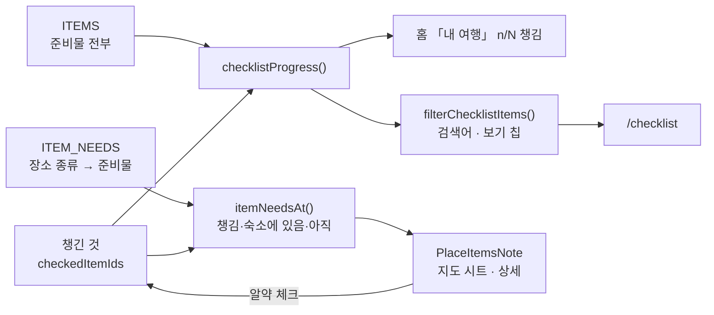

# 여행 준비물

> 최종 수정: 2026-10-08 (v12: 장소 쪽 `PlaceItemsNote` 의 "n/N 챙김" 은 **체크한 것만** 센다 — 숙소에 있는 담요를 챙김으로 세어 체크 0 인 호텔 핀코가 "1/5 챙김" 이었다. 숙소 몫은 분모에서도 빼고 접힌 줄이 따로 말한다(14 W261007.13))
> 이전 2026-10-08 (v11: **탭은 내 물건을 찾아 챙겼는지 표시하는 곳** — 검색 + 보기 칩(전체·안 챙긴 것·챙긴 것) + 한 줄 목록, 이름을 누르면 이유·구매 링크 시트, 체크는 오른쪽 상자. 탭에서 저장한 곳·계절 칩·네 묶음·펼침을 뺐고 짱구누나 글은 맨 아래 → [ADR-009 v4](../decisions/ADR-009-trip-derived-checklist.md))
> 이전 2026-10-08 (v10: 기내용 가방 갈래를 **우리 강아지 몸무게로** 줄인다(`variantsForDog` — 여러 마리는 합, 5kg 경계는 둘 다, 안 맞으면 전부) · 유모차 등록자에겐 유모차 줄에서 "챙기셨나요? [챙겼어요]" 를 **묻는다** — 조용히 챙김으로 세지 않는다(14 W261007.13))
> 이전 2026-10-07 (v9: 챙기는 순간 이모지가 한 번 뛰고, **이 누름이 마지막 하나면** 막대 위로 발바닥이 행진한다 — 다 챙긴 목록으로 돌아올 때는 아무 일도 없다. [app-shell-and-state 「작은 응답 모션과 이스터에그」](../architecture/app-shell-and-state.md#작은-응답-모션과-이스터에그-stylesmicromotioncss-v52))
> 이전 2026-10-07 (v8: 진행률을 "챙김" 과 "숙소에 있음" 으로 따로 센다 — 합친 "1가지 준비됐어요" 가 숙소 물건을 내가 챙긴 것처럼 말했다(07 U6). 막대는 두 겹으로 둘 다 찬다)
> 이전 (v7: 준비물 줄은 본체 탭이 체크, 펼침은 오른쪽 화살표 칸 하나 — 이름을 누르면 펼쳐져 체크하려던 사람이 이유를 열고 있었다(14 W261006.8). 체크 상자 24px)
> 이전 (v6: 준비물 목록을 저장한 곳으로 좁히지 않는다 — 목록이 원본, 장소가 읽는 쪽. 섹션은 '어디서 쓰는가' 넷,
> 장소의 `MissingItemsNote` → `PlaceItemsNote`(필요한 것 전부를 상태와 함께, 그 자리에서 체크). 준비물 → 둘러보기 카드 제거 → [ADR-009 v3](../decisions/ADR-009-trip-derived-checklist.md))
> 이전 (v5: 기내용 가방을 체크하는 순간 프로필 이동 수단이 '없어요' 면 "이동가방으로 바꿀까요?" 를 한 번 묻는다 — 준비물은 챙겼다는데 식당 판정은 가방 없음 그대로였다(N5))
> 이전 (v4: 어려움 판정에서는 '챙기면 좋은 것' 넛지를 띄우지 않는다 — 판정과 반대로 말하므로)
> 이전 (v3: 섹션 이름 '이번 여행에 필요해요' → '저장한 N곳에 필요해요'. 다른 화면은 같은 하트를 모두 '저장' 이라
> 부르는데 여기서만 '여행' 이라 불러, 이 목록이 내가 누른 하트에서 나온다는 인과가 끊겼다)
> 이전 (v2: '어디서 쓰는가' 묶음, 기내용 가방 갈래 합치기, 안 챙긴 것 알림을 항상 표시)
> 이전 (v1: 신설 — 저장한 곳 기준으로 좁히기, 장소별 안 챙긴 준비물 알림)

왜 이런 모양인지는 [ADR-009](../decisions/ADR-009-trip-derived-checklist.md).

## 무엇이 어디서 나오나

방향이 하나다 — **준비물 목록이 원본이고, 장소는 그것을 읽는다**(v6). 탭은 장소를 모른다(v11) — 내 짐만 센다.



| 파일 | 맡는 것 |
|---|---|
| `src/lib/itemNeeds.ts` | **규칙 테이블.** 준비물이 어느 종류의 장소에서 필요한가 · 장소 하나의 상태(`itemNeedsAt`) |
| `src/lib/places.ts` 의 `ITEM_VARIANTS` | 원본의 여러 줄을 한 준비물로 합치기(기내용 가방 5kg 이하/이상) |
| `src/lib/seasonItems.ts` | 계절 필터(`visibleItems`) — 이제 장소 쪽만 쓴다 |
| `src/lib/checklist.ts` | 탭·홈의 숫자(`checklistProgress`) · 검색과 보기 칩(`filterChecklistItems`·`matchesItemQuery`) · 프로필 물음 |
| `src/lib/amenities.ts` | 숙소 구비 용품 문장 → 안 챙겨도 되는 준비물(장소 쪽) |
| `src/components/placeItemsNote.tsx` | 장소 하나에서 "여기 필요한 준비물" — 알약을 누르면 체크된다 |
| `src/screens/checklistPage*.tsx` | 준비물 화면 · 한 줄 · 이유와 링크 시트 |

## 규칙을 고치는 곳

`ITEM_NEEDS` 한 줄이 규칙 하나다. `itemName` 은 `src/data/items.json` 의 `name` 과 **정확히**
일치해야 한다 — 어긋나면 그 규칙은 조용히 빠지고, 테스트가 그것을 잡는다.

```ts
{ itemName: '휴대용 물병/밥그릇', types: ['restaurant', 'cafe'] },
{ itemName: '기저귀', types: ['restaurant', 'cafe'], when: (p) => p.policy.indoor === 'free' || p.policy.outdoorFree },
```

`when` 은 종류만으로 안 갈리는 조건일 때만 쓴다. 지금은 기저귀 하나뿐이다.

## 화면이 어떻게 갈리나

```
여행 준비물                 ← 접히면 헤더 오른쪽 "3/14 챙김"
14가지 중 3가지 챙겼어요 ▬▬▬───
[🔍 준비물 검색            ]
(전체) (안 챙긴 것) (챙긴 것)
👜 강아지 기내용 가방      ›  ☐
🛟 강아지 튜브 여름        ›  ☐   ← 계절 물건도 늘 보인다(이름 옆에 계절)
…
짱구누나의 한마디            ← 원 자료의 글 · 조언
```

- 목록은 `ITEMS` 전부, 원본 순서 그대로다. 체크한 줄을 아래로 내리지 않는다 — 누른 줄이 손 밑에서 사라진다.
- 한 줄에서 **누르는 곳은 둘** — 이모지·이름은 시트(이유 · 몸무게에 맞는 갈래 링크 · 제휴 고지), 오른쪽 44px 상자는 체크(v11, v7 의 반대).
- 검색과 보기 칩은 함께 걸린다. 못 찾으면 `EmptyState` 와 [검색 지우기].
- 저장한 숙소는 이 화면에 아무것도 하지 않는다. 그 숙소에 있는 물건은 그 숙소를 열었을 때 장소 쪽이 말한다.

### 장소 쪽 — `PlaceItemsNote`

| 상태 | 모양 | 누르면 |
|---|---|---|
| 아직 | 크림 알약 + 이모지 | 체크 |
| 챙김 | 브랜드 워시 알약 + ✓ | 체크 해제 |
| 숙소에 있어요 | 흐린 알약(이 숙소 자신의 구비 용품) | 없음 |

머리의 "n/N 챙김" 은 **체크한 것만** 센다 — 숙소에 있는 것은 분자에도 분모에도 넣지 않는다. 섞으면 체크가 하나도
없는 숙소에서 "1/5 챙김" 이 된다(14 W261007.13 — 호텔 핀코의 담요). 숙소에 있는 것은 알약의 '숙소에 있어요' 가 말한다.

챙길 것을 다 챙기면 "여기 필요한 준비물 N가지는 다 챙겼어요"(숙소에 있는 것이 섞이면 "여기 챙길 준비물 N가지는 다
챙겼어요 · M가지는 숙소에 있어요") 한 줄로 줄어든다 — 그 자리에서 방금 누른 경우는 빼고(누른 알약이 사라지면 되돌릴 곳이 없다).

## 조용히 깨지는 것들

- **이동가방·케이지·유모차는 이 표에 넣지 않는다.** 판정(`eligibility.ts`)이 이미 같은 말을
  하고 있어서, 넣으면 한 화면에서 두 줄이 서로 반대를 말한다.
- **준비물이 프로필을 바꾸자고 _묻기만_ 한다**(`shouldAskCarrierBag`, v5). 기내용 가방을 막 체크했고
  이동 수단이 '없어요' 일 때 그 줄 아래에 [바꾸기]/[괜찮아요] — 판정이 바뀌는 것은 사용자의 [바꾸기]
  한 번뿐이다. 체크가 프로필을 조용히 바꾸면 판정이 사용자 모르게 뒤집힌다. **ADR-009 의 반대 방향
  (프로필 → 준비물, 가방을 `ITEM_NEEDS` 에 넣기)은 여전히 금지다.** 항목은 이름(`CARRY_BAG_ITEM_NAME`)
  으로 찾는다 — 합친 항목의 id 는 첫 갈래의 것이라 데이터를 따라 바뀐다. 이름이 어긋나면 조용히 한 번도
  안 묻게 되므로 `checklist.test.ts` 가 이름이 `ITEMS` 에 있는지 본다.
- **유모차 등록자에게도 _묻기만_ 한다**(`shouldOfferStroller`, v10) — 위 가방 질문의 거울(프로필 → 준비물). 평가자 셋이 "유모차로 다닌다고 적었는데
  준비물엔 안 챙김" 을 어색해했지만, 자동 체크는 07 U6 이 고친 거짓말(안 챙긴 것을 챙긴 것처럼 세기)을 되살린다 — 유모차로 다닌다는 것이 짐을 쌌다는
  뜻이 아니고, 이 항목의 이유부터 '공항 근처 대여' 다. 체크는 [챙겼어요] 한 번뿐이고 체크하면 줄이 사라진다. 'bag' 등록자에게 기내용 가방을 같은 식으로
  묻지 않는다 — 천 가방은 기내 반입 가방이 아니다.
- **기내용 가방 갈래는 화면에서만 몸무게로 거른다**(`variantsForDog`, v10). `ITEMS` 는 강아지를 모르는 모듈 로드 시점에 합쳐지고, 분모·id 는 그대로다 —
  갈래는 링크만 가른다. 구간은 라벨을 파싱하지 않고 `ITEM_VARIANTS` 의 `kg` 숫자로 둔다(두 라벨이 다 5 를 품어 5kg 은 둘 다 보인다).
- **어려움 판정에서는 `PlaceItemsNote` 를 띄우지 않는다**(`shouldShowPlaceItems`) —
  "못 가요" 아래에서 "챙기라" 고 하면 판정과 반대로 말한다. 판정은 컴포넌트가 직접 읽는다(prop 없음).
- **계절을 고르지 않으면 여름·겨울 항목은 애초에 없다**(`visibleItems`). 물놀이 숙소를
  보고 있어도 튜브 경고는 안 뜬다 — 세 화면이 같은 숫자를 보여주기 위한 대가다.
- **`PlaceItemsNote` 는 localStorage 를 읽기 전에는 아무 말도 하지 않는다**
  (`useStoreHydrated`). 읽기 전에는 체크한 것이 하나도 없어 보이므로, 그냥 그리면 **다 챙긴
  사람에게도 '아직' 알약이 떴다가 바뀐다.** 저장 개수가 0 에서 채워지는 것과는 다르다 — 그쪽은
  정보가 늘어날 뿐이지만 이쪽은 한 말을 무르는 것이라, 보고 나서 말한다.
- **목록을 저장한 곳으로 다시 좁히지 않는다**(v6). 좁히면 "저장한 곳에 필요 없음" 이 "여행에 필요 없음" 으로
  읽히고(숙소를 아직 안 고른 사람에게 이불이 사라진다), 하트를 누를 때마다 분모가 흔들린다. 장소별로 필요한 것은
  장소 화면이 말한다.
- **`ITEM_NEEDS` 에 규칙이 없는 준비물은 어느 장소의 "여기 필요한 준비물" 에도 안 뜬다.** 지금 그래야 하는 것
  (기내용 가방·유모차)과 규칙을 아직 안 적은 것이 **구분되지 않는다.** 준비물을 새로 늘리면서 장소 규칙이 필요하다면 반드시 표에 줄을 더한다.
- **갈래를 합치는 이름은 `items.json` 의 `name` 과 정확히 일치해야 한다**(`ITEM_VARIANTS`).
  어긋나면 합치지 않고 원본 두 줄이 그대로 남아, 한 줄이 영영 체크되지 않는다 —
  `checklist.test.ts` 의 「ITEMS 갈래 합치기」 가 그것을 잡는다.
- **합쳐진 항목은 첫 갈래의 id 를 물려받는다.** id 를 새로 만들면 이미 체크해 둔 사람의
  기록(`checkedItemIds`)이 통째로 어긋난다.
- **진행 막대는 숙소 몫까지 차고, 숫자는 둘을 따로 말한다**(v8). `ready = packed + atStay` 로 막대·묶음 머리의 `2/3` 이
  차서 목록의 흐린 줄과 어긋나지 않는다. 그러나 문장·접힌 머리·홈 링크는 "0가지 챙겼고, 2가지는 숙소에 있어요" 로
  나눠 말한다 — 합친 "1가지 준비됐어요" 는 아무것도 체크 안 한 사람에게 숙소 물건을 내가 챙긴 것처럼 읽혔다(07 U6).
  체크했고 숙소에도 있으면 **챙김**으로 한 번만 센다. 막대는 두 겹(진한 색 = 챙김, 옅은 색 = 숙소).
- **`checklist.ts` 와 `itemNeeds.ts` 는 서로를 import 하지 않는다.** 둘 다 계절 필터가
  필요한데, 한쪽이 다른 쪽에서 가져오면 순환 고리가 된다. 그래서 `seasonItems.ts` 가 있다.
