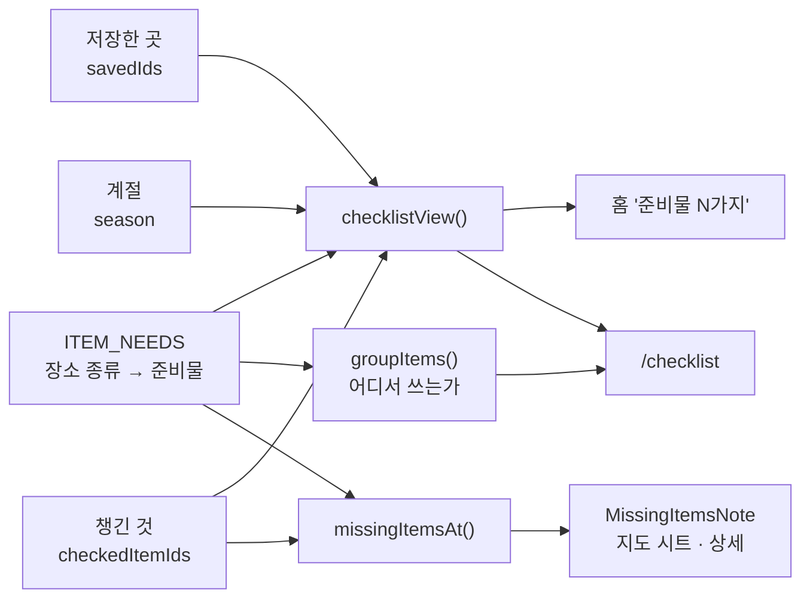

# 여행 준비물

> 최종 수정: 2026-09-28 (v3: 섹션 이름 '이번 여행에 필요해요' → '저장한 N곳에 필요해요'. 다른 화면은 같은 하트를 모두 '저장' 이라
> 부르는데 여기서만 '여행' 이라 불러, 이 목록이 내가 누른 하트에서 나온다는 인과가 끊겼다)
> 이전 (v2: '어디서 쓰는가' 묶음, 기내용 가방 갈래 합치기, 안 챙긴 것 알림을 항상 표시)
> 이전 (v1: 신설 — 저장한 곳 기준으로 좁히기, 장소별 안 챙긴 준비물 알림)

왜 이런 모양인지는 [ADR-009](../decisions/ADR-009-trip-derived-checklist.md).

## 무엇이 어디서 나오나



| 파일 | 맡는 것 |
|---|---|
| `src/lib/itemNeeds.ts` | **규칙 테이블.** 준비물이 어느 종류의 장소에서 필요한가 |
| `src/lib/itemGroups.ts` | 규칙 표에서 파생한 화면 묶음(`오가는 길에`·`어디를 가든`·`식당·카페에서`·`숙소에서`) |
| `src/lib/places.ts` 의 `ITEM_VARIANTS` | 원본의 여러 줄을 한 준비물로 합치기(기내용 가방 5kg 이하/이상) |
| `src/lib/seasonItems.ts` | 계절 필터(`visibleItems`). 순환 참조를 끊으려고 따로 있다 |
| `src/lib/checklist.ts` | 화면이 쓰는 한 덩어리(`checklistView`) |
| `src/lib/amenities.ts` | 숙소 구비 용품 문장 → 안 챙겨도 되는 준비물 |
| `src/components/missingItemsNote.tsx` | 장소 하나에서 "아직 이게 없어요" 한 줄 |
| `src/screens/checklistPage*.tsx` | 준비물 화면 · 묶음 목록 · 준비물 한 줄 |

## 규칙을 고치는 곳

`ITEM_NEEDS` 한 줄이 규칙 하나다. `itemName` 은 `src/data/items.json` 의 `name` 과 **정확히**
일치해야 한다 — 어긋나면 그 규칙은 조용히 빠지고, 테스트가 그것을 잡는다.

```ts
{ itemName: '휴대용 물병/밥그릇', types: ['restaurant', 'cafe'] },
{ itemName: '기저귀', types: ['restaurant', 'cafe'], when: (p) => p.policy.indoor === 'free' || p.policy.outdoorFree },
```

`when` 은 종류만으로 안 갈리는 조건일 때만 쓴다. 지금은 기저귀 하나뿐이다.

## 화면이 어떻게 갈리나

두 축이 겹쳐 있다. **급한 순서**가 섹션(h2)이고, **쓰는 자리**가 그 안의 묶음(h3)이다.

```
오가는 길에                    ← 묶음 하나지만 섹션으로 승격(아래 참고)
저장한 N곳에 필요해요          ← 저장한 곳이 있을 때만
  어디를 가든 / 식당·카페에서 / 숙소에서
그 밖에 챙기면 좋아요 N가지      ← 접힘. 저장한 곳이 없으면 펼친 전체 목록
  어디를 가든 / 식당·카페에서 / 숙소에서
```

- 묶음이 하나뿐인 섹션은 머리글을 생략한다 — 가를 것이 없는데 이름표만 붙으면 읽는 사람이
  보이지 않는 다른 묶음을 찾는다.
- `오가는 길에`(기내용 가방·유모차)는 장소 규칙이 없어 **절대 '저장한 N곳에 필요해요' 에 못 들어간다.**
  그대로 두면 늘 접혀 있는 '그 밖에' 아래로 떨어지므로, 이 묶음만 맨 위 섹션으로 뺀다.
- 묶음은 `ITEM_NEEDS` 의 `types` 에서 파생된다. 준비물에 묶음을 따로 적어 두지 않는 이유는
  규칙과 묶음이 서로 다른 말을 하기 시작하기 때문이다(→ [ADR-009 v2](../decisions/ADR-009-trip-derived-checklist.md)).

## 조용히 깨지는 것들

- **이동가방·케이지·유모차는 이 표에 넣지 않는다.** 판정(`eligibility.ts`)이 이미 같은 말을
  하고 있어서, 넣으면 한 화면에서 두 줄이 서로 반대를 말한다.
- **계절을 고르지 않으면 여름·겨울 항목은 애초에 없다**(`visibleItems`). 물놀이 숙소를
  보고 있어도 튜브 경고는 안 뜬다 — 세 화면이 같은 숫자를 보여주기 위한 대가다.
- **`MissingItemsNote` 는 localStorage 를 읽기 전에는 아무 말도 하지 않는다**
  (`useStoreHydrated`). 읽기 전에는 체크한 것이 하나도 없어 보이므로, 그냥 그리면 **다 챙긴
  사람에게도 경고가 떴다가 사라진다.** 저장 개수가 0 에서 채워지는 것과는 다르다 — 그쪽은
  정보가 늘어날 뿐이지만 이쪽은 한 말을 무르는 것이라, 보고 나서 말한다.
- **`ITEM_NEEDS` 에 규칙이 없는 준비물은 `오가는 길에` 묶음으로 떨어진다.** 지금 거기 있어야
  하는 것(기내용 가방·유모차)과, 규칙을 아직 안 적은 것이 **구분되지 않는다.** 준비물을
  새로 늘리면서 장소 규칙이 필요하다면 반드시 표에 줄을 더한다.
- **갈래를 합치는 이름은 `items.json` 의 `name` 과 정확히 일치해야 한다**(`ITEM_VARIANTS`).
  어긋나면 합치지 않고 원본 두 줄이 그대로 남아, 한 줄이 영영 체크되지 않는다 —
  `itemGroups.test.ts` 가 그것을 잡는다.
- **합쳐진 항목은 첫 갈래의 id 를 물려받는다.** id 를 새로 만들면 이미 체크해 둔 사람의
  기록(`checkedItemIds`)이 통째로 어긋난다.
- **진행률의 분자(`ready`)에는 숙소가 갖고 있는 것이 포함된다.** "N가지 준비됐어요" 의
  "준비" 는 챙긴 것과 숙소에 있는 것 둘 다를 뜻한다 — 목록의 흐린 줄과 숫자가 어긋나면 안 된다.
- **`checklist.ts` 와 `itemNeeds.ts` 는 서로를 import 하지 않는다.** 둘 다 계절 필터가
  필요한데, 한쪽이 다른 쪽에서 가져오면 순환 고리가 된다. 그래서 `seasonItems.ts` 가 있다.
