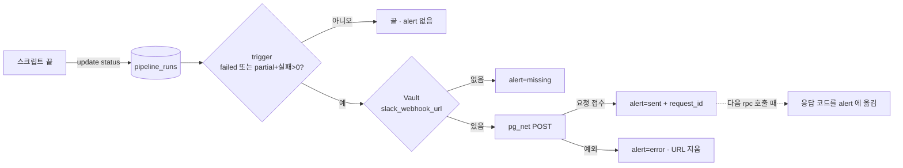

# 운영 현황 화면 `/admin/ops` — 수집·분석·검수·반영·재빌드가 돌고 있는지 한 화면에서

> 최종 수정: 2026-10-06 (v1: 제안 — 화면 명세와 UI/UX 설계. 코드 없음)
> 상태: **제안**. 왜 이런 모양인지는 [ADR-023](../decisions/ADR-023-ops-dashboard-and-run-log.md), 진행은 [todo/15](../todo/15-ops-dashboard.md).

이 화면이 답하는 질문은 하나다 — **"지금 어디가 막혀 있나, 아니면 다 괜찮나."** `/admin` 이 후보를 올리는 자리라면, 여기는 그 장치가 도는지 보는 자리다. 운영자(개발자 한 명)가 PC 에서 10초 훑고 닫는 것을 기준으로 설계한다. 핸드폰은 "읽힌다" 까지만.

## 누가, 언제 연다

| 장면 | 보고 싶은 것 | 그래서 화면은 |
|---|---|---|
| 주말에 "이번 주 수집 돌렸던가?" | 마지막 수집이 언제였고 성공했는지 | 맨 위 다섯 칸 중 **수집** 칸의 "N일 전 · 정상" 한 줄 |
| `analyze` 를 돌려 놓고 자리를 비웠다 | 끝났는지, 죽었는지, 몇 건 했는지 | **분석** 칸이 `돌고 있음(3분 전 심장)` 또는 `중단된 듯` 또는 `끝남 · 47건` |
| `/admin` 에서 승인했는데 사이트가 안 바뀐다 | 반영 → 재빌드 어디서 끊겼나 | **반영** 칸의 "approved 인데 반영 안 됨 2건" 또는 **재빌드** 칸의 4xx 경고 |
| 한 달 지나 "이거 비용이 얼마나 들지" | Claude 토큰·재빌드 횟수 | **사용량** 묶음의 30일 합계 |
| Slack 에 실패 알림이 왔다 | 어떤 실행이 왜 실패했나 | 알림 링크 → 이 화면의 **실행 기록** 그 행이 펼쳐진 상태 |

## 화면 구성

```
┌──────────────────────────────────────────────────────────────────────────────┐
│ 운영 현황                                    ← 검수 화면 · 새로고침 · 42초 전 │
│ 재빌드가 걸렸어요(2분 전 · 201)                              ← /admin 과 같은 줄│
├──────────────────────────────────────────────────────────────────────────────┤
│ ⚠ 수집이 9일째 없어요 · 분석 backlog 47건(5일째) · 검수 8일째 대기  ← 주의 띠 │
├──────────────────────────────────────────────────────────────────────────────┤
│ ① 파이프라인                                                                 │
│ ┌──────────┐ ┌──────────┐ ┌──────────┐ ┌──────────┐ ┌──────────┐             │
│ │● 수집    │ │● 분석    │ │○ 검수    │ │● 반영    │ │● 재빌드  │             │
│ │9일 전    │ │2시간 전  │ │대기 31   │ │3일 전    │ │2분 전    │             │
│ │신규 12   │ │47건 미분석│ │오래된 8일│ │끊긴 0    │ │7일 6회  │             │
│ │7일 넘음  │ │5일째 쌓임│ │          │ │          │ │201      │             │
│ └──────────┘ └──────────┘ └──────────┘ └──────────┘ └──────────┘             │
├──────────────────────────────────────────────────────────────────────────────┤
│ ② 흐름  [7일] [30일]                                                         │
│ 신규 글 12 ███                                                                │
│ 분석    73 ████████████████████                                               │
│ 후보    41 ███████████                                                        │
│ 승인    18 █████             제외 15 ████                                     │
│ 반영    18 █████                                                              │
│ 재빌드   6 ██                                                                 │
│ 지금 보류 31 ████████   ← 기간 무관, 노랑                                     │
├──────────────────────────────────────────────────────────────────────────────┤
│ ③ 실행 기록  [전체] [수집] [분석] [반영] [승인]   [실패만]                      │
│ 시각        스크립트   상태    소요    요약                              알림  │
│ 2시간 전    analyze    ●끝남   41분    분석 47건 (후보 23 · 일치 9 · …)   —    │
│ 어제 21:03  analyze    ●실패   3분     Claude 인증 실패                  Slack │
│ 9일 전      collect    ●끝남   2분     수집 120건 (신규 12 · 기존 108)   —    │
│ …                                                                   더 보기   │
├──────────────────────────────────────────────────────────────────────────────┤
│ ④ 사용량(30일)   Claude 입력 1.2M · 출력 180k · 캐시 940k │ 네이버 검색 2,400 │ 재빌드 22  │
│ ⑤ 알림          Slack 웹훅 있음 · 마지막 발송 어제 21:03(200)   [테스트 보내기]│
└──────────────────────────────────────────────────────────────────────────────┘
```

### ① 파이프라인 다섯 칸 — 한 줄 진단

순서는 장치가 도는 순서다(수집 → 분석 → 검수 → 반영 → 재빌드). [ADR-020](../decisions/ADR-020-pipeline-stages-and-blocklist.md) 의 다섯 칸(수집 완료 · 검수 대기 · 등록 완료 · 등록 해제 · 블랙리스트)은 **후보가 지금 어디 있나**를 가르는 상태이고, 여기 다섯 칸은 **장치가 어디까지 돌았나**를 가르는 단계라 축이 다르다 — 이름이 달라야 맞고, `/admin` 탭과 같은 낱말(검수·반영)만 같은 뜻으로 쓴다. 칸마다 네 줄:

| 줄 | 수집 | 분석 | 검수 | 반영 | 재빌드 |
|---|---|---|---|---|---|
| 상태점 + 이름 | ● | ● | ○(사람 몫이라 색을 약하게) | ● | ● |
| **첫째 수**(마지막) | 마지막 ok 실행 상대 시각 | 마지막 ok 실행 또는 `돌고 있음(심장 N분 전)` | 대기 N건 | 마지막 ok 실행 | 마지막 `rebuild_log` 행의 상대 시각 · 응답 코드 |
| **둘째 수**(쌓인 것) | 그 실행의 신규 N | 미분석 backlog N | 가장 오래된 pending 며칠 | approved 인데 merged 아님 N(= `countStrandedCandidates`) | 7일 훅 횟수 |
| 판정 이유(주의·실패일 때만) | "7일 넘음" | "N일째 쌓임" / "중단된 듯" | "N일 넘게 대기" | "반영 안 된 승인 N" | "Deploy Hook 폐기된 듯" |

상태점은 넷이다 — **정상**(초록 `success`) · **주의**(노랑 `warning`) · **실패**(빨강 `error`) · **기록 없음**(회색, "아직 한 번도 안 돌았어요"). 판정 규칙은 `src/lib/adminOpsHealth.ts` 한 곳이 소유하고 단위 테스트가 붙는다. 재빌드 칸은 `rebuildHeadline()` 의 문장(`{tone, text}`)을 파싱하지 않고 `fetchRebuildStatus()` 가 돌려주는 행(`response_status`·`hook`·`responded_at`)을 직접 받는다 — 머리글 한 줄은 그대로 `rebuildHeadline` 이 만든다. 재빌드 칸은 `rebuildHeadline()` 의 문장(`{tone, text}`)을 파싱하지 않고 `fetchRebuildStatus()` 가 돌려주는 행(`response_status`·`hook`·`responded_at`)을 직접 받는다 — 머리글 한 줄은 그대로 `rebuildHeadline` 이 만든다. 칸을 누르면 ③ 실행 기록이 그 스크립트로 걸러진다.

판정 규칙(권장 기본값 — 임계값은 🙋, [todo/15](../todo/15-ops-dashboard.md)):

| 칸 | 실패 | 주의 | 기록 없음 |
|---|---|---|---|
| 수집 | 마지막 실행이 `failed` | 마지막 ok 가 **7일** 넘음 | `collect` 행이 0 |
| 분석 | 마지막 실행이 `failed` · `running` 인데 `heartbeat_at` 이 **10분** 넘음(중단된 듯) | 미분석 글 > 0 이고 가장 오래된 미분석 글의 `fetched_at` 이 **2일** 넘음 | `analyze` 행이 0 |
| 검수 | — (사람 몫, 실패가 없다) | 가장 오래된 pending 이 **7일** 넘음 | pending 0 → "비었어요"(정상) |
| 반영 | 마지막 `apply` 에 실패 건수 > 0 | approved 인데 merged 아닌 후보 > 0 | — |
| 재빌드 | 마지막 `sent` 행의 `response_status` 가 4xx·5xx | `missing`·`error` · 응답 null 이 3분 넘음(`rebuildHeadline` 과 같은 기준) | `rebuild_log` 0 |

"운영자가 `/admin` 에서 승인하면 반영이 곧바로 일어난다"(ADR-018) 는 사실 때문에 **반영 칸의 주의는 거의 CLI 경로(`data:review approve` → `data:apply`)에서만 선다.** 그게 서면 "apply 를 돌리세요" 라는 뜻이다 — 칸 아래 그 명령을 한 줄 적어 준다.

### ② 흐름 — 어디서 쌓이나

기간(7일 · 30일) 안에서 **그 기간에 각 단계를 지난 건수.** rpc `ops_overview(days)` 한 번이 센다. 줄들은 서로의 부분집합이 **아니다**(이번 주 분석된 글이 지난주 수집된 글일 수 있다) — 그래서 "깔때기" 라도 비율은 **가장 큰 줄을 100%** 로 둔다. 보류(pending)는 기간 흐름이 아니라 **지금 쌓인 것**이라 줄을 따로 뗀다.

| 줄 | 세는 것 | 어디서 |
|---|---|---|
| 신규 글 | `fetched_at` 이 기간 안인 글(`ignoreDuplicates` 라 **새로 들어온 글만** 센다 — 실행 기록의 "수집 120건" 과 다른 수다) | `blog_posts` |
| 분석 | `analyzed_at` 이 기간 안인 글 | `blog_posts` |
| 후보 | `created_at` 이 기간 안인 후보 | `candidates` |
| 승인 · 제외 | `reviewed_at` 이 기간 안인 후보 — 승인 = `status in ('approved','merged')`(반영되면 `merged` 로 바뀌므로 `approved` 만 세면 빠진다), 제외 = `rejected`. `reviewed_at` 은 트리거가 approved/rejected 로 바뀔 때만 채우므로 pending 은 여기 없다 | `candidates` |
| 지금 보류 | 현재 `status='pending'` 수(기간 무관 — ① 검수 칸의 대기 수와 같은 값) | `candidates` |
| 반영 | `extracted.applied.at` 이 기간 안인 후보 | `candidates` |
| 재빌드 | `hook='sent'` 이고 응답 2xx 인 행 | `rebuild_log` |

막대는 **가장 큰 줄을 100% 로 둔 비율**이다. 색은 한 가지(`bg-brand-solid` 의 약한 톤), 줄마다 다른 색을 쓰지 않는다 — 비교하는 축이 "얼마나 지났나" 하나뿐이다. 승인·제외는 한 줄에 둘을 나란히, **지금 보류 줄만 노랑**(`warning` 토큰)이다 — 그게 사람이 할 일이다. 수 0 인 줄은 막대 없이 `0` 만 쓴다. 차트 라이브러리를 들이지 않는다 — `div` 너비 하나다. 구현 전에 `dataviz` 스킬의 "stat tile · 비율 막대" 절을 한 번 읽는다.

### ③ 실행 기록 — 무슨 일이 있었나

`pipeline_runs` 를 최신순으로. `adminTable` + `adminInfiniteScroll` 재사용. 열은 여섯:

| 열 | 내용 | 비고 |
|---|---|---|
| 시각 | 상대("2시간 전"), 호버·탭에 절대(KST) | `started_at` |
| 스크립트 | `collect` · `analyze` · `apply` · `approve`/`reject` | `adminTypeChip` 과 같은 알약 모양, 색은 회색 하나 |
| 상태 | 끝남 · 일부 실패 · 실패 · 돌고 있음 · 중단된 듯 | 상태점 색 = ① 과 같은 토큰 |
| 소요 | `ended_at − started_at`, 돌고 있으면 "N분째" | 분석은 보통 수십 분 |
| 요약 | 콘솔 요약 줄을 `stats` 에서 **그대로 다시 만든 문장** | 터미널에서 본 것과 같은 말이어야 한다 |
| 알림 | `—` · `Slack` · `Slack 실패` | `alert` 칸 |

행을 펼치면 `stats` 의 전부(토큰 · 제외 사유별 수 · 좌표 보강 · 홈페이지), `args`(플래그 목록), `error` 한 줄, 알림 request_id 가 키-값으로 선다. 필터는 칩 둘 — 스크립트, `실패만`. URL 에 `?run=<id>` 가 오면 그 행이 펼쳐진 채 스크롤된다 — Slack 메시지의 링크가 여기로 온다.

**중단된 듯** 행에는 버튼이 없다. 운영자가 할 일은 터미널에서 다시 돌리는 것이다. `runLock`(`scripts/lib/runLock.mjs`)은 잠금을 쥔 pid 가 죽어 있으면 **알아서 이어받으므로** 락 파일을 지울 필요가 없다 — 행 아래 한 줄은 "프로세스가 죽었으면 그냥 다시 돌리면 돼요. 살아 있는데 멎어 있으면 그 프로세스를 끊고 다시" 다. 행을 손으로 `failed` 로 닫는 버튼은 두지 않는다 — 기록을 화면이 고치기 시작하면 정본이 둘이 된다.

### ④ 사용량 — 30일 합계

한 줄 세 묶음. `analyze` 행들의 `stats.tokens`(입력·출력·캐시) 합 · 네이버 검색 호출 수(`collect` + `analyze` 의 `stats.naverCalls`) · 재빌드 2xx 횟수. 금액으로 바꾸지 않는다 — Claude 는 구독이라 한도 소모이지 돈이 아니고([todo/README](../todo/README.md) 🙋), 네이버는 무료 구간이다. 수가 뜻하는 바를 한 줄 각주로: "구독 5시간 한도는 토큰이 아니라 호출 패턴에 걸린다 — 참고값".

### ⑤ 알림 — Slack 이 살아 있나

- **웹훅 있음 / 없음** — Vault 에 `slack_webhook_url` 이 있는지는 브라우저가 알 수 없으므로 `ops_overview` 가 `slackConfigured: boolean` 으로 돌려준다(definer 가 Vault 의 **이름만** 확인, URL 은 반환하지 않는다). 화면을 여는 것만으로 Slack 에 아무것도 가지 않는다. 마지막 발송 시각·응답 코드는 `pipeline_runs.alert` 에서.
- **테스트 보내기** 버튼 — 버튼 전용 rpc `ops_slack_test()` 를 부른다. 메시지는 고정 문구("zgnn 운영 알림 테스트 · <시각>"). 값은 어디에도 안 보인다.
- 웹훅이 없으면 이 묶음이 "Slack 알림을 켜려면 → todo/15 §Slack" 한 줄로 접힌다. 알림 없이도 화면은 전부 동작한다.

Slack 메시지 모양(실패 알림):

```
🔴 zgnn · analyze 실패 — 어제 21:03 · 3분
Claude 인증 실패
▸ 운영 현황 열기  https://<site>/admin/ops/?run=<id>
```

수와 스크립트 이름, 에러 **분류 문구** 한 줄, 링크. `error` 칸은 스크립트가 짧은 분류("Claude 인증 실패" · "네이버 검색 429" · "DB 쓰기 실패")만 적고 원문은 콘솔에만 남긴다 — PostgREST 오류 details 에는 `Key (…)=(값)` 꼴로 장소명이 들어올 수 있어 URL 만 지워서는 샌다. **장소명·블로그 제목·URL 은 넣지 않는다**(ADR-023 결정 5). `partial` 은 "⚠ apply 일부 실패 — 반영 16 · 실패 2".

## 알림이 가는 길



Deploy Hook(`notify_vercel_rebuild`)과 같은 모양이다 — 응답은 `net._http_response` 에 남으므로 `ops_overview` 가 불릴 때 옮겨 적는다(`rebuild_status` 와 같은 수법).

## 들어오고 나가는 길

- `/admin` 머리글 오른쪽에 `운영 현황 →` 텍스트 링크 하나. 경고 띠에 ① 의 주의·실패 중 **가장 심한 하나**를 한 줄 더한다("수집이 9일째 없어요 · 운영 현황 →"). 운영자는 `/admin` 은 매번 열지만 `/admin/ops` 는 그렇지 않다.
- `/admin/ops` 머리글 왼쪽에 `← 검수 화면`. 셸 뒤로가기는 없다(`/admin/**` 은 bare).
- 로그인은 `/admin` 과 **같은 세션**이다. 세션이 없으면 `adminPageLogin` 을 그대로 쓴다 — 로그인 뒤 돌아오는 곳만 `/admin/ops`.
- `robots: noindex` 는 `/admin` 과 같고, 보안 장치가 아니다. 경계는 RLS·GRANT.

## 모바일에서

PC 기준이되 깨지지 않게만 — 다섯 칸은 가로 스크롤 한 줄(각 칸 최소 폭 고정), ② 는 그대로, ③ 은 열을 셋(시각·스크립트+상태·요약)으로 접고 나머지는 펼친 줄에. `data-admin-dense` 라 글자는 커지지 않는다. `/admin` 과 같이 하단 탭바가 보이는 문제(ADR-018 메모)는 이 화면도 같이 겪는다 — 여기서 고치지 않는다.

## 빈 상태와 첫 화면

- `pipeline_runs` 0행: ① 다섯 칸이 회색 "기록 없음", ③ 은 "아직 기록이 없어요 — 다음 `pnpm data:collect` 부터 쌓여요" 한 줄. ②·재빌드 칸은 기존 표로 채워지므로 **첫날부터 비어 있지 않다** — 그래서 ②를 ① 바로 아래 둔다.
- 로딩: 다섯 칸 자리를 먼저 잡고(높이 고정) 수만 `…`. 레이아웃이 뛰지 않게.
- 새로고침: 60초마다 조용히, 머리글의 "N초 전" 만 바뀐다. 손 새로고침 버튼은 `/admin` 과 같은 자리.

## 조용히 깨지는 것들 (만들 때 확인)

- **`heartbeat_at` 을 안 찍으면 "중단된 듯" 이 영원히 안 뜬다.** `running` 상태만 보는 구현은 죽은 프로세스를 "돌고 있음" 으로 보여 준다 — 교차점검 `verify` 의 `null` 과 같은 함정(CLAUDE.md). 테스트에 "running + 심장 11분 전 → 중단된 듯" 케이스를 둔다.
- **`stats` 의 키 이름이 콘솔 요약과 어긋나면 요약 문장이 틀린 수를 말한다.** 요약 줄을 만드는 함수는 **이미 있다**(`scripts/analyze/analyzeCandidates.mjs` 의 `formatSummary(stats, meterSummary, …)`). 새 문장 생성기를 만들지 말고 그 함수를 `src/lib/runSummary.ts` 로 옮겨 스크립트와 화면이 같은 모듈을 쓴다 — 방향은 **스크립트가 `src/lib` 을 읽는 쪽**이다(`review-candidates.mjs` 가 `../src/lib/petPolicy.ts` 를 읽는 선례). `src/` 가 `scripts/lib/*.mjs` 를 import 하는 길은 없다.
- **`fetched_at` 으로 "마지막 수집" 을 세면 틀린다** — `ignoreDuplicates` 라 신규 0건인 실행은 흔적이 없다. 수집 칸은 반드시 `pipeline_runs` 를 본다.
- **approved 인데 반영 안 됨은 `/admin` 승인 경로에선 거의 0 이다** — 0 이 아니면 CLI 승인이 남아 있거나 `adminApply` 가 중간에 실패한 것이다. "정상이라 0" 과 "경로가 없어서 0" 을 화면이 구별할 필요는 없지만, 문서는 구별한다.
- **Slack 메시지에 장소명이 들어가면 ADR-023 결정 5 위반이다.** 트리거 함수는 `stats` 의 **수 칸만** 읽고, `error` 는 200자로 자르고 `https?://` 를 지운다(`rebuild_log` 와 같은 정규식) — 하지만 진짜 보장은 스크립트가 `error` 에 분류 문구만 적는 것이다(위 「Slack 메시지 모양」).
- **`?run=<id>` 를 `useSearchParams` 로 읽으면 정적 내보내기에서 Suspense 경계를 요구한다.** effect 안에서 `window.location.search` 를 읽는다(화면은 어차피 `ssr:false`).
