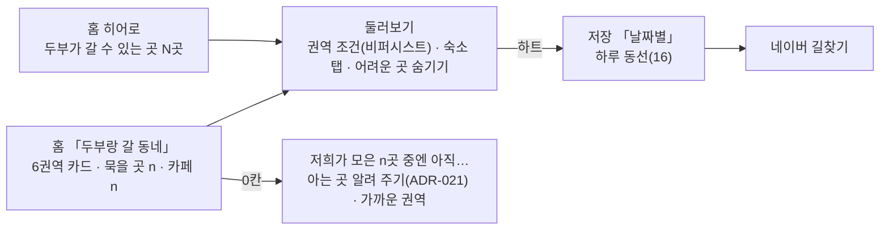

# 기획 토론 — "오늘 가고 싶은 지역" → 「두부랑 갈 동네」

> 최종 수정: 2026-10-08 (v2: §5 를 구현 규격으로 바로잡음 — 6권역 매핑은 읍면(셈)·관광지 키(칩 배치) 둘이고 테스트가 둘을 맞춘다, 셈은 홈 히어로와 같은 `countByLevel` ok+outdoor 임을 코드로 확인,
> 권역 조건은 새로 만드는 비퍼시스트 칸, 카드 배치는 임시안(320px). §6 정성 kill 을 주간 평가의 **있는** 과제로)
> 이전 2026-10-08 (v1: 신설 — 오너의 가제 "오늘 가고 싶은 지역"(지역을 고르면 가는 길 카페·숙소·카페를 일자별/지역별로 추천)을
> 사실 묶음 + 페르소나 셋(서비스 기획·데이터 리서치·사업기획, 사전 입장을 일부러 갈라 둠) 2라운드로 따졌다. **결론은 제안**이고 방향 승인은 🙋 — NOW 「기다림」)

원문 기록: [사실 묶음](2026-10-08-region-pick/00-factpack.md) · 1라운드 [서지원(PM·옹호)](2026-10-08-region-pick/round1-pm-seo.md) ·
[강도윤(데이터·반대)](2026-10-08-region-pick/round1-data-kang.md) · [한유진(사업기획)](2026-10-08-region-pick/round1-bd-han.md) ·
2라운드 [서](2026-10-08-region-pick/round2-pm-seo.md) · [강](2026-10-08-region-pick/round2-data-kang.md) · [한](2026-10-08-region-pick/round2-bd-han.md).
관련: [16 하루 동선](../todo/16-trip-route-planner.md) · [ADR-026](../decisions/ADR-026-route-ours-navigation-naver.md) · [18 홈 재구성](../todo/18-home-restructure.md) ·
[ADR-022 관광지 반경](../decisions/ADR-022-landmark-search-by-radius.md) · [경쟁 2026-10](competitor/2026-10.md) §6 · [14 W261007.9·.12](../todo/14-weekly-ux-eval.md).

## 0. 한 줄 결론

**"추천"이 아니라 "판정으로 센 동네"로 간다.** 홈의 관광지 칩 줄을 **6권역 카드**로 바꾸고, 카드마다 "두부랑 **묵을 곳 n · 카페 n**"(홈 N 과 같은 셈)을 단다.
누르면 둘러보기가 그 권역·숙소 탭·'어려운 곳 숨기기' 로 열리고, 하트 → 기존 하루 동선(16)으로 잇는다. **0칸은 '없다'가 아니라 '저희가 아직 덜 모았다'로 말한다.**
경유 카페와 일자별 자동 추천은 접는다. 돈은 수수료가 아니라 **판정 데이터 → B2G·2027 공모전**에서 찾는다. 이름은 **「두부랑 갈 동네」**.

## 1. 판정을 가른 숫자

**① 권역 × 강아지 판정**(게시 84곳, `judgeEligibility` 실측 — 표 전체는 사실 묶음 §3-2). "갈 수 있어요(+야외)" 만 센 것:

| | 숙소(6권역) | 카페(6권역) | 식당(6권역) |
|---|---|---|---|
| 두부 3kg·가방 | 8·3·**0**·2·5·2 | 3·4·1·5·9·1 | 2·**0**·1·1·0·0 |
| 보리 30kg·없음 | 1·1·**0**·**0**·1·1 | **0**·1·1·1·1·**0** | 전 권역 **0**(야외 1) |
| 콩+해피·유모차 | 3·1·**0**·1·1·2 | 3·4·1·5·9·1 | 2·**0**·1·1·0·0 |

(권역 순서: 서부 애월·한림·한경 / 서남 대정·안덕 / 남부 서귀포·중문·남원 / 동남 표선·성산 / 동부 구좌·우도 / 북부 조천·제주시)

- 소형견·다견은 **숙소+카페** 12칸 중 11칸이 찬다. 대형견은 숙소가 권역마다 0~1곳, 식당은 누구에게나 구멍(대부분 '확인이 필요해요'인데 전화번호가 없다).
- 검수 대기 신규 후보 **99곳**(숙소 48 · 카페 39 · 식당 12). 다 들어와도 식당은 얇다.

**② 시장**(사실 묶음 §6, 한국관광공사 2024 조사 등)
- **코스 생성은 이미 붐빈다** — 반려생활 "추천 여행코스", 네이버 AI탭(2026-06, 1,000만+), 경남 '강생이랑 갱이랑'(코스·이동시간), 펫플레이, 애월펫패스(지역 묶음 상품),
  제주도의 2026 "동반 가능 여부·조건 통합 제공" 예고. **"내 강아지 조건으로 거른 동네 묶음"은 못 찾았다** — 경쟁력은 이 한 칸뿐이다.
- 제주는 숙박 80.9%·렌터카 71%·희망 1위인데 실제 약 6% — **드물고 긴, 미리 준비하는 여행**. 준비 때 '이동 거리' 고려 **11.7%(지역 중 최저)**.
- 가장 어려운 점: 동반 숙소 부족 46.4% · 음식점·카페 부족 44.8%. "15kg 이상은 숙소 10곳 중 1곳"(여행사 인터뷰).
- 2026-03 법 개정으로 식당·카페 동반이 조건부 허용 → 그 데이터는 빨리 낡는다(287→802곳/2주, 노펫존 전환도).

**③ 운영 조건**(메인이 Vercel 공식 문서로 확인)
- Hobby 요금제는 **비상업 개인 용도 전용** — 광고·방문자 결제·"제휴 링크가 주목적"은 상업. **후원 요청은 상업이 아니다**.
- Web Analytics **사용자 정의 이벤트(외부 클릭 등)는 Pro·Enterprise 전용**. 페이지뷰는 Hobby 에서도 센다.
- 지금 사이트엔 애널리틱스가 **없다** — 무엇도 정량으로 못 잰다.

## 2. 세 안의 운명

| 안 | 결론 | 이유 |
|---|---|---|
| ① 가는 길 경유 카페 | **접는다** (만장일치) | 이동 거리 고려 11.7% · 경로 API 를 안 들인다(ADR-026) · 대형견이 갈 수 있는 카페는 6권역 합쳐 3곳. 살리면 하루 동선 안의 "이동일 사이 카페 1곳" 규칙 하나로만(나중) |
| ② 지역별 추천 | **변형해서 산다** | "추천"이 아니라 **판정 개수**. 문턱(§5)을 넘은 칸에만 '두부랑 가기 좋은 곳' 라벨 |
| ③ 일자별 추천 | **지금은 접는다** | 저장하지 않은 곳은 일정에 넣지 않는다(ADR-026 결정 1) · 하루 동선은 오늘 막 출하돼 쓰임 증거가 없다 · 숙소 0 권역을 고른 날은 시작점이 없다. 일자는 사용자가 하루 동선에서 단다 |

**오너 가설 "반려인은 카페를 정하고 떠난다"** — 직접 물은 조사가 없어 **근거 없음**(맞다/틀리다 둘 다 말할 수 없다). 다만 ①을 접는 데 이 가설은 필요 없다.
"카페가 목적지" 라면 할 일은 카페를 목적지로 고르게 하는 것이고, 그건 둘러보기 카페 탭이 이미 한다.

## 3. 토론 경과 — 무엇이 어떻게 바뀌었나

1라운드는 셋 다 ①·③ 을 접고 ②로 갔다. 갈린 것은 **모양**이었다.

| 쟁점 | 1라운드 | 2라운드 |
|---|---|---|
| D1 화면 | 서: 새 「동네」 하위 화면 / 강: 홈 칩 → 둘러보기 흡수 / 한: 홈 N → "숙소 먼저" 목록 | **엇갈려 양보** — 서·한은 칩 → 둘러보기로, 강은 "권역끼리 나란히 비교해야 답이 된다"며 새 화면으로 |
| D2 숙소 먼저 | 한만 주장 | **합의** — 대형견은 숙소가 지역을 정한다(6권역 합쳐 4곳). 숙소 → 카페 순, 식당은 머리 숫자에서 뺀다 |
| D3 0칸 | 강: "'모른다'를 '없다'로 단정한다" | **합의** — "없어요"·"추천"을 안 쓴다. 분모와 주어('저희가 모은')로 '모른다'와 '어렵다'를 가른다 |
| D4 순서 | 강: 데이터 먼저 / 서: 화면 먼저 | **합의** — 1주차 셈 함수 + 검수, 2주차 화면. 셈 함수가 곧 검수 순서표 |
| D5 측정 | 한: 측정부터 / 서·강: ADR 이 먼저 | **합의** — 2주 안엔 정량 없음. 쿠키 없는 페이지뷰 ADR 을 🙋 로 |
| D6 BM | 한: 제휴는 월 1만 방문에 ~6.5만원 | **합의** — 제휴 보류, B2G·공모전 + 원문을 뺀 판정 데이터셋 |
| D7 이름 | 각자 | 서·한 「두부랑 갈 동네」, 강 「두부랑 어디 갈까요?」 |

양보의 근거로 서로 인정한 것: 저장 0인 첫 방문자에겐 입구가 없다(서) · 홈 N 과 권역 수는 **같은 함수**로 세야 한다(서, 불변식) ·
0곳은 '모른다'다(강) · 넘길 수 있는 자산은 원문이 아니라 스키마·엔진·정답셋이다(강) · 숙소 26곳은 OTA 링크 0개·네이버 예약은 제휴 프로그램이 없다(한, 실측).

## 4. 사회자 판정 — 남은 쟁점

- **D1 → 새 경로도 맨 칩도 아닌 "홈 안의 6권역 카드".** 강의 반론(칩 하나씩으론 권역끼리 비교가 안 된다)과 서·한의 비용 논거(새 화면은 둘러보기와 겹친다)는
  둘 다 맞다. 홈 「지역으로 찾기」 자리에 **6권역 카드**(배치는 임시안, §5)를 두면 나란히 비교가 되고 새 경로는 없다. 관광지 칩은 각 권역 카드 안으로 들어간다(W261007.9 의 0곳 관광지 칩 정리를 같이).
  - 페르소나들은 "홈 **읍면** 칩"을 전제했는데, 홈엔 이미 읍면 칩이 없고 **관광지 칩 27개**가 있다(18 T2, 사실 묶음 정정). 그래서 이 판정이 원안을 바꾸지는 않는다.
  - **권역 조건은 퍼시스트로 두지 않는다.** 읍면(퍼시스트)이 카페 탭·다음 방문까지 새던 문제(ux-expert M-5) 때문에 홈이 퍼시스트 필터를 버렸다 — 권역도 관광지 검색어처럼 비퍼시스트.
  - 새 하위 화면(권역별 정적 페이지)은 정량 go(§6) 뒤에 연다. 그때는 검색 유입·공개 리포트 입구로서 값이 있다(한).
- **식당** — 카드 머리 숫자에서 뺀다. 둘러보기 식당 탭은 그대로라 길은 막지 않는다. 강의 "물어봐야 알아요 N" 접힘 칸은 별도 화면이 생길 때의 몫이다.
- **D7** → 「두부랑 갈 동네」(§8).

## 5. 결론 — 단기 2주 (승인되면)

**1주차 — 셈 함수와 검수(코드와 사람 손이 겹치지 않는다)**
- `src/lib/` 에 6권역 매핑 **둘** — 장소는 `region.town`(읍면 13) 하나만 가지므로 셈은 읍면으로 하고, 관광지 칩을 어느 카드에 둘지는 `LANDMARKS_BY_AREA` 키(13)로 정한다:
  - `region.town` → 6권역 (셈용) — §1 표가 이 매핑으로 셌다(서부 애월읍·한림읍·한경면 / 서남 대정읍·안덕면 / 남부 서귀포시·남원읍 / 동남 표선면·성산읍 / 동부 구좌읍·우도면 / 북부 조천읍·제주시)
  - `LANDMARKS_BY_AREA` 키 → 6권역 (칩 배치용) — 중문·서귀포·남원 → 남부, 한경 → 서부 …
  - **테스트가 둘이 어긋나지 않음을 잡는다**(같은 이름의 읍면·권역 키가 같은 6권역으로 가는지). §1 표도 테스트로 고정.
- 권역 × 종류 셈은 **홈 N 과 같은 함수**: `countByLevel(그 권역의 placesOfType(type), dog, { needsIndoor })` 의 `ok + outdoor`.
  홈 히어로 N 이 종류별 이 값의 합이다(`homePage.tsx` — 여러 마리는 `judgeEligibility` 가 프로필 전체로 한 번에 판정). 새로 세면 "홈은 12곳, 눌렀더니 11곳" 이 생긴다.
- `pnpm data coverage`(`scripts/data.mjs` 하위 명령) — 같은 함수로 원형 셋(소형·대형·다견) × 6권역 × 종류 표, 문턱 통과 수, 칸별 검수 대기 후보 수.
  이 출력이 **검수 순서표**이자 나중의 **B2G 공백 표**다.
- 🧑 운영자 검수 **약 6시간/2주**(하루 20~30분, 분/곳은 가정): 숙소 0 권역(남부·동남)과 대형견 후보의 숙소 → 신규 숙소 48곳 → 카페 39곳.
  전화번호(07 P0)를 열면 숙소·카페부터 약 1.5시간 더.

**2주차 — 화면**
- 홈 「지역으로 찾기」 → 「두부랑 갈 동네」 6권역 카드. 0인 카드도 숨기지 않는다. 등록 전엔 「강아지랑 갈 동네」(총수만).
  **배치는 임시안**(16 T1.4 와 같은 뜻 — 자리·문구는 디자인 트랙이 다시 정할 수 있다). "2열" 은 확정이 아니다 — 320px 에서 카드 폭 ~140px 에
  "묵을 곳 8 · 카페 3" 과 관광지 칩이 들어가면 W261007.10(종류 카드 글자가 세로로 꺾임)과 같은 실패가 난다. 320 폭 실측이 출하 조건.
- **권역 조건은 새로 만든다** — 지금 둘러보기엔 없다. 읍면 여럿을 한 번에 거는 **비퍼시스트** 조건을 `usePlacesPageFilterStore`(관광지 검색어와 같은 store)에 한 칸.
  퍼시스트 읍면(`town`)·검색어와 겹칠 때의 빈 상태(18 T2.1 "읍면을 풀면 N곳")와 맞물리니, 빈 상태 문구·푸는 버튼도 이 조건을 알아야 한다 — 2주차 몫에서 가장 크다.
- 0칸 문장(분모가 '모른다'와 '어렵다'를 가른다):
  - 모은 곳이 적을 때 — 「저희가 모은 숙소 중엔 아직 보리랑 묵을 곳이 없어요. 아는 곳이 있으면 알려 주세요」 + 가까운 권역 링크
  - 모았는데 어려울 때 — 「모아 둔 숙소 9곳 중 보리가 묵을 수 있는 곳은 1곳이에요」
- 카드·히어로 N 을 누르면 둘러보기(권역·숙소 탭·숨기기). W261007.12(히어로 N) · .9(0곳 관광지 칩)를 이 안에서 닫는다.

**하지 않는 것**: 새 경로·새 탭 · 식당 머리 숫자 · '추천' 라벨(문턱 전) · 일자 자동 배정 · 저장 때 날짜 칩 · 경유 띠 계산 · 지도 기본 표시(ADR-008 비용) · 제휴 링크 · 애널리틱스 구현.

## 6. go / kill

| 무엇 | 언제 | 기준 |
|---|---|---|
| 데이터 문턱 | 2026-10-22 첫 판정, 매주 `pnpm data coverage` | 칸에 '두부랑 가기 좋은 곳' 라벨을 켜는 문턱 — 소형견 숙소·카페 12칸 중 '갈 수 있어요' ≥3곳 칸 **6 → 10** · 다견 **4 → 8** · 대형견 숙소 ≥2곳 권역 **0/6 → 4/6**. 대형견은 숙소+카페 빈칸 ≤2/12 전엔 숫자만 |
| 정성 kill | 출하 뒤 주간 평가 2회(~2026-11-05) | 평가 과제는 매주 같으므로 **이미 있는 과제**로 본다 — 성호 ② "보리가 묵을 수 있는 숙소만 추려 본다" · 하은 ② "'중문'·'성산' 같은 동네로 찾는다" · 민지 ④ "'애월'로 검색" · 민지 ⑥·준혁 ⑥ 저장. 이 넷 중 권역 카드에서 막힌 평가자 ≥2, 또는 0칸 문장을 "제주엔 갈 곳이 없다" 로 읽은 평가자 ≥2/6 → 관광지 칩으로 되돌림(비용 0). 출하하면 `ux-eval` SKILL.md 7단계에 18 때와 같은 **"회차 한 번" 줄**(종합에 「동네 카드」 절 — 위 과제가 카드를 거쳤나·0칸을 어떻게 읽었나)을 더한다 |
| 정량 go (애널리틱스를 들였다면) | 2026-12-03 (모수 부족 시 12-31 한 번만 연기) | 권역 카드 → 둘러보기 진입 PV ÷ 홈 PV — **<10% kill · ≥25% go**(권역별 정적 페이지 + '숙소 없는 날 채우기'). 모수가 끝내 모자라면 **유지·확장 안 함** |

합성 페르소나 평가는 **kill 근거로만** 쓴다(강) — go 는 진짜 사용자 수치가 있어야 한다(한). 외부 클릭률 5%와 15%를 가르려면 숙소 상세 진입 약 140회가 필요하다(강, 95% 구간).

## 7. 중기 BM (6~12개월)

**포지션**: "반려생활이 예약할 곳을 넓게 판다면, 우리는 제주에서 우리 강아지가 정말 들어갈 수 있는지를 근거와 함께 판정한다. 예약은 남에게 넘기고 판정은 우리가 갖는다."(한)
제주도가 공식 목록을 내면 **목록**의 값은 떨어진다 — 남는 해자는 판정 엔진·근거 하이라이트·정정 루프다.

| 순위 | 수익원 | 조건 · 비고 |
|---|---|---|
| **1** | **판정 데이터 → B2G·공모전** — `coverage` 공백 표로 연간 공개 리포트 「제주 반려견 동반 조건 지도」 → 제주도(2026 통합 제공)·비짓제주 혼저옵서개(307곳 전수조사) 데이터 협업 → **2027 관광데이터 공모전**(KTO OpenAPI 필수, 2026 은 총 2,800만) · 관광벤처 · J-스타트업(최대 5천만) | 공모전 자격 = 경쟁 §6 ⑦ **관광공사 API 대조군**이 선행(공고는 보통 상반기). 넘기는 자산 = `TPetPolicy` 스키마 · 판정 엔진 · 정답셋 86곳 · 확인일·정정 이력 — **블로그 원문은 뺀다**(남의 글). 지원금이 실제로 들어오는 시점엔 Vercel Hobby 의 "비상업" 해석을 다시 본다 |
| 보조 | 후원(커피 한 잔) | Vercel 약관상 **상업이 아니다** — Hobby 를 유지한 채 가장 싸게 "돈을 낼 사람이 있나" 를 본다(사회자 덧붙임, 페르소나 토론 밖) |
| 조건부 | 숙소 제휴 링크(아고다 4~7% · 마이리얼트립 2%) | **다섯 조건을 다 채울 때만**: 숙소 상세 월 5천 PV · 26곳 OTA 등록률 ≥50% · Pro 전환 · "순서는 판정·거리로만" ADR 공개 · 공정위 제휴 표시. 상세에만, 네이버 버튼과 같은 모양. 손익분기 예약 연 28건 — 빨라도 2027 하반기 |

**하지 말 것**: 업체 유료 입점·상위 노출·인증 배지(돈 낸 곳이 '갈 수 있어요'에 가까워 보이는 순간 끝난다) · 예약 중개·결제·로그인(ADR-011·메모를 뒤집는다) · 준비물 쿠팡파트너스(품목을 늘릴 유인 — ADR-009) · 경유·자동 일정 · 전국 확장.

## 8. 기획명

1. **「두부랑 갈 동네」** — 추천. '두부' 자리에 등록한 강아지 이름이 들어간다(등록 전 「강아지랑 갈 동네」). '갈'은 판정 문구 "갈 수 있어요"와 같은 말이라 추천이 아니라 사실을 말하고,
   숙소(묵을 곳)·카페 둘을 다 품는다. 홈 섹션 제목 길이.
2. 「두부랑 어디 갈까요?」 — 짱구누나식 존댓말 질문. 저장이 비었을 때의 버튼 문장·섹션 부제로 쓴다.
3. 「오늘의 동네」 — 가제의 뜻을 살린 이름. 제주는 미리 준비하는 여행이라 계획 단계에선 '오늘'이 약하다 — 나중에 **여행 중 모드**가 생기면 그때 이름.

피할 것: '~패스'(펫패스·애월펫패스·제주항공 펫패스와 겹친다) · '~개' 말장난(혼저옵서개와 결이 겹쳐 공공 서비스로 오인).

## 9. 🙋 오너가 정할 것

1. **방향** — 원안(지역 → 추천·일자별·경유) 대신 「두부랑 갈 동네」(판정 개수 · 숙소 먼저 · 빈칸 정직 · 홈 6권역 카드)로 갈지. **권고: 간다.** 승인되면 §5 를 번호 문서로 옮기고 1주차부터.
2. **애널리틱스** — Vercel Web Analytics(Hobby, **페이지뷰만**, 쿠키 없음, 같은 출처)를 들일지. ADR-015 결정 2("사이트는 런타임에 바깥을 부르지 않는다")의 두 번째 예외라 ADR 한 편.
   **권고: 들인다** — 없으면 12-03 정량 판정도, 공모전 서류의 사용 수치도 없다. 켜는 것은 Vercel 대시보드(사람 손).
3. **검수 시간** — 2주 약 6시간(숙소 먼저). 이 기획의 성패는 화면보다 이 시간에 달렸다.
4. **전화 버튼(07 P0)** — 이미 「기다림」 에 있다. 이 토론의 세 페르소나 모두 "연다"에 찬성(식당·대형견 카페 대부분이 '확인이 필요해요'인데 번호가 없다).
