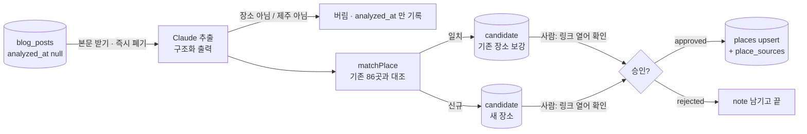

# 3. AI 분석 → 사람이 링크 확인 → 승인

> 최종 수정: 2026-10-02 (v17: 「근거 없음 재검색」 의 **빼는 쪽만 임시로** 들어갔다 — 신규·동반 근거 없음은 `noPetEvidence`(`recheck: null`). 재검색(결정 7 ①·②)은 아직이다 · 분석 순서는 제목이 한 가게 후기로 보이는 글 먼저([data-pipeline v32](../architecture/data-pipeline.md)))
> 이전 2026-10-01 (v16: 분석이 차단 목록 `place_blocks` 를 읽는다 — 제외 이유 `blocked`, 표가 없으면 경고 한 줄 · [09](09-admin-pipeline-stages.md) T1.2)
> 이전 (v15: 교차검토(ADR-019 v5) — 재검색의 **요약문 확인 단계를 뺐다**(검색어가 만든 동거라 근거가 아니다), 검색어는 둘,
> 대조 뒤에 돌고, `recheck` 가 표식을 이긴다. 교차점검의 **인용 대조(`quoteInBody`)는 구현됨**)
> 이전 (v14: **「근거 없음 재검색」 할 일을 더했다(제안, 코드 없음)** — 교차점검이 `동반 근거 없음` 을 내면 업체명으로
> 블로그를 한 번 더 찾고(최대 3건), 그래도 없으면 후보에서 빼 `analysis.excluded` 에 남긴다. 결정·검증 계획은 [ADR-019](../decisions/ADR-019-ai-cross-check-and-address-rules.md) 결정 7·8)
> 이전 (v13: **공식 홈페이지 카드** — 대조 뒤에 이름 축이 준 `link` 가 업체 사이트면 한 번 읽어 `extracted.homepage`
> `{ url, siteName, image }` 로 남긴다(`homepageCard.mjs`, 끄려면 `--no-homepage`). 쌓인 pending 후보는 `pnpm data:homepage` 로 채운다)
> 이전 (v12: **Claude 를 두 번 부른다** — 추출 뒤에 「교차점검」 패스가 붙었다([ADR-019](../decisions/ADR-019-ai-cross-check-and-address-rules.md)).
> 동반 조건 문장이 **없는** 후보를 묶어 글 하나당 한 번, "강아지를 데리고 들어간 근거가 본문에 있나" 를 다시 묻는다 —
> 추출 패스는 "반려견 동반 여행기" 를 전제로 읽어 강아지를 두고 들른 일반 카페도 장소로 뽑았다(실측: pending 58건 중 조건 문장 없는 것 28건).
> ⚠ **`--limit` 을 절반으로 본다** — 글마다 호출이 최대 한 번 더 늘었다. 끄려면 `--no-verify`, 모델은 `VERIFY_MODEL`.
> 주소 표기 대조는 **AI 가 아니라 규칙**으로 갔다(`src/lib/addressMatch.ts`) — 실측 43쌍 중 39쌍이 `제주특별자치도`↔`제주` 뿐이었고,
> 지번↔도로명은 조회해야 아는 것이라 모델이 지어낸다)
> 이전 (v11: **검수 창이 앱 안 `/admin` 으로 옮겨졌다**([ADR-018](../decisions/ADR-018-in-app-admin-review.md)) — 「사람의 승인」 표의 '지금' 이 `/admin` 이고
> '다음' 으로 예고했던 줄은 그것으로 실현됐다. **🙋 "draft 를 생략하고 바로 published 로" 가 닫혔다** — `/admin` 의 승인은 곧바로 `published`(완성도 게이트가 draft 단계를 대신한다)이고,
> `pnpm data:apply` 는 그대로 `draft` 다. "Studio 로 먼저 몇 주 돌려 보고 화면을 만든다" 는 문단은 지웠다 — 첫 160건이 그 몇 주를 앞당겼다)
> 이전 (v10: **첫 실행 실측 + 설계 검토 반영.** 사용자가 키 없이 돌린 첫 `data:analyze`(글 50건 → 후보 160건, 14:16~14:31)를 읽어 보니 — 좌표 보강 0건 ·
> 목록 글 하나가 101건 · 자사 홍보 블로그의 같은 펜션 13건 · 조건 문장 있는 32건 중 정규식이 20건을 못 읽음 · "애견동반 안됩니다" 카페가 후보 · 빈 조건이 '갈 수 있어요'(BUG-008).
> 그래서 [ADR-017](../decisions/ADR-017-ai-structured-pet-policy.md): 구조화는 AI(`petPolicy`), 정규식은 시드·안전망. 추출 필드 `visited`·`petAllowed`·`stayPriceText`·`stayAmenitiesText`,
> `blog_posts.analysis`, `nameKey`/`dupOf`, `--max-per-blog 2`, `--dump`, **`pnpm data:review`**, 반영 게이트(지역 필수 · ask 재대조는 사람에게), 마이그레이션 `20260928150000`.
> 워크플로 검토 45건 중 검증 31건 반영, 14건은 검증자 한도 실패로 미검증(RP-1·RP-2·RP-3·RP-4·FF-8·FF-10·NQ-1·NQ-2·NQ-10·NQ-12 는 실측과 겹쳐 함께 반영, FF-9·FF-11·FF-12·NQ-11 은 보류))
> 이전 (v9: **셀프 리뷰 반영** — 되울림 검사가 **도로명 안의 숫자**에 걸려 도로 중심점을 통과시켰다(`김녕로2길 2` 를 물으면
> `김녕로2길` 이 "2" 를 담고 있다). 제주 도로명은 숫자가 박힌 것이 흔해(실측 표 5행 중 3행) 드문 경우가 아니었고,
> `addressElements` 가 안 읽히는 분기에서는 그게 유일한 방어라 **두 겹이 0 겹이 됐다.** 이제 **번호 토큰 자체**를 대조한다.
> 함께: 쉼표 토큰화("관덕로 8, 2층" 의 번호를 못 찾았다 — 본문 주소의 표준 표기다) · 숫자 행정동(오라2동) · 모호성을 **쌍마다**(별 모양이면 지름 180m 통과) ·
> `longName: ''` 에서 shortName 으로 물러서기 · 200 인데 JSON 이 아닐 때 **본문 조각이 로그로 나가던 것** · 게이트웨이 `errorCode` 를 숫자로 가두기 ·
> `Invalid…` 를 `missing` 보다 먼저 보기(오라클이 거꾸로 붙었다) · `chance` 를 검색 키 있을 때만 세기. 회귀 테스트 11개 — naverGeocode 55 · 전체 566)
> 이전 (v8: **주소 → 좌표 축을 구현했다**(`scripts/analyze/naverGeocode.mjs` · `lib/naverMapsApi.mjs` · 55 테스트, 전체 566).
> 이름 축이 좌표를 못 붙인 후보에만 붙고, **키는 검색 것이 아니라 Maps Application 의 `NAVER_MAP_CLIENT_ID`·`NAVER_MAP_CLIENT_SECRET`** 이다.
> 조사에서 나온 함정 넷을 코드·테스트에 박았다: `totalCount>0` 은 채택 근거가 아니다(거친 주소가 **구 중심점**을 status OK 로 준다) ·
> `addressElements` 는 9칸이 **항상** 오고 없는 성분은 `longName: ""` 다 · 문서 표는 `type` 인데 예제는 `types` 다 · `errorMessage` 는 200 에도 `""` 로 온다.
> **이름 축과 달리 401/403/429 가 fatal 이 아니다** — 이 축은 더하기만 하므로 죽으면 어제까지의 동작으로 돌아갈 뿐이다.
> 5곳은 손대지 않았다(영업 확인이 먼저다). 응답은 우리 키로 아직 못 봤다 → README 의 ⚠️3)
> 이전 (v7: **주소 → 좌표(Geocoding) 갈래를 TODO 로 넣었다** — 지금 보강은 이름이 축이라 이름이 안 맞으면 좌표가 영영 없는데,
> 추출 스키마엔 `address` 가 이미 있다. 좌표 미확보 5곳의 주소를 후기에서 실측해 박아 뒀다(재도출 금지))
> 이전 (v6: self-cr 반영 — 네이버 **429 도 실행을 세운다**(쿼터를 `data:collect` 와 나눠 쓴다), 좌표 보강 **요약 한 줄**을 실행 끝에(첫 실행이 곧 `mapx`/`mapy` 포맷의 실측이라 탈락 사유를 갈라 센다))
> 이전 (v5: JWT expiry 가 **43200** 이 돼 세션 창은 11.5시간 — `--limit` 을 나누는 이유가 세션 창에서 **구독 5시간 한도**로 바뀌었다)
> 이전 (v4: **(c) Actions 폐지** — `data:analyze`·`data:apply` 는 사용자 터미널의 운영자 세션에서 따로 부른다. Claude 인증은 이 머신의 `claude` 로그인뿐
> (`CLAUDE_CODE_OAUTH_TOKEN`·`CI`·`GITHUB_ACTIONS` 를 자식 env 허용 목록에서 뺌). `DEFAULT_LIMIT` 의 근거는 Actions timeout 이 아니라 **세션 창**(그때는 3600 이라 30분))
> 이전 (v3: 코드 완료 — 본문 파서·Claude 추출(`claude -p`, 구독)·Kakao 보강·`matchPlace` 본체·`data:analyze`·`data:apply`·Actions. 실행은 수집(02) 뒤. 리뷰 지적 반영: 자동 승인 기본 off, Kakao 정확 일치만, 읍·면 목록, 영구 실패 닫기, 재대조)
> 이전 (v2: `matchPlace` 골격 상태 갱신 — 신호 헬퍼·임계값 상수·테스트는 있고 본체는 아직 🙋)
> 이전 (v1: 신설)
> 상태: **코드는 끝났다.** 실제 글로는 아직 안 돌렸다(`blog_posts` 가 비어 있다 — 02 의 네이버 키가 먼저). 실제 후기 링크 1건으로 본문 → 추출 → 대조까지 엔드투엔드는 확인했다. 선행: [02](02-collect-naver-blog.md). 입력은 `blog_posts`, 출력은 `candidates` → 승인되면 `places`. 실행 주체는 사용자 터미널(스케줄 없음).

## 역할 분담 — AI 는 뽑고, 사람은 열어 보고, 코드는 병합한다



## AI 추출 — `scripts/analyze-candidates.mjs` (`pnpm data:analyze`)

**Claude 는 API 키가 아니라 구독으로 부른다(2026-09-21 결정).** `scripts/analyze/extractPlaces.mjs` 가 `claude -p --json-schema` 를
자식 프로세스로 돌린다. 인증은 **이 머신에 로그인된 `claude`(키체인)뿐**이다 — 토큰 env 도 코드의 키도 없다(2026-09-22 (c): 옛 Actions 용
`CLAUDE_CODE_OAUTH_TOKEN` 은 발급하지 않고, 자식 env 허용 목록에서도 뺐다. 그 env 로만 인증되는 머신에서는 auth(fatal) 로 멈추는 것이 **의도**다).
왜 — 구독 OAuth 토큰은 Claude Code 전용이라 Messages API SDK 에 못 쓰고, 글당 과금이 0 이 된다. 대신 **세션 한도(5시간 창)를 대화와
공유**한다: 대량 처리는 `--limit` 로 나눈다.
`--system-prompt` 로 기본 프롬프트를 대체하고 `--tools "" --strict-mcp-config --setting-sources "" --disable-slash-commands` 로 레포
컨텍스트를 전부 끈다 — 안 끄면 호출마다 CLAUDE.md·MCP 툴 목록이 실려 3~4만 토큰, 끄면 1천(실측). `--bare` 는 못 쓴다(키체인·OAuth 를 안 읽는다).

**한 실행의 크기는 두 창이 정한다** — Claude 의 5시간 한도와 **운영자 세션 창**. 세션은 `pnpm data:login` 의 JWT 라 실효 창은 대시보드 JWT expiry 에서
코드 skew(30분)를 뺀 값인데, 2026-09-22 사용자가 expiry 를 3600 → **43200** 으로 올려 창이 **11.5시간**이 됐다 — 이제 좁은 쪽은 세션이 아니라 **구독 5시간 한도**이고,
`--limit 30` 씩 나누는 이유도 그것이다(3600 이던 시절엔 창이 30분이라 `DEFAULT_LIMIT`(50)이 다 들어간다고 장담할 수 없었다).
중간에 세션이 죽으면 그 글부터 DB 쓰기가 실패해 건너뛰고(`analyzed_at` 안 찍힘) 다음 실행이 이어 간다. 옛 근거(Actions `timeout-minutes: 30`)는 워크플로와 함께 사라졌다.

- [x] 모델 기본 `claude-opus-5`(`ANALYZE_MODEL` 로 덮음), 구조화 출력은 `--json-schema`(결과 JSON 의 `structured_output`).
      사고(thinking)는 CLI 가 모델에 맞게 알아서 — 코드에 없다.
- [x] 한 글 → 장소 **0~N개**. 여행기 하나에 카페 셋이 나온다. 스키마는 배열이다.
- [x] 본문은 데스크톱 `PostView.naver`(`scripts/analyze/naverPostBody.mjs`). 에디터 세대가 셋이다 — SmartEditor ONE(`.se-main-container`) ·
      SE3(`.__se_component_area`) · 구 에디터(`#postViewArea`). 컨테이너를 못 찾으면 `''` → 그 글은 "분석 불가" 로 닫는다.
- [x] 추출 필드 = `TPlace` 의 부분 + 근거:
  ```
  { name, type: 'stay'|'restaurant'|'cafe'|'other', regionRaw?, address?, petPolicyText?, features?,
    isJeju: boolean, evidence: string[] /* 본문 인용 1~3문장 */, confidence: 0..1 }
  ```
  - **`petPolicyText` 는 원문 문장**이다("소형견만 실내 가능, 대형견은 테라스"). 구조화(무게·마릿수)는 하지 않는다 —
    그건 `parsePetPolicy()` 의 일이고, 두 벌이 되면 어긋난다([pet-policy-and-eligibility.md](../architecture/pet-policy-and-eligibility.md)).
  - `evidence` 가 사람 확인의 핵심이다. 링크를 열었을 때 **어디를 보면 되는지**를 알려 준다.
  - `type: 'other'` · `isJeju: false` 는 후보를 만들지 않고 `analyzed_at` 만 찍는다.
- [x] 시스템 프롬프트는 고정 문자열(`--system-prompt`), 메타·본문은 stdin 으로 뒤에 → 호출 간 prefix 가 같다.
- ~~Batches API~~ — 구독 경로엔 없다. 첫 1년치는 `--limit` 로 나눠 여러 번 돌린다(세션 한도).
- 🙋 **모델**: 구독이라 글당 비용은 0 이고 차이는 한도 소모뿐. 기본 `claude-opus-5`. `ANALYZE_MODEL=claude-haiku-4-5` 로 바꿔 품질을 비교해 볼 수 있다.
- [x] 좌표·주소 보강은 **네이버 지역 검색**(`scripts/analyze/naverLocal.mjs`, `NAVER_CLIENT_ID`·`NAVER_CLIENT_SECRET` 선택 — 02 수집과 같은 키). `title` 이
      후보 이름과 **정규화 후 완전 일치**할 때만 채택한다 — 부분 일치(0.7)를 받으면 "고기부엌" 에 "협재고기부엌" 좌표가 실려 그대로
      `places` 에 쓰인다(리뷰에서 재현). 없으면 좌표를 비워 둔다(지어내지 않는다). 키가 401/403 이면 실행을 세운다 — 조용히 이름만으로
      대조하면 동명 가게가 `ask` 대신 `auto` 로 올라간다. **429(쿼터 소진)도 같은 이유로 세운다**(self-cr 지적): 검색 API 는 일 25,000 호출
      상한을 `data:collect` 와 **나눠 쓰므로** 한 번 소진되면 그날 남은 전 건이 좌표 없이 대조된다 — 일시 장애처럼 흘려보내면 401/403 을
      세우는 이유가 그대로 재현되는데 실행만 안 멈춘다. 주소 → `regionRaw` 는 기존 86곳의 읍·면→방향 표에서 추론(`inferRegionRaw`).
- [x] **두 번째 갈래: 주소 → 좌표(NCP Geocoding)** — `scripts/analyze/naverGeocode.mjs`, 규격은 `scripts/lib/naverMapsApi.mjs`.
      이름 축이(위 항목) 좌표를 못 붙인 후보에만 붙는다. 추출 스키마의 **`address`**(`extractPlaces.mjs` 의 `EXTRACT_SCHEMA`)를 쓰므로
      본문에 주소가 적혀 있으면 이름이 안 맞아도 구제된다. 이게 이 TODO 의 본론이었고, 아래 5곳은 그 부수 효과다(그리고 **닿지 않는다** — 맨 아래).

      **키가 다르다.** `NAVER_MAP_CLIENT_ID`·`NAVER_MAP_CLIENT_SECRET`(NCP 콘솔의 **Maps** Application) — 검색 키
      (`NAVER_CLIENT_ID`/`SECRET`, API HUB)가 **아니다**. 헤더 이름은 같고 값만 다르니 섞으면 그냥 401 이라, env 이름을 갈라 둔 것이 유일한 방어다
      (BUG-006 이 같은 함정이었다). 둘 다 없으면 이 축은 꺼지고 이름 축만 돈다.

      **이름 축과 실패 정책이 반대다 — 401/403/429 가 fatal 이 아니다.** 이름 축을 세우는 이유는 "좌표 없이 대조하면 동명 가게가 ask 대신 auto
      로 올라간다" 였다. 이 축은 **이미 좌표가 없는** 후보에만 붙으니 죽어도 결과가 어제까지의 동작으로 돌아갈 뿐 그 아래로 내려가지 않는다
      (`matchPlace` 는 값 없는 신호를 감점 없이 건너뛴다). 세우면 **더하기만 하는 기능이 잘 돌던 파이프라인을 죽이는 새 통로**가 된다.
      대신 그 실행 동안 축을 내리고(`geocodeAxisOff`) 한 번만 크게 찍는다 — 남은 건마다 같은 실패로 쿼터를 더 태우지 않으려고.

      **`totalCount > 0` 을 채택 근거로 쓰지 않는다**(2026-09-28 조사에서 나온 가장 중요한 함정). 거칠거나 잘린 주소는 시끄럽게 실패하지 않고
      **행정구역 중심점을 `status OK · totalCount 1` 로** 준다(실측: "서울특별시 금천구" → 구 중심점, 건물번호는 `""`). 제주 범위 박스도 이걸 못 거른다 —
      읍 중심점은 제주 안이다. 그래서 방어가 두 겹이다:
      1. **호출 전**(`addressSpecificity`) — 도로명·지번 이름 + **그 뒤의 번호** + 제주. "제주시 애월읍" 은 호출조차 하지 않는다(쿼터도 아낀다).
      2. **호출 후**(`addressElements` 의 `BUILDING_NUMBER`·`LAND_NUMBER` 가 비지 않았는지) — 응답이 스스로 "행정구역까지만 풀렸다" 고 말하는 자리다.
      같은 엔드포인트를 운영에 쓴 제3자도 "시도·도로명·건물번호가 일치하는 단일 결과" 만 받는 같은 규칙에 이르렀다.
      셋째 겹으로, 한 주소가 여러 점으로 풀렸을 때 **그중 어느 두 점이라도 100m 넘게 떨어져 있으면** 아무것도 쓰지 않는다
      (첫 점 기준이 아니라 **쌍마다** — 별 모양으로 재면 89m·89m 인데 서로 178m 인 세 점이 통과한다). `matchPlace` 의 `GEO_NEAR_M` 이 100m 라 그 차이가 판정을 가른다.

      ⚠️ **되울림 검사는 번호 토큰 자체를 본다**(v9 에서 고쳤다). 숫자 경계로만 보면 물어본 번호가 **도로명 안의 숫자**에 걸려
      도로 중심점이 통과한다 — `김녕로2길 2` 를 물었을 때 `김녕로2길` 이 "2" 를 담고 있다. 그리고 그 통과는
      `addressElements` 를 못 읽는 분기(일부러 채택 쪽으로 물러서는 자리)에서 **유일한 방어를 뚫는다.**

      **응답 모양에서 확인된 것**(공식 문서 + 제3자 실제 캡처 2건 + 자격증명 없는 라이브 프로브):
      `x`=경도 · `y`=위도, **도(度) 단위 소수 문자열**(지역검색의 `mapx`/`mapy` 와 달리 10^7 배가 아니다) · `addressElements` 는 **9칸이 항상 오고
      없는 성분은 `longName: ""`**(칸의 존재는 아무 증거가 아니다) · **문서 표는 `type`(단수)인데 예제는 `types`(배열)** 라 코드가 둘 다 읽는다 ·
      `errorMessage` 는 **200 OK 에도 `""`** 로 와서 에러 신호로 쓸 수 없다 · REST 는 평평하고 `v2` 로 감싸는 것은 브라우저 SDK 다(감싸여 와도 풀어 준다).
      그래도 파서는 지역검색과 **공유**하고 최종 판별은 제주 범위 검사다 — 포맷이 어느 쪽이어도 틀린 좌표가 들어가는 대신 "좌표 없음" 이 된다.

      **후보에 `geoSource` 가 붙는다**(`'local'` | `'geocode'` | `null`). Studio 에서 사람이 볼 단서다 — `'geocode'` 는 "그 주소의 점" 이라 건물은 맞지만
      **그 가게가 지금 그 건물에 있다는 보증은 아니다**. `naverLink`·`category` 는 이 축에서 항상 `null` 이다(Geocoding 은 업체를 모른다).
      판정(`matchPlace`)에는 축을 쓰지 않는다 — 축마다 가중치를 달리 두면 임계값이 두 벌이 된다.

      🙋 **다만 구간(tier) 의미가 한 군데 움직였다**(리뷰가 짚었다). 두 축은 **다른 것을 확인한다**: 이름 축은 *장소가 같음*(완전 일치)을,
      주소 축은 *AI 가 읽은 문자열이 한 점으로 풀림*을 확인한다. 그래서 **이름이 부분 일치(0.7)라 좌표가 없어 `ask` 에 머물던 후보**가
      이제 거리 가점(+0.15)을 받아 `0.85` = `auto` 로 올라갈 수 있다. 지금은 `AUTO_APPROVE=false` 라 전부 `pending` 이고 사람이 보므로 위험이 없다 —
      **`AUTO_APPROVE` 를 켤 때 이 자리를 다시 본다.**
      - **왜 추정이 아닌가**: 도로명주소는 좌표를 유일하게 정한다. ADR-008 의 "좌표를 지어내지 않는다" 와 충돌하지 않는다 —
        반대로 **동명 가게의 좌표를 이름만으로 가져오는 쪽**이 지어내는 것이다(그래서 이름 축이 완전 일치만 받는다).
      - **API**(2026-09-28 조사로 확정 · 정본은 `scripts/lib/naverMapsApi.mjs`): `GET https://maps.apigw.ntruss.com/map-geocode/v2/geocode` ·
        헤더 `x-ncp-apigw-api-key-id` + `x-ncp-apigw-api-key`(**대소문자 무관** — HTTP/1.1 로 소·대·혼합을 각각 보내 셋 다 파싱됐다. HTTP/2 는 헤더를
        강제로 소문자로 내리므로 HTTP/2 실험은 아무것도 증명하지 못한다) · `Accept: application/json` 은 문서가 요구한다.
        자격증명은 **지금 지도가 쓰는 그 Maps Application 의 Client ID/Secret**(새 앱·새 계정이 아니다). 단 `NEXT_PUBLIC_NAVER_MAP_KEY_ID` 는
        그 **Client ID 만**(브라우저 공개값)이라 재사용할 수 없다 — REST 는 Secret 이 필요하다. `ncpKeyId` 는 JS SDK **쿼리 파라미터** 전용이고
        REST 헤더로 보내면 게이트웨이가 자격증명으로 알아보지도 못한다(실측).
        콘솔 Maps Application 에 **Geocoding 체크**가 필요하다 — Dynamic Map 미체크 때 429 가 나던 그 자리다(→ [ADR-008](../decisions/ADR-008-map-provider.md)).
        게이트웨이 번호로도 읽힌다: **210=권한 없음 · 400=한도/미체크**(`lib/naverApiError.mjs` 의 표).
        ⚠️ **옛 호스트 `naveropenapi.apigw.ntruss.com` 도 지금 라우팅된다** — 자격증명 없이 찔러 보면 두 호스트가 바이트까지 같은 401 을 준다.
        그래서 "옛 호스트는 죽었다" 는 확인할 수 없고, 온라인 예제 대부분이 옛 호스트를 쓴다. 전환 공지·날짜는 없다.
        키를 안 늘리는 길도 있다: 지도 JS SDK 의 `submodules=geocoder`(`naver.maps.Service.geocode`)는 **클라이언트 키로 브라우저에서** 돈다 — 5건짜리 일회성엔 그게 싸다.
      - 🚩 **약관 자리는 그대로**다 — NCP Maps 약관 제7조 ⑪ 이 "지도 좌표 데이터" 의 별도 저장을 금지하고, Geocoding 결과를 `places.geo` 에 굽는 것도 같은 자리다
        (트래커의 🚩 — 네이버 기준으로 진행하기로 이미 결정된 항목이라 새 결정이 아니다).
      - **좌표 미확보 5곳**: 엔트리가 사라져 이름으로는 영영 안 되지만(→ [data-pipeline](../architecture/data-pipeline.md) 「왜 그 5곳인가」),
        **주소는 후기 본문에 다 있다**(2026-09-28 실측 — 다시 뽑지 말고 이 표를 쓴다):

        | 장소 | 후기에서 읽힌 주소 | 후기 날짜 |
        |---|---|---|
        | 요호르기 스테이 | 제주특별자치도 제주시 애월읍 상가로1길 11-15 | 2025-04-24 |
        | 미트타운 | 제주특별자치도 제주시 애월읍 일주서로 6935 1층 | 2024-06-24 |
        | 개떼목장 | 제주특별자치도 서귀포시 안덕면 평화로 486 | 2023-09-25 |
        | 브릭스제주 | 제주특별자치도 제주시 구좌읍 김녕로2길 6 1층 | 2024-04-20 |
        | 롯지먼트 | 제주특별자치도 제주시 구좌읍 김녕로1길 23 | 2024-03-10 |

      - ⚠️ **5곳은 좌표를 얻는 것이 답이 아닐 수 있다 — 영업 확인이 먼저다.** 플레이스 엔트리가 없고 후기가 1.4~3년 전이라 폐업이 의심된다.
        문 닫은 가게에 좌표를 넣으면 지도에 핀이 찍히는데, 그건 "좌표 없어 제외" 보다 **나쁘다**(가서 보니 없다). 폐업이면 `status` → `archived`.
      - **이 5곳의 원본 후기는 3,360건 수집분에 없다**(365일 창 밖 — 위 날짜가 이유다). 그러니 `data:analyze` 가 이 5곳을 저절로 채우는 일은 없다.
        다른 최신 글에 같은 가게가 나오면 그때 후보가 될 뿐이다.
      - **그래서 구현된 축은 이 5곳에 닿지 않는다** — 축은 `candidates` 를 만드는 경로에만 있고, 그 경로에 이 5곳이 들어오지 않는다.
        **남은 것은 코드가 아니라 결정이다**: 영업 확인(폐업이면 `archived`) → 살아 있으면 위 표의 주소를 Studio 에서 사람이 넣는다.
        위 표가 있으니 손으로 geocode 해 볼 수도 있지만(브라우저 SDK 로 5건), **영업 확인 전에 좌표를 넣는 것은 하지 않는다** — ⚠️ 항목 그대로다.
- [x] **좌표 보강 요약을 실행 끝에 한 줄 찍는다**(self-cr 지적) — `검색 N · 채택 N · 요청실패 N` + 탈락 사유(제주밖주소 / 좌표파싱실패 /
      좌표제주밖 / 이름불일치). **이 줄이 `mapx`/`mapy` 포맷의 실측 보고**다: 공식 문서가 스스로 모순돼(본문 WGS84, 예제는 옛 KATECH 6자리)
      실제 응답을 봐야 확정된다. 채택 0건이면 표본의 원시 `mapx`/`mapy` 를 함께 찍어 자릿수를 눈으로 보게 한다. 이게 없으면 "포맷이 틀렸다" 와
      "이름이 안 맞았다" 가 똑같이 `null` 로만 보이고, 운영자가 볼 단서는 "후보 N건" 뿐이다(→ [README 의 ⚠️ 미검증 1](README.md)).
  - ⚠️ **제주 범위 검사가 못 거르는 것 하나 — datum.** 범위 박스는 자릿수 오류(KATECH·10⁶·10⁸·lat/lng 스왑)를 전부 잡지만,
    **구 베셀 좌표가 도(度) 단위로 오면 박스 안이라 통과한다**(제주에서 WGS84 와 수백 m 차이). `matchPlace` 의 `GEO_NEAR_M` 이
    100m 라 이게 판정을 갈라 버린다. 증상: **채택은 0이 아닌데 기존 장소와의 거리가 일관되게 300~400m** 로 나온다.
    요약 줄에 거리 분포가 없어 지금은 자동으로 안 보이므로, 첫 실행 때 Studio 에서 몇 건을 눈으로 대조한다(self-cr 검증 패스 지적).
- [x] 실패 분류(`analyze-candidates.mjs`): 다시 받아도 같을 실패(본문 **404/410**·컨테이너 없음·`blog_id/log_no` 없음·모델이 스키마 재시도를
      소진하거나 턴 초과)는 `analyzed_at` 을
      찍어 **닫는다** — 안 닫으면 매 실행 `--limit` 창을 잠식하며 영원히 재시도한다. 단 닫기는 **루프 끝에, 그 실행에서 성공한 글이 1건 이상일 때만**
      — 전부 "분석 불가" 면 글이 아니라 파이프라인(에디터 구조 변경·차단 페이지) 문제라 아무것도 닫지 않고 exit 1. 403(차단)·5xx·한도·타임아웃·
      DB 쓰기 실패는 비워 둬 재시도. 인증 실패·CLI 없음·Claude API 4xx(모델명 오타)·네이버 키 오류(401/403)는 나머지 글도 같으므로 루프를 끊고 exit 1.

### 교차점검(두 번째 Claude 패스) — `scripts/analyze/verifyPlaces.mjs`

추출이 끝난 뒤, **동반 조건 문장이 없는 후보**만 묶어 한 번 더 부른다. 묻는 것은 하나다 —
"글쓴이가 이 장소에 강아지를 데리고 들어갔다는 근거가 본문에 있나?" 왜 필요한지와 왜 호출을 한 번 더 하는지는
[ADR-019](../decisions/ADR-019-ai-cross-check-and-address-rules.md).

- [x] 게이트는 `needsDogCheck`(조건 문장 유무)뿐이다. 제외될 장소(제주 아님·`other`·동반 불가)는 넣지 않는다 —
      버릴 것에 근거를 물어 봐야 결정이 안 바뀐다.
- [x] **글 하나당 한 번.** 그 글의 대상 후보 이름을 목록으로 실어 한 호출에서 다 받는다.
- [x] 판단은 `{ petAllowedHere: yes|no|unclear, dogWasThere, quote, why }` → 후보의 `extracted.verify`.
      **근거 문장(`quote`) 없는 `yes` 는 `unclear` 로 내린다** — 프롬프트가 금지한 조합이고, 통과시키면 지어낸 확인이 검수자에게 간다.
      **본문에 없는 `quote` 도 같다**(`quoteInBody`, ADR-019 v5) — 글자·숫자만 남겨 대 보고, 없으면 인용을 비우고 `why` 끝에 남긴다.
      모델이 빠뜨린 장소는 `missingVerdict()` 로 채운다(점검 안 함과 **섞지 않는다**).
- [x] **버리지 않고 표식만 단다.** 자동 반려는 조용하다 — `/admin` 의 걸러 보기('동반 근거 없는 것만')로 모아 일괄 반려한다.
      → `동반 근거 없음` 갈래는 재검색 뒤 빼는 것으로 **번복 예정**(아래 「근거 없음 재검색」, ADR-019 결정 7).
- [x] 실패는 글을 버리지 않는다. 주소→좌표 축과 같은 정책이고(이 패스도 더하기만 한다) 한 번 실패하면 그 실행 동안 패스를 내린다.
      인증·CLI 없음(fatal)만 루프를 끊는다.
- [x] 계량기를 **따로** 센다(`Claude 교차점검 N회 …` 가 요약 아래 줄에). 합쳐 세면 구독 5시간 한도를 무엇이 태웠는지 가릴 수 없다.
- [x] 요약 한 줄에 `교차점검 N건(근거 없음 · 동반 불가 정황 · 실패)`. **점검 수와 갈래를 같이** 적는다 — `근거 없음 0` 만 적으면
      "전부 근거가 있었다" 와 "패스가 안 돌았다" 를 구별할 수 없는데 운영자가 할 일은 정반대다.
- 🙋 **이미 쌓인 후보 218건은 이 점검을 못 받는다.** 본문을 다시 받아 교차점검만 돌리는 `--reverify-pending` 이 필요하다.

### 근거 없음 재검색 — 제안 (2026-10-01, [ADR-019](../decisions/ADR-019-ai-cross-check-and-address-rules.md) 결정 7·8)

교차점검이 `동반 근거 없음` 을 낸 후보를 사람에게 그대로 넘기지 않고, **업체명으로 블로그를 다시 찾아** 정리한다.
네이버 공식 API(지역 검색·지도)에는 반려동물 칸이 없고, 플레이스 화면은 긁지 않기로 했다(ADR-019 「고려했다 버린 것」).
규칙·흐름도·검증 계획의 정본은 ADR-019 이고 여기는 할 일 목록이다.

**0. 먼저 확인 (사용자 터미널)**
- [ ] 🙋 블로그 글 PostView 에 **지도 카드**(이름·주소·플레이스 id)와 **태그**가 어떤 모양으로 오는지 — ADR-019 「검증 계획」 A 의 명령.
      결과를 ADR-019 에 적는다. 안 나오면 8-4·8-5 를 접는다.
- [ ] 🙋 이미 쌓인 pending 후보에도 돌릴지, 돌린다면 코드가 `rejected` 로 바꿀지 표식만 바꿀지(ADR-019 「열린 것」).
- [ ] 🙋 뺀 것 표본의 허용선(제안: 10건 중 1건 이하가 실제 동반 가능).

**1. 재검색 (결정 7)**
- [ ] 대상은 `동반 근거 없음` 하나뿐 — `null`(미점검)·`동반 확인`·`동반 불가 정황` 은 건드리지 않는다. **대조 뒤**에 돈다(`alreadyHave` 면 안 돈다).
- [ ] 블로그 검색 2회: `제주 <이름> 애견동반` · `제주 <이름> 반려견 동반`, `sort=date`, URL 로 합침. 원글 URL 제외.
- [ ] 같은 가게 글 고르기: `<b>` 벗긴 제목·요약문에 정규화 이름 **통째 일치**(부분 일치 거부) · 가게의 읍·면을 알 때, 요약문에 읍·면이 있는데 가게 것이 없으면 거부 · 최신 3건.
- [ ] 0건 → 뺀다. 1~3건 → **언제나 본문 단계**(요약문의 동반·금지 표현은 아무것도 정하지 않는다 — ADR-019 v5).
- [ ] 뺀 것은 `blog_posts.analysis.excluded` 에 `reason: 'noPetEvidence'` + `{ queries, hits, posts }`. **본문 인용은 넣지 않는다.** 지우지 않는다.
- [ ] 남는 후보는 `extracted.verify.recheck = { verdict, url, postdate, quote, promptVersion }` — 원글 판단은 그대로 두고 `verifyLabel`·`verifyView` 가 `recheck` 를 먼저 읽는다(`동반 확인(다른 글)`). CLAUDE.md 의 "넷" 을 "다섯" 으로.
- [ ] **실패는 빼지 않는다**(검색·본문·Claude 어느 것이든) — 지금처럼 `동반 근거 없음` 으로 남기고 그 실행 동안 재검색을 끈다.
- [ ] 스위치 `--no-recheck` · 계량기 `createUsageMeter('재검색')` · 요약 줄 `재검색 N건(확인 a · 불가 b · 뺌 c · 실패 d)`.

**2. 본문 정확도 (결정 8)**
- [ ] 8-1 이름 주변 창: 이름이 나오는 문단 ± 몇 문단, 글당 상한. 본문에 이름이 없으면 그 글을 버린다. 첫 추출(2만 자)은 그대로.
- [x] 8-2 인용 확인 함수(`quoteInBody`)는 교차점검에 들어갔다. 재검색은 같은 함수를 창에 대고 부른다 — 없으면 `none`.
- [ ] 8-3 최신순 + `postdate` 를 프롬프트에. 글끼리 갈리면 `split` → 불가 정황(사람이 고른다).
- [ ] 8-4 지도 카드로 같은 가게 확인(`sameAddress` 가 `different` 면 그 글 버림) — **0 의 확인 뒤**.
- [ ] 8-5 태그를 보조 정보로(태그만으로 `yes` 금지) — **0 의 확인 뒤**.

**3. 화면·검증**
- [ ] `/admin`: `동반 확인 — 다른 글` 을 원글 확인과 구별해 그리고 그 글 링크를 건다. 인용 문장은 [06 의 G](06-admin-review.md)(하이라이트) 대상.
- [ ] 단위 테스트 — ADR-019 「검증 계획」 B 의 목록.
- [ ] 표본 실측 — `pnpm data:analyze --limit 20 --dry-run` 덤프로 뺀 것 10건·확인 10건을 사람이 연다(「검증 계획」 C).
- [ ] 조용히 깨지는 것 — 키 없이·`--no-recheck` 로 돌려 아무것도 빠지지 않는지(「검증 계획」 D).
- [ ] 끝나면 ADR-019 결정 7·8 의 상태를 '구현됨' 으로, `docs/architecture/data-pipeline.md` 의 분석 절과 CLAUDE.md 표 줄을 고친다.

### 주소 표기 대조 — `src/lib/addressMatch.ts` (AI 아님)

후보의 두 주소(네이버가 준 것 ↔ AI 가 본문에서 읽은 것)를 **문자열로** 비교하던 것을 규칙으로 바꿨다.
실측 43쌍이 `same 39 / different 2 / unknown 2` 로 갈린다 — 경보가 40번 울려 남은 2번(검색이 동명의 다른
가게를 집은 것)을 아무도 보지 않던 상태였다. 분석 때 저장하지 않고 **화면이 그때그때 부른다** — 저장하면
이미 쌓인 218건은 영원히 옛 경보를 쓴다. 지번↔도로명은 `'unknown'` 으로 두고 참고로만 적는다(모델에게 묻지 않는 이유는 ADR-019).

### 공식 홈페이지 카드 — `scripts/analyze/homepageCard.mjs` (AI 아님)

사진을 **가져오지 않고** 업체가 공유용으로 내놓은 `og:image` 의 URL 만 링크 카드로 싣는다([ADR-002](../decisions/ADR-002-no-place-photos.md) v3).
collect 가 아니라 analyze 에 둔 이유 — 재료인 `link` 가 네이버 지역 검색(이름 축)에서 나오고, 그 검색은 분석만 한다.

- 판정·대조에 쓰이지 않는 '더하기만 하는' 값이라 실패해도 실행을 세우지 않는다(카드 없이 간다). 같은 link 는 한 실행에 한 번.
- `places.homepage_url` 이 없으면(마이그레이션 `20260930120000` 전) 카드를 끈다 — 카드 든 후보의 승인이 insert 에서 실패한다.
- [x] 분석 단계에서 읽기 · [x] 반영(`homepageColumns` — 세 칸을 한 벌로, 빈 곳에만) · [x] 상세 카드 · [x] `/admin` 에서 보고 고치기
- [x] 쌓인 pending 후보 채우기 — `pnpm data:homepage [--limit N] [--dry-run]`(세션 필요). 못 찾으면 `homepage: null` 로 닫아 다시 두드리지 않는다.
- [ ] 🙋 **실측 전** — 카드가 붙는 비율(지역 검색 `link` 가 업체 사이트인 비율)과 og:image 가 로고·배너인 비율. 첫 `data:homepage` 의 요약 줄이 그 값이다.

## 🙋 `matchPlace` — 기본안이 구현돼 있다. 가중치·임계값은 사용자가 조정한다

`scripts/analyze/matchPlace.mjs`. 후보가 기존 장소와 같은 곳인지. **틀리면 조용히 데이터가 썩는다** — 잘못 병합하면
사람이 쓴 설명이 덮이고, 잘못 신규면 같은 가게가 두 번 뜬다. 기존 계획 §4 의 그 자리다.

**구현된 기본안**(2026-09-21, 🙋 항목이었지만 기본값으로 채웠다 — 바꿀 자리는 `THRESHOLD`·`WEIGHT` 두 상수뿐):
- `naverPlaceId` 일치 → 1.0. 그 외 **이름이 축**이다: 정규화 이름 완전 일치 1.0 · 부분 포함 0.7 · 아니면 0 — **이름 신호가 0 이면
  다른 신호가 아무리 강해도 후보가 아니다**(평대반점↔평대코지카페 18m 를 좌표로 묶지 않는다).
- 이름 위에 보정: 좌표 100m 안 +0.15 · 2km 밖 −0.3(우도↔성산 16km) · 종류 다름 −0.1 · 읍·면 같음 +0.05 · 읍·면 다름 −0.2.
  값이 없는 신호는 감점 없이 건너뛴다(좌표 없는 5곳). 읍·면은 **제주 12개 읍·면 목록**으로만 본다 — 패턴으로 잡으면
  "함덕해물라면" 의 '면' 이 읍·면이 된다(리뷰에서 재현). 시(제주시·서귀포시)는 신호가 아니다.
- 그래서 생기는 구간: 이름 일치+100m 안 → 1.0 `auto` · 이름 일치+2km 밖 → 0.7 `ask` · 부분 일치+100m 안 → 0.85 `auto` ·
  부분 일치+종류 다름 → 0.6 `ask` · 이름 불일치 → 0 `new`.
- **자기충돌 검사**가 테스트에 있다: 86곳 각각을 후보로 만들어 나머지 85곳과 대조했을 때 `ASK` 를 넘는 쌍이 0 이어야 한다.
  깨지면 임계값을 올리지 말고 `nameSimilarity` 를 조인다.

**🙋 재대조의 경계값**: 부분 일치 0.7 + 100m 안 +0.15 = **정확히 0.85 = `AUTO_MERGE`** 이고 `apply` 의 재대조는 `≥` 다. 그래서 사람이
`new` 후보를 승인해도 이름이 부분만 겹치는 이웃 가게(100m 안)에 조용히 합쳐질 수 있다 — `AUTO_APPROVE` 와 별개 경로다. 리뷰에서는
"임계값 결정" 으로 분류됐다. 보수적으로 가려면 `GEO_NEAR_BONUS` 를 0.1 로 낮추거나 재대조에 `>` 를 쓴다.

**🙋 자동 승인은 기본 꺼져 있다**(`scripts/analyze/analyzeCandidates.mjs` 의 `AUTO_APPROVE = false`). `auto` 구간도 `pending` 으로
들어가고 `extracted.match.tier = 'auto'` 로 표시만 된다 — Studio 에서 `extracted->match->>tier = 'auto'` 로 걸러 한꺼번에 승인한다.
켜면 같은 잡의 `data:apply` 가 사람 확인 없이 `places` 를 고친다(빈 칸만이지만 좌표·주소·category 는 "빈 칸" 이라 그대로 들어간다).
86곳이라 사람 확인이 싸다는 전제로 보수적으로 시작한다 — 몇 주 돌려 보고 `auto` 가 한 번도 틀리지 않으면 그때 켠다.

**실제 데이터에서 찾은 함정**(테스트 케이스로 남겨 뒀다):
- 평대반점(별칭 바당반점) ↔ 평대코지카페 — 좌표 18m 차이. 좌표만으로 묶으면 오병합.
- 제이아일랜드 ↔ 아오오 — 좌표 40m 차이. 역시 좌표 단독 판정 위험.
- "카페살레" 가 "살레" 로만 오는 경우 — 이름 정규화가 부분 문자열까지 다뤄야 하는지가 쟁점.
- 좌표가 아예 없는 5곳(01 의 미확보 목록과 동일) — 좌표 기반 신호가 통하지 않는다.

테스트: `matchPlace.test.mjs` — 실제 86곳으로 위 함정 전부 + 우도 vs 본섬 동명(카페살레) + 좌표 없는 5곳 + 자기충돌 검사. `skip` 없음.

## 사람의 승인 — 어디서 하나

| 단계 | 도구 | 만들 것 |
|---|---|---|
| **지금** | **앱 안 `/admin`**(2026-09-29) | 후보 묶음 카드 · 원글 링크와 인용문 · 조건 미리보기 · **맞아요 / 반려하기**. 맞아요 한 번이 `approved` → `places` 반영 → `merged` 까지 밟고 **신규 장소는 곧바로 `published`** 다(아래 🙋 닫힘). 로그인은 운영자 계정, 12시간마다 다시. 무엇이 보이고 버튼이 무엇을 쓰는지는 [features/admin-review.md](../features/admin-review.md), 결정은 [ADR-018](../decisions/ADR-018-in-app-admin-review.md), 진행은 [06](06-admin-review.md) |
| 그대로 | **`pnpm data:review`**(2026-09-28) | `list`(기본) — pending 을 같은 가게로 묶어 검수 순서대로: `■ 이름 [종류 · 구간 · AI 0.93 · 글 2] 지역 좌표 ⚠표식` / `id …` / `조건: 정규식 [..] · AI [..] · 앱 [..] ⚠ AI≠정규식`. `--verbose` 로 원문·evidence, `--md 경로` 로 파일. `approve <id앞자리…> [--merge-into <placeId>] [--note]` · `approve --tier auto` · `reject <id…> --note "이유"`. `status` — 후보·글·장소 수와 **published 대기 draft 의 빈 칸**. 검수 순서는 `reviewCandidates.mjs` 의 `reviewPriority`(🙋 사용자가 다듬는 자리). |
| 그대로 | Supabase Studio 표 편집기 | `candidates` 를 열어 `post_url` 클릭 → `extracted.evidence` 와 대조 → `status` 바꾸고 `reviewer_note`. **`ask` 후보가 신규가 맞다면 `match_place_id` 를 비운 뒤 approved 로** — `data:apply` 는 `match_place_id` 가 있으면 그것을 믿고 병합한다. `extracted` 의 `petPolicyText`·`regionRaw`·`petPolicy` 는 승인 전에 손으로 고쳐도 된다. |

v10 의 표에는 `| 다음 | 앱 안 /admin | … **이때 처음으로 앱 번들에 Supabase 가 들어간다** → 05 의 anon key 항목이 살아난다 |` 행이 있었다.
**그대로 일어났다**(2026-09-29). publishable 키와 프로젝트 호스트가 번들에 들어갔고, [05](05-security.md) 의 「관리 화면을 만들게 되면」 절이 살아났다.
유출 검사의 `supabase.co` 전면 차단은 **우리 호스트만 허용**으로 좁혔다(다른 프로젝트로 새는 오타는 계속 잡는다).

세 도구가 같은 후보를 본다. 셋이 다른 규칙으로 `places` 를 쓰면 데이터가 조용히 오염되므로,
`/admin` 은 `apply-approved.mjs` 의 순수 모듈(`matchPlace`·`mergeIntoExisting`·`toNewPlaceRow`)을 **그대로 import** 한다 — 옮겨 적지 않는다.

## 승인 → `places` 반영 — `scripts/apply-approved.mjs` (`pnpm data:apply`)

- [x] `status='approved'` 후보를 읽어:
  - `match_place_id` 있음 → 기존 행에 **빈 칸만 채운다**(`mergeIntoExisting`). 사람이 쓴 `features`·`petPolicyText` 를 AI 가 덮지 않는다.
    다른 값이 필요하면 `reviewer_note` 에 적고 Studio 에서 손으로 고친다. **archived 장소에는 병합하지 않는다**(실패로 남겨 사람이 본다).
  - 없음 → 분석 때 `tier` 가 `new` 였던 후보만 현재 `places`(방금 만든 draft 포함)와 **다시 대조**해 `AUTO_MERGE` 이상이면 보강으로 돌린다 —
    같은 새 가게를 말하는 글 둘이 따로 승인되면 분석 시점엔 서로 몰라 둘 다 '신규' 이기 때문이다. `auto`/`ask` 였는데 `match_place_id` 가
    비어 있으면 **사람이 비운 것**이라 재대조 없이 신규로 존중한다. 재대조는 분석 때와 같은 지역 신호(`extracted.regionRawAi`)를 본다.
    아니면 `source='blog'`, `status='draft'` 로 insert.
    **`published` 는 사람이 Studio 에서 올린다** — 이 스크립트는 그대로다.
    ~~🙋 여기서 바로 `published` 로 갈지~~ → **닫혔다**(2026-09-29, [ADR-018 §4](../decisions/ADR-018-in-app-admin-review.md)): **화면에서 승인한 것만** 곧바로 `published` 다.
    갈라 둔 이유는 `draft` 단계의 뜻이 "사람이 한 번 더 본다" 였고, `/admin` 에서는 그 한 번이 버튼을 누르기 직전에 이미 일어나기 때문이다 —
    종류·이름·지역(`parseRegion` 통과)이라는 완성도 게이트가 버튼 앞을 막고, 못 넘으면 이유와 최소 편집(지역 고르기)만 보여 준다.
    CLI 에는 그 눈이 없으므로 `draft` 를 유지한다. 두 경로의 차이는 [data-pipeline 의 상태 머신](../architecture/data-pipeline.md#후보의-상태-머신) 표에 있다.
  - `place_sources` 에 링크 추가(출처 추적용). 화면의 "후기 링크" 는 여전히 `places.review_url` 하나뿐이라 보강된 기존 장소에는 새 글이
    화면에 닿지 않는다 — 여러 출처 표시는 기능 변경이라 범위 밖(04 의 "앱 코드 변경").
- [x] 처리한 후보는 `status='merged'`. `--dry-run` 이면 아무것도 쓰지 않고 할 일만 찍는다.
- [x] 이 스크립트는 **DB 웹훅이 아니라 사람이 부른다** — 사용자 터미널에서 `pnpm data:analyze` 다음에 `pnpm data:apply` 를 **따로**(2026-09-22 (c). 옛
      Actions 에선 `if: !cancelled()` step 이었다). 별개 명령이라 분석이 실패해도 승인된 것의 반영은 막히지 않는다 — 그 이유는 그대로다.
      실패 수가 exit code 고 요약 한 줄이 관측이다. 웹훅으로 재빌드를 부르는 건 04 의 일이다.

## 끝났다고 볼 조건

- [ ] 실제 글 20건으로 돌려 후보가 생기고, Studio 에서 승인·거절 각 1건 → `data:apply` → `data:pull` → 화면에 새 장소가 뜬다.
      **아직** — `blog_posts` 가 비어 있다(02 의 네이버 키). 대신 실제 후기 링크 1건(제이아일랜드)으로 본문 2,171자 → `claude -p` 8.9초 →
      카페·이용 조건 원문·근거 3문장 → `matchPlace` 1.00 까지 확인했다(2026-09-21, DB 쓰기 없이).
- [x] `matchPlace.test.mjs` 통과(자기충돌 검사 포함). `docs/architecture/data-pipeline.md` 에 "분석·승인" 절과 상태 머신 표.
- ~~Actions 에서 한 번 실제로: 시크릿 등록 → `workflow_dispatch`~~ → [ ] **사용자 터미널에서 첫 실행**(README 의 **실행 순서** 블록): `pnpm data:login` →
      `pnpm data:analyze --dry-run --limit 5`(**사용자 터미널에서, 네이버 키를 env 로** — Claude 도 돌기는 하지만 그 env 엔 키가 없어 좌표 보강이 꺼진다 → ⚠️1 이 측정되지 않는다) → 사용자 세션으로 `pnpm data:analyze` → `pnpm data:apply`.
      ⚠️ **API HUB Application 에 「지역」 검색이 추가돼 있어야 한다**(2026-09-30 실측 → [BUG-006](../bugs/BUG-006-naver-key-401-undiagnosable.md) v8).
      블로그만 있으면 `data:collect` 는 되고 **이 축만 401** 이며 응답이 값 오류와 글자까지 같다.
      **키는 env 가 먼저고, 없으면 사람 터미널에서 숨김 입력으로 받는다**(2026-09-30, `collect-blog.mjs` 와 같은 모양 · 값은 어디에도 안 남는다).
      물을 수 없으면(비TTY·에이전트 세션) **이름 축은 시작에서 exit 1**, 주소 축은 경고 후 진행 — 세기가 갈리는 이유는 `keyGate` 의 주석.
      좌표 없이 돌릴 작정이면 `--no-geo`. 그때만 보강을 건너뛰고 후보가 좌표 없이 들어간다(`matchPlace` 는 이름·종류만으로 대조, 감점 없음).
      **프롬프트에서 Ctrl-C 는 실행을 끝낸다**(축 하나를 끄는 게 아니다). 이름 축에서 **빈 엔터도 exit 1** 이다 —
      빈 엔터를 건너뛰기로 받으면 `--no-geo` 말고 두 번째 옵트아웃이 생기고, 붙여넣기가 실패해 `*` 가 0개인 것과 구별되지 않는다.
      주소 축에서만 빈 엔터가 '건너뜀' 이다.
      ⚠️ 예전에는 키가 없어도 로그 한 줄 찍고 그냥 돌았고, 그것이 첫 실행에서 좌표 0건인 후보 160건을 만들었다(v10 참조).
      **함정 둘**: `mapx`/`mapy` 는 WGS84 를 10^7 배한 정수인데 공식 문서 예제는 아직 옛 KATECH 6자리다 → 나눈 값이 제주 범위 밖이면 버린다.
      `title` 에 `<b>` 태그가 섞여 와서 안 벗기면 이름 비교가 영영 안 맞는다. `display` 상한은 **5**(Kakao 15보다 좁아 동명 구분이 약하다).
