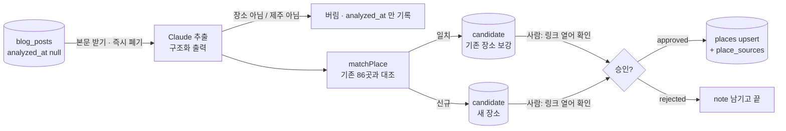

# 3. AI 분석 → 사람이 링크 확인 → 승인

> 최종 수정: 2026-09-23 (v6: self-cr 반영 — 네이버 **429 도 실행을 세운다**(쿼터를 `data:collect` 와 나눠 쓴다), 좌표 보강 **요약 한 줄**을 실행 끝에(첫 실행이 곧 `mapx`/`mapy` 포맷의 실측이라 탈락 사유를 갈라 센다))
> 이전 (v5: JWT expiry 가 **43200** 이 돼 세션 창은 11.5시간 — `--limit` 을 나누는 이유가 세션 창에서 **구독 5시간 한도**로 바뀌었다)
> 이전 (v4: **(c) Actions 폐지** — `data:analyze`·`data:apply` 는 사용자 터미널의 운영자 세션에서 따로 부른다. Claude 인증은 이 머신의 `claude` 로그인뿐
> (`CLAUDE_CODE_OAUTH_TOKEN`·`CI`·`GITHUB_ACTIONS` 를 자식 env 허용 목록에서 뺌). `DEFAULT_LIMIT` 의 근거는 Actions timeout 이 아니라 **세션 창**(그때는 3600 이라 30분))
> 이전 (v3: 코드 완료 — 본문 파서·Claude 추출(`claude -p`, 구독)·Kakao 보강·`matchPlace` 본체·`data:analyze`·`data:apply`·Actions. 실행은 수집(02) 뒤. 리뷰 지적 반영: 자동 승인 기본 off, Kakao 정확 일치만, 읍·면 목록, 영구 실패 닫기, 재대조)
> 이전 (v2: `matchPlace` 골격 상태 갱신 — 신호 헬퍼·임계값 상수·테스트는 있고 본체는 아직 🙋)
> 이전 (v1: 신설)
> 상태: **코드는 끝났다.** 실제 글로는 아직 안 돌렸다(`blog_posts` 가 비어 있다 — 02 의 네이버 키가 먼저). 실제 후기 링크 1건으로 본문 → 추출 → 대조까지 엔드투엔드는 확인했다. 선행: [02](02-collect-naver-blog.md). 입력은 `blog_posts`, 출력은 `candidates` → 승인되면 `places`. 실행 주체는 사용자 터미널(스케줄 없음).

## 역할 분담 — AI 는 뽑고, 사람은 열어 보고, 코드는 병합한다



## AI 추출 — `scripts/analyze-candidates.mjs` (`pnpm data:analyze`)

**Claude 는 API 키가 아니라 구독으로 부른다(2026-09-21 결정).** `scripts/analyze/extractPlaces.mjs` 가 `claude -p --json-schema` 를
자식 프로세스로 돌린다. 인증은 **이 머신에 로그인된 `claude`(키체인)뿐**이다 — 토큰 env 도 코드의 키도 없다(2026-09-22 (c): 옛 Actions 용
`CLAUDE_CODE_OAUTH_TOKEN` 은 발급하지 않고, 자식 env 허용 목록에서도 뺐다. 그 env 로만 인증되는 머신에서는 auth(fatal) 로 멈추는 것이 **의도**다).
왜 — 구독 OAuth 토큰은 Claude Code 전용이라 Messages API SDK 에 못 쓰고, 글당 과금이 0 이 된다. 대신 **세션 한도(5시간 창)를 대화와
공유**한다: 대량 처리는 `--limit` 로 나눈다.
`--system-prompt` 로 기본 프롬프트를 대체하고 `--tools "" --strict-mcp-config --setting-sources "" --disable-slash-commands` 로 레포
컨텍스트를 전부 끈다 — 안 끄면 호출마다 CLAUDE.md·MCP 툴 목록이 실려 3~4만 토큰, 끄면 1천(실측). `--bare` 는 못 쓴다(키체인·OAuth 를 안 읽는다).

**한 실행의 크기는 두 창이 정한다** — Claude 의 5시간 한도와 **운영자 세션 창**. 세션은 `pnpm data:login` 의 JWT 라 실효 창은 대시보드 JWT expiry 에서
코드 skew(30분)를 뺀 값인데, 2026-09-22 사용자가 expiry 를 3600 → **43200** 으로 올려 창이 **11.5시간**이 됐다 — 이제 좁은 쪽은 세션이 아니라 **구독 5시간 한도**이고,
`--limit 30` 씩 나누는 이유도 그것이다(3600 이던 시절엔 창이 30분이라 `DEFAULT_LIMIT`(50)이 다 들어간다고 장담할 수 없었다).
중간에 세션이 죽으면 그 글부터 DB 쓰기가 실패해 건너뛰고(`analyzed_at` 안 찍힘) 다음 실행이 이어 간다. 옛 근거(Actions `timeout-minutes: 30`)는 워크플로와 함께 사라졌다.

- [x] 모델 기본 `claude-opus-5`(`ANALYZE_MODEL` 로 덮음), 구조화 출력은 `--json-schema`(결과 JSON 의 `structured_output`).
      사고(thinking)는 CLI 가 모델에 맞게 알아서 — 코드에 없다.
- [x] 한 글 → 장소 **0~N개**. 여행기 하나에 카페 셋이 나온다. 스키마는 배열이다.
- [x] 본문은 데스크톱 `PostView.naver`(`scripts/analyze/naverPostBody.mjs`). 에디터 세대가 셋이다 — SmartEditor ONE(`.se-main-container`) ·
      SE3(`.__se_component_area`) · 구 에디터(`#postViewArea`). 컨테이너를 못 찾으면 `''` → 그 글은 "분석 불가" 로 닫는다.
- [x] 추출 필드 = `TPlace` 의 부분 + 근거:
  ```
  { name, type: 'stay'|'restaurant'|'cafe'|'other', regionRaw?, address?, petPolicyText?, features?,
    isJeju: boolean, evidence: string[] /* 본문 인용 1~3문장 */, confidence: 0..1 }
  ```
  - **`petPolicyText` 는 원문 문장**이다("소형견만 실내 가능, 대형견은 테라스"). 구조화(무게·마릿수)는 하지 않는다 —
    그건 `parsePetPolicy()` 의 일이고, 두 벌이 되면 어긋난다([pet-policy-and-eligibility.md](../architecture/pet-policy-and-eligibility.md)).
  - `evidence` 가 사람 확인의 핵심이다. 링크를 열었을 때 **어디를 보면 되는지**를 알려 준다.
  - `type: 'other'` · `isJeju: false` 는 후보를 만들지 않고 `analyzed_at` 만 찍는다.
- [x] 시스템 프롬프트는 고정 문자열(`--system-prompt`), 메타·본문은 stdin 으로 뒤에 → 호출 간 prefix 가 같다.
- ~~Batches API~~ — 구독 경로엔 없다. 첫 1년치는 `--limit` 로 나눠 여러 번 돌린다(세션 한도).
- 🙋 **모델**: 구독이라 글당 비용은 0 이고 차이는 한도 소모뿐. 기본 `claude-opus-5`. `ANALYZE_MODEL=claude-haiku-4-5` 로 바꿔 품질을 비교해 볼 수 있다.
- [x] 좌표·주소 보강은 **네이버 지역 검색**(`scripts/analyze/naverLocal.mjs`, `NAVER_CLIENT_ID`·`NAVER_CLIENT_SECRET` 선택 — 02 수집과 같은 키). `title` 이
      후보 이름과 **정규화 후 완전 일치**할 때만 채택한다 — 부분 일치(0.7)를 받으면 "고기부엌" 에 "협재고기부엌" 좌표가 실려 그대로
      `places` 에 쓰인다(리뷰에서 재현). 없으면 좌표를 비워 둔다(지어내지 않는다). 키가 401/403 이면 실행을 세운다 — 조용히 이름만으로
      대조하면 동명 가게가 `ask` 대신 `auto` 로 올라간다. **429(쿼터 소진)도 같은 이유로 세운다**(self-cr 지적): 검색 API 는 일 25,000 호출
      상한을 `data:collect` 와 **나눠 쓰므로** 한 번 소진되면 그날 남은 전 건이 좌표 없이 대조된다 — 일시 장애처럼 흘려보내면 401/403 을
      세우는 이유가 그대로 재현되는데 실행만 안 멈춘다. 주소 → `regionRaw` 는 기존 86곳의 읍·면→방향 표에서 추론(`inferRegionRaw`).
- [x] **좌표 보강 요약을 실행 끝에 한 줄 찍는다**(self-cr 지적) — `검색 N · 채택 N · 요청실패 N` + 탈락 사유(제주밖주소 / 좌표파싱실패 /
      좌표제주밖 / 이름불일치). **이 줄이 `mapx`/`mapy` 포맷의 실측 보고**다: 공식 문서가 스스로 모순돼(본문 WGS84, 예제는 옛 KATECH 6자리)
      실제 응답을 봐야 확정된다. 채택 0건이면 표본의 원시 `mapx`/`mapy` 를 함께 찍어 자릿수를 눈으로 보게 한다. 이게 없으면 "포맷이 틀렸다" 와
      "이름이 안 맞았다" 가 똑같이 `null` 로만 보이고, 운영자가 볼 단서는 "후보 N건" 뿐이다(→ [README 의 ⚠️ 미검증 1](README.md)).
  - ⚠️ **제주 범위 검사가 못 거르는 것 하나 — datum.** 범위 박스는 자릿수 오류(KATECH·10⁶·10⁸·lat/lng 스왑)를 전부 잡지만,
    **구 베셀 좌표가 도(度) 단위로 오면 박스 안이라 통과한다**(제주에서 WGS84 와 수백 m 차이). `matchPlace` 의 `GEO_NEAR_M` 이
    100m 라 이게 판정을 갈라 버린다. 증상: **채택은 0이 아닌데 기존 장소와의 거리가 일관되게 300~400m** 로 나온다.
    요약 줄에 거리 분포가 없어 지금은 자동으로 안 보이므로, 첫 실행 때 Studio 에서 몇 건을 눈으로 대조한다(self-cr 검증 패스 지적).
- [x] 실패 분류(`analyze-candidates.mjs`): 다시 받아도 같을 실패(본문 **404/410**·컨테이너 없음·`blog_id/log_no` 없음·모델이 스키마 재시도를
      소진하거나 턴 초과)는 `analyzed_at` 을
      찍어 **닫는다** — 안 닫으면 매 실행 `--limit` 창을 잠식하며 영원히 재시도한다. 단 닫기는 **루프 끝에, 그 실행에서 성공한 글이 1건 이상일 때만**
      — 전부 "분석 불가" 면 글이 아니라 파이프라인(에디터 구조 변경·차단 페이지) 문제라 아무것도 닫지 않고 exit 1. 403(차단)·5xx·한도·타임아웃·
      DB 쓰기 실패는 비워 둬 재시도. 인증 실패·CLI 없음·Claude API 4xx(모델명 오타)·네이버 키 오류(401/403)는 나머지 글도 같으므로 루프를 끊고 exit 1.

## 🙋 `matchPlace` — 기본안이 구현돼 있다. 가중치·임계값은 사용자가 조정한다

`scripts/analyze/matchPlace.mjs`. 후보가 기존 장소와 같은 곳인지. **틀리면 조용히 데이터가 썩는다** — 잘못 병합하면
사람이 쓴 설명이 덮이고, 잘못 신규면 같은 가게가 두 번 뜬다. 기존 계획 §4 의 그 자리다.

**구현된 기본안**(2026-09-21, 🙋 항목이었지만 기본값으로 채웠다 — 바꿀 자리는 `THRESHOLD`·`WEIGHT` 두 상수뿐):
- `naverPlaceId` 일치 → 1.0. 그 외 **이름이 축**이다: 정규화 이름 완전 일치 1.0 · 부분 포함 0.7 · 아니면 0 — **이름 신호가 0 이면
  다른 신호가 아무리 강해도 후보가 아니다**(평대반점↔평대코지카페 18m 를 좌표로 묶지 않는다).
- 이름 위에 보정: 좌표 100m 안 +0.15 · 2km 밖 −0.3(우도↔성산 16km) · 종류 다름 −0.1 · 읍·면 같음 +0.05 · 읍·면 다름 −0.2.
  값이 없는 신호는 감점 없이 건너뛴다(좌표 없는 5곳). 읍·면은 **제주 12개 읍·면 목록**으로만 본다 — 패턴으로 잡으면
  "함덕해물라면" 의 '면' 이 읍·면이 된다(리뷰에서 재현). 시(제주시·서귀포시)는 신호가 아니다.
- 그래서 생기는 구간: 이름 일치+100m 안 → 1.0 `auto` · 이름 일치+2km 밖 → 0.7 `ask` · 부분 일치+100m 안 → 0.85 `auto` ·
  부분 일치+종류 다름 → 0.6 `ask` · 이름 불일치 → 0 `new`.
- **자기충돌 검사**가 테스트에 있다: 86곳 각각을 후보로 만들어 나머지 85곳과 대조했을 때 `ASK` 를 넘는 쌍이 0 이어야 한다.
  깨지면 임계값을 올리지 말고 `nameSimilarity` 를 조인다.

**🙋 재대조의 경계값**: 부분 일치 0.7 + 100m 안 +0.15 = **정확히 0.85 = `AUTO_MERGE`** 이고 `apply` 의 재대조는 `≥` 다. 그래서 사람이
`new` 후보를 승인해도 이름이 부분만 겹치는 이웃 가게(100m 안)에 조용히 합쳐질 수 있다 — `AUTO_APPROVE` 와 별개 경로다. 리뷰에서는
"임계값 결정" 으로 분류됐다. 보수적으로 가려면 `GEO_NEAR_BONUS` 를 0.1 로 낮추거나 재대조에 `>` 를 쓴다.

**🙋 자동 승인은 기본 꺼져 있다**(`scripts/analyze/analyzeCandidates.mjs` 의 `AUTO_APPROVE = false`). `auto` 구간도 `pending` 으로
들어가고 `extracted.match.tier = 'auto'` 로 표시만 된다 — Studio 에서 `extracted->match->>tier = 'auto'` 로 걸러 한꺼번에 승인한다.
켜면 같은 잡의 `data:apply` 가 사람 확인 없이 `places` 를 고친다(빈 칸만이지만 좌표·주소·category 는 "빈 칸" 이라 그대로 들어간다).
86곳이라 사람 확인이 싸다는 전제로 보수적으로 시작한다 — 몇 주 돌려 보고 `auto` 가 한 번도 틀리지 않으면 그때 켠다.

**실제 데이터에서 찾은 함정**(테스트 케이스로 남겨 뒀다):
- 평대반점(별칭 바당반점) ↔ 평대코지카페 — 좌표 18m 차이. 좌표만으로 묶으면 오병합.
- 제이아일랜드 ↔ 아오오 — 좌표 40m 차이. 역시 좌표 단독 판정 위험.
- "카페살레" 가 "살레" 로만 오는 경우 — 이름 정규화가 부분 문자열까지 다뤄야 하는지가 쟁점.
- 좌표가 아예 없는 5곳(01 의 미확보 목록과 동일) — 좌표 기반 신호가 통하지 않는다.

테스트: `matchPlace.test.mjs` — 실제 86곳으로 위 함정 전부 + 우도 vs 본섬 동명(카페살레) + 좌표 없는 5곳 + 자기충돌 검사. `skip` 없음.

## 사람의 승인 — 어디서 하나

| 단계 | 도구 | 만들 것 |
|---|---|---|
| **지금** | Supabase Studio 표 편집기 | 없음. `candidates` 를 열어 `post_url` 클릭 → `extracted.evidence` 와 대조 → `status` 바꾸고 `reviewer_note`. **`ask` 후보가 신규가 맞다면 `match_place_id` 를 비운 뒤 approved 로** — `data:apply` 는 `match_place_id` 가 있으면 그것을 믿고 병합한다. |
| 다음 | 앱 안 `/admin` (정적 라우트 + 클라이언트 Supabase auth + RLS) | 후보 카드·링크·근거 문장·"승인/거절" 버튼. **이때 처음으로 앱 번들에 Supabase 가 들어간다** → 05 의 anon key 항목이 살아난다 |

Studio 로 먼저 몇 주 돌려 보고 **어떤 정보가 화면에 있어야 결정이 빨라지는지** 안 다음에 화면을 만든다.
후보가 주에 수십 건이면 Studio 로 충분할 수도 있다.

## 승인 → `places` 반영 — `scripts/apply-approved.mjs` (`pnpm data:apply`)

- [x] `status='approved'` 후보를 읽어:
  - `match_place_id` 있음 → 기존 행에 **빈 칸만 채운다**(`mergeIntoExisting`). 사람이 쓴 `features`·`petPolicyText` 를 AI 가 덮지 않는다.
    다른 값이 필요하면 `reviewer_note` 에 적고 Studio 에서 손으로 고친다. **archived 장소에는 병합하지 않는다**(실패로 남겨 사람이 본다).
  - 없음 → 분석 때 `tier` 가 `new` 였던 후보만 현재 `places`(방금 만든 draft 포함)와 **다시 대조**해 `AUTO_MERGE` 이상이면 보강으로 돌린다 —
    같은 새 가게를 말하는 글 둘이 따로 승인되면 분석 시점엔 서로 몰라 둘 다 '신규' 이기 때문이다. `auto`/`ask` 였는데 `match_place_id` 가
    비어 있으면 **사람이 비운 것**이라 재대조 없이 신규로 존중한다. 재대조는 분석 때와 같은 지역 신호(`extracted.regionRawAi`)를 본다.
    아니면 `source='blog'`, `status='draft'` 로 insert.
    **`published` 는 사람이 Studio 에서 올린다** — 승인 두 번이 번거로우면 🙋 여기서 바로 `published` 로 갈지 정한다.
  - `place_sources` 에 링크 추가(출처 추적용). 화면의 "후기 링크" 는 여전히 `places.review_url` 하나뿐이라 보강된 기존 장소에는 새 글이
    화면에 닿지 않는다 — 여러 출처 표시는 기능 변경이라 범위 밖(04 의 "앱 코드 변경").
- [x] 처리한 후보는 `status='merged'`. `--dry-run` 이면 아무것도 쓰지 않고 할 일만 찍는다.
- [x] 이 스크립트는 **DB 웹훅이 아니라 사람이 부른다** — 사용자 터미널에서 `pnpm data:analyze` 다음에 `pnpm data:apply` 를 **따로**(2026-09-22 (c). 옛
      Actions 에선 `if: !cancelled()` step 이었다). 별개 명령이라 분석이 실패해도 승인된 것의 반영은 막히지 않는다 — 그 이유는 그대로다.
      실패 수가 exit code 고 요약 한 줄이 관측이다. 웹훅으로 재빌드를 부르는 건 04 의 일이다.

## 끝났다고 볼 조건

- [ ] 실제 글 20건으로 돌려 후보가 생기고, Studio 에서 승인·거절 각 1건 → `data:apply` → `data:pull` → 화면에 새 장소가 뜬다.
      **아직** — `blog_posts` 가 비어 있다(02 의 네이버 키). 대신 실제 후기 링크 1건(제이아일랜드)으로 본문 2,171자 → `claude -p` 8.9초 →
      카페·이용 조건 원문·근거 3문장 → `matchPlace` 1.00 까지 확인했다(2026-09-21, DB 쓰기 없이).
- [x] `matchPlace.test.mjs` 통과(자기충돌 검사 포함). `docs/architecture/data-pipeline.md` 에 "분석·승인" 절과 상태 머신 표.
- ~~Actions 에서 한 번 실제로: 시크릿 등록 → `workflow_dispatch`~~ → [ ] **사용자 터미널에서 첫 실행**(README 의 **실행 순서** 블록): `pnpm data:login` →
      `pnpm data:analyze --dry-run --limit 5`(Claude 가 돌려도 된다 — 세션이 있으면) → 사용자 세션으로 `pnpm data:analyze` → `pnpm data:apply`.
      env 에 네이버 키 둘이 다 있을 때만 켜진다(숨김 입력 없음 — 분석은 오래 도는 일이라 중간에 프롬프트가 뜨면 안 된다).
      없으면 보강을 건너뛰고 후보는 좌표 없이 들어간다(`matchPlace` 는 이름·종류만으로 대조, 감점 없음).
      **함정 둘**: `mapx`/`mapy` 는 WGS84 를 10^7 배한 정수인데 공식 문서 예제는 아직 옛 KATECH 6자리다 → 나눈 값이 제주 범위 밖이면 버린다.
      `title` 에 `<b>` 태그가 섞여 와서 안 벗기면 이름 비교가 영영 안 맞는다. `display` 상한은 **5**(Kakao 15보다 좁아 동명 구분이 약하다).
