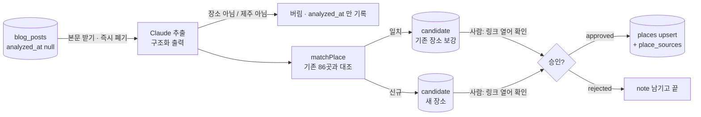

# 3. AI 분석 → 사람이 링크 확인 → 승인

> 최종 수정: 2026-09-20 (v2: `matchPlace` 골격 상태 갱신 — 신호 헬퍼·임계값 상수·테스트는 있고 본체는 아직 🙋)
> 이전 (v1: 신설)
> 상태: 계획. 선행: [02](02-collect-naver-blog.md). 입력은 `blog_posts`, 출력은 `candidates` → 승인되면 `places`.

## 역할 분담 — AI 는 뽑고, 사람은 열어 보고, 코드는 병합한다



## AI 추출 — `scripts/analyze-candidates.mjs` (`pnpm data:analyze`)

- [ ] 모델 기본 `claude-opus-5`, `thinking: {type: 'adaptive'}`, 구조화 출력 `output_config.format`(JSON 스키마).
      **SDK 코드는 그때 `claude-api` 스킬을 읽고 쓴다** — 여기 옮겨 적지 않는다.
- [ ] 한 글 → 장소 **0~N개**. 여행기 하나에 카페 셋이 나온다. 스키마는 배열이다.
- [ ] 추출 필드 = `TPlace` 의 부분 + 근거:
  ```
  { name, type: 'stay'|'restaurant'|'cafe'|'other', regionRaw?, address?, petPolicyText?, features?,
    isJeju: boolean, evidence: string[] /* 본문 인용 1~3문장 */, confidence: 0..1 }
  ```
  - **`petPolicyText` 는 원문 문장**이다("소형견만 실내 가능, 대형견은 테라스"). 구조화(무게·마릿수)는 하지 않는다 —
    그건 `parsePetPolicy()` 의 일이고, 두 벌이 되면 어긋난다([pet-policy-and-eligibility.md](../architecture/pet-policy-and-eligibility.md)).
  - `evidence` 가 사람 확인의 핵심이다. 링크를 열었을 때 **어디를 보면 되는지**를 알려 준다.
  - `type: 'other'` · `isJeju: false` 는 후보를 만들지 않고 `analyzed_at` 만 찍는다.
- [ ] 시스템 프롬프트는 고정 문자열로 앞에, 본문은 뒤에 → 프롬프트 캐시가 먹는다.
- [ ] 글이 쌓여 있을 때(첫 실행 1년치)는 **Batches API**(50%). 증분(주 2회 수십 건)은 그냥 동기 호출.
- [ ] 🙋 **모델은 사용자가 정한다.** 대략 글 하나 4k 입력·0.5k 출력 기준:
  | 모델 | 글 200건 | 비고 |
  |---|---|---|
  | `claude-opus-5` ($5/$25) | ≈ $6.5 (Batch ≈ $3.3) | 기본. 애매한 문장("작은 강아지는 괜찮대요")을 제일 잘 읽는다 |
  | `claude-haiku-4-5` ($1/$5) | ≈ $1.3 | 첫 1년치 대량 처리용으로 고려. 품질은 직접 비교해 보고 |
- [ ] 좌표·주소 보강은 **Kakao 로컬 REST API**(`/v2/local/search/keyword.json`, REST 키) 로 한다 — 지도가 이미 Kakao 라
      좌표계가 같고, 지금 문서에 적힌 `m.place.naver.com` HTML 파싱은 약관·차단 위험이 있다. 검색 결과가 여럿이면
      `address` 가 있는 것을 우선, 없으면 좌표를 비워 둔다(지어내지 않는다).

## 🙋 `matchPlace` — 골격은 있고, 본체와 임계값은 사용자가 쓴다

`scripts/analyze/matchPlace.mjs`. 후보가 기존 장소와 같은 곳인지. **틀리면 조용히 데이터가 썩는다** — 잘못 병합하면
사람이 쓴 설명이 덮이고, 잘못 신규면 같은 가게가 두 번 뜬다. 기존 계획 §4 의 그 자리다.

**지금 있는 것**: 신호 헬퍼(`normalizeName`·`splitAliases`·`nameSimilarity`·`distanceMeters`)와
`THRESHOLD = { AUTO_MERGE: 0.85, ASK: 0.4 }` 상수. **없는 것**: `matchPlace` 본체 — 헬퍼를 어떻게 조합해
confidence 를 낼지가 🙋. `matchPlace.test.mjs` 의 본체 케이스는 `describe.skip` 으로 비활성.

```js
/**
 * @param {{name:string, naverPlaceId?:string, geo?:{lat:number,lng:number}, address?:string}} candidate
 * @param {TPlace[]} existing  src/data/places.json
 * @returns {{ match: TPlace|null, confidence: number, reason: string }}
 */
export function matchPlace(candidate, existing) {
  // TODO
}
```

선택지와 맞바꿈 — 결정은 사용자 몫:
- `naverPlaceId` 완전 일치 = 확실. 하지만 블로그에서 온 후보엔 거의 없다.
- 이름 정규화 일치("카페 ○○" = "○○카페" = "○○ 제주점") — 오탐이 잦다.
- 좌표 100m 이내 — 한 건물에 가게 여럿. 좌표 없는 곳은 못 잡는다.
- 조합 + 임계값 — 예: 0.8↑ 자동 병합 · 0.4~0.8 사람에게 묻기 · 그 아래 신규.
  **어디에 선을 긋고, 애매 구간을 자동/사람 중 어디로 기울일지.** 86곳이라 사람 확인 비용이 싸다는 점을 고려.

**실제 데이터에서 찾은 함정**(테스트 케이스로 남겨 뒀다):
- 평대반점(별칭 바당반점) ↔ 평대코지카페 — 좌표 18m 차이. 좌표만으로 묶으면 오병합.
- 제이아일랜드 ↔ 아오오 — 좌표 40m 차이. 역시 좌표 단독 판정 위험.
- "카페살레" 가 "살레" 로만 오는 경우 — 이름 정규화가 부분 문자열까지 다뤄야 하는지가 쟁점.
- 좌표가 아예 없는 5곳(01 의 미확보 목록과 동일) — 좌표 기반 신호가 통하지 않는다.

테스트: `matchPlace.test.mjs` 에 실제 86곳 이름으로 케이스를 넣는다("우도 ○○" vs 본섬 동명 가게 등). 본체 케이스는
`matchPlace` 가 채워지면 `describe.skip` 을 풀어 활성화한다.

## 사람의 승인 — 어디서 하나

| 단계 | 도구 | 만들 것 |
|---|---|---|
| **지금** | Supabase Studio 표 편집기 | 없음. `candidates` 를 열어 `post_url` 클릭 → `extracted.evidence` 와 대조 → `status` 바꾸고 `reviewer_note`. |
| 다음 | 앱 안 `/admin` (정적 라우트 + 클라이언트 Supabase auth + RLS) | 후보 카드·링크·근거 문장·"승인/거절" 버튼. **이때 처음으로 앱 번들에 Supabase 가 들어간다** → 05 의 anon key 항목이 살아난다 |

Studio 로 먼저 몇 주 돌려 보고 **어떤 정보가 화면에 있어야 결정이 빨라지는지** 안 다음에 화면을 만든다.
후보가 주에 수십 건이면 Studio 로 충분할 수도 있다.

## 승인 → `places` 반영 — `scripts/apply-approved.mjs` (`pnpm data:apply`)

- [ ] `status='approved'` 후보를 읽어:
  - `match_place_id` 있음 → 기존 행에 **빈 칸만 채운다**(`coalesce`). 사람이 쓴 `features`·`petPolicyText` 를 AI 가 덮지 않는다.
    다른 값이 필요하면 `reviewer_note` 에 적고 Studio 에서 손으로 고친다.
  - 없음 → `places` 에 `source='blog'`, `status='draft'` 로 insert. **`published` 는 사람이 Studio 에서 올린다** — 승인 두 번이
    번거로우면 🙋 여기서 바로 `published` 로 갈지 정한다.
  - `place_sources` 에 링크 추가. 화면의 "후기 링크" 가 이 출처를 쓴다(`reviewUrl` 은 첫 출처).
- [ ] 처리한 후보는 `status='merged'`.
- [ ] 이 스크립트는 **DB 웹훅 대신 Actions 에서 `data:analyze` 다음에** 돈다. 웹훅으로 재빌드를 부르는 건 04 의 일이다.

## 끝났다고 볼 조건

- 실제 글 20건으로 돌려 후보가 생기고, Studio 에서 승인·거절 각 1건 → `data:apply` → `data:pull` → 화면에 새 장소가 뜬다.
- `matchPlace.test.mjs` 통과. `docs/architecture/data-pipeline.md` 에 "분석·승인" 절과 상태 머신 표.
