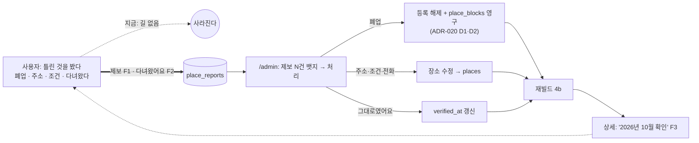

# 10. 사용자 피드백 — 반려인 페르소나 3명이 써 본 뒤 (기능 기획만)

> 최종 수정: 2026-10-01 (v1: 신설. 사용자(운영자)의 첫 피드백 "**이 매장에 대해 말할 수 있는 게 없다** — 폐업했는지, 주소가 틀렸는지 제보할 버튼이 있어야 한다" 에서 출발해,
> 서로 다른 반려인 셋(노령견 · 다두 가족 · 뚜벅이 첫 반려인)이 2026-10-01 코드 기준의 앱을 과제대로 걸어 본 피드백을 모았다.
> **기능 기획까지만** 다룬다 — 진입점 위치·문구·색·컴포넌트는 적지 않고 §7 에 "디자인에 넘기는 질문" 으로만 남긴다. 디자인·UI/UX 는 분리해서 따로 진행한다)
> 상태: **계획만**. 태스크 전부 `[ ]`. 실행 규약은 [08](08-usability-and-process-plan.md) 의 것을 그대로 쓴다(한 태스크 = 한 커밋). 결정 R1~R6 은 **제안** — 🙋 가 닫히면 ADR 로 옮기고 여기서는 링크만 남긴다.

관련: [07](07-product-and-ux.md)(제보 카테고리 4개는 거기서 이미 정해졌다 — 이 문서는 그것을 **기능으로 펼친다**) · [09](09-admin-pipeline-stages.md) · [ADR-020](../decisions/ADR-020-pipeline-stages-and-blocklist.md)(폐업 = 영구 제외 `place_blocks` — **표는 이미 있다**(`20261001120000_place_blocks.sql`), 제보의 출구가 거기다) ·
[reviews/2026-09-29 persona](../reviews/2026-09-29-persona-and-process-review.md)(지수·민준 — 이번 셋은 그 둘과 **겹치지 않는 축**으로 골랐다) · [ADR-015 §2](../decisions/ADR-015-supabase-source-and-rebuild.md)(사용자 화면은 런타임 fetch 없음 — 제보가 이것을 처음 깬다) ·
[ADR-012](../decisions/ADR-012-personal-data-and-consent.md)(개인정보 — 제보는 연락처를 받지 않아 여기 안 걸리게 설계한다).

## 0. 한 줄 요약

**앱은 "갈 수 있나" 를 잘 답하는데, 그 답이 틀렸을 때 사용자가 할 수 있는 일이 없다.** 셋 모두 다른 이유로 같은 자리에 닿았다 —
노령견 보호자는 "이 정보가 언제 것인지" 를, 가족은 "다녀왔는데 달랐다" 를, 뚜벅이는 "문 닫은 가게에 버스 타고 갔다" 를 말할 곳이 없다.
그래서 P0 는 **장소 제보**(사용자 피드백 그대로) 하나고, 나머지는 제보가 만드는 **신뢰 루프**(제보 → 운영자 처리 → 재빌드 → "최근 확인" 표시) 위에 얹는다.

## 1. 방법과 한계

- 2026-10-01 `develop` 코드 기준. 상세에 **있는 것**: 판정 카드 · 원문 · 저장 · 공유(복사 폴백) · 네이버 지도/사진/후기 링크 · 준비물 알약 · 미니 지도 · 근처 장소 · 공식 홈페이지 카드.
  **없는 것**: 전화번호(07 P0) · 영업시간·휴무일 · 확인일 · 제보 · 방문 기록 · 저장한 곳의 메모 · 숙소 환경(복층·울타리) 구조화 값.
- 데이터 86곳: 좌표 81 · 주소 76 · 네이버 링크 86. 읍면 분포는 구좌 22 · 성산 10 · 애월 10 … **제주시 3 · 서귀포(시) 7**.
- **실제 사람이 아니다.** AI 가 연기한 사용자다. 그래서 07 P0 의 실제 5명 테스트(08 H.1)는 이 문서로 **대체되지 않는다** — 이 문서는 그 전까지의 가설이고, 테스트 결과로 §5 순서를 다시 매긴다.
- 지수(소형견 첫 방문 · 카톡 진입)·민준(대형견 2마리 · 숙소부터)이 이미 본 것(공유 · 전화 · 식당 기본값 · 카드 근거)은 **다시 적지 않는다** — 재현되면 "같다" 한 줄만.

## 2. 페르소나 셋

| | 은서 | 태호 | 민지 |
|---|---|---|---|
| 나이·동행 | 31 · 혼자 운전 | 42 · 배우자 + 초등생 둘 | 24 · 친구 1명, 렌터카 없음 |
| 강아지 | 몰티즈 13살 3.2kg, 심장약 복용, 계단 못 오름, 더위에 약함 | 보더콜리 18kg + 믹스 12kg | 푸들 5kg, 첫 반려견 1년차, 천 이동가방 |
| 여정 | 2박, 가을, 비행기 | 4박, 여름, **배(완도)+자차** | 1박 2일, 공항 → 버스·택시 |
| 축 | **건강·환경** — 무리 없는 곳, 정보가 **지금도 맞는지** | **다두·가족·여정** — 둘 다 되는 곳, 가족과 **같이 정하기**, 다녀온 뒤 | **이동·시간·기여** — 공항 근처, 헛걸음, "여기도 되던데요" |
| 프로필 | 1마리 3.2kg · 이동가방 | 2마리 18+12kg · 없음 | 1마리 5kg · 이동가방 |

### 2-1. 은서 — 노령견, "이 정보가 지금도 맞나요"

| 과제 | 앱이 주는 것 | 멈춘 곳 |
|---|---|---|
| 조용하고 계단 없는 숙소 | 판정 가능 21곳(3.2kg 은 거의 다 통과) | 판정이 **전부 가능**이라 거르지 못한다. 알고 싶은 것은 조건이 아니라 **환경** — 복층인가, 마당에 울타리가 있나, 독채인가. `features` 문장("넓은 마당") 을 21곳 다 읽어야 한다 |
| 더운 날 실내 자리 | "실내 자리 필요" 토글(프로필 있을 때 필터 시트 안) | 토글을 찾긴 했다. 그런데 **왜 필요한지**(더위·비)와 연결되지 않아 매번 켠다 — 여행 정보라 프로필에 안 넣은 것은 맞다(dog-profile.md) |
| 가도 되는지 전화 확인 | 네이버 지도 링크 | 지수·민준과 같다(07 P0). 전화해서 "된다" 고 들은 것을 **적어 둘 곳이 없다** — 다음 날 또 헷갈린다 |
| 상세의 요금·조건 | 원문 + "정보는 바뀔 수 있어요" | **언제 것인지**가 없다. 2년 전 후기 기반인지 지난달 확인인지 같은 모양이다. 13살 개를 데리고 가는 사람에게 "바뀔 수 있어요" 는 경고가 아니라 부담이다 |
| 폐업한 곳에 도착 | — | 돌아와서 **아무것도 할 수 없다.** 다음 사람도 간다 |
| 응급 상황 | — | 동물병원이 앱에 없다. 숙소·식당·카페 셋만 다루는 앱이라는 것은 이해하지만, 노령견 보호자의 첫 질문은 "근처 24시 병원" 이다(→ 🙋 D) |

> "거르는 건 잘 돼요. 그런데 다 '가능' 이라고 나오면 그다음은 결국 블로그를 또 뒤져요. 그리고 이게 올해 정보인지만 알려 주면 전화를 한 번 덜 해요."

### 2-2. 태호 — 가족 + 중형견 둘, "같이 정하고, 다녀온 뒤에"

| 과제 | 앱이 주는 것 | 멈춘 곳 |
|---|---|---|
| 둘 다 되는 숙소 | 2마리 합산 요금("대장이와 초코는 6만원") · 넘는 쪽 이름(08 T1.5) | **좋다** — 민준이 본 것 그대로 믿는다. 남은 질문은 "18kg 만 안 되면 12kg 만 데려가면 되나" 인데 그건 **what-if** 라 나중(§4 F11) |
| 아내와 후보 고르기 | 공유(상세 한 곳씩) | 저장 목록을 **통째로** 보낼 수 없다(07 P1 저장 목록 공유 — 같다). 둘이 각자 저장하면 **둘의 목록이 다르다** |
| 저장한 7곳 구분 | 종류별 묶음 | "아내가 고른 곳"·"1일차"·"전화했음, 2마리 OK" 를 적을 **메모가 없다.** 하트 하나뿐 |
| 비 오는 날 | "실내 자리 필요" 토글 · 식당 필터 "실내 동반 OK" | 있다. 그런데 **'비 오는 날' 이라는 상황**으로 들어가는 길이 없다(→ 디자인 질문 §7) |
| 배로 가는데 준비물 | "기내용 가방" 이 맨 위 | 민준과 같다(08 T5.2) |
| 다녀온 뒤 | — | "그대로였어요 / 2마리는 안 받더라 / 주차 못 함" 을 **남길 곳이 없다.** 다음 가족이 똑같이 겪는다. 보호자 커뮤니티 경험상 이게 가장 먼저 생기는 기능인데 여기 없다 |

> "요금 계산이 맞아서 믿음이 갔어요. 그 믿음이 다녀온 뒤에도 이어지려면, 틀렸을 때 말할 수 있어야죠."

### 2-3. 민지 — 뚜벅이 첫 반려인, "헛걸음은 한 번으로"

| 과제 | 앱이 주는 것 | 멈춘 곳 |
|---|---|---|
| 공항 근처 카페 | 읍면 필터 "제주시" | **3곳**(커버리지 — 07 P2 와 같다). 첫날·마지막 날이 빈손 |
| 버스로 갈 수 있나 | 네이버 지도 링크 | 대중교통 정보는 없다. 네이버로 나가서 보는 것이 맞다 — **앱이 할 일이 아니다**(§6) |
| 지금 여기서 가까운 곳 | 지도 "내 위치"(`myLocation.ts`, 저장 안 함) | 지도에는 있는데 **목록 정렬**에는 없다. 목록에서 "가까운 순" 이 없어 지도로 넘어가 마커를 하나씩 누른다 |
| 도착했는데 문 닫음 | — | 영업시간·휴무일이 없다. 택시비 1.5만원. **그런데 이 가게가 닫은 걸 앱에 말할 수 없다** — 가장 화가 난 지점 |
| 사진 없이 분위기 | 네이버 사진 링크 | ADR-002 를 읽고 **납득**했다. 링크면 된다 |
| "여기도 강아지 되던데요" | — | 다른 카페에서 반려견을 봤다. 앱에 **알려 줄 길이 없다.** 블로그를 쓸 생각은 없다 — 운영자는 블로그만 긁는다(ADR-019) |
| 설치 | — | 07 U9 와 같다 |

> "틀린 정보 하나가 뚜벅이에겐 두 시간이에요. 그걸 말할 수 있으면 다시 쓰고, 없으면 네이버만 쓸 거예요."

## 3. 세 사람이 만난 한 자리 — 신뢰 루프가 없다



제보자에게 **답장하지 않는다**(연락처를 받지 않으니 할 수도 없다). 루프가 닫혔다는 것은 "최근 확인" 표시가 바뀌는 것으로만 보인다 — 그래서 F1 과 F3 는 한 쌍이다.

## 4. 요구 → 기능 (F1~F11)

| # | 누가 | 기능 | 지금 코드 | 데이터·경계 | 우선 |
|---|---|---|---|---|---|
| **F1** | 셋 + **사용자** | **장소 제보** — 상세에서 카테고리 하나 고르고(선택) 한 줄 적어 보낸다 | 없음 | 새 표 `place_reports`, anon **insert 만**. 사용자 화면의 첫 런타임 쓰기 → 새 ADR(ADR-020 다음 번호) | **P0** |
| F2 | 태호·은서 | **다녀왔어요** — "그대로였어요" 한 번. 제보와 같은 표, 긍정 신호 | 없음 | F1 의 `kind='visited_ok'`. 운영자 처리 없이 `verified_at` 집계 근거 | P1 |
| F3 | 은서 | **확인일 표시** — 상세에 "2026년 10월 확인", 1년 넘으면 톤 낮춤 | 없음 | 07 P1 「데이터 신선도」 **그대로**. 여기선 F2·운영자 처리가 그 날짜를 **갱신하는 규칙**만 더한다(§R5) | P1 |
| F4 | 셋 | 전화 버튼 | 없음 | **07 P0 그대로** — 가져오지 않는다. 제보 카테고리 `phone` 이 그 번호의 오류를 잡는다 | (07) |
| F5 | 태호·은서 | **저장한 곳 메모** — 저장한 장소마다 한 줄(≤80자) | `savedIds: string[]` 만 | 퍼시스트 필드 `savedNotes: Record<id,string>`, `merge` 가 없는 id 를 걸러낸다. 공유 링크(07 P1)에는 **싣지 않는다**(사적 메모) | P1 |
| F6 | 은서·태호 | **숙소 환경 구조화** — 독채 · 마당 울타리 · 복층/계단 · 실내 자유 | `features` 문장 · `stay.amenitiesText` | AI 추출 스키마(ADR-017)에 `environment` 칸 추가 + 시드는 `features` 정규식 시드 + `/admin` 검수 칸 + 숙소 필터 셋. 판정(`eligibility`)에는 **넣지 않는다** — 갈 수 있나와 무관한 선호다 | P2 |
| F7 | 민지 | **목록 "가까운 순"** — 위치 1회, 저장·전송 없음 | 지도에만 `myLocation` | `sortByEligibility` 옆에 거리 정렬 하나. 좌표 없는 5곳은 뒤로(가격 정렬과 같은 규칙). ADR-012 대상 아님(저장 안 함) | P2 |
| F8 | 민지 | **장소 제안** — "여기도 돼요": 가게 이름(+네이버 링크 선택) | 없음 | F1 표에 `kind='suggest'`, `place_id null`. 운영자는 [ADR-019](../decisions/ADR-019-ai-cross-check-and-address-rules.md) 결정 7 의 **업체명 블로그 재검색**으로 넘긴다 — 사용자가 블로그를 대신 쓰는 셈 | P2 |
| F9 | 민지 | 공항 근처·서귀포 커버리지 | 키워드 6개 지역 무관 | **07 P2 그대로** | (07) |
| F10 | 태호 | 저장 목록 통째로 공유 | 상세 공유만 | **07 P1 그대로** | (07) |
| F11 | 태호 | 다두 what-if — "12kg 만 데려가면 갈 수 있어요" | T1.5 가 넘는 쪽 이름만 | 판정을 **마리 부분집합으로 다시 돌리는** 순수 함수. 설계 먼저(08 P3 T5.7 과 같이) | P3 |

### F1 장소 제보 — 기능 명세

**카테고리.** 07 의 넷에 둘을 더해 **여섯**(🙋 1). 운영자 할 일이 카테고리에서 바로 갈리는 것이 기준이다.

| `kind` | 사용자가 고르는 말(뜻만 — 문구는 디자인) | 운영자 할 일 | 09 · ADR-020 과의 연결 |
|---|---|---|---|
| `closed` | 없어졌어요(폐업·휴업) | 확인 → **등록 해제**(`ARCHIVE_REASONS` 의 `폐업`) | 폐업은 **영구 제외**(ADR-020 D2) — 등록 해제 폼의 「블랙리스트에」(09 T1.4)가 그 동작이다. 제보 처리는 그 폼을 **열어 주기만** 한다 |
| `replaced` | 다른 가게로 바뀌었어요 | 등록 해제 → 새 가게가 동반이면 F8 과 같은 길로 | 옛 이름은 영구 제외, 새 이름은 재검색 |
| `address` | 주소·위치가 달라요 | 주소·좌표 수정(기존 편집 + Geocoding 축) | — |
| `policy` | 반려동물 조건이 달라요 | 원문·AI 판단 수정 → 재빌드 | 사람이 고친 값이 정답(09 D3) |
| `phone` | 전화번호가 달라요(F4 뒤) | 번호 수정 | — |
| `other` | 기타 | 적힌 대로 | — |
| `visited_ok` | (F2) 다녀왔는데 그대로였어요 | 없음 — 집계만 | `verified_at` 갱신 근거(§R5) |
| `suggest` | (F8) 여기도 강아지 돼요 | 재검색 큐로 | ADR-019 결정 7 |

**싣는 것.** `place_id`(상세에서 자동 — 사용자가 어느 곳인지 다시 적지 않는다) · `kind` · `note`(선택, ≤200자) · `app_build`(배포 식별 — 어느 데이터를 보고 말한 건지) · `created_at`.
`visited_ok` 는 `note` 없이도 된다. `suggest` 는 `place_id null` + `note` 필수(이름).

**받지 않는 것.** 연락처 · 위치 · 기기 식별자 · 프로필(강아지 이름·몸무게) · 판정 결과. 하나라도 받으면 [ADR-012](../decisions/ADR-012-personal-data-and-consent.md) 의 문서 묶음이 먼저 필요해진다 — 제보는 그 선 **바깥**에 머문다. 답장도 없다.

**한도.** 같은 기기·같은 장소·같은 `kind` 는 24시간에 한 번(localStorage 의 `reportedAt` — **부드러운** 한도, 지우면 풀린다). 서버 쪽 한도는 두지 않는다(아래 R2).
오프라인이면 보내지 않고 **그 자리에서 실패를 말한다**(v1). 큐에 넣어 나중에 보내기는 제보가 실제로 쌓이는 것을 본 뒤.

**운영자 쪽.** `/admin` 등록 완료 탭(09 T3.1, 다섯 칸 중 셋째)의 장소 줄에 **열린 제보 수** 뱃지 + 걸러 보기 "제보 있는 곳". 펼치면 제보 목록(kind · note · 날짜 · app_build). 처리는 **상태 한 칸**: `open → handled | dismissed`(+ `handled_note`). 폐업 처리는 **기존 등록 해제 폼**(사유 `폐업` + 「블랙리스트에 · 영구」, 09 T1.4)으로 보내고, 그 폼이 닫히면 그 장소의 `closed`·`replaced` 제보를 `handled` 로 함께 닫는다 — 제보 화면에 **두 번째 내리기 버튼을 만들지 않는다**(둘이 생기면 한쪽만 `place_blocks` 를 쓴다 — 09 의 "내린 곳이 새 id 로 되살아난다" 와 같은 함정).

### 결정 R1~R6 (제안)

**R1. 제보는 Supabase `place_reports` 에 anon insert 로 받는다** — 07 🙋 "어디로" 의 (c). (a) 구글 폼은 코드가 0 이지만 **09 와 이어지지 않는다**: 폐업 제보가 영구 제외(`place_blocks`)까지 가려면 사람이 폼 응답을 읽고 `/admin` 에 옮겨 적어야 하고, 그 단계가 있으면 안 한다(S4 — 백로그로 넘어간 지적은 사라졌다).
(c) 는 ADR-015 §2 "사용자 화면은 런타임 fetch 없음" 을 **처음 깬다** — 그래서 새 ADR 이 필요하고, 깨는 범위를 "insert 한 번, 읽기 없음" 으로 못 박는다. `/admin` 이 이미 같은 publishable 키로 붙으므로 번들·유출 검사(`check-bundle`, 우리 호스트만 허용)는 **새로 열 것이 없다**.

**R2. 경계는 RLS·GRANT·CHECK 다. 서버 쪽 속도 제한은 두지 않는다.** anon 에게 `insert` 만 grant(select 없음 → 보낸 것을 다시 읽을 수 없다. supabase-js 는 `.insert()` 뒤 `.select()` 를 **붙이지 않아야** `return=minimal` 로 201 이 온다 — 붙이면 42501). 정책 `with check`: `kind` 가 목록 안 · `char_length(note) <= 200` · `place_id` 가 `published` 장소(anon 이 읽을 수 있는 정책 그대로 쓴다) 또는 `kind='suggest'` 면 null.
남용은 **표가 커지는 것** 이상이 아니다(사이트는 재빌드로만 바뀌고, 이 표는 재빌드 방아쇠가 아니다 — `places_notify_vercel_rebuild` 는 `places` 에만 걸려 있다). 쌓이면 `/admin` 머리글에 "오늘 제보 N" 로 보이고, 폭주하면 정책 하나를 끄는 것이 대응이다. Edge Function·CAPTCHA 는 **쓰지 않는다** — 익명·답장 없음·효과 작음.

**R3. 제보 표는 운영자에게도 delete 가 없다.** 다른 표와 같은 선([ADR-018](../decisions/ADR-018-in-app-admin-review.md) 결정 6~8). `dismissed` 가 삭제다. `20260922120000` 뒤로 **새 표에는 grant 도 정책도 자동으로 붙지 않는다** — 마이그레이션에 anon insert grant · authenticated select/update grant · 정책 셋을 같이 쓴다(없으면 42501 이 아니라 조용한 `[]`·거부다).

**R4. 제보는 장소에 대한 말이고, 후보(`candidates`)에 대한 말이 아니다.** 사이트에 보이는 것만 제보할 수 있다(`published` 체크). 내린 장소에 남은 제보는 `handled` 로 닫힌다.

**R5. `verified_at` 는 세 가지가 갱신한다** — 운영자 승인·수정(`/admin`), `visited_ok` 제보가 **30일 안에 2건 이상**(한 건은 실수일 수 있다), 재분석 덮어쓰기. 열린 `closed`·`replaced` 제보가 있으면 그 장소의 "최근 확인" 은 **표시하지 않는다**(확인됐다고 말하는 순간 제보가 거짓이 된다). 날짜만 보이고 **건수·제보 내용은 사용자에게 보이지 않는다** — 후기 서비스가 아니다(🙋 2).

**R6. 디자인은 이 문서가 정하지 않는다.** §7 의 질문을 디자인 트랙이 답한 뒤 화면 태스크(T1.3 · T2.2 · T3.2)가 시작된다. 그 전에는 데이터·순수 함수·`/admin` 처리까지만 간다.

## 5. 순서

```
P0  ★ F1 장소 제보(카테고리 6) + /admin 처리 + 폐업 → 영구 제외 연결     ← 사용자 피드백 그대로. 07 P0 전화와 같은 급
P1  F2 다녀왔어요 · F3 확인일(07 P1 + R5) · F5 저장 메모
P2  F6 숙소 환경 · F7 가까운 순 · F8 장소 제안
P3  F11 다두 what-if
07 로 보낸 것: F4 전화 · F9 커버리지 · F10 저장 목록 공유 · 설치 안내
```

07 과 같이 할 때의 순서: **F4 전화(07 P0) → F1 제보 → 5명 테스트(08 H.1)**. 전화와 제보가 둘 다 있어야 "확인이 필요해요" 의 출구가 완성된다(전화는 가기 전, 제보는 다녀온 뒤).

## 6. 하지 않기로 제안하는 것

| 요구 | 누가 | 왜 안 하나 | 대신 |
|---|---|---|---|
| 영업시간·휴무일 저장 | 민지 | 네이버 지역검색 응답에 영업시간 칸이 없고, 운영자 손 입력은 86곳 × 계절·임시휴무를 못 따라간다 — **틀린 영업시간은 없는 것보다 나쁘다** | 네이버 지도 링크가 그 답이라고 **말하게** 한다(디자인 질문 §7) + `closed` 제보가 폐업·장기 휴업을 잡는다 |
| 대중교통 접근 | 민지 | 경로 데이터·실시간이 필요하다. 앱의 축이 아니다 | 네이버 지도 링크(길찾기) |
| 제보자에게 답장·처리 알림 | 셋 | 연락처를 받는 순간 ADR-012 묶음(방침·동의·파기)이 전부 필요하다 | "최근 확인" 날짜가 바뀌는 것(F3)이 유일한 답장 |
| 제보·방문 건수를 사용자에게 보이기 | 태호 | 후기 서비스가 된다 — 숫자가 적은 동안은 "제보 1건" 이 신뢰를 깎고, 많아지면 조작 유인이 생긴다 | 날짜 하나(R5) |
| 사진 첨부 제보 | 민지 | 저장소·저작권·초상권(ADR-002 의 "사진을 갖지 않는다" 와 충돌) | 글 한 줄 + 운영자가 네이버에서 확인 |
| 서버 쪽 속도 제한·CAPTCHA | — | R2 | 정책 CHECK + 부드러운 기기 한도 + 끄는 스위치 |

## 7. 디자인·UI/UX 에 넘기는 질문 (이 문서는 답하지 않는다)

디자인 트랙이 따로 답한다. 여기 적는 것은 **기능이 디자인에 요구하는 제약**과 **열린 질문**뿐이다.

| 기능 | 제약(기능 쪽) | 디자인이 정할 것 |
|---|---|---|
| F1 제보 | 장소는 자동으로 실린다 · 카테고리 하나 + 선택 한 줄 · 보낸 뒤 **다시 읽을 수 없다**(성공/실패만 안다) · 오프라인이면 실패 | 상세 어디에 두나(액션 줄 `placeDetailActions` 칸 vs 맨 아래 한 줄 — 07 은 맨 아래로 봤다) · 카테고리 **문구**(위 표의 뜻을 짱구누나 말투로) · 보낸 뒤 피드백(`showAppStatus` 토스트로 충분한가) · 24시간 한도에 걸렸을 때의 말 |
| F2 다녀왔어요 | 제보와 같은 표지만 **뜻이 반대**(긍정) — 한 버튼 안에 둘지 따로 둘지는 기능이 가리지 않는다 | 제보 안의 한 카테고리로 묻히지 않게 할 방법 · 누른 뒤 되돌리기가 없다는 것을 어떻게 말하나 |
| F3 확인일 | 날짜 하나 · 1년 넘으면 톤을 낮춘다 · 열린 폐업 제보가 있으면 **안 그린다** | 어디에(판정 카드 아래 "정보는 바뀔 수 있어요" 줄과 합치나) · 1년 넘은 것의 모양 |
| F5 메모 | ≤80자 · 저장한 곳에서만 · 공유에 안 실린다 | 입력 위치(저장 목록 vs 상세) · 지도 시트에도 보이나 |
| F6 환경 | 필터 셋(독채·울타리·계단 없음) · 판정 배지와 **섞이지 않게**(08 T2.3 의 이유 그대로) | 속성 배지 자리에 넣나, 숙소 필터 그룹에 넣나 |
| F7 가까운 순 | 위치는 누를 때 1회, 거절하면 다시 묻지 않음(`myLocation` 규칙) | 정렬 옵션 vs 토글 · 권한 요청 타이밍 · 좌표 없는 곳의 꼬리표 |
| 상황 진입 | "실내 자리 필요"·"실내 동반 OK" 는 **이미 있다** — 기능 추가 없음 | '비 오는 날'·'더운 날' 같은 상황에서 그 토글로 가는 길(태호·은서) |
| 영업시간 | 저장하지 않는다(§6) | 네이버 지도 칸이 "영업시간·전화는 여기서" 라고 말하게 하는 방법 |

## 8. 🙋 사용자가 정할 것

| # | 무엇 | 선택지 | 권장 |
|---|---|---|---|
| 1 | 제보를 어디로 — 07 🙋 첫 줄을 **이 문서가 닫자고 제안** | (a) 구글 폼 · (b) mailto · (c) Supabase insert-only | **(c)** — R1. 09 의 영구 제외와 한 동작으로 이어지는 것은 (c) 만이다. 새 ADR 하나가 비용 |
| 2 | 카테고리 | 07 의 4 · **6**(+전화·조건) · 거기에 `visited_ok`·`suggest` 까지 한 표 | **6 + 둘을 한 표에** — 표는 하나, 화면에서 어떻게 가르는지는 디자인(§7) |
| 3 | "다녀왔어요" 를 받을지 | 받는다 · 안 받는다(제보만) | 받는다 — 긍정 신호 없이는 "최근 확인" 이 운영자 손으로만 움직인다. 단 **건수는 안 보인다**(R5) |
| 4 | 장소 제안(F8)을 받을지 | 받는다 · 안 받는다 | 받되 **P2** — 재검색 큐(ADR-019 결정 7)가 먼저 있어야 처리할 곳이 생긴다 |
| D | **장소 종류를 늘릴 것인가**(동물병원 · 공원·해변) — 은서 | 늘린다 · 셋 유지 | 이 문서는 **판단하지 않는다**. CONCEPT 의 "세 종류" 가 바뀌는 범위 결정이라 [08 T0.2](08-usability-and-process-plan.md)(CONCEPT v3) 와 같이 본다 |
| 5 | 이 셋을 실제 5명 테스트 과제에 쓸지 | 08 T0.5 키트의 과제 셋 그대로 · 여기 과제(은서 "계단 없는 숙소" · 태호 "둘 다 되는 곳 아내와 고르기" · 민지 "공항 근처, 문 닫았을 때") 로 바꾼다 | **섞는다** — 지수·민준 과제가 "판정 → 출구", 이번 셋이 "틀렸을 때 → 제보" 를 본다 |

## 9. 태스크 (08 실행 규약 · 전부 `[ ]` · 화면 태스크는 §7 이 닫힌 뒤)

### P0 — F1 장소 제보

- [x] **T1.1 마이그레이션 `place_reports`** — 표 · CHECK(kind 목록 · note 길이 · published 또는 suggest) · anon insert grant · authenticated select/update grant · 정책 셋(anon insert with check · operators select · operators update) · delete 없음. 재빌드 트리거에 **걸지 않는다**(의도 — 주석으로 박는다).
      문서: [05](05-security.md) 「어디에 무엇이 있는지」 표에 한 줄(anon 이 처음 **쓴다**) · 새 ADR(R1~R5) · `.mdc` 의 `supabase/migrations/**` 트리거대로 [ADR-016](../decisions/ADR-016-secrets-by-login.md) 에도 한 줄.
      선행: 🙋 1·2.
      > 메모: `20261001130000_place_reports.sql`(원격 미적용). 비로그인 insert 는 **열 단위**(`place_id, kind, note, app_build`) — `status`·`handled_*` 는 보낼 수 없다. 모양 CHECK 하나로 "제안은 장소 없음 + 이름 필수, 그 밖은 장소 필수". ADR 은 [ADR-021](../decisions/ADR-021-place-reports.md).
- [x] **T1.2 `src/lib/placeReport.ts`** — 순수 함수: `buildReport(place, kind, note, build)`(검증 · 길이 · suggest 의 place_id null) · `canReportNow(localRecord, now)`(24시간 한도) · 테스트. **fetch 는 여기 없다**(테스트가 Next·네트워크를 안 거친다는 규칙).
      > 메모: 이름은 `buildReport({ placeId, kind, note, build })`(장소 객체 대신 id — 제안은 장소가 없다) · `canReportNow(record, placeId, kind, now)` + `recordReport`·`parseReportRecord`. 제안은 한도를 걸지 않는다(키가 하나로 모여 하루 두 곳을 못 알린다). `phone` 은 표에는 있되 고를 수 있는 목록(`PICKABLE_REPORT_KINDS`)에서 빠진다 — 번호 데이터(07 P0)가 생기면 넣는다. 종류 목록이 마이그레이션 CHECK 와 같은지 테스트가 SQL 파일을 읽어 대 본다.
- [x] **T1.3 상세 화면 제보 진입** — §7 답 뒤. 보내는 쪽은 `adminSupabase.ts` 의 클라이언트를 **재사용하지 않고** 사용자 화면용 얇은 모듈(`placeReportSend.ts`)을 따로 둔다 — `/admin` 클라이언트는 세션·storageKey 를 들고 있어 사용자 화면에 끌려오면 안 된다. `.insert()` 뒤 `.select()` 없음(R2). 오프라인·실패는 `showAppStatus`.
      문서: `features/place-report.md` 신설(07 이 예고한 파일).
      > 메모: §7 이 닫히기 전이라 자리·문구는 **임시안**(07 의 "맨 아래" 판단대로 — 근처 장소 다음 카드 `placeDetailReport.tsx`). 보내기는 supabase-js 없이 `fetch` 하나(`apikey` 헤더만 — publishable 키는 JWT 가 아니라 Bearer 에 넣으면 안 된다). 시트는 `components/reportSheet.tsx` 로 떼어 F8 이 재사용한다. 실패하면 시트를 닫지 않는다(적은 말을 잃지 않게).
- [x] **T1.4 `/admin` 제보 처리** — 등록 완료 탭 장소 줄 뱃지(열린 제보 수) · 걸러 보기 "제보 있는 곳" · 펼친 줄의 제보 목록 · `handled`/`dismissed` + 메모 · `closed`·`replaced` 는 **기존 등록 해제 폼을 연다**(사유 `폐업` 미리 고름) 그리고 해제가 끝나면 그 장소의 열린 폐업 제보를 함께 `handled` 로.
      문서: [features/admin-review.md](../features/admin-review.md) 에 「제보」 절 · [06](06-admin-review.md).
      선행: 09 T1.4(등록 해제 폼의 「블랙리스트에」 — `place_blocks` 표 자체는 있다).
      > 메모: 09 T1.4 를 먼저 닫았다(같은 세션). 해제가 끝나면 **폐업 제보만이 아니라 그 장소의 처리할 제보 전부**를 닫는다 — R4 "내린 장소에 남은 제보는 handled" 를 그대로. 처리 쓰기는 `adminReports.ts` 의 `setReportStatus`(0행 = 실패). 제보 처리는 `places`·대조 장부를 안 건드려 쓰기 잠금을 쓰지 않고 줄의 `busy` 로만 막는다. 머리글 한 줄은 "열린 제보 · 오늘 들어온 것"(R2).
- [x] **T1.5 `app_build` 식별자** — 빌드 때 `NEXT_PUBLIC_APP_BUILD`(커밋 짧은 해시 또는 `VERCEL_GIT_COMMIT_SHA` 앞 7자)를 박아 제보에 싣는다. 값이 없으면 `'dev'`. 유출 검사의 허용 목록을 건드리지 않는지 확인.
      > 메모: `next.config.mjs` 의 `env` 로 박는다(`VERCEL_GIT_COMMIT_SHA` → `git rev-parse --short=7` → `dev`). 같은 값을 프리캐시 `revision` 해시에도 넣었다 — 번들에 박히는 값이라 빼면 청크만 바뀌고 HTML revision 은 그대로 남는다(pwa-offline v8). 7자 hex 는 유출 검사 패턴 어디에도 안 걸린다.

### P1 — 루프 닫기

- [x] **T2.1 `places.verified_at` + `data:pull`** — 07 P1 「데이터 신선도」 의 데이터 쪽. 시드는 Notion 작성 시점(없으면 null) · `/admin` 승인·수정·덮어쓰기가 `now()` 를 쓴다(트리거가 아니라 **쓰는 코드가** — 트리거면 `visited_ok` 집계와 섞인다). JSON 에 `verifiedAt` 으로. 문서: [data-pipeline](../architecture/data-pipeline.md) · [01](01-schema-and-seed.md).
      > 메모: `20261001140000_places_verified_at.sql`(원격 미적용). JSON 은 **한국 날짜**(`kstDay`). 칸이 원격에 없을 수 있어 쓰는 쪽은 `'verified_at' in row` 를 먼저 본다(`hasVerifiedColumn` — 없는 칸을 쓰면 승인 전체가 실패한다). 주소 고치기는 같은 쓰기에 싣고(훅 한 번), 승인은 끝에 한 번 더 쓴다(새 장소 insert 에 실으면 칸이 없을 때 insert 가 죽는다). 제보 `고쳤어요` 도 찍는다 · `무시` 는 안 찍는다.
- [x] **T2.2 F2 다녀왔어요** — `kind='visited_ok'` 보내기(T1.2·T1.3 재사용) + `/admin` 에서 **30일 2건 규칙**으로 `verified_at` 를 올리는 버튼("최근 확인으로 반영", 자동 아님 — 운영자가 한 번 본다). 문서: `features/place-report.md`.
      > 메모: 상세 카드의 첫 버튼 `그대로였어요`(한 번 누르면 바로 — 시트 안의 종류로 묻지 않는다). 집계는 `visitedTallyByPlace` — **마지막 확인 뒤**의 것만 세고, 열린 폐업 제보가 있으면 `ready` 가 서지 않는다(R5 의 "확인됐다고 말하는 순간 제보가 거짓" 과 같은 이유). 반영은 날짜를 찍은 **뒤** 센 것을 `handled` 로 닫는다 — 칸이 없으면 닫지 않는다.
- [x] **T2.3 F3 확인일 표시** — `src/lib/placeFreshness.ts`(날짜 → 문구 · 1년 기준 · 열린 폐업 제보면 null — 제보 유무는 **빌드 때** `data:pull` 이 `openReportKinds` 로 옮긴다, 런타임 읽기 없음) + 테스트 + 상세 반영(§7 답 뒤).
      > 메모: 빌드는 비로그인 역할이라 표를 읽을 수 없다 — `place_report_flags()`(security definer, 마이그레이션 `20261001150000`)가 **게시 장소 id·폐업 종류만** 돌려준다. 함수가 없으면 `data:pull` 은 경고 한 줄 뒤 계속. 자리는 "정보는 바뀔 수 있어요" 줄을 대신한다(임시안 — §7). 1년 판정은 브라우저에서만(`useSyncExternalStore` 서버 값 null — 빌드 시각으로 판정하면 하이드레이션이 어긋난다).
- [x] **T2.4 F5 저장 메모** — `useAppStore` 에 `savedNotes` + `merge`(없는 id 제거 · 80자 자르기) + `setSavedNote` · 테스트. 화면은 §7 답 뒤. 문서: [app-shell-and-state](../architecture/app-shell-and-state.md) 퍼시스트 필드 표.
      > 메모: 하트를 지우면 메모도 지운다(다시 저장했을 때 옛 메모가 되살아나지 않게). 순수 함수는 `src/lib/savedNotes.ts`. 화면은 저장 화면 카드 밑 한 줄(임시안 — 누를 때만 입력 칸이 열린다, 카드 링크 **밖**). 지도 시트에는 아직 안 보인다(§7 질문 그대로).

### P2

- [ ] **T3.1 F6 환경 칸** — AI 추출 스키마에 `environment: { standalone, fencedYard, stairs }`(null = 원문에 없음) + `correctPetPolicyFacts` 와 같은 자리의 근거 단어 확인 + 시드 86곳은 `features` 정규식 시드(검수 대조군) + `/admin` 칸 + `data:pull`. 숙소 필터 셋은 §7 뒤. 문서: [ADR-017](../decisions/ADR-017-ai-structured-pet-policy.md) 에 칸 추가 이력 · [pet-policy-and-eligibility](../architecture/pet-policy-and-eligibility.md)(판정에 **안 들어간다** 고 명시).
- [ ] **T3.2 F7 가까운 순** — `src/lib/distanceSort.ts`(하버사인 · 좌표 없는 곳 뒤로) + 테스트 · 둘러보기 정렬에 한 줄(§7 뒤) · `myLocation` 재사용.
- [ ] **T3.3 F8 장소 제안** — `kind='suggest'` 보내기 + `/admin` 「수집 완료」 탭 옆 또는 재검색 큐에 노출. 선행: ADR-019 결정 7 의 재검색 구현(03).

### P3

- [ ] **T4.1 F11 다두 what-if** — 설계 먼저(08 P3 T5.7 과 묶어서). Sonnet 단독 실행 금지.

## 10. 07·08·09 와의 관계

| 항목 | 어디서 |
|---|---|
| 제보 카테고리 4개 · 받는 곳 🙋 | 07 P0 가 "무엇을 왜" — **이 문서가 명세·결정 제안(R1~R5)·태스크**. 07 의 🙋 첫 줄은 🙋 1 로 여기서 닫자고 제안 |
| 전화 · 커버리지 · 저장 목록 공유 · 설치 안내 · 데이터 신선도의 "왜" | 07 그대로. T2.1 은 07 P1 신선도의 데이터 태스크를 **여기서** 만든 것 — 07 쪽 체크박스는 링크로 닫는다 |
| 폐업 영구 제외 · `place_blocks` · 다섯 탭 | 09 · [ADR-020](../decisions/ADR-020-pipeline-stages-and-blocklist.md). 표·분석 쪽은 끝났고(09 T1.1~T1.3), 이 문서의 T1.4 는 **등록 해제 폼의 「블랙리스트에」(09 T1.4)** 를 소비한다 — 그것이 먼저 |
| 실제 5명 테스트 · 실행 규약 · 금지 규칙 | 08. 이 문서의 페르소나는 그 테스트를 대체하지 않는다(🙋 5) |
| 다두 what-if · 이동 방식 | 08 P3 T5.7 · T5.2 |
