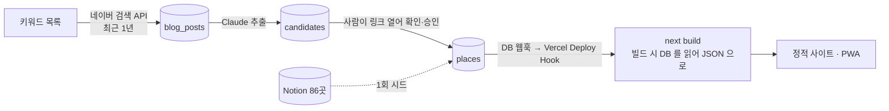

# TODO — 블로그 수집 → AI 분석 → 승인 → DB → 자동 배포

> 최종 수정: 2026-09-23 (v14: **좌표 보강도 네이버로** — `kakaoLocal.mjs` → `naverLocal.mjs`(02 수집과 같은 키). 검색 API 시한은 사용자가 2026-07-25 전에 발급해 둬 **2027-06-30 까지 산다**(확인 완료).
> 「다음 할 일」 을 `feature/naver-map` 기준으로 다시 썼다 — 끝난 것 / 남은 실행 순서 / **미검증 둘**(좌표 포맷 · 오프라인 지도)로 나눴다)
> 이전 (v13: 🚨 **네이버 검색 API 전제가 흔들린다** — 개발자센터 신규 발급이 2026-07-31 종료됐고, 2026-09-07 개정 약관이 검색 결과를
> **외부 AI 에 입력하는 것 자체를 금지**한다. 2·3 단계가 여기 걸린다(아래 「막힌 것」 절). 지도는 네이버로 교체 완료(ADR-008 v4). 조사 원문은 [naver-migration-research.md](naver-migration-research.md).
> 실행 순서의 `[Claude] self-cr → push` 는 이미 끝났다 — `main` = `origin/main` = `dabb092`)
> 이전 (v12: "다음 할 일" 을 **실행 순서 블록**(누가 무엇을 치는가)으로 다시 쓰고 끝난 항목은 접었다. 상태 줄·단계 표에 남아 있던
> "(b) 는 파일만 · GitHub 시크릿 2개 · 미커밋" 을 현재 사실로 — (b) 는 원격 적용·실측 완료이고 열린 것은 어드바이저 대시보드 확인 하나. JWT expiry 3600 → **43200**(실효 11.5시간). 세션 로그 (6) 을 (5) 위로)
> 이전 (v11: **(b) 원격 적용·실측 완료** — `db push` 뒤 anon/세션 경로를 테이블·동작별로 실측(진행 상태 0 의 (b) 줄). JWT expiry 3600 실측. 남은 것은 self-cr → push → 로컬 잠금)
> 이전 (v10: **(c) 구현** — `collect.yml` 삭제 · `supabaseClient` 세션/anon 둘(service 키는 CI 든 아니든 트립와이어) · `collect-blog` 네이버 키 숨김 입력 ·
> `loginReadHidden` → `readHidden` 리네임 · 옛 Actions 문구 정리 · (b) `narrow_grants` 마이그레이션 **파일** · 문서(todo 00·02·03·04·05·이 README). GitHub 시크릿 2개 삭제 완료(`gh secret list` 빈 결과 — **0개**). (b) 는 파일만 — 원격 적용은 v11.
> 다음 할 일 4 삭제(목표 소멸), 5 이후 번호 하나씩 당김)
> 이전 (v9: **결정 2 = (c) Actions 폐지** + 네이버·Kakao 키는 사용자가 로컬에서 직접 관리(스크립트는 env 또는 TTY 숨김 입력, 저장 없음).
> 구현 계획을 다음 할 일 2 에 항목화 — 새 세션은 거기서 시작. 대시보드 몫(legacy secret 퇴역·sign-up off·secure password change on) 완료)
> 이전 (v8: 다음 할 일 3 의 Claude 파트 완료 — Preview 빌드 로그 `publishable(anon)` 실측(Preview env 에 service 키가 남아 있어도), self-cr minor 4건 반영(+29 테스트=440).
> 사용자 재확인: 마켓플레이스 연동은 끊는다(쓰는 기능 0, 넣는 값은 전부 만료 없는 우회 키). 옛 env 파일 2개는 지워진 것 확인)
> 이전 (v7: 사용자 결론 "Claude 는 민감정보를 알아선 안 된다" 를 계획으로 — 실행 경로가 곧 읽기 경로이므로 만료 없는 우회 키·접속 정보를
> 에이전트가 트리거할 수 있는 경로(로컬 파일·Vercel env·Actions)에서 전부 뺀다. RLS 는 PostgREST 로 실측 완료. 마켓플레이스 연동은 끊기로. Actions 경로는 🙋)
> 이전 (v6: 다음 할 일 0(Auth 로그인 모델) 구현 완료 — 마이그레이션 2개 적용, `pnpm data:login/logout`, 통로 재작성. 남은 건 사용자 몫(publishable 키·대시보드 3개·회전)과 엔드투엔드 확인. 보안 리뷰 반영)
> 이전 (v5: 배포 복구 확인 완료. 시크릿은 저장하지 않고 로그인된 CLI 로 실행 시점에(ADR-016) — 다음 할 일 1·2 를 그 절차로, 세션 로그)
> 이전 (v4: 3 코드 완료(Claude 는 구독 `claude -p`), 4a 완료(+BUG-005 수정), 5 검증 항목 완료. 세션 로그·🙋 표 갱신)
> 이전 (v3: 0·1·2·5 에 실제 코드가 생겨 진행 상태를 항목별로 쪼갬. 세션 로그 절 추가)
> 이전 (v2: 가정 두 개가 확정돼 ADR-015 로 옮김. 회원은 todo 범위 밖으로)
> 이전 (v1: 신설 — 5단계 파이프라인의 실행 트래커)
> 상태: **진행 중**. 0·1·2·3·5 는 코드가 있고 4a 도 끝났다. 시크릿 모델(ADR-016)은 구현·실측 완료로 `main` 에 있다. **지도와 좌표 보강은 네이버로 옮겨 `feature/naver-map` 에 있다(미push).** 남은 것은 **self-cr → push → 로컬 잠금 → 키워드 확정 → 첫 수집·분석 실행(사용자 터미널)** 과 4b(웹훅 재빌드), 그리고 미검증 둘(좌표 포맷 · 오프라인 지도)이다. 각 항목의 `[ ]` 를 채워 가며 진행하고, 결정이 확정되면 ADR 로 옮기고 여기서는 링크만 남긴다.

## 목표

지금은 Notion 에서 한 번 뽑은 86곳이 빌드에 구워져 있고 갱신은 사람 손이다. 이걸 아래로 바꾼다.



| 단계 | 문서 | 지금 | 목표 |
|---|---|---|---|
| 0 | [00-setup-supabase-vercel.md](00-setup-supabase-vercel.md) | 끝남 — GitHub 0개·Vercel 0개(실측), 로컬은 세션만. 남은 건 Deploy Hook(4b) | 프로젝트 둘 다 생성, **시크릿은 GitHub 0개·Vercel 0개**(로컬은 세션만) |
| 1 | [01-schema-and-seed.md](01-schema-and-seed.md) | 데이터는 `src/data/*.json` 뿐 | Supabase 가 원본. 86곳·15개 시드, `data:pull` 로 JSON 생성 |
| 2 | [02-collect-naver-blog.md](02-collect-naver-blog.md) | 코드 완료(실행 전) | 키워드로 최근 1년 블로그 글을 **사용자 터미널에서 수집**(`pnpm data:collect`, 스케줄 없음) |
| 3 | [03-analyze-and-review.md](03-analyze-and-review.md) | 코드 완료(실행 전) | Claude(구독, 로컬 `claude -p`)가 장소·조건을 뽑고, 사람이 링크 보고 승인 — 사용자 터미널의 운영자 세션에서 |
| 4 | [04-deploy-and-propagate.md](04-deploy-and-propagate.md) | 4a 완료(빌드가 DB 를 anon 으로 읽음) · 4b 없음 | 승인 → 자동 재빌드 → 사이트 반영(수동 경로는 `data:apply` 뒤 Redeploy) |
| 5 | [05-security.md](05-security.md) | 두 출처(세션·anon) · (b) GRANT 축소 원격 적용·실측 완료(어드바이저 확인만 남음) | 키 분리·RLS·GRANT 상한·웹훅 서명·프리뷰 보호 |

## 이 계획이 서 있는 결정 — [ADR-015](../decisions/ADR-015-supabase-source-and-rebuild.md)

2026-09-18 사용자 확인으로 확정됐다. 요지만:

1. **원본은 Supabase.** 와이프가 더 이상 Notion 을 편집하지 않는다 → Notion 은 1회 시드. 손으로 고칠 일은 Studio 에서.
2. **반영은 재빌드.** DB 웹훅 → Deploy Hook → 빌드 안에서 `data:pull`. 앱 번들에 Supabase 없음, 기존 ADR 전부 유지.
3. **회원·로그인은 todo 에 없다.** ADR-011·012 는 "추후 고도화" 로 보류. 필요해지면 4 만 런타임 fetch 로 다시 쓴다.

## 순서와 의존

```
0 (계정·시크릿) ──▶ 1 (스키마·시드·data:pull) ──▶ 4 (Vercel 빌드 = pull + build)   ← 여기까지가 "DB 가 원본" 의 최소 완성
                                   │
                                   └──▶ 2 (수집) ──▶ 3 (분석·승인) ──▶ 4 의 웹훅 재빌드
5 (보안) 은 0 에서 시작해 각 단계마다 항목이 하나씩 붙는다
```

**0 → 1 → 4 를 먼저 끝낸다.** 수집·분석(2·3) 없이도 "Studio 에서 한 줄 고치면 사이트가 바뀐다" 가 성립하고,
그 상태가 2·3 을 만드는 동안의 안전한 기반이다.

## 진행 상태

- [x] 가정 1·2 확인 → [ADR-015](../decisions/ADR-015-supabase-source-and-rebuild.md) (2026-09-18)
- **0** Supabase · Vercel · GitHub Secrets
  - [x] Supabase 프로젝트(서울 리전, `zgnn_supabase`) 생성 · CLI link
  - [x] Vercel Git 연동(대시보드에서 `main` → Production)
  - [x] GitHub Secrets — (c) 결정(2026-09-22 (3))으로 **목표가 0개** → 2026-09-22 (5) 죽은 값 2개(`SUPABASE_SERVICE_ROLE_KEY`·`SUPABASE_URL`) `gh secret delete`(이름만) → `gh secret list` 빈 결과. **0개 달성.**
        ~~Actions 워크플로도 삭제 예정~~ → [x] `collect.yml` 삭제(2026-09-22 (5), `.github/` 소멸)
  - [x] Vercel CLI link · Kakao 지도 배포 도메인(`zgnn.vercel.app/map` 정상). Vercel 환경변수는 ADR-016 v4 뒤로 **필요 없어졌다** — [x] 마켓플레이스 연동 해제 + env 전부 삭제(2026-09-22 (2), `vercel env ls` → No Environment)
  - **시크릿 모델 = Auth 로그인**([ADR-016](../decisions/ADR-016-secrets-by-login.md), v5 = 세션·anon 두 출처)
    - [x] 마이그레이션 `operators`+RLS 8정책(`20260921075901`·`20260921080333`, 원격 적용, 어드바이저 No issues)
    - [x] **(b) `20260922120000_narrow_grants.sql`** — 파일 작성(2026-09-22 (5)), `db push` 적용(2026-09-22 (6)): 여섯 테이블 ALL 회수 · anon 은 places·items select · authenticated 는 5 테이블 select/insert/update + operators select ·
          default privileges 차단 · `operators_all` → select/insert/update 15 정책 · `is_operator()` execute 는 authenticated 만. **원격 적용·실측 완료(2026-09-22 (6))**: anon = places 86·items 15 select 만(blog_posts·candidates·operators select, delete·insert, `rpc is_operator` 전부 42501) · 운영자 세션 = 5 테이블 select(operators 는 자기 행 1) · delete → 42501 · insert 는 grant·정책을 지나 not-null(23502)에서 멈춤 · `data:apply --dry-run` 반영 0건 exit 0 · `CLAUDECODE=1 data:collect` 거부 문구 실측. JWT expiry 는 (6) 시점 **3600 실측**(로그인 문구의 만료가 +1h, 실효 30분) → 같은 날 사용자가 **43200** 으로 올렸다(실효 11.5시간)
    - [x] `pnpm data:login`/`logout`(`scripts/login.mjs`·`logout.mjs`·`lib/sessionKeychain.mjs`) · `lib/supabaseClient.mjs` ~~출처 3단계 + 13 테스트~~ → **출처 둘(세션/anon) + 18 테스트**(2026-09-22 (5):
          service 경로·`SUPABASE_URL` override·`inCi` 삭제, env 에 service 키가 있으면 CI 든 아니든 throw, `readOnly` 는 anon + 이름만 경고) · `pull-db` readOnly · deny 확장
    - [x] `PUBLISHABLE_KEY` 상수 채움(2026-09-21 (4)) → `pnpm data:pull` 이 **PostgREST 의 anon 경로**로 86·15 행, diff 없음 — anon 정책은 실측됐다
    - [x] `operators` insert(`zgnn@gmail.com` 만 — `zgnn-test@gmail.com` 은 비운영자 역할로 밖에 둔다) · **RLS 를 PostgREST 로 실측**(2026-09-21 (4), `data:apply --dry-run`):
      세션 없음 → 로그인 안내 exit 1 · 비운영자 → `places 가 비어 있다` exit 1 · 운영자 → `반영 0건` exit 0. 세 결과가 갈렸으므로 이제 추론이 아니다
    - [x] 대시보드(2026-09-22 (3) 사용자 완료 보고): 회원가입 off · Secure password change on · legacy JWT secret 퇴역(Migrate → Rotate → legacy API keys disable → Revoke).
      퇴역 뒤 anon `data:pull` 86·15 diff 없음 실측. **JWT expiry 는 2026-09-22 사용자가 3600 → `43200` 으로 올렸다** — 코드의 30분 skew 를 빼면 실효 창 **11.5시간**이라
      ADR-016 의 "≥ 8시간" 전제를 채운다(코드는 손댈 것 없음 — `SESSION_MAX_TTL_S` 24시간 안). 남은 확인은 다음 `pnpm data:login` 의 만료 문구가 **+12시간**인지 하나뿐 · ~~Vercel env 삭제~~(완료)
  - [ ] Vercel Deploy Hook(4b)
- [x] 1 스키마 + RLS + 시드 + `scripts/pull-db.mjs` (시드→pull 왕복, `git diff src/data` 빈 결과로 확인)
- **2** 수집
  - [x] 코드 — `scripts/collect/keywords.json` · `scripts/collect/naverBlog.mjs`(23 테스트) · `scripts/collect-blog.mjs`(네이버 키: env 또는 TTY 숨김 입력, `CLAUDECODE` 거부 — 2026-09-22 (5)) ·
        `scripts/lib/readHidden.mjs`(← `loginReadHidden`, 두 소유자라 리네임, 17 테스트). ~~`.github/workflows/collect.yml`~~ 삭제
  - [ ] 실행 — 사용자 터미널에서(`pnpm data:login` → `pnpm data:collect`). 네이버 개발자센터 키 발급 전이라 아직 한 번도 안 돌림
- **3** 분석·승인
  - [x] 코드 — `scripts/analyze/{naverPostBody,extractPlaces,naverLocal,matchPlace,analyzeCandidates,applyApproved}.mjs`(테스트 포함) ·
        `scripts/analyze-candidates.mjs` · `scripts/apply-approved.mjs`. ~~`collect.yml` 에 analyze→apply step~~ → 사용자가 따로 부른다. Claude 인증은 로컬 `claude` 로그인뿐(자식 env 허용 목록에서 토큰·CI 제거, 2026-09-22 (5))
  - [x] `matchPlace` 본체 — 기본안 구현(🙋 였던 자리. `THRESHOLD`·`WEIGHT` 로 조정). 자동 승인은 `AUTO_APPROVE=false` 로 시작
  - [x] 엔드투엔드 1건 — 실제 후기 링크로 본문 → `claude -p` → 대조까지(DB 쓰기 없이)
  - [ ] 실행 — `blog_posts` 가 비어 있어(02) 아직. 사용자 터미널의 운영자 세션에서(아래 **실행 순서** 블록)
- [x] 4a Vercel 빌드 명령 `pnpm data:pull && pnpm build`(`vercel.json`) — 첫 배포는 `outputDirectory: "out"` 때문에 실패했고(BUG-005) 고쳐 커밋했다. push 뒤 확인
- [ ] 4b DB 웹훅 → Deploy Hook 자동 재빌드
- **5** 보안
  - [x] `scripts/check-bundle.mjs` 유출 검사(빌드 뒤 자동 실행) · `.env.example` 커밋
  - [x] anon select 빈 결과(5 테이블 `[]`) · env→번들 유출 경로(참조가 있을 때만 잡힘 — 그게 맞는 자리) · 보안 헤더 3개(`vercel.json`)
  - [x] ~~🙋 마켓플레이스가 넣은 여분 시크릿 정리~~ → 연동 해제 + env 0개(2026-09-22 (2)) · service_role 은 회전 대신 퇴역(2026-09-22 (3))
  - [ ] 프리뷰 보호 · 키 회전 절차(남은 대상은 네이버 키·Deploy Hook 뿐) · ~~(b) GRANT 축소 원격 적용·검증~~(완료 (6)) · 7일 일시정지를 깨우는 잡이 없어졌다(05 에 비용으로 기록)
- [x] `docs/architecture/data-pipeline.md` v2 (이번에 반영)

체크박스가 정본이다. 진행 상황을 다음 세션에 넘길 때는 아래 세션 로그에 한 줄 남긴다.

## 다음 할 일 (2026-09-23 기준 — 새 세션은 여기서 시작)

브랜치 **`feature/naver-map`** (`main` `dabb092` 에서 시작). 지도 교체 · 좌표 보강 네이버 전환 · 문서. **커밋 5개, 아직 push 안 했다.**
그 앞의 `feature/local-only-pipeline` 은 `main` 에 머지됐다(= ADR-016 구현·실측, (b) GRANT 축소, Actions 폐지까지 전부 `main` 에 있다).

### 이 브랜치에서 끝난 것 (새 세션이 다시 하지 말 것)

- **지도 = 네이버 NCP Maps v3.** `src/lib/naverMap.ts` · `src/naverMaps.d.ts` · `mapPageCanvas` · `sw.ts` · `places.ts`. Kakao 파일 2개 삭제.
  **브라우저 실측 완료** — `/map` 렌더·마커·로고·저작권 표시 정상, 서비스워커 캐시 항목 수(타일 23 · 자원 6 · SDK 2)까지 셌다.
- **좌표 보강 = 네이버 지역 검색.** `scripts/analyze/naverLocal.mjs`(29 테스트). **02 수집과 같은 키**를 쓴다 — 키를 더 발급하지 않아도 된다.
- 결정은 [ADR-008 v4](../decisions/ADR-008-map-provider.md)(파일명이 `ADR-008-kakao-map.md` → `ADR-008-map-provider.md` 로 바뀌었다). 조사 원문은 [naver-migration-research.md](naver-migration-research.md).
- 451 테스트 통과 · `pnpm build` 통과 · 번들 유출 검사 통과.

### 남은 것 — 실행 순서 (이 블록이 정본)

```
[Claude]  self-cr → push (브랜치 최초 push 라 하드 게이트가 걸린다)
[사용자]  로컬 잠금 3개: vercel logout · gh auth logout -u hoiya-woohyun · ssh-keygen -p -f ~/.ssh/id_ed25519_hoiya
[사용자]  검색 키워드 확정(🙋 02) → [Claude] scripts/collect/keywords.json 반영
[사용자]  pnpm data:login   → 만료 +12시간 확인
[사용자]  pnpm data:collect → 네이버 키 숨김 입력, blog_posts 채움
[Claude]  pnpm data:analyze --dry-run --limit 5     ← 좌표 보강의 첫 실측이 여기서 난다(아래 ⚠️)
[사용자]  pnpm data:analyze --limit 30   (구독 5시간 한도 때문에 30씩. 좌표 보강을 켜려면 네이버 키를 env 로)
[Claude]  pnpm data:apply --dry-run → [사용자] pnpm data:apply
[사용자]  Studio 에서 후보 20건쯤 → AUTO_APPROVE·THRESHOLD·WEIGHT 결정(🙋 03)
[사용자]  Supabase 대시보드 어드바이저 한 번 확인((b) 검증의 마지막 항목)
[사용자]  배포 뒤 실기기 비행기 모드 — 지도가 오프라인에서 뜨는가(아래 ⚠️)
[Claude]  4b: Vercel Deploy Hook → Supabase DB 웹훅(🙋 04: 승인마다 재빌드 vs 모아서)
```

굳어 있는 순서는 셋뿐이다. **push → 로컬 잠금**(먼저 잠그면 push 가 막힌다 — 로그아웃은 늘 심부름의 끝에),
**네이버 키 → `data:collect`**(키 없이는 `blog_posts` 가 안 찬다), **`collect` → `analyze` → `apply`**.
어드바이저 확인과 4b 는 그 사이 어디서 해도 된다. `data:collect` 는 에이전트 세션에서 거부되므로(`CLAUDECODE`) **사용자 터미널 몫**이고,
`data:analyze`·`data:apply` 는 사용자가 `pnpm data:login` 해 둔 동안 Claude 도 돌릴 수 있다.

### ⚠️ 미검증 둘 — 새 세션이 먼저 확인할 것

1. **좌표 보강의 실제 응답을 아직 한 번도 못 봤다.** `blog_posts` 가 비어 있어 `data:analyze` 를 돌린 적이 없다.
   코드는 `mapx`/`mapy` 를 **WGS84 × 10^7 정수**로 읽는데, **공식 문서가 스스로 모순된다** — 본문은 "WGS84 좌표계 기준" 이라 하고
   응답 예제는 옛 KATECH 6자리(`<mapx>311277</mapx>`)를 그대로 두고 있다. 그래서 나눈 값이 제주 범위 밖이면 **버리도록** 해 뒀다.
   → 첫 실행에서 **"좌표 보강이 전부 null"** 이면 포맷이 우리가 아는 것과 다른 것이다. 그때 실제 응답 한 건의 `mapx`/`mapy` 자릿수를 보고
   `parseNaverCoord` 를 고치고 `naverLocal.test.mjs` 에 그 값을 못 박는다. 지금 통과하는 테스트는 **가정을 못 박은 것이지 실측이 아니다.**
2. **오프라인 지도가 뜨는지 모른다.** 네이버 SDK 는 지도를 만들 때 `/v3/auth?…&time=<매번 다름>` 을 런타임에 부르고,
   `time` 때문에 서비스워커 캐시가 그 요청을 절대 맞출 수 없다. Playwright 의 offline 에뮬레이션은 서비스워커보다 앞단을 막아 검증에 실패했다.
   정황은 나쁘다 — `/v3/auth` 가 401 일 때 SDK 는 타일을 안 그리고 예외를 던졌다. → **실기기 비행기 모드로 확인**하고,
   안 뜨면 `sw.ts` 의 타일·자원 규칙을 지우고 `pwa-offline.md`·ADR-008 의 오프라인 절을 "지도는 온라인 전용" 으로 확정한다.

### 🚩 결정은 됐지만 해소되지 않은 것 — 검색 결과 저장

네이버 검색 API 약관도, Kakao 로컬 API FAQ 도 **결과 데이터의 별도 저장·DB화를 금지**한다(NCP Maps 약관 제7조 ⑪ 은 "지도 좌표 데이터" 를 예시로 콕 집는다).
우리는 지역 검색이 준 좌표·주소를 `places` 에 굽는다. **벤더를 옮겨도 이 자리는 그대로**이고, 2026-09-23 사용자 판단으로 **네이버 기준으로 진행**하기로 했다.
기록만 남긴다 — 나중에 문제가 되면 선택지는 "사람이 Studio 에서 좌표를 넣는다" 뿐이다.

### 네이버 검색 API 의 시한 — 2027-06-30 (기록)

- 2026-07-31 개발자센터 **신규 발급 종료**(신규는 NAVER API HUB / 유료 종량제).
- **사용자는 그 전에 발급받아 뒀다**(2026-09-23 확인) → 발급일로부터 1년, 늦어도 **2027-06-30** 까지 지금 경로가 산다.
- 2026-09-07 개정 약관이 검색 결과를 "입력하거나 학습·개선·평가·노출에 활용하는 행위" 를 금지한다. 3단계(`claude -p` 본문 분석)가 여기 걸리는지는
  **사용자가 알고 진행하는 것으로 정리됐다**(본문은 블로그 HTML 에서 읽고 검색 API 결과가 아니지만, 링크는 검색 API 가 준다).

### 접힌 것 — 끝난 항목의 근거만

0. ~~Auth 로그인 모델 구현 · publishable 키 · `operators` · RLS 실측~~ **완료**(2026-09-21 (4)).
1. ~~경로 닫기(사용자 터미널·대시보드)~~ — **로컬 잠금 3개만 남았다**(위 블록). 닫힌 것: 옛 `.env.local`·`.vercel/.env.production.local` 둘 다 없는 것 확인(2026-09-22 (2)) ·
   Vercel 마켓플레이스 **연동 해제** + env 0개(2026-09-22 (2) `No Environment`) · `supabase` CLI 는 휴지 = 로그아웃(스키마 작업 때만 열고 끝나면 닫는다) ·
   대시보드 회원가입 off · Secure password change on · **JWT expiry 43200**(2026-09-22, 실효 11.5시간).
   기록해 둘 절차 하나 — Supabase 의 legacy JWT secret 은 **회전 버튼이 없다**. 서명키 시스템이라 *퇴역*시킨다: JWT Keys 에서 ① Migrate JWT secret → ② standby 키(ECC P-256) 만들고 Rotate keys →
   ③ API Keys 에서 legacy `anon`·`service_role` disable → ④ "previously used" legacy 키 Revoke(공식 docs `guides/auth/signing-keys`). 2026-09-22 (3) 완료.
   `gh` 잠금의 함정: 레포 소유 계정(`hoiya-woohyun`)이 `gh` 의 기본 활성 계정이 아니다. Free private 레포는 브랜치 보호가 안 되므로 **이 로그아웃이 "에이전트가 빌드를 트리거할 수 없다" 를 만드는 유일한 문**이다
   (Actions 는 (c) 로 없어졌으니 남은 트리거는 Vercel 빌드뿐이고, 그 빌드는 anon 이라 읽을 시크릿이 없다).
2. ~~(c) Actions 폐지 구현 · (b) `narrow_grants` · GitHub 시크릿 삭제~~ **완료**(2026-09-22 (5)·(6)). 구현·실측 목록은 진행 상태 0 과 세션 로그 (5)·(6) 이 정본이고,
   (b) 에서 **열린 것은 어드바이저 대시보드 확인 하나**(위 블록). 결정 근거만 남긴다: 네이버·Kakao 키는 **사용자가 로컬에서 직접 관리**한다 — 스크립트는 env 로 받고 없으면 TTY 숨김 입력,
   레포·키체인·파일 어디에도 저장하지 않으며 에이전트 세션이면 exit 1. Kakao REST 키는 사용자가 안 쓴다(지도 JS 키와 다른 키) — 없으면 좌표 보강을 건너뛴다.
   (a) 봇 운영자 로그인은 **기각**(봇의 이메일·비밀번호가 GitHub 에 남아 service 키와 구조가 같다). **비용**: 화·금 자동 수집이 없어 `blog_posts` 는 사용자가 돌릴 때만 차고,
   7일 비활성 일시정지를 깨우던 잡도 사라졌다(05).
3. ~~배포 확인 — self-cr → push → Preview 가 `publishable(anon)` 인지 → Vercel 정리 → `main` 머지 → 프로덕션~~ **완료**(2026-09-22 (2)):
   `main` `63abb90` 프로덕션 Ready, Vercel env 0개·연동 없음 상태에서 `publishable(anon)` 86·15, 유출 검사 통과. self-cr 지적(major 1 + minor 4)도 전부 반영됐다 —
   그중 남는 불변식 하나: `readOnly` 는 env 에 service 키가 남아 있어도 anon 이다("빌드는 anon" 이 env 정리 순서가 아니라 **코드 불변식**).

## 세션 로그

세션이 끝나거나 컨텍스트가 커져 나눌 때 여기에 한 항목. 체크박스가 정본이고 로그는 인수인계 메모.

- 2026-09-23 — **지도·좌표 보강을 네이버로.** 브랜치 `feature/naver-map`, 커밋 5개(미push).
  한 것: NCP Maps v3 교체(로더·타입·캔버스·sw·zoom) → **브라우저 실측**(렌더·캐시 항목 수) → `naverLocal.mjs`(29 테스트) → 문서 8개.
  실측이 문서 조사를 **세 번 뒤집었다**: (1) 타일·자원 호스트가 **페이지 프로토콜에 따라 갈린다**(HTTPS `*.pstatic.net` / HTTP `*.naver.net`) — 한쪽만 적으면 캐시가 조용히 빈다,
  (2) `navermap_authFailure` 는 401 에서 **안 불리고** SDK 가 `Marker.setMap` 에서 던진다 → try/catch 필수,
  (3) **포트를 본다**(등록 안 된 포트 → 401) — 7727 고정 유지. 2차 출처들의 "호스트만 본다" 는 틀렸다.
  약관 1차 출처 확보(Maps 제7조 ⑪): 금지 대상은 "지도 **좌표** 데이터" 이지 타일이 아니다 — 2차 요약들이 타일로 잘못 인용하고 있었다.
  **하지 말 것**: 워크플로로 웹 조사를 팬아웃하지 말 것(이 세션에서 5 에이전트가 전부 stall, 2.2M 토큰·2.8시간 낭비. 다만 트랜스크립트에서 결과를 건질 수는 있었다).
  사고 하나: 2일 된 `next dev` 가 7727 을 잡고 있어 한참 dev 서버를 정적 빌드로 착각했다 — 포트 점유를 먼저 볼 것.
  다음: self-cr → push → 로컬 잠금 → 키워드 확정 → 첫 수집·분석. 미검증 둘은 「다음 할 일」 의 ⚠️ 절.

- 2026-09-22 (6) — **(b) 원격 적용·실측**. 사용자 `supabase login` → dry-run 에 `narrow_grants` 하나 → 사용자 확인 뒤 `db push` 적용 → **원격 적용·실측 완료(2026-09-22 (6))**: anon = places 86·items 15 select 만(blog_posts·candidates·operators select, delete·insert, `rpc is_operator` 전부 42501) · 운영자 세션 = 5 테이블 select(operators 는 자기 행 1) · delete → 42501 · insert 는 grant·정책을 지나 not-null(23502)에서 멈춤 · `data:apply --dry-run` 반영 0건 exit 0 · `CLAUDECODE=1 data:collect` 거부 문구 실측. JWT expiry 3600 실측(로그인 문구의 만료가 +1h) — 실효 30분이라 `data:analyze` 는 `--limit 30` 씩이거나 43200 으로 올린다(→ 같은 날 사용자가 **43200** 으로 올려 닫혔다). 검증용 임시 스크립트는 지웠다(값 없이 코드·행 수만 찍는 것).

- 2026-09-22 (5) — **(c) 구현 워크플로**(브랜치 `feature/local-only-pipeline`): 구현 4갈래 병렬(A `supabaseClient` 세션/anon 둘 + 트립와이어 · B `collect-blog` 숨김 입력 + `readHidden` 리네임 ·
  C `collect.yml` 삭제 + 옛 Actions 문구·allowlist 정리 · D (b) `narrow_grants` 마이그레이션 파일) → 문서 2갈래(todo 5편·README / ADR-016 v5·architecture·CLAUDE.md) → 3렌즈 리뷰 13건 → 지적마다 반박 2표 →
  확인 7건. **함정**: Fix 에이전트가 8파일 17편집을 적용하고 테스트(439)까지 돌린 뒤 구조화 보고 직전에 구독 세션 한도로 죽었다 → resume 의 재검증이 "이미 반영된 상태" 를 보고 전부 stale 판정 →
  워크플로 회계는 "확인 0·Fix 건너뜀" 이지만 실제로는 **리뷰 패스 없이 들어간 편집**이 커밋에 섞여 있다(`.cursor/rules` · `supabaseClient{,.test}.mjs` · ADR-016 · todo 00·01·05 · CLAUDE.md) —
  self-cr 에 이 목록을 넘겨 커버. 메인이 직접 넣은 것: `collect-blog` 빈 id 면 secret 안 묻기 한 줄(테스트 없음). GitHub 시크릿 2개 삭제(`gh secret list` 빈 결과, 0개). 커밋 3개(코드·마이그레이션·문서).
  **남은 것**: 사용자 `pnpm exec supabase login` → (사용자 확인 뒤) `db push` → 사용자 `pnpm data:login` → `data:apply --dry-run` 검증(delete 42501 · anon pull 86·15) → `supabase logout` → self-cr → push → 로컬 잠금 3개.
  (b) 는 push 전까지 **미검증** — 검증이 push 앞인 이유: `db push` 가 grant 실수를 드러내면 깨진 마이그레이션을 올리는 대신 같은 커밋을 고친다.

- 2026-09-22 (4) — **결정 2 = (c)**. 사용자가 (c) 선택 → advisor 지적으로 키 전달 방식을 물어 "네이버·Kakao 키는 내가 로컬로 관리" 로 확정(env 또는 TTY 숨김 입력, 저장 없음;
  Kakao REST 는 안 씀). 대시보드 몫 완료 보고 뒤 anon `data:pull` 86·15 실측(legacy 키 퇴역 뒤에도 OK), 옛 세션은 만료 상태. 구현은 컨텍스트(436k) 때문에 **새 세션**에서 —
  다음 할 일 2 에 구현·검증 목록을 항목화해 둠. 로컬 잠금 3개(`vercel logout`·`gh` hoiya 로그아웃·SSH 암호구)는 구현 push 뒤 세션 마지막에.

- 2026-09-22 (3) — 사용자가 Supabase 에서 "JWT secret" 을 못 찾음 → 공식 docs 확인: 회전 버튼이 없고 JWT 서명키 시스템(Migrate → Rotate → legacy API keys disable → Revoke)으로
  퇴역시킨다. todo 1 의 두 항목을 이 절차 하나로 정정. Vercel 의 `SUPABASE_JWT_SECRET` 은 연동이 넣은 실제 값이었다(4일 전·마켓플레이스 배치, 손으로 넣은 3개는 1일 전).

- 2026-09-22 (2) — **다음 할 일 3 의 Claude 파트**. (1) 상태 점검: 옛 `.env.local`·`.vercel/.env.production.local` 은 이미 없음 · `vercel`·`gh`(두 계정) 로그인 상태 ·
  `supabase` CLI 로그아웃 · Vercel env 는 마켓플레이스 15개 그대로(정리 전). (2) Preview(`1b4264c`) 빌드 로그 `Supabase 인증: publishable(anon — published 읽기만)` ·
  `pull 완료: places 86 · items 15` — service 키가 env 에 있어도 anon, 코드 불변식 실측. (3) self-cr minor 4건을 워크플로(구현 → 3렌즈 리뷰 → 지적마다 반박 2표 →
  반영 → 최종 검증, 에이전트 20)로 반영: 리뷰 7건 중 6건 확인·반영(그중 실질은 겹친 Meta 접두 `ESC ESC [ A` 회귀 1건 — 옛 코드는 맞았다), 1건(비문자열 토큰의
  `toString` 재호출)은 표가 갈려 메인이 `typeof` 한 줄로 닫음. 테스트 411 → 440. (4) 사용자 질문 "연동이 편의성 아닌가" → 이 프로젝트가 쓰는 연동 기능이 0(env 주입·
  Redirect URL·청구·Branching 전부 미사용)이고 넣는 값은 전부 만료 없는 우회 키라 제거로 재확인. (5) 사용자가 연동 해제 → 마켓플레이스 변수 12개 소멸, 손으로 넣은 3개는
  Claude 가 `vercel env rm`(값 노출 없음) → `No Environment`. `main` ff 머지(`541c3ae..63abb90`) → 프로덕션 Ready, anon 86·15. **다음 할 일 3 닫힘.** 남은 사용자 몫: JWT 서명키 회전 ·
  secret key 재발급+legacy 폐기 · 대시보드 3개 · `vercel`/`gh`/SSH 잠금 · 🙋 2(Actions 경로).

- 2026-09-21 (4) ~ 09-22 — **RLS 실측 완료·원칙 확정**. (1) 사용자가 publishable 키를 줌 → `PUBLISHABLE_KEY` 채움 → `data:pull` 이 anon 으로 86·15 행(PostgREST 첫 통과).
  (2) 계정 2개(`zgnn@gmail.com` 운영자 · `zgnn-test@gmail.com` 비운영자) → `operators` insert(운영자만) → `data:apply --dry-run` 3라운드: 세션 없음 exit 1 · 비운영자
  `places 가 비어 있다` exit 1 · 운영자 `반영 0건` exit 0. (3) JWT expiry 는 기본 3600 유지(사용자 결정) — skew 30분과 합치면 실효 세션 30분, 문서에 보류로. (2026-09-22 `43200` 으로 변경돼 이 보류는 닫혔다.)
  (4) 마켓플레이스 연동 논의 → 사용자 결론 "Claude 는 민감정보를 알아선 안 된다" → 접근 경로 = 읽기 경로(빌드 env 는 push 한 줄로 읽힘)이므로 계획을
  "우회 키를 에이전트가 트리거할 수 있는 경로 어디에도 두지 않는다" 로 다시 씀(다음 할 일 v7). 연동은 끊는다(A/B 판별 뒤 Disconnect 만). Actions 경로는 🙋 (a) 권장.
  (5) `supabase` CLI 는 로그아웃 상태 확인. 커밋 4개 로컬, **미push** — Vercel env 정리가 먼저다. 사용자가 다음에 검토 재개.

- 2026-09-21 (3) — **다음 할 일 0 구현**(ADR-016 v4): (1) 마이그레이션 `operators`+`is_operator()`+정책 7개 push → 어드바이저가 definer 함수의 RPC 노출을
  경고(0028/0029) → 두 번째 마이그레이션으로 invoker + `operators_read_self`(정책 안 서브쿼리는 호출자 역할이라 자기 행 정책이 없으면 **조용히 false**) → No issues.
  (2) `scripts/lib/sessionKeychain.mjs`(키체인, `security -i` stdin 으로 써서 argv 에 안 실림) · `supabaseClient.mjs` 재작성(env service → 세션 JWT(60초 skew) →
  anon, `readOnly` 는 pull-db 만, 출처 이름을 한 줄 로그) · `login.mjs`(TTY·CLAUDECODE 가드, refresh 폐기) · `logout.mjs` · 13 테스트. `PROJECT_REF` 상수(Vercel 엔 link 파일이 없다),
  `PUBLISHABLE_KEY` 는 **빈 문자열** — 사용자가 준다. (3) `collect.yml` 에서 `SUPABASE_URL` 제거, deny 에 `security -i`·api-keys 변형 추가(파이프 안에서도 막히는 걸 실측).
  (4) 함정: `supabase migration new` 는 stdin 이 TTY 가 아니면 SQL 을 기다리며 **멈춘다** — `</dev/null` 을 붙이거나 파일을 직접 쓴다.
  (5) **구멍 발견**: `pnpm data:pull` 로그가 `env(service key)` 를 찍어 봤더니 옛 `.env.local` 과 `.vercel/.env.production.local` 에 service_role 키가 평문으로 남아 있었다(값은 안 봄 —
  이름만). 에이전트 `rm` 은 권한 거부 → 사용자가 지운다(다음 할 일 1). 코드에 **CI 가드** 추가: `CI` 가 아니면 env 의 service 키를 거부하고 멈춘다(14 테스트).
  (6) `pnpm login`/`logout` 이 pnpm 내장 명령(npm 로그인)이라 가려짐 → `data:login`/`data:logout` 으로 개명. (7) 보안 중점 리뷰(4 렌즈 + 렌즈별 적대 검증, 8 에이전트, 50건 확인·1건 반박) 반영. **결론: `pnpm data:*` 경로는 요구 ①~⑤를 채우지만 이 머신은 아직 아니다** —
  관리자 없이 RLS 를 우회하는 무만료 자격증명이 5개(env 파일 2개·supabase CLI PAT·Vercel env 의 JWT secret 등·admin gh+SSH 키) 남아 있고, 전부 사용자 터미널 작업으로만 닫힌다
  (ADR-016 "잔존 위험" 표 = 다음 할 일 1). 코드 반영 8건: `readOnly` 는 항상 anon · 세션/anon 경로 URL 고정(`SUPABASE_URL` 로 JWT 를 밖으로 보내는 통로 차단) ·
  `--env-file-if-exists` 제거 · 세션 수명 ≤ 1일 단언(⑤) · `data:pull` 빈 결과 exit 1 · `claude -p` 자식 env 허용 목록 · `PUBLISHABLE_KEY` 형식 단언 · 키체인 오류 경로.
  보류(사용자 결정): Actions 의 service_role → 봇 운영자 로그인, GRANT(DELETE·TRUNCATE) 회수·`for all` 축소, Actions 자체를 로컬 실행으로 대체할지. 문서의 틀린 주장 2개 정정
  ("deny 가 2차 자물쇠" → 경계 아님, "`cat` 은 안 막힌다" → 이 CLI 버전은 막힌다). RLS 검증은 PostgREST 전이라 **추론** 으로 표기.

- 2026-09-21 (2) — (1) **배포 복구 확인 완료**: Preview `0d625f6` Ready(13h 전 프로덕션 Error 는 로그로 BUG-005 확인, `data:pull` 은 통과했었다)
  → `main` 에 ff 머지·push → 프로덕션 Ready. `zgnn.vercel.app` 응답에 `x-content-type-options: nosniff`·`referrer-policy`·
  `permissions-policy` 세 개 다 붙음(`sw.js` 포함. 캐시 우회 `?cb=` 로 `age: 0` 확인). (2) **시크릿 처리 방식 두 번 바뀜**(사용자 결정
  "Claude 가 값을 읽는 순간부터 문제" → "관리 스크립트 말고 로그인 방식으로 단순하게"): 1차로 macOS 키체인 + `scripts/secrets.mjs` 를 만들어
  main 에 머지했다가, 2차로 **로그인 모델**(ADR-016 v3)로 교체 — `scripts/lib/supabaseClient.mjs` 가 env(CI·Vercel) → 로그인된 `supabase` CLI
  (`projects api-keys --reveal`) 순으로 키를 실행 시점에 받는다. 로컬에 값이 어디에도 없고 `.env.local` 은 선택. `.claude/settings.json` deny 가
  **bypass 세션에서도 실제로 막히는 걸 실측**(`--help` 조차). 옛 `.env.local` 의 키는 노출로 보고 **회전**(다음 할 일 1) — 로컬은 할 게 없다.
  (3) 그 로그인 모델도 **PAT 는 만료가 없어** 사용자 요구 ⑤(토큰 1일 미만)를 못 채운다 → **Auth 사용자 로그인 + RLS + 짧은 JWT** 로 재설계 결정,
  구현은 다음 세션(다음 할 일 0). 브랜치의 2차 리뷰(12건: major 3 — spawn 실패 시 TypeError, 반쪽 env 진단 회귀, deny 누락)는 미반영 상태로 목록만 다음 할 일에 남겼다.

- 2026-09-21 — 브랜치 `feature/todo-analyze-pipeline`(작업 중엔 push·머지·Vercel 트리거 없이 로컬 커밋만 — 사용자 지시. 리포트 뒤 지시로 **push 함**, main 머지는 아직). 한 것:
  (1) Vercel 배포 실패 원인 = `vercel.json` 의 `outputDirectory: "out"` → 제거(BUG-005, 로컬 `vercel build --prod` 로 재현·확인).
  프로덕션은 3시간 전 배포가 그대로 살아 있고 push 하면 복구된다. (2) 보안 헤더 3개를 `vercel.json` 에. (3) 03 전체 코드 —
  **Claude 는 API 키 대신 구독(`claude setup-token` → `CLAUDE_CODE_OAUTH_TOKEN`)으로 `claude -p --json-schema` 를 돌린다**(사용자 결정,
  `@anthropic-ai/sdk` 제거). 적대적 리뷰가 22건을 냈고 21건 재현 → 반영: Kakao 정확 일치만, 읍·면 12개 목록, AI regionRaw 도 대조 신호,
  영구 실패는 `analyzed_at` 으로 닫기, Kakao 401/403·인증 실패는 실행 중단, places 빈 결과 중단, apply 의 archived 거부·신규 재대조,
  apply step `!cancelled`, HTML 상한, **자동 승인 기본 off**. (4) 05 검증: anon `[]`, env→번들 유출 e2e, 헤더. 리뷰 워크플로는 구독
  **세션 한도**("resets 2:30am")에 걸려 중단됐다 — 서브에이전트도 같은 한도를 쓴다. 다음: 시크릿 4개 등록 → `workflow_dispatch` 로
  수집·분석 실제 실행 → 후보 Studio 확인 → 4b. **사용자 확인 필요**: 자동 승인 켤지(`AUTO_APPROVE`), 임계값·가중치(재대조 0.85 경계 포함), 여분 시크릿 정리.
  **2차 리뷰**(전송부 교체 뒤, 4 렌즈): 30건 중 14건 확인·반영. 한계 — 전송부 렌즈의 검증 투표는 전부 한도로 죽어 그 지적들은 검증 없이
  내가 골라 반영했고, 수정 에이전트도 죽어 14건 수정은 독립 리뷰 없이 직접 했다(근거는 393 테스트 + 실제 `claude -p` 재스모크).
  `pnpm lint` 는 `scripts/` 를 검사하지 않는다. `CLAUDE_CODE_OAUTH_TOKEN` 만 있는 러너에서 `claude -p` 가 도는지는 첫 `workflow_dispatch` 가 시험이다.

- 2026-09-20 (2) — 5커밋 push 완료, Vercel 프로덕션이 새 커밋으로 배포됨(`sw.js` revision 이 로컬 빌드와 일치 → `package.json` 의 `build` 스크립트가 쓰이므로 유출 검사도 Vercel 에서 돈다). DB 한 필드 수정 → pull → 그 줄만 diff → 되돌림 검증 완료(01 끝). **순서 제약**: 로컬에 `vercel.json`(buildCommand `pnpm data:pull && pnpm build`) 초안이 **커밋되지 않은 채** 있다 — Vercel env(`SUPABASE_URL`·`SUPABASE_SERVICE_ROLE_KEY`, Production+Preview, Sensitive)가 먼저 들어가야 한다. 먼저 커밋하면 `data:pull` 이 exit 1 로 모든 배포가 실패한다(이전 배포는 살아 있지만). 05 의 헤더 작업이 `vercel.ts` 를 말하는데 `.json` 과 둘이 공존할 수 없다 — 헤더를 붙일 때 `.json` → `.ts` 로 옮기든지 `.json` 에 headers 를 넣든지 하나만 고른다(🙋). 참고: `supabase`(CLI)가 devDependencies 라 Vercel 이 매 빌드 설치한다 — 빌드 시간이 늘면 CLI 는 `pnpm dlx` 로 빼는 걸 검토. Actions `collect.yml` 은 네이버 시크릿이 들어가기 전까지 화·금마다 빨갛게 실패한다(무해).
- 2026-09-20 — 한 것: Supabase 프로젝트 생성·link(빈 마이그레이션 함정 우회, 스키마+RLS+시드 완료, 시드↔pull 왕복 검증), 02 수집 코드 전체(테스트 포함) 작성, 03 골격(헬퍼+임계값 상수+테스트)만 작성, 05 유출 검사·`.env.example`·GitHub Secrets 일부 등록, Vercel Git 연동 확인. 다음: GitHub Secrets 나머지 4개(네이버·Anthropic·Kakao REST) 등록 → 02 실제 실행 → `matchPlace` 본체(🙋) → 4a Vercel 빌드 명령 전환. 사용자 대기: 네이버 개발자센터 키 발급, `matchPlace` 임계값 확정, Vercel 로그인/link, Kakao 지도 배포 도메인 등록. **하지 말 것**: 빈 마이그레이션을 다시 만들지 말 것(`db pull` 로 새로 뜬 빈 마이그레이션에 SQL 을 쓰면 `db push` 가 조용히 건너뛴다 → `migration repair --status reverted` 로 되돌리고 새 파일을 만든다), 시드는 이미 끝났으니 `seed-db.mjs` 를 다시 돌릴 필요 없음(멱등이라 돌려도 무해하지만 불필요).

## 🙋 사용자가 정할 것 (문서가 결정해 두지 않은 자리)

| 어디 | 무엇 | 왜 사용자 몫인가 |
|---|---|---|
| 02 | 검색 키워드 목록 | 도메인 지식. "강아지 동반" vs "애견 동반" vs "반려견" 이 다른 글을 낸다 |
| 03 | `matchPlace` 가중치·임계값(`WEIGHT`·`THRESHOLD`), **자동 승인을 켤지**(`AUTO_APPROVE`, 기본 off) | 기본안은 구현돼 있다. 틀리면 데이터가 조용히 썩는다. 86곳이라 사람 비용이 싸다 |
| 03 | AI 모델 | 구독이라 비용 차이는 없고 한도 소모뿐. 기본 `claude-opus-5`, `ANALYZE_MODEL` 로 비교 |
| 04 | 승인마다 재빌드 vs 모아서 "반영" 한 번 | 빌드 횟수 = Vercel 무료 한도 소비 |
| 02·05 | 수집 주기(스케줄이 없다 — 사용자가 돌릴 때만) · 7일 일시정지를 무엇으로 깨울지 | (c) 의 비용. 주 1회 `pnpm data:pull` 이면 충분하지만 그건 습관이지 코드가 아니다 |

## 기존 문서와의 관계

- [.omc/plans/2026-09-17-notion-supabase-scraping.md](../../.omc/plans/2026-09-17-notion-supabase-scraping.md) — 이 폴더가 **대체**한다. 살아남은 것: Phase 1 의 "재추출 스크립트 부재", §4 의 `matchPlace`. Phase 4 의 GitHub Actions 선택 이유는 (c) 로 뒤집혔다(2026-09-22 — 관리자 없이 도는 구조가 곧 만료 없는 시크릿 저장소라서). 거기 적힌 "git 원격이 없다" 는 이제 사실이 아니다(`origin` = `hoiya-woohyun/zgnn`).
- [ADR-011](../decisions/ADR-011-app-gate-and-supabase.md) · [ADR-012](../decisions/ADR-012-personal-data-and-consent.md) — **추후 고도화로 보류**(ADR-015 §3). 회원을 받지 않으므로 개인정보도 받지 않는다. ADR-012 의 "리전은 서울, 생성 시에만" 만 **지금 0 에서 지킨다.**
- [docs/architecture/data-pipeline.md](../architecture/data-pipeline.md) — 1·4 가 끝나면 "동기화는 수동", "런타임 fetch 없음"(이건 그대로 참), "재추출 스크립트는 없다" 를 다시 쓴다.
