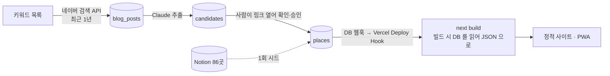

# TODO — 블로그 수집 → AI 분석 → 승인 → DB → 자동 배포

> 최종 수정: 2026-09-21 (v6: 다음 할 일 0(Auth 로그인 모델) 구현 완료 — 마이그레이션 2개 적용, `pnpm data:login/logout`, 통로 재작성. 남은 건 사용자 몫(publishable 키·대시보드 3개·회전)과 엔드투엔드 확인. 보안 리뷰 반영)
> 이전 (v5: 배포 복구 확인 완료. 시크릿은 저장하지 않고 로그인된 CLI 로 실행 시점에(ADR-016) — 다음 할 일 1·2 를 그 절차로, 세션 로그)
> 이전 (v4: 3 코드 완료(Claude 는 구독 `claude -p`), 4a 완료(+BUG-005 수정), 5 검증 항목 완료. 세션 로그·🙋 표 갱신)
> 이전 (v3: 0·1·2·5 에 실제 코드가 생겨 진행 상태를 항목별로 쪼갬. 세션 로그 절 추가)
> 이전 (v2: 가정 두 개가 확정돼 ADR-015 로 옮김. 회원은 todo 범위 밖으로)
> 이전 (v1: 신설 — 5단계 파이프라인의 실행 트래커)
> 상태: **진행 중**. 0·1·2·3·5 는 코드가 있고 4a(빌드가 DB 를 읽음)도 끝났다. 시크릿 모델은 ADR-016 v4(Auth 로그인)로 **구현 완료**. 남은 것은 **사용자 몫 세 가지(publishable 키·대시보드·회전) → 연결 확인 → 키 등록 → 실제 실행**과 4b(웹훅 재빌드). 각 항목의 `[ ]` 를 채워 가며 진행하고, 결정이 확정되면 ADR 로 옮기고 여기서는 링크만 남긴다.

## 목표

지금은 Notion 에서 한 번 뽑은 86곳이 빌드에 구워져 있고 갱신은 사람 손이다. 이걸 아래로 바꾼다.



| 단계 | 문서 | 지금 | 목표 |
|---|---|---|---|
| 0 | [00-setup-supabase-vercel.md](00-setup-supabase-vercel.md) | Supabase 없음 · Vercel 미연결 · CLI 미설치 | 프로젝트 둘 다 생성, 시크릿 자리 잡기 |
| 1 | [01-schema-and-seed.md](01-schema-and-seed.md) | 데이터는 `src/data/*.json` 뿐 | Supabase 가 원본. 86곳·15개 시드, `data:pull` 로 JSON 생성 |
| 2 | [02-collect-naver-blog.md](02-collect-naver-blog.md) | 없음 | 키워드로 최근 1년 블로그 글을 GitHub Actions 가 주기 수집 |
| 3 | [03-analyze-and-review.md](03-analyze-and-review.md) | 코드 완료(실행 전) | Claude(구독, `claude -p`)가 장소·조건을 뽑고, 사람이 링크 보고 승인 |
| 4 | [04-deploy-and-propagate.md](04-deploy-and-propagate.md) | 4a 완료(빌드가 DB 를 읽음) · 4b 없음 | 승인 → 자동 재빌드 → 사이트 반영 |
| 5 | [05-security.md](05-security.md) | 시크릿 없음 | 키 분리·RLS·웹훅 서명·프리뷰 보호 |

## 이 계획이 서 있는 결정 — [ADR-015](../decisions/ADR-015-supabase-source-and-rebuild.md)

2026-09-18 사용자 확인으로 확정됐다. 요지만:

1. **원본은 Supabase.** 와이프가 더 이상 Notion 을 편집하지 않는다 → Notion 은 1회 시드. 손으로 고칠 일은 Studio 에서.
2. **반영은 재빌드.** DB 웹훅 → Deploy Hook → 빌드 안에서 `data:pull`. 앱 번들에 Supabase 없음, 기존 ADR 전부 유지.
3. **회원·로그인은 todo 에 없다.** ADR-011·012 는 "추후 고도화" 로 보류. 필요해지면 4 만 런타임 fetch 로 다시 쓴다.

## 순서와 의존

```
0 (계정·시크릿) ──▶ 1 (스키마·시드·data:pull) ──▶ 4 (Vercel 빌드 = pull + build)   ← 여기까지가 "DB 가 원본" 의 최소 완성
                                   │
                                   └──▶ 2 (수집) ──▶ 3 (분석·승인) ──▶ 4 의 웹훅 재빌드
5 (보안) 은 0 에서 시작해 각 단계마다 항목이 하나씩 붙는다
```

**0 → 1 → 4 를 먼저 끝낸다.** 수집·분석(2·3) 없이도 "Studio 에서 한 줄 고치면 사이트가 바뀐다" 가 성립하고,
그 상태가 2·3 을 만드는 동안의 안전한 기반이다.

## 진행 상태

- [x] 가정 1·2 확인 → [ADR-015](../decisions/ADR-015-supabase-source-and-rebuild.md) (2026-09-18)
- **0** Supabase · Vercel · GitHub Secrets
  - [x] Supabase 프로젝트(서울 리전, `zgnn_supabase`) 생성 · CLI link
  - [x] Vercel Git 연동(대시보드에서 `main` → Production)
  - [ ] GitHub Secrets 5개 중 1개(`SUPABASE_SERVICE_ROLE_KEY`, 회전 예정)만 등록 — 남은 것: `NAVER_CLIENT_ID`·`NAVER_CLIENT_SECRET`·`CLAUDE_CODE_OAUTH_TOKEN`(`ANTHROPIC_API_KEY` 대신)·`KAKAO_REST_API_KEY`. `SUPABASE_URL` 은 코드 상수가 돼 빠졌다
  - [x] Vercel CLI link · Kakao 지도 배포 도메인(`zgnn.vercel.app/map` 정상). Vercel 환경변수는 ADR-016 v4 뒤로 **필요 없어졌다** — [ ] 삭제(아래 다음 할 일 2)
  - **시크릿 모델 = Auth 로그인**([ADR-016 v4](../decisions/ADR-016-secrets-by-login.md))
    - [x] 마이그레이션 `operators`+RLS 8정책(`20260921075901`·`20260921080333`, 원격 적용, 어드바이저 No issues)
    - [x] `pnpm data:login`/`logout`(`scripts/login.mjs`·`logout.mjs`·`lib/sessionKeychain.mjs`) · `lib/supabaseClient.mjs` 출처 3단계 + 13 테스트 · `pull-db` readOnly · deny 확장
    - [ ] `PUBLISHABLE_KEY` 상수 채우기(사용자가 값을 준다 — 공개값) · 대시보드 3개(사용자) · `operators` insert · PostgREST 로 RLS 확인 · Vercel env 삭제
  - [ ] Vercel Deploy Hook(4b)
- [x] 1 스키마 + RLS + 시드 + `scripts/pull-db.mjs` (시드→pull 왕복, `git diff src/data` 빈 결과로 확인)
- **2** 수집
  - [x] 코드 — `scripts/collect/keywords.json` · `scripts/collect/naverBlog.mjs`(23 테스트) · `scripts/collect-blog.mjs` · `.github/workflows/collect.yml`
  - [ ] 실행 — 네이버 개발자센터 키 발급 전이라 아직 한 번도 안 돌림
- **3** 분석·승인
  - [x] 코드 — `scripts/analyze/{naverPostBody,extractPlaces,kakaoLocal,matchPlace,analyzeCandidates,applyApproved}.mjs`(테스트 포함) ·
        `scripts/analyze-candidates.mjs` · `scripts/apply-approved.mjs` · `collect.yml` 에 analyze→apply step. `pnpm test` 393
  - [x] `matchPlace` 본체 — 기본안 구현(🙋 였던 자리. `THRESHOLD`·`WEIGHT` 로 조정). 자동 승인은 `AUTO_APPROVE=false` 로 시작
  - [x] 엔드투엔드 1건 — 실제 후기 링크로 본문 → `claude -p` → 대조까지(DB 쓰기 없이)
  - [ ] 실행 — `blog_posts` 가 비어 있어(02) 아직. 시크릿 등록 뒤 `workflow_dispatch`
- [x] 4a Vercel 빌드 명령 `pnpm data:pull && pnpm build`(`vercel.json`) — 첫 배포는 `outputDirectory: "out"` 때문에 실패했고(BUG-005) 고쳐 커밋했다. push 뒤 확인
- [ ] 4b DB 웹훅 → Deploy Hook 자동 재빌드
- **5** 보안
  - [x] `scripts/check-bundle.mjs` 유출 검사(빌드 뒤 자동 실행) · `.env.example` 커밋
  - [x] anon select 빈 결과(5 테이블 `[]`) · env→번들 유출 경로(참조가 있을 때만 잡힘 — 그게 맞는 자리) · 보안 헤더 3개(`vercel.json`)
  - [ ] 프리뷰 보호 · 키 회전 절차 · 🙋 마켓플레이스가 넣은 여분 시크릿 정리
- [x] `docs/architecture/data-pipeline.md` v2 (이번에 반영)

체크박스가 정본이다. 진행 상황을 다음 세션에 넘길 때는 아래 세션 로그에 한 줄 남긴다.

## 다음 할 일 (2026-09-21 (3) 기준 — 새 세션은 여기서 시작)

브랜치 `feature/supabase-login-model`(**미push**). ADR-016 v4(Auth 로그인 모델)는 **구현 완료** — 마이그레이션은 원격에 적용됐고 코드는 커밋 대기.
사용자 요구 5개(① Claude 는 시크릿을 모른다 ② 작업자가 있을 때 로그인 요청 ③ 사용자가 직접 로그인 ④ 그 토큰으로 사용 ⑤ 토큰 1일 미만)를 코드가 채운다.
**아직 한 번도 세션으로 붙어 보지 못했다** — 운영자 계정과 publishable 키가 없어서. 아래 1 이 그 전제다.

0. ~~Auth 로그인 모델 구현(Claude)~~ **완료.** 남은 잔가지: `docs/todo/05` 의 anon/JWT PostgREST 확인(2 에서), `.claude/settings.json` deny 실측(`security -i` 는 확인).
1. **사용자 몫(터미널·대시보드)** — Claude 는 값을 받지 않는다(publishable 키만 예외 — 공개값). **보안 리뷰가 "관리자 없이 되는 경로" 로 짚은 순서**(ADR-016 "잔존 위험" 표):
   - `rm -f .env.local .vercel/.env.production.local` — 둘 다 옛 service_role 키가 평문(에이전트 `rm` 은 권한 거부됨).
   - `pnpm exec supabase logout` — 휴지 상태. 아래 `operators` insert·`db push` 가 필요할 때만 `pnpm exec supabase login` 하고 끝나면 다시 logout.
   - Vercel: 마켓플레이스 Supabase 연동 해제 + `vercel env rm` 으로 `SUPABASE_*`·`POSTGRES_*` 전부 제거(Production·Preview). **지금** 한다 — 아무 브랜치 push 가 그 env 로
     빌드를 돌린다. `JWT_SECRET` 이 거기 있었으니 대시보드에서 새 서명키로 회전을 검토. 그 뒤 `vercel logout`(휴지).
   - `gh auth logout -u hoiya-woohyun`(휴지) · `ssh-keygen -p -f ~/.ssh/id_ed25519_hoiya`(암호구) — 시크릿 등록·push 때만 연다.
   - **publishable 키를 Claude 에게 준다**(대시보드 Project Settings → API Keys → **Publishable key** 행의 `sb_publishable_…` 만. `projects api-keys` 명령은 secret 키를 나란히 찍으니 쓰지 않는다).
     브라우저 번들용 공개값이라 대화에 붙여넣어도 된다. Claude 가 `PUBLISHABLE_KEY` 에 넣는다(형식 단언이 있어 다른 키는 거부된다).
   - Authentication → Users → **Add user**: 이메일 + 비밀번호(비밀번호 관리자에), Auto Confirm. 만들었다고만 알려 주면 Claude 가 `supabase db query --linked` 로 uid 를 읽어
     `operators` 에 넣는다(비밀번호 불필요).
   - Authentication → Settings → **JWT expiry** 8~12시간(예 `43200`, 86400 초과는 코드가 거부) · **Secure password change: on** · Sign In / Providers → **Allow new users to sign up: off**.
   - Project Settings → API Keys → **새 secret key 발급 + legacy `service_role` 폐기**(옛 값은 에이전트 대화 기록에 실렸을 수 있어 노출로 본다)
     → 터미널에서 `gh auth switch`(계정 `hoiya-woohyun`) 뒤 `gh secret set SUPABASE_SERVICE_ROLE_KEY` 에 붙여넣기. GitHub Actions 만 쓴다.
2. **연결 확인(Claude + 사용자)** — 1 이 끝난 뒤. 순서가 중요하다:
   - Claude: `PUBLISHABLE_KEY` 채움 → (사용자가 CLI 로그인을 잠깐 열면) `operators` insert → 사용자가 **별도 터미널**에서 `pnpm data:login` →
     Claude 가 `pnpm data:pull`(항상 anon — 로그 `Supabase 인증: publishable(anon …)`, diff 없음, 86·15 행) → **세션 확인은 `pnpm data:apply`**(승인 후보 0건이면
     `candidates` 를 읽기만 하고 끝난다 — 로그 `로그인 세션(JWT …)`) → `pnpm data:logout` 뒤 `data:apply` 가 "로그인이 필요하다" 로 멈추는지.
     **RLS 는 PostgREST 로만 검증**: 비운영자 계정 세션으로 `data:apply` → `candidates` 빈 결과(정책이 닫힘)까지 보면 끝. 이 항목이 끝나기 전엔 RLS 검증은 "추론" 이다.
   - self-cr → 커밋·push → Preview 빌드(Vercel env 를 이미 지웠으니 **anon 경로**로 돈다 — `PUBLISHABLE_KEY` 가 채워진 커밋이 먼저 올라가야 한다) → `main` 머지 → 프로덕션 확인.
3. **키 3종 → GitHub Secrets(사용자)** — `gh auth status` 활성 계정 `hoiya-woohyun` 확인 후 각각 `gh secret set NAME` 에 붙여넣기:
   `claude setup-token` → `CLAUDE_CODE_OAUTH_TOKEN` · 네이버 개발자센터 → `NAVER_CLIENT_ID`·`NAVER_CLIENT_SECRET` · Kakao REST 키(선택) → `KAKAO_REST_API_KEY`.
   `SUPABASE_URL` 시크릿은 지워도 된다(코드 상수).
4. **첫 실행(Claude)** — Actions `블로그 수집 · 분석 · 반영` 을 `workflow_dispatch` 로 한 번. 실패해도 그 로그가 다음 할 일이다.
5. **로컬 dry-run(Claude, 사용자가 `pnpm data:login` 한 상태에서)** — `pnpm data:analyze --dry-run --limit 5`. 백로그는 `--limit 30` 씩(구독 세션 한도).
6. **Studio 에서 후보 20건쯤 본 뒤 결정(🙋)** — `AUTO_APPROVE`, `WEIGHT`·`THRESHOLD`(재대조 0.85 경계), `ask` 승인 절차.
7. **4b** — 승인이 실제로 생긴 뒤 DB 웹훅 → Deploy Hook.

## 세션 로그

세션이 끝나거나 컨텍스트가 커져 나눌 때 여기에 한 항목. 체크박스가 정본이고 로그는 인수인계 메모.

- 2026-09-21 (3) — **다음 할 일 0 구현**(ADR-016 v4): (1) 마이그레이션 `operators`+`is_operator()`+정책 7개 push → 어드바이저가 definer 함수의 RPC 노출을
  경고(0028/0029) → 두 번째 마이그레이션으로 invoker + `operators_read_self`(정책 안 서브쿼리는 호출자 역할이라 자기 행 정책이 없으면 **조용히 false**) → No issues.
  (2) `scripts/lib/sessionKeychain.mjs`(키체인, `security -i` stdin 으로 써서 argv 에 안 실림) · `supabaseClient.mjs` 재작성(env service → 세션 JWT(60초 skew) →
  anon, `readOnly` 는 pull-db 만, 출처 이름을 한 줄 로그) · `login.mjs`(TTY·CLAUDECODE 가드, refresh 폐기) · `logout.mjs` · 13 테스트. `PROJECT_REF` 상수(Vercel 엔 link 파일이 없다),
  `PUBLISHABLE_KEY` 는 **빈 문자열** — 사용자가 준다. (3) `collect.yml` 에서 `SUPABASE_URL` 제거, deny 에 `security -i`·api-keys 변형 추가(파이프 안에서도 막히는 걸 실측).
  (4) 함정: `supabase migration new` 는 stdin 이 TTY 가 아니면 SQL 을 기다리며 **멈춘다** — `</dev/null` 을 붙이거나 파일을 직접 쓴다.
  (5) **구멍 발견**: `pnpm data:pull` 로그가 `env(service key)` 를 찍어 봤더니 옛 `.env.local` 과 `.vercel/.env.production.local` 에 service_role 키가 평문으로 남아 있었다(값은 안 봄 —
  이름만). 에이전트 `rm` 은 권한 거부 → 사용자가 지운다(다음 할 일 1). 코드에 **CI 가드** 추가: `CI` 가 아니면 env 의 service 키를 거부하고 멈춘다(14 테스트).
  (6) `pnpm login`/`logout` 이 pnpm 내장 명령(npm 로그인)이라 가려짐 → `data:login`/`data:logout` 으로 개명. (7) 보안 중점 리뷰(4 렌즈 + 렌즈별 적대 검증, 8 에이전트, 50건 확인·1건 반박) 반영. **결론: `pnpm data:*` 경로는 요구 ①~⑤를 채우지만 이 머신은 아직 아니다** —
  관리자 없이 RLS 를 우회하는 무만료 자격증명이 5개(env 파일 2개·supabase CLI PAT·Vercel env 의 JWT secret 등·admin gh+SSH 키) 남아 있고, 전부 사용자 터미널 작업으로만 닫힌다
  (ADR-016 "잔존 위험" 표 = 다음 할 일 1). 코드 반영 8건: `readOnly` 는 항상 anon · 세션/anon 경로 URL 고정(`SUPABASE_URL` 로 JWT 를 밖으로 보내는 통로 차단) ·
  `--env-file-if-exists` 제거 · 세션 수명 ≤ 1일 단언(⑤) · `data:pull` 빈 결과 exit 1 · `claude -p` 자식 env 허용 목록 · `PUBLISHABLE_KEY` 형식 단언 · 키체인 오류 경로.
  보류(사용자 결정): Actions 의 service_role → 봇 운영자 로그인, GRANT(DELETE·TRUNCATE) 회수·`for all` 축소, Actions 자체를 로컬 실행으로 대체할지. 문서의 틀린 주장 2개 정정
  ("deny 가 2차 자물쇠" → 경계 아님, "`cat` 은 안 막힌다" → 이 CLI 버전은 막힌다). RLS 검증은 PostgREST 전이라 **추론** 으로 표기.

- 2026-09-21 (2) — (1) **배포 복구 확인 완료**: Preview `0d625f6` Ready(13h 전 프로덕션 Error 는 로그로 BUG-005 확인, `data:pull` 은 통과했었다)
  → `main` 에 ff 머지·push → 프로덕션 Ready. `zgnn.vercel.app` 응답에 `x-content-type-options: nosniff`·`referrer-policy`·
  `permissions-policy` 세 개 다 붙음(`sw.js` 포함. 캐시 우회 `?cb=` 로 `age: 0` 확인). (2) **시크릿 처리 방식 두 번 바뀜**(사용자 결정
  "Claude 가 값을 읽는 순간부터 문제" → "관리 스크립트 말고 로그인 방식으로 단순하게"): 1차로 macOS 키체인 + `scripts/secrets.mjs` 를 만들어
  main 에 머지했다가, 2차로 **로그인 모델**(ADR-016 v3)로 교체 — `scripts/lib/supabaseClient.mjs` 가 env(CI·Vercel) → 로그인된 `supabase` CLI
  (`projects api-keys --reveal`) 순으로 키를 실행 시점에 받는다. 로컬에 값이 어디에도 없고 `.env.local` 은 선택. `.claude/settings.json` deny 가
  **bypass 세션에서도 실제로 막히는 걸 실측**(`--help` 조차). 옛 `.env.local` 의 키는 노출로 보고 **회전**(다음 할 일 1) — 로컬은 할 게 없다.
  (3) 그 로그인 모델도 **PAT 는 만료가 없어** 사용자 요구 ⑤(토큰 1일 미만)를 못 채운다 → **Auth 사용자 로그인 + RLS + 짧은 JWT** 로 재설계 결정,
  구현은 다음 세션(다음 할 일 0). 브랜치의 2차 리뷰(12건: major 3 — spawn 실패 시 TypeError, 반쪽 env 진단 회귀, deny 누락)는 미반영 상태로 목록만 다음 할 일에 남겼다.

- 2026-09-21 — 브랜치 `feature/todo-analyze-pipeline`(작업 중엔 push·머지·Vercel 트리거 없이 로컬 커밋만 — 사용자 지시. 리포트 뒤 지시로 **push 함**, main 머지는 아직). 한 것:
  (1) Vercel 배포 실패 원인 = `vercel.json` 의 `outputDirectory: "out"` → 제거(BUG-005, 로컬 `vercel build --prod` 로 재현·확인).
  프로덕션은 3시간 전 배포가 그대로 살아 있고 push 하면 복구된다. (2) 보안 헤더 3개를 `vercel.json` 에. (3) 03 전체 코드 —
  **Claude 는 API 키 대신 구독(`claude setup-token` → `CLAUDE_CODE_OAUTH_TOKEN`)으로 `claude -p --json-schema` 를 돌린다**(사용자 결정,
  `@anthropic-ai/sdk` 제거). 적대적 리뷰가 22건을 냈고 21건 재현 → 반영: Kakao 정확 일치만, 읍·면 12개 목록, AI regionRaw 도 대조 신호,
  영구 실패는 `analyzed_at` 으로 닫기, Kakao 401/403·인증 실패는 실행 중단, places 빈 결과 중단, apply 의 archived 거부·신규 재대조,
  apply step `!cancelled`, HTML 상한, **자동 승인 기본 off**. (4) 05 검증: anon `[]`, env→번들 유출 e2e, 헤더. 리뷰 워크플로는 구독
  **세션 한도**("resets 2:30am")에 걸려 중단됐다 — 서브에이전트도 같은 한도를 쓴다. 다음: 시크릿 4개 등록 → `workflow_dispatch` 로
  수집·분석 실제 실행 → 후보 Studio 확인 → 4b. **사용자 확인 필요**: 자동 승인 켤지(`AUTO_APPROVE`), 임계값·가중치(재대조 0.85 경계 포함), 여분 시크릿 정리.
  **2차 리뷰**(전송부 교체 뒤, 4 렌즈): 30건 중 14건 확인·반영. 한계 — 전송부 렌즈의 검증 투표는 전부 한도로 죽어 그 지적들은 검증 없이
  내가 골라 반영했고, 수정 에이전트도 죽어 14건 수정은 독립 리뷰 없이 직접 했다(근거는 393 테스트 + 실제 `claude -p` 재스모크).
  `pnpm lint` 는 `scripts/` 를 검사하지 않는다. `CLAUDE_CODE_OAUTH_TOKEN` 만 있는 러너에서 `claude -p` 가 도는지는 첫 `workflow_dispatch` 가 시험이다.

- 2026-09-20 (2) — 5커밋 push 완료, Vercel 프로덕션이 새 커밋으로 배포됨(`sw.js` revision 이 로컬 빌드와 일치 → `package.json` 의 `build` 스크립트가 쓰이므로 유출 검사도 Vercel 에서 돈다). DB 한 필드 수정 → pull → 그 줄만 diff → 되돌림 검증 완료(01 끝). **순서 제약**: 로컬에 `vercel.json`(buildCommand `pnpm data:pull && pnpm build`) 초안이 **커밋되지 않은 채** 있다 — Vercel env(`SUPABASE_URL`·`SUPABASE_SERVICE_ROLE_KEY`, Production+Preview, Sensitive)가 먼저 들어가야 한다. 먼저 커밋하면 `data:pull` 이 exit 1 로 모든 배포가 실패한다(이전 배포는 살아 있지만). 05 의 헤더 작업이 `vercel.ts` 를 말하는데 `.json` 과 둘이 공존할 수 없다 — 헤더를 붙일 때 `.json` → `.ts` 로 옮기든지 `.json` 에 headers 를 넣든지 하나만 고른다(🙋). 참고: `supabase`(CLI)가 devDependencies 라 Vercel 이 매 빌드 설치한다 — 빌드 시간이 늘면 CLI 는 `pnpm dlx` 로 빼는 걸 검토. Actions `collect.yml` 은 네이버 시크릿이 들어가기 전까지 화·금마다 빨갛게 실패한다(무해).
- 2026-09-20 — 한 것: Supabase 프로젝트 생성·link(빈 마이그레이션 함정 우회, 스키마+RLS+시드 완료, 시드↔pull 왕복 검증), 02 수집 코드 전체(테스트 포함) 작성, 03 골격(헬퍼+임계값 상수+테스트)만 작성, 05 유출 검사·`.env.example`·GitHub Secrets 일부 등록, Vercel Git 연동 확인. 다음: GitHub Secrets 나머지 4개(네이버·Anthropic·Kakao REST) 등록 → 02 실제 실행 → `matchPlace` 본체(🙋) → 4a Vercel 빌드 명령 전환. 사용자 대기: 네이버 개발자센터 키 발급, `matchPlace` 임계값 확정, Vercel 로그인/link, Kakao 지도 배포 도메인 등록. **하지 말 것**: 빈 마이그레이션을 다시 만들지 말 것(`db pull` 로 새로 뜬 빈 마이그레이션에 SQL 을 쓰면 `db push` 가 조용히 건너뛴다 → `migration repair --status reverted` 로 되돌리고 새 파일을 만든다), 시드는 이미 끝났으니 `seed-db.mjs` 를 다시 돌릴 필요 없음(멱등이라 돌려도 무해하지만 불필요).

## 🙋 사용자가 정할 것 (문서가 결정해 두지 않은 자리)

| 어디 | 무엇 | 왜 사용자 몫인가 |
|---|---|---|
| 02 | 검색 키워드 목록 | 도메인 지식. "강아지 동반" vs "애견 동반" vs "반려견" 이 다른 글을 낸다 |
| 03 | `matchPlace` 가중치·임계값(`WEIGHT`·`THRESHOLD`), **자동 승인을 켤지**(`AUTO_APPROVE`, 기본 off) | 기본안은 구현돼 있다. 틀리면 데이터가 조용히 썩는다. 86곳이라 사람 비용이 싸다 |
| 03 | AI 모델 | 구독이라 비용 차이는 없고 한도 소모뿐. 기본 `claude-opus-5`, `ANALYZE_MODEL` 로 비교 |
| 05 | Vercel 마켓플레이스가 넣은 여분 시크릿(`POSTGRES_*`·`SUPABASE_JWT_SECRET` 등)을 지울지 | 빌드는 안 쓴다. 안 쓰는 시크릿은 노출면 |
| 04 | 승인마다 재빌드 vs 모아서 "반영" 한 번 | 빌드 횟수 = Vercel 무료 한도 소비 |

## 기존 문서와의 관계

- [.omc/plans/2026-09-17-notion-supabase-scraping.md](../../.omc/plans/2026-09-17-notion-supabase-scraping.md) — 이 폴더가 **대체**한다. 살아남은 것: Phase 1 의 "재추출 스크립트 부재", Phase 4 의 GitHub Actions 선택 이유, §4 의 `matchPlace`. 거기 적힌 "git 원격이 없다" 는 이제 사실이 아니다(`origin` = `hoiya-woohyun/zgnn`).
- [ADR-011](../decisions/ADR-011-app-gate-and-supabase.md) · [ADR-012](../decisions/ADR-012-personal-data-and-consent.md) — **추후 고도화로 보류**(ADR-015 §3). 회원을 받지 않으므로 개인정보도 받지 않는다. ADR-012 의 "리전은 서울, 생성 시에만" 만 **지금 0 에서 지킨다.**
- [docs/architecture/data-pipeline.md](../architecture/data-pipeline.md) — 1·4 가 끝나면 "동기화는 수동", "런타임 fetch 없음"(이건 그대로 참), "재추출 스크립트는 없다" 를 다시 쓴다.
