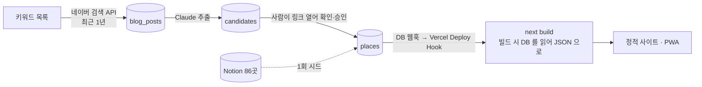

# TODO — 블로그 수집 → AI 분석 → 승인 → DB → 자동 배포

> 최종 수정: 2026-09-20 (v3: 0·1·2·5 에 실제 코드가 생겨 진행 상태를 항목별로 쪼갬. 세션 로그 절 추가)
> 이전 (v2: 가정 두 개가 확정돼 ADR-015 로 옮김. 회원은 todo 범위 밖으로)
> 이전 (v1: 신설 — 5단계 파이프라인의 실행 트래커)
> 상태: **진행 중**. 0·1·2·5 는 코드가 있고(1 은 로컬에서 시드↔pull 왕복 검증까지), 4(자동 재빌드)로 가는 배포 전환이 남았다. 각 항목의 `[ ]` 를 채워 가며 진행하고, 결정이 확정되면 ADR 로 옮기고 여기서는 링크만 남긴다.

## 목표

지금은 Notion 에서 한 번 뽑은 86곳이 빌드에 구워져 있고 갱신은 사람 손이다. 이걸 아래로 바꾼다.



| 단계 | 문서 | 지금 | 목표 |
|---|---|---|---|
| 0 | [00-setup-supabase-vercel.md](00-setup-supabase-vercel.md) | Supabase 없음 · Vercel 미연결 · CLI 미설치 | 프로젝트 둘 다 생성, 시크릿 자리 잡기 |
| 1 | [01-schema-and-seed.md](01-schema-and-seed.md) | 데이터는 `src/data/*.json` 뿐 | Supabase 가 원본. 86곳·15개 시드, `data:pull` 로 JSON 생성 |
| 2 | [02-collect-naver-blog.md](02-collect-naver-blog.md) | 없음 | 키워드로 최근 1년 블로그 글을 GitHub Actions 가 주기 수집 |
| 3 | [03-analyze-and-review.md](03-analyze-and-review.md) | 없음 | Claude 가 장소·조건을 뽑고, 사람이 링크 보고 승인 |
| 4 | [04-deploy-and-propagate.md](04-deploy-and-propagate.md) | 로컬 `pnpm build` | 승인 → 자동 재빌드 → 사이트 반영 |
| 5 | [05-security.md](05-security.md) | 시크릿 없음 | 키 분리·RLS·웹훅 서명·프리뷰 보호 |

## 이 계획이 서 있는 결정 — [ADR-015](../decisions/ADR-015-supabase-source-and-rebuild.md)

2026-09-18 사용자 확인으로 확정됐다. 요지만:

1. **원본은 Supabase.** 와이프가 더 이상 Notion 을 편집하지 않는다 → Notion 은 1회 시드. 손으로 고칠 일은 Studio 에서.
2. **반영은 재빌드.** DB 웹훅 → Deploy Hook → 빌드 안에서 `data:pull`. 앱 번들에 Supabase 없음, 기존 ADR 전부 유지.
3. **회원·로그인은 todo 에 없다.** ADR-011·012 는 "추후 고도화" 로 보류. 필요해지면 4 만 런타임 fetch 로 다시 쓴다.

## 순서와 의존

```
0 (계정·시크릿) ──▶ 1 (스키마·시드·data:pull) ──▶ 4 (Vercel 빌드 = pull + build)   ← 여기까지가 "DB 가 원본" 의 최소 완성
                                   │
                                   └──▶ 2 (수집) ──▶ 3 (분석·승인) ──▶ 4 의 웹훅 재빌드
5 (보안) 은 0 에서 시작해 각 단계마다 항목이 하나씩 붙는다
```

**0 → 1 → 4 를 먼저 끝낸다.** 수집·분석(2·3) 없이도 "Studio 에서 한 줄 고치면 사이트가 바뀐다" 가 성립하고,
그 상태가 2·3 을 만드는 동안의 안전한 기반이다.

## 진행 상태

- [x] 가정 1·2 확인 → [ADR-015](../decisions/ADR-015-supabase-source-and-rebuild.md) (2026-09-18)
- **0** Supabase · Vercel · GitHub Secrets
  - [x] Supabase 프로젝트(서울 리전, `zgnn_supabase`) 생성 · CLI link
  - [x] Vercel Git 연동(대시보드에서 `main` → Production)
  - [ ] GitHub Secrets 6개 중 2개(`SUPABASE_URL`·`SUPABASE_SERVICE_ROLE_KEY`)만 등록
  - [ ] Vercel 환경변수 · Deploy Hook · Kakao 지도 배포 도메인 등록
- [x] 1 스키마 + RLS + 시드 + `scripts/pull-db.mjs` (시드→pull 왕복, `git diff src/data` 빈 결과로 확인)
- **2** 수집
  - [x] 코드 — `scripts/collect/keywords.json` · `scripts/collect/naverBlog.mjs`(23 테스트) · `scripts/collect-blog.mjs` · `.github/workflows/collect.yml`
  - [ ] 실행 — 네이버 개발자센터 키 발급 전이라 아직 한 번도 안 돌림
- [ ] 3 골격만 — 신호 헬퍼·`THRESHOLD` 상수·테스트 파일은 있고, `matchPlace` 본체·임계값 확정은 🙋 사용자 몫
- [ ] 4a Vercel 빌드 명령 `pnpm data:pull && pnpm build` 로 첫 배포
- [ ] 4b DB 웹훅 → Deploy Hook 자동 재빌드
- **5** 보안
  - [x] `scripts/check-bundle.mjs` 유출 검사(빌드 뒤 자동 실행) · `.env.example` 커밋
  - [ ] anon select 빈 결과 확인 · 프리뷰 보호 · 키 회전 절차
- [x] `docs/architecture/data-pipeline.md` v2 (이번에 반영)

체크박스가 정본이다. 진행 상황을 다음 세션에 넘길 때는 아래 세션 로그에 한 줄 남긴다.

## 세션 로그

세션이 끝나거나 컨텍스트가 커져 나눌 때 여기에 한 항목. 체크박스가 정본이고 로그는 인수인계 메모.

- 2026-09-20 — 한 것: Supabase 프로젝트 생성·link(빈 마이그레이션 함정 우회, 스키마+RLS+시드 완료, 시드↔pull 왕복 검증), 02 수집 코드 전체(테스트 포함) 작성, 03 골격(헬퍼+임계값 상수+테스트)만 작성, 05 유출 검사·`.env.example`·GitHub Secrets 일부 등록, Vercel Git 연동 확인. 다음: GitHub Secrets 나머지 4개(네이버·Anthropic·Kakao REST) 등록 → 02 실제 실행 → `matchPlace` 본체(🙋) → 4a Vercel 빌드 명령 전환. 사용자 대기: 네이버 개발자센터 키 발급, `matchPlace` 임계값 확정, Vercel 로그인/link, Kakao 지도 배포 도메인 등록. **하지 말 것**: 빈 마이그레이션을 다시 만들지 말 것(`db pull` 로 새로 뜬 빈 마이그레이션에 SQL 을 쓰면 `db push` 가 조용히 건너뛴다 → `migration repair --status reverted` 로 되돌리고 새 파일을 만든다), 시드는 이미 끝났으니 `seed-db.mjs` 를 다시 돌릴 필요 없음(멱등이라 돌려도 무해하지만 불필요).

## 🙋 사용자가 정할 것 (문서가 결정해 두지 않은 자리)

| 어디 | 무엇 | 왜 사용자 몫인가 |
|---|---|---|
| 02 | 검색 키워드 목록 | 도메인 지식. "강아지 동반" vs "애견 동반" vs "반려견" 이 다른 글을 낸다 |
| 03 | `matchPlace` 자동 병합 임계값, 애매 구간은 자동 vs 사람 | 틀리면 데이터가 조용히 썩는다. 86곳이라 사람 비용이 싸다는 점도 고려 |
| 03 | AI 모델(품질 vs 비용) | 주당 몇 달러 차이. 기본은 `claude-opus-5` |
| 04 | 승인마다 재빌드 vs 모아서 "반영" 한 번 | 빌드 횟수 = Vercel 무료 한도 소비 |

## 기존 문서와의 관계

- [.omc/plans/2026-09-17-notion-supabase-scraping.md](../../.omc/plans/2026-09-17-notion-supabase-scraping.md) — 이 폴더가 **대체**한다. 살아남은 것: Phase 1 의 "재추출 스크립트 부재", Phase 4 의 GitHub Actions 선택 이유, §4 의 `matchPlace`. 거기 적힌 "git 원격이 없다" 는 이제 사실이 아니다(`origin` = `hoiya-woohyun/zgnn`).
- [ADR-011](../decisions/ADR-011-app-gate-and-supabase.md) · [ADR-012](../decisions/ADR-012-personal-data-and-consent.md) — **추후 고도화로 보류**(ADR-015 §3). 회원을 받지 않으므로 개인정보도 받지 않는다. ADR-012 의 "리전은 서울, 생성 시에만" 만 **지금 0 에서 지킨다.**
- [docs/architecture/data-pipeline.md](../architecture/data-pipeline.md) — 1·4 가 끝나면 "동기화는 수동", "런타임 fetch 없음"(이건 그대로 참), "재추출 스크립트는 없다" 를 다시 쓴다.
